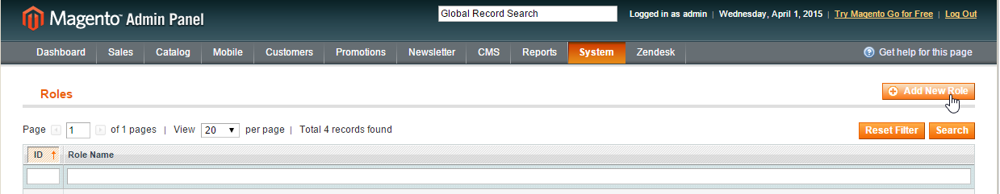
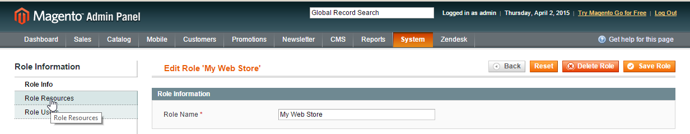
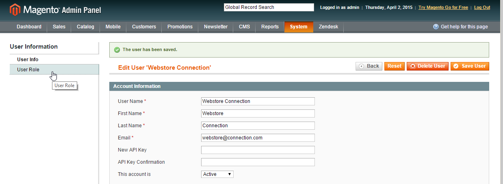

.. _user-guide-magento-channel-integration:

Integration with Magento
========================

OroCRM supports out of the box integration with Magento.
The integration enables loading  data from and to a Magento-based eCommerce store ("Magento store") and processing it in
the OroCRM.
This article describes how to define and edit the integration and synchronization settings.

.. hint::

    While Magento integration capabilities are pre-implemented, OroCRM can be integrated with different third-party
    systems.

On the Magento Side
-------------------

The integration is made possible with the OroCRM Bridge Magento Extenstion. The OroCRM Bridge can be installed through
the MagentoConnect.

      |
	  

|

Once the extension has been successfully installed, you need to login to your Magento account and to set up a SOAP API
user within Magento, as described below:

.. note::

    The integration can also be created without installation of the OroCRM Bridge Magento Extenstion, however the
    synchronization will then take longer, and some options, such as two-way synchronization, and synchronization of
    the custom records data will not be available.

Define a New Role
^^^^^^^^^^^^^^^^^

- Once logged in, go to the System → Web Services → SOAP/XML - RPC - Roles

  |
  
.. image:: ./img/magento_integration/magento_01.png

|
  
- You will get to the Roles grid. Click the :guilabel:`Add New Role`

  |
  

|
  
- Define the Role Name that corresponds to your eCommerce store.

  |  

.. image:: ./img/magento_integration/magento_03.png

|

- Click the :guilabel:`Save Role` button. The role will be saved and you will get to page of the role.

  .. hint::

      You can also click the role name in the grid at any time to get to the page of the role.

- Click  the :guilabel:`Role Resources` on the left.

  |
  

|

- In the Roles Resources section, set the "Resource Access" field value to "All" and save the role.

  |
  
.. image:: ./img/magento_integration/magento_05.png

Define a New User
^^^^^^^^^^^^^^^^^

- Go to the System → Web Services → SOAP/XML - RPC - Users

- You will get to the Users grid. Click the :guilabel:`Add New User` button.

- Define the following fields:

  .. csv-table::
    :header: "Field", "Description"
    :widths: 10, 30

    "**User Name***","The name used for login into the account."
    "**First Name***","The first part of the name displayed in the system to refer to the user."
    "**Last Name***","The last part of the name displayed in the system to refer to the user."
    "**Email***","The email address of the user."
    "**API Key***","Define a password for the account. The key shall be at least 6 symbols long."
    "**API Key Confirmation***","Confirm the password."
    "**The account is**","Set the value to *Active* in order to use the user account created."

- Save the user created.

  |
  
.. image:: ./img/magento_integration/magento_06.png

|

- The user account will be saved and you will get to page of the user.

.. hint::

    You can also click the user name in the grid at any time to get to the page of the Role.

- Click  the :guilabel:`User Role` on the left

  |
  

|

- Select the role that you've created for your store above.

  |
  
.. image:: ./img/magento_integration/magento_08.png

|

- Click  the :guilabel:`Save User` button in the top right corner.

.. _user-guide-magento-channel-integration-details:

On the Oro Side
-------------------

Create Magento Integration
^^^^^^^^^^^^^^^^^^^^^^^^^^

To create integration with Magento, create a channel of Magento type as described in the
:ref:`Channels Management <user-guide-channel-guide-create>` guide.

As soon as the channel type is set to *Magento*, a mandatory **Integration*** field  will appear in the "General"
section.

      |
	  
.. image:: ./img/magento_integration/configure_integration.png

|

Click the *Configure integration* link. The form will emerge.

     |

.. image:: ./img/magento_integration/configure_integration_form.png

|

General Settings
""""""""""""""""

Define the following details in the *"General"* section:

.. csv-table::
  :header: "Field", "Description"
  :widths: 10, 30

  "**Name***","The configuration name used to refer to the configuration within the system."
  "**SOAP WSDL URL***","A URL of the SOAP v.2 WSDL source (this is the URL of your Magento installation plus
  **api/v2_soap/?wsdl=1**). For example, if your installation were available at
  *http://example.com/magento/index.php/*, the SOAP WSDL URL would be
  *http://example.com/magento/index.php/api/v2_soap/?wsdl=1*."
  "**SOAP API Key***","The API Key defined for the Magento user above."
  "**SOAP API User***","The username defined for the Magento user above."
  "**WS-I Compliance**","Defines whether `WS-I compliance
  mode <http://www.magentocommerce.com/api/soap/wsi_compliance.html>`_ is enabled for the Magento store."
  "**Sync start date**","Data will be synchronized as of the date defined."

At this point, click :guilabel:`Check Connection` button, to see if the settings defined above are correct.
Once the connection details have been verified, the following fields will be filled with default settings.

.. csv-table::
  :header: "Field", "Description"
  :widths: 10, 30

  "**Website***","The list of all the Websites available for the shop. *All Websites* option is chosen by default.

  You can edit the field value and choose one of the Websites available. Only entries of the selected Website are
  synchronized.

  Click the *Sync website list* link if the list of Websites is outdated."
  "**Admin url**","Optional field. A url to the administrator panel of the specified Magento store."
  "**Default owner***","Specifies what users can manage the configuration, subject to the
  :ref:`access and permission settings <user-guide-user-management-permissions>`. By default is filled with the user 
  creating the integration."

.. _user-guide-magento-channel-integration-synchronization:

Synchronization Settings
""""""""""""""""""""""""

Use the *Synchronization Settings* section to enable/disable two-way synchronization.

.. image:: ./img/magento_integration/synch_settings.png

Check *Enable Two Way Sync* box, if you want to download data both from Magento to OroCRM and
back. If the box is unchecked, data from Magento will be loaded to OroCRM, but changes performed in OroCRM will not be
loaded to Magento.

If two-way synchronization is enabled, define the priority used for conflict resolution (e.g. if the same
customer details were edited from both OroCRM and Magento):

- *Remote wins*: Magento data will be applied to the both Magento and OroCRM.

- *Local wins*: OroCRM data will be applied to the both Magento and OroCRM.

.. _user-guide-magento-channel-integration-details_edit:

Edit the Integration
^^^^^^^^^^^^^^^^^^^^

To edit the integration details:

- Go to the :ref:`Edit form <user-guide-ui-components-create-pages>` of the channel and click *"Edit"* link by the
  integration name.

  The integration form will appear. Priory defined settings will be shown in the form. Once synchronization has been
  performed, it is impossible to change the Sync start date.

  .. image:: ./img/magento_integration/edit_form.png

- Click :guilabel:`Done` button to save the changes

  .. hint::

      To remove an integration from the system, go to the :ref:`Edit form <user-guide-ui-components-create-pages>`
      of the channel and click |IcCross| located next to the integration name

.. _user-guide-magento-channel-start-synchronization:

Start Synchronization Manually
------------------------------

Once integration has been created, the data will be automatically synchronized. However, you can also start the
synchronization manually from OroCRM:

- Go to the System → Integrations → Manage Integrations and click the |BSchedule|
  :ref:`grid action icon <user-guide-ui-components-grid-action-icons>` or

- Go to the :ref:`View page <user-guide-ui-components-view-pages>` of the channel and click the integration name link:

  .. image:: ./img/magento_integration/edit_from_view.png

- The *"View"* page of the integration will appear.

  .. image:: ./img/magento_integration/integration_view.png

- Click :guilabel:`Schedule Sync` button. *A sync*
  :ref:`job <book-job-execution>`
  *has been added to the queue.   Check progress.* note will appear.

- The data is being synchronized. You can click *Check progress* link to see the synchronization status.

After the successful synchronization, details of the Magento entity records defined for the channel will be loaded to 
OroCRM and can be processed therein, for example cart can be converted, customer details can be edited and new customers
can be added to the system.

.. |BSchedule| image:: ./img/buttons/BSchedule.png
   :align: middle
