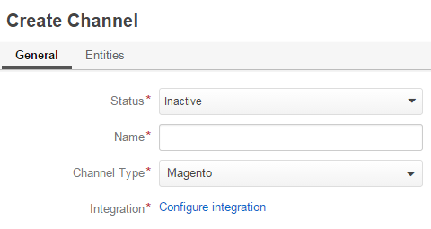
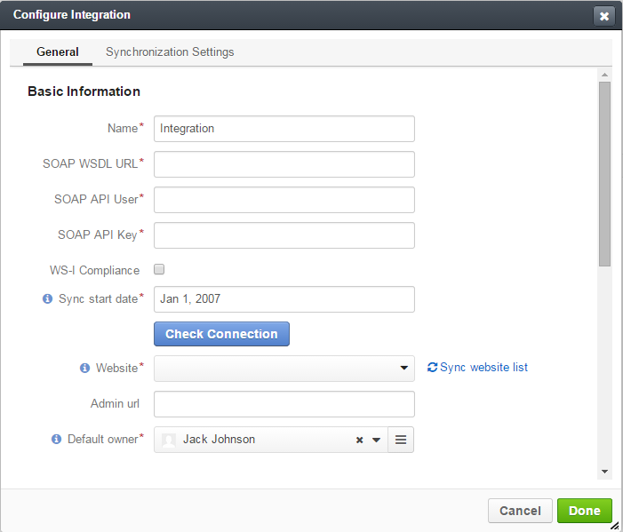
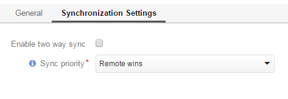
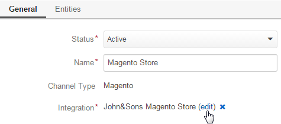
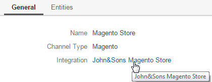
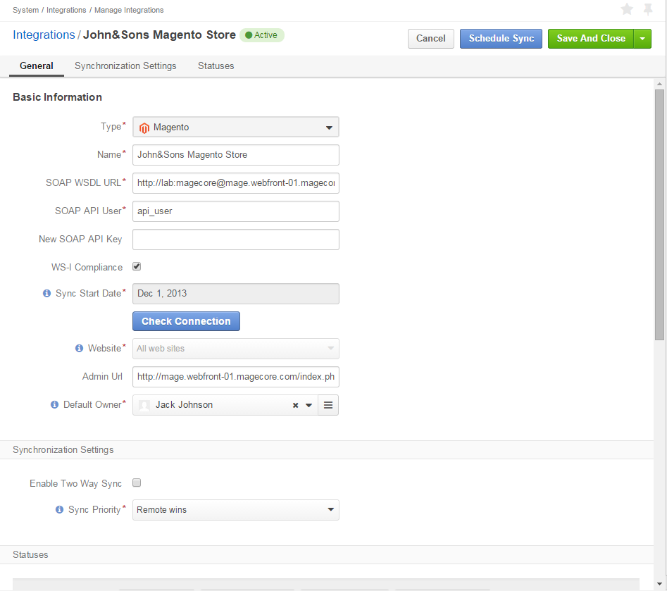

.. _user-guide-magento-channel-integration:

Integration with Magento
========================

OroCRM comes with out of the box integration with Magento. 
Following the integration data can be loaded from and to a Magento-based E-commerce store and processed in the OroCRM. 
The article describes how to :ref:`define <user-guide-magento-channel-integration-details>` and 
:ref:`manage <user-guide-magento-channel-integration-details-edit>`, including the way to define data synchronization
:ref:`settings <user-guide-magento-channel-integration-synchronization>` and 
:ref:`run <user-guide-magento-channel-integration-synchronization>` the synchronization. 

.. hint::
    
    OroCRM can be integrated with different third-party systems but Magento integration capabilities are 
    pre-implemented. 
    

.. _user-guide-magento-channel-integration-details:

Create Integration
------------------

To create integration with a Magento-based E-commerce store, create a channel of Magento type as described in the 
*Channels Management* Guide. 

As soon as the channel type is set to *Magento*, a mandatory **Integration*** field  will appear in the General details 
section.

Click *Configure integration* link. The form will emerge.

General Settings
^^^^^^^^^^^^^^^^

Define the following details in the *General* section:

.. list-table::
   :widths: 10 30
   :header-rows: 1

   * - Field
     - Description
     
   * - **Name***
     - Configuration name. Used to refer to the configuration within the system (edit, assign, etc.)
 
   * - **SOAP WSDL URL***
     - An http URL string to the WSDL of the SOAP-based service.
     
   * - **SOAP API Key***
   
       **SOAP API User***
       
     - SOAP API credentials. 
     
   * - **WS-I Compliance**
     - Optional flag. Defines whether the configuration meets the requirements of Web Services Interoperability 
       Organization guidelines.
   
   * - **Sync start date**
     - Data will be synchronized as of the date defined.

.. hint::  

    Please address you Magento administrator for the information on SOAP settings details. 

At this point, click :guilabel:`Check Connection` button, to check if the settings defined are correct.
Once the connection details have been verified, the next fields will be filled with default settings.

.. list-table:: **System Channel Entities (continued)**
   :widths: 12 30
   :header-rows: 1

   * - Field
     - Description
     
   * - **Website***
     - The list of all the Websites available for the shop. *All Websites* option is chosen by default.
       
       You can edit the field value and choose one of the Websites available.
       
       Click "Sync website list" link if the list of Websites is outdated.
       
   * - **Admin url**
     - Optional field. An http link to the Administrator panel of the specified Magento store.
     
   * - **Default owner***
     - Specifies what Users can manage the configuration. By default is filled with the User
       creating the integration.

       
.. _user-guide-magento-channel-integration-synchronization:

Synchronization Settings
^^^^^^^^^^^^^^^^^^^^^^^^

Use the *Synchronization Settings* section to enable/disable two way synchronization.

Check *Enable Two Way Sync* box, if you want to download data from the Magento-based E-commerce store to OroCRM and
back.

If the box is unchecked, data from Magento will be loaded to OroCRM, but changes performed in OroCRM will no be loaded
to Magento.

If two-way synchronization is enabled, define the priority used for conflict resolution (e.g. if the same customer was 
edited from both OroCRM and Magento:
   
- Remote wins: Magento settings will be saved in Magento and loaded to OroCRM
  
- Local wins: OroCRM settings will be saved in OroCRM and loaded to Magento  
       

.. _user-guide-magento-channel-integration-details_edit:

Edit Integration
----------------

To edit integration details:

- Go to the Edit form of the channel and click *"Edit"* link by the integration name

The integration form will appear. Priory defined settings will be shown in the form. Once synchronization has been 
performed, it is impossible to change the Sync start date.

.. image:: ./img/integration/ediit_form.png 

- Click :guilabel:`Done` button to save the changes

.. hint::  

    To remove an integration from the system, go to the Edit from of the channel and click |IcCross| by the 
    integration name

.. _user-guide-magento-channel-start-synchronization:

Start Synchronization Manually
-------------------------------

Once integration has been created, the data will be automatically synchronized. However, you can also start the 
synchronization manually:

- Go to the View page of the channel and click the integration name link

Integration View page will appear.

- Click :guilabel:`Schedule Sync` button. *A sync job has been added to the queue. Check progress.* note will appear. 

- The data is being synchronized. You can click *Check progress* link to see the synchronization status. 

After successful synchronization, you can use OroCRM to manage customer relations for the Magento based E-commerce 
store, as described in the *Magento Entities Management* guide.

