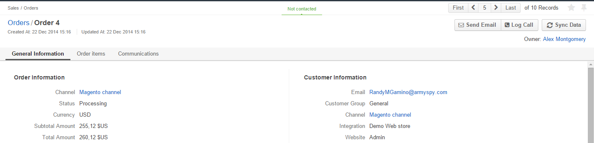

.. _user-guide-magento-channel:

Magento Channels
================

OroCRM supports out of the box integration with Magento. Data can be loaded from Magento and back and processed in 
OroCRM. :ref:`Channels <user-guide-channels>` of Magento type ("Magento Channels") represent sources of customer-related
data collected from Magento-based E-commerce stores.

.. hint::
    
    While Magento integration capabilities are pre-implemented, OroCRM can also be integrated with different third-party 
    systems.

For each Magento Channel, you can:

- Define integration settings and rules, including synchronization priorities, as described in the 
  :ref:`Magento Integration guide <user-guide-magento-channel-integration>`.

- Define :term:`entities <Entity>`, records of which can be loaded to OroCRM from Magento, processed and 
  (subject to the synchronization settings) updated in Magento. 
 
.. _user-guide-magento-entities-entities:
  
Default Entities of Magento Channel
-----------------------------------
There are three basic entities pre-implemented in OroCRM and by default assigned to Magento channels. 

.. hint::
    
    It is possible to add other system and custom entities to the channel, as well as delete most of the default 
    entities from it, subject to you needs. 
    
The default entities are:

.. csv-table:: 
  :header: "Entity", "Instance Description"
  :widths: 10, 30

  "**Web Customer**","Represents a Magento customer, for whom data is collected within the channel. Must be defined 
  for Magento channels."
  "**Shopping Cart**","Keeps details on the Magento Customer's actions with the |WT02|_"
  "**Order**","Keeps details of items purchased and ordered by the customer within the channel, including store details, 
  personal and banking data, one-time and total credited, paid and taxed amounts, feed-backs, etc."

Details of the entity records are uploaded into OroCRM in the course of synchronization, can be 
:ref:`processed <user-guide-magento-entities-actions>` from the OroCRM UI and used to create 
:ref:`reports <user-guide-reports>` and set up :ref:`related workflows <user-guide-magento-entities-workflows>`.

.. _user-guide-magento-entities-actions:

Managing Magento Entities 
^^^^^^^^^^^^^^^^^^^^^^^^^

You can scroll pages, refresh the grid details and reset the grid of Magento entities as described in the 
:ref:`OroCRM UI Elements <user-guide-ui-components-grid-action-buttons>`

The only action available from the :ref:`grid <user-guide-ui-components-grids>` of Web Customers 
(*Customers → Web Customers*), Shopping Carts (*Sales → Shopping Carts*) and Orders (*Sales → Orders*), is calling
the :ref:`View page <user-guide-ui-components-view-pages>` of their records:  |IcView|

*Managing Web-Customers*
^^^^^^^^^^^^^^^^^^^^^^^^

From the :ref:`View page <user-guide-ui-components-view-pages>` of a Web Customer record, you can perform the actions  
specified in the Communication &  Collaboration section of the entity (*System → Entities → Entity Management/Web 
Customer*):

.. image:: ./img/magento_entities/view_web_customer.png

*Managing Shopping Carts*
^^^^^^^^^^^^^^^^^^^^^^^^^
From the *View* page of any shopping cart you can

- Perform the actions specified in the Communication &  Collaboration section of the entity (*System → Entities → 
  Entity Management/Shopping Cart*):

- Synchronize Data, i.e. upload the latest information for the cart/order from Magento and back (as defined by the 
  synchronization settings).

.. image:: ./img/magento_entities/view_carts.png

.. important:: 

    Information for all the carts is updated once in a predefined period (default value is 5 minutes).
    However, it is strongly recommended to update a specific Cart record before you perform any actions with it.

You can also place an order from the :ref:*View* page of every shopping cart with *Open* status (items in the cart have 
not yet been purchased). Click the button to get to the Magento *Place an Order* form.

.. image:: ./img/magento_entities/view_place_order.png

.. caution::

    Be careful not to confuse the cart status and step of the related workflow. For example, a cart at the step 
    "Contacted" can still have the "Open" status (items in the carts have not yet been bought).

.. caution::
    
    You need to enter your credentials when referred to the Magento for the first time in the session.

    
*Managing Shopping Carts*
^^^^^^^^^^^^^^^^^^^^^^^^^
From the *View* page of any order you can

- Perform the actions specified in the Communication &  Collaboration section of the entity (*System → Entities → 
  Entity Management/Shopping Cart*):

- Synchronize Data : uploads the latest information for the cart/order from Magento and back (if so is specified by the 
  synchronization settings).

    
    

.. _user-guide-magento-entities-workflows:

Default Workflows with Magento Entities 
---------------------------------------

To provide consistent and customer oriented approach, you can define a specific workflow within which the actions can be
performed for each shopping cart or order. The following two workflows are pre-implemented in OroCRM
for Magento-based shops:

*Abandoned Shopping Cart* Workflow
^^^^^^^^^^^^^^^^^^^^^^^^^^^^^^^^^^

The workflow is aimed at boosting sales from carts. Basically, once the managers sees a cart that has not been 
converted into an order, the manager can:

1. Contact the customer. Multiple calls an/or E-mails can be made/sent.

2. Convert the cart into an Order or Abandon the cart

This way, the workflow allows converting the cart into an order without contacting the customer, but within the workflow
it is impossible to abandon the cart without getting in touch with the customer.

.. image:: ./img/magento_entities/cart_workflow_diagram.png

The workflow helps to improve customer-oriented communications and increase the amount of actual orders. At the 
same time, the managers can see all the information on the relevant items (no long search during the call), switch to 
the customer and account info and even check if the customer has already been contacted.

*Order Follow Up* Workflow
^^^^^^^^^^^^^^^^^^^^^^^^^^

The workflow is aimed to keep track of the customer feedback on the purchase. For each order, the manager can:

1. Contact the customer by E-mail. You can contact the customer by E-mail only once. 

2. If there is no response to the E-mail, it is possible to contact the customer by phone. 
   It is also possible to skip sending an Email and start with a call.
   
3. Once a call has been logged, there are two options:

  - Record Feedback: the *Record Feedback* form will appear. Fill it out, and click :guilabel:`Submit` to save it in the 
    system.
     
    There will be no more calls or E-mails to the customer related to this cart.
   
  - No Reply: if it has not been possible to get in touch with the customer, it is possible to make a note on the case
    (e.g. "an answer-machine", "no parents at home, call-back after six"). 

.. image:: ./img/magento_entities/order_followup_workflow_diagram.png

The workflow provides for consistent feedback collection and eliminates excessive calls, as each manager can see
the log of E-mails and call-attempts.

.. |WT02| replace:: Shopping Cart
.. _WT02: http://www.magentocommerce.com/magento-connect/customer-experience/shopping-cart.html

.. |IcView| image:: ./img/buttons/IcView.png
   :align: middle
