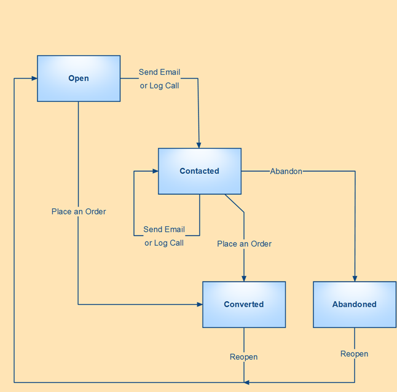
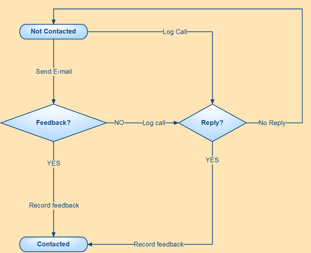

.. _user-guide-magento-entities-workflows:

Default Workflows with Magento Entities
=======================================

To provide a consistent and customer-oriented approach, you can 
:ref:`define a specific workflow <user-guide-workflow-management-basics>` within which the actions can be
performed for each shopping cart or order. The following two workflows are pre-implemented in OroCRM
for Magento-based shops out-of-the-box:

*Abandoned Shopping Cart* Workflow
----------------------------------

The workflow is aimed at boosting sales from carts. Basically, once the managers sees a cart that has not been
converted into an order, the manager can:

1. Contact the customer. Multiple calls and/or emails can be made/sent.

2. Convert the cart into an Order or Abandon the cart

This way, the workflow allows converting the cart into an order without contacting the customer, but within the workflow
it is impossible to abandon the cart without getting in touch with the customer.

The workflow helps to improve customer-oriented communications and to increase the amount of actual orders. At the
same time, the managers can see all the information on the relevant items (no long search during the call), switch to
the customer and account info and even check if the customer has already been contacted.

*Order Follow Up* Workflow
--------------------------

The workflow aims to keep track of the customer feedback on the purchase. For each order, the manager can:

1. Contact the customer by email. You can contact the customer by email only once.

2. If there is no response to the email, it is possible to contact the customer by phone.
   It is also possible to skip sending an email and start with a call.

3. Once a call has been logged, there are two options:

  - Record Feedback: the *Record Feedback* form will appear. Fill it out, and click :guilabel:`Submit` to save it in the
    system.

    There can be no more calls or emails to the customer related to this cart.

  - No Reply: if it has not been possible to get in touch with the customer, it is possible to make a note on the case
    (e.g. "an answering machine", "no parents at home, call back after six").

The workflow provides for consistent feedback collection and eliminates excessive calls, as each manager can see
the log of emails and call-attempts.
