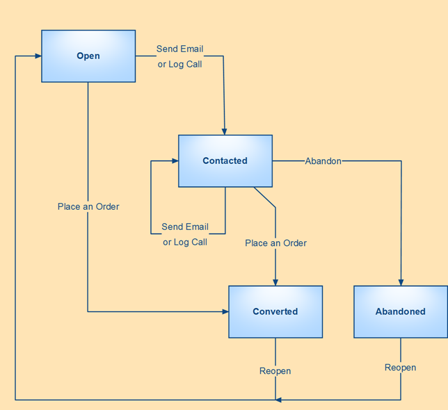
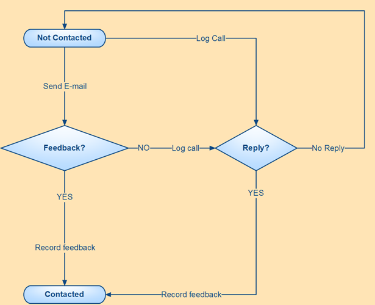

.. _user-guide-magento-entities-guide:

System Magento Entities Management Guide
========================================

Magento and OroCRM
------------------

On one hand, Oro Platform-based :term:`OroCRM` is a strongly flexible and customizable solution scalable and adjustable
enough to meet the needs of different businesses. In the course of customization it is possible to create a special 
:term:`channel <Channel>` and assign it such :term:`entities <Entity>` that their instances will correspond specific 
task. 

It is also possible to set up integration with different data management systems (whether CRM, ERP, 
time&task management, etc.) to upload details of the defined entity-instances. 

Each and every of such instances can then be used to set-up required :term:`workflows`, reports, and actions.

On the other hand, OroCRM comes pre-integrated and sharpened for work with `Magento <http://magento.com/>`_ .
This article is devoted to the description of Magento-specific settings and ways of their processing available with
OroCRM 1.4.

Magento Channels
----------------

Channel instances in OroCRM represent specific sources of sales or customers, which for Magento means specific Magento 
shops. A special Channel type devoted to process data of Magento Stores is *Web Channels*.

For each Web Channel created you can define:
- Basic channel instance details (i.e. name and status in the system)

- Integration settings and rules, including synchronization priorities (whether you wish only to update data in OroCRM 
  from Magento, or update data on Magento shop if it was changed in the OroCRM and which data is a priority if the same 
  details were changed differently at the both locations)
  
- Set of the channel entities, i.e. such entities that information of their instances will be provided to OroCRM by your
  Magento shop, uploaded to the OroCRM and processed there, and (subject to the synchronization settings) updated in 
  your Magento shop

For more details on Channel creation please address our \:ref:`Channels Management Guide <user-guide-channel-guide>`\.

Magento Entities
----------------

While it is possible to modify the list of entities for a channel of *Web* type in the course of customization and 
subject to your needs, there are three basic Magento entities already implemented in OroCRM, covering basic need of 
Magento customer relations management.
The entities are:

.. csv-table:: 
  :header: "Entity", "Instance Description"
  :widths: 10, 30

  "
  .. _user-guide-magento-entities-web-customer:
   
  **Web Customer**","Aggregates all the data on a specific Magento-shop customer, including the list of Channels active 
  for the customer, billing details, related opportunities, shipping details, rating, etc.
  
  Each Web Customer instance is assigned to an Account instance, from where the user can get a full view of the sales
  and pre-sales activities of the customer or a group of customers across multiple Channels"

  "
  .. _user-guide-magento-entities-shopping-cart:
   
  **Shopping Cart**","Keeps details on the Magento Customer's pre-sales activity with the |WT02|_"
   
  "
  .. _user-guide-magento-entities-order:
    
  **Order**","Keeps details of actual sales made by the customer within the channel, including store details, Customer's 
  details, one-time and total credited, paid and taxed amounts, feed-backs, etc."

Details of all of these entities may be uploaded into OroCRM in the course of integration, processed from OroCRM UI and 
used to create reports, actions and workflows. 

Magento Synchronization
-----------------------

As soon as integrations setting of at least one Magento Channel instance have been defined, and the channel was assigned
Cart and Order entities, you can upload details of all the carts and orders present for the related Magento shop into 
the OroCRM, you need to run the first data upload:

- Go to *System --> Channels* and click in the row of the grid that contains your Magento Channel

- Click on its Integration link

- Click :guilabel:`Schedule Sync` button. *A sync job has been added to the queue. Check progress.* note will appear. 

- The data is being synchronized. You can click *Check progress* link to see the synchronization status.

From now on the data will be automatically synchronized every five minutes.

This way, you do not create or edit any Cart or Orders from OroCRM.

As soon as they have been loaded from Magento, you can use their details for different actions, as a part of 
pre-implemented and customized workflows and \:ref:`reports <user-guide-reports>`\.

Magento Actions 
---------------

The following actions can be performed for every Shopping Cart and Order:

- Refresh Data : uploads the latest information for the Cart from Magento.

.. caution:: 

    As a matter of fact, information for all the carts is updated once in a predefined period (5 minutes by default), 
    however it is strongly recommended to update a specific Cart instance before you perform any actions with it.

- Log Call :  once the action is performed, *Log Call* form will emerge pre-filled with details of the related Contact
  instance.
  
  Record the call details in the form to keep them in the system. 

- Send Email :  once the action is performed, *Send Email* form will emerge pre-filled with details of the related 
  Contact instance. 
  
  Fill in the Email subject and Email content fields and click :guilabel:`Submit` button to send the E-mail.
  
  You can also provide a supplementary note in the *Notes* section that will be saved in the system.

*Place and Order* action can be performed for any Cart the items whereof have not yet been purchased. The action refers 
you to the Magento *Place an Order* form.
  
.. caution::
  
    You need to enter your credentials when referred to the Magento for the first time in the session.

Magento Workflows 
-----------------
To provide consistent and customer oriented approach, you can define a specific workflow within which the actions can be
performed for each instance of a Shopping Cart or Order.

There is one workflow for Shopping Cart and one for Orders pre-implemented in the system and described below:

*Abandoned Shopping Cart* Workflow
^^^^^^^^^^^^^^^^^^^^^^^^^^^^^^^^^^

The workflow is aimed at boosting sales from carts. Basically, once the managers sees a Cart instance that has not been 
converted into an order, the manager can:

1. Contact the customer. Multipple calls an/or E-mails can be made/sent.

2. Convert the cart into an Order or Abandon the cart

It is possible to convert the cart into an order without contacting the customer, but it is impossible to abandon it 
without getting in touch with the customer.

The workflow provides for increase of customer-oriented communications and provide for higher level of actual orders, 
at the same time providing the managers with a convenient tool for organization of customer communications, as they can 
see all the information on the relevant items (no long search during the call), switch to the Customer and Account info,
and, the last bar way not the least, check if the customer has already been contacted (every customer appreciates a bit 
of attention, but no one like being bothered by the sales guys too often).

*Order Follow Up* Workflow
^^^^^^^^^^^^^^^^^^^^^^^^^^

The workflow is aimed to keep track of the customer feedback on the purchase. For each Order instance the manager can:

1. Contact the customer by E-mail. You can contact the customer by E-mail only once. 

2. If there is no response to the E-mail, it is possible to contact the customer by phone. 
   It is also possible to skip sending an Email and start with a call.
   
3. Once a call was logged, there are two options:

   - Record Feedback : *Record Feedback* form will appear. Fill it, and click :guilabel:`Submit` to save it in the 
     system.
     
     No more calls or E-mails to the customer related to this Cart instance.
   
   - No Reply : you can make a note (e.g. "an answer-machine", "no parents at home, call-back after six"). 

The workflow provides for consistency of the feedback collection and eliminates excessive calls, as each manager can see
the log of previous E-mails and call-attempts, if any.

.. |WT02| replace:: Shopping Cart
.. _WT02: http://www.magentocommerce.com/magento-connect/customer-experience/shopping-cart.html
