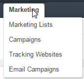

.. _user-guide-marketing:

Marketing Functionality
=======================

Marketing functionality is sharpened to organize and monitor marketing campaigns and mailings.

The following entities are implemented in the OroCRM for the functionality-purposes:

- :ref:`*Marketing List <user-guide-marketing-lists>*` records define the rules used to select sets of contact 
  details for marketing needs

- :ref:`*Campaign <user-guide-marketing-campaigns>*` records represent marketing campaigns and 
  keep their general information, related events and tracking settings.
    
- :ref:`*Tracking Website*` <user-guide-tracking-websites>` records define details of a website, for which tracking 
  shall be performed. 

As soon as a campaign and tracking website record have been defined, you can modify the website code to  monitor 
campaign-related activity of the Website users, as described in the :ref:`*How to Track Campaign Related Activities on 
the Website <user-guide-how-to-track>*` guide
  
- :ref:`*Email Campaign <user-guide-marketing-email-campaigns>*` records define the rules used to generate a
  mailing.

For every Email campaign, a marketing list must be chosen, campaign can be assigned and website tracking can be used, 
as shown in the :ref:`*Marketing Functionality Example for an Email Campaign <user-guide-marketing-example>*`.
 
