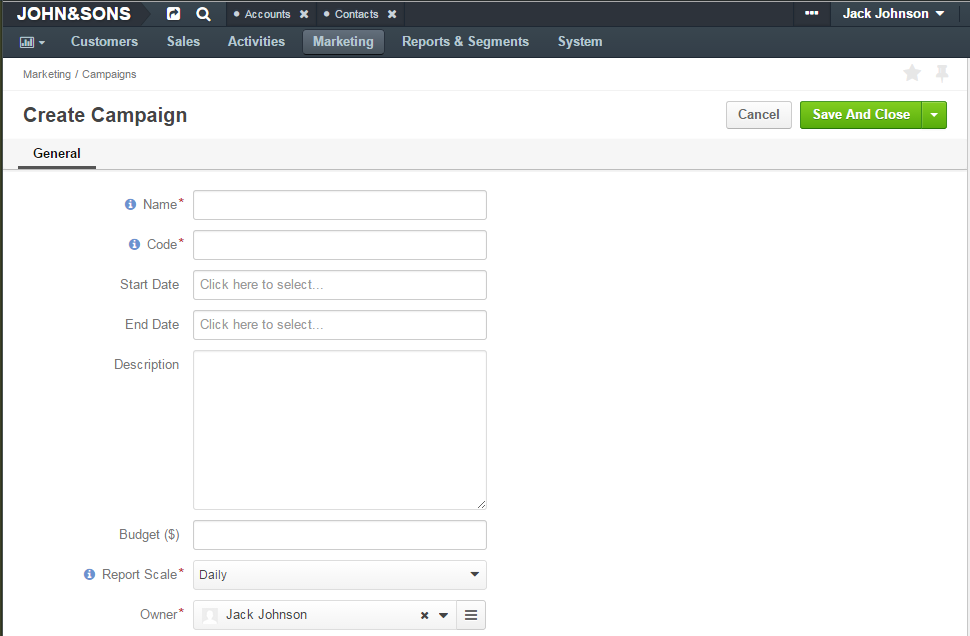
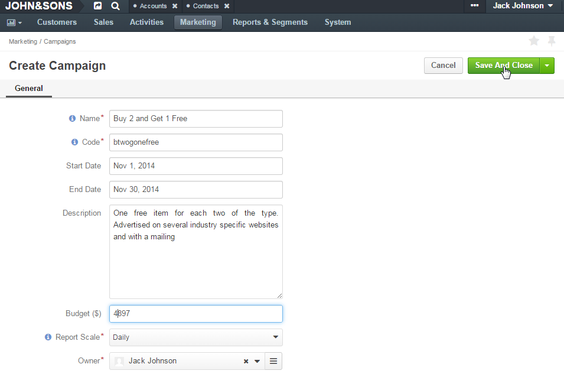

.. _user-guide-marketing-campaigns:

Marketing Campaigns
===================

Campaign records in OroCRM are used to define general details of the marketing activity and monitor its flow and results.

You can include any amount of :ref:`Email Campaigns <user-guide-email-campaigns-plus-marketing>` and 
:ref:`Tracking Website records <user-guide-marketing-tracking>` into one Campaign and get the full picture to evaluate 
the campaign efficiency.

This article describes the ways to create, manage and view the Campaign records. 

.. _user-guide-marketing-campaigns-create:

Create Campaign Records
-----------------------

1. Go to *Marketing → Campaigns* page and click :guilabel:`Create Campaign` button in the top right corner to get 
   to the *Create Campaign* :ref:`form <user-guide-ui-components-create-pages>`.
   

2. Define settings of the campaign:

There are four mandatory fields that **must** be defined:
  
.. csv-table::
  :header: "**Field**","**Description**"
  :widths: 10, 30

  "**Name***","Name used to refer to the campaign in the system."
  "**Code***","Unique code of the campaign, used to generate its tracking settings. May contain only alphanumeric 
  symbols, dashes, and underscores."
  "**Report Scale***","Defines default time-scale of the events graph. The next larger scale is chosen if there are 
  over 40 records" 
  "**Owner***","Limits the list of users that can manage the campaign to users,  whose 
  :ref:`roles <user-guide-user-management-permissions>` allow managing 
  campaigns of the owner (e.g. the owner, members of the same business unit, system administrator, etc.)."

Optional fields can be used to define such details as start and end dates of the campaign, its description and its budget. 

Custom fields may be added, subject to specific business-needs. 

.. note::

    The default Sender Email and Name values are defined for all the emails generated in the system within different 
    marketing campaigns by the corresponding :ref:`configuration settings <admin-configuration-emails>`.

3. Save the campaign in the system with the button in the top right corner of the page.

.. _user-guide-marketing-campaigns-actions:

Manage Campaigns
----------------

The following actions are available for a campaign from the :ref:`grid <user-guide-ui-components-grids>`:

.. image:: ./img/marketing/marketing_campaign_action_icons.png

- Delete the campaign from the system: |IcDelete| 

- Get to the :ref:`Edit form <user-guide-ui-components-create-pages>` of the campaig: |IcEdit| 
  
- Get to the :ref:`View page <user-guide-ui-components-view-pages>` of the campaign: |IcView| 

.. _user-guide-marketing-campaigns-view-page:

Campaign View Page
^^^^^^^^^^^^^^^^^^^

The :ref:`View page <user-guide-ui-components-view-pages>` of a campaign contains the following three sections:

- General Information: details specified for the campaign during its creation/editing

.. image:: ./img/marketing/marketing_campaign_view_general.png

- Events: each event represents one time a user has accessed a pre-defined part of the Website following the 
  campaign.
  
  The section contains the "Detailed Events Report" and the grid.
  
  |ViewEvents|

  In the example above users have accessed the site 36 times, twenty-two out of these times, they've made an order and 
  8 times they've viewed some item details.
  
  Campaign events include the events logged for related 
  :ref:`Email Campaigns <user-guide-email-campaigns-plus-marketing>` and 
  :ref:`Tracking Website records <user-guide-marketing-tracking>`

- Campaign tracking code. A piece of code, that you can use, to include details of Tracking Website records to the 
  Campaign. 

  |CampaignCode|

.. |IcDelete| image:: ./img/buttons/IcDelete.png
   :align: middle

.. |IcEdit| image:: ./img/buttons/IcEdit.png
   :align: middle

   
.. |BGotoPage| image:: ./img/buttons/BGotoPage.png
   :align: middle
   
.. |Bdropdown| image:: ./img/buttons/Bdropdown.png
   :align: middle

.. |BCrLOwnerClear| image:: ./img/buttons/BCrLOwnerClear.png
   :align: middle

.. |ViewEvents| image:: ./img/marketing/marketing_campaign_view_events.png

.. |CampaignCode| image:: ./img/marketing/marketing_campaign_view_code.png
  