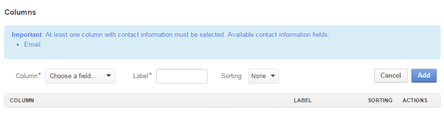
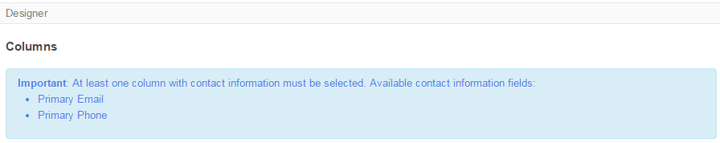
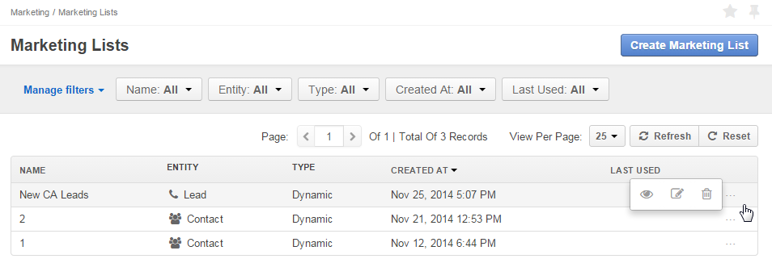
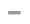

.. _user-guide-marketing-lists:

Marketing Lists
===============

Marketing lists define a set of contact details to be used for marketing purposes (mass call or mailing). 

For example, you can create a list that will contain only details of leads added to the system after October 1 with 
addresses in California. 

.. _user-guide-marketing-lists-create:

Creating a Marketing List
-------------------------

1. Go to the *Marketing → Marketing Lists* and click :guilabel:`Create Marketing List` button 
   in the top right corner of the grid.
   
   Create Marketing List :ref:`form <user-guide-ui-components-create-pages>` will emerge

2. Define :ref:`general details <user-guide-marketing-marketing-list-create-general>` of the marketing list.

3. Define conditions in the *Filters* section. Only the records that meet the conditions will be added to the marketing
   list.
  
4. Choose the :ref:`columns <user-guide-marketing-marketing-list-create-columns>` that will be visible on the *"View*" 
   page of the list and available to third-party systems following integration
    
5. Save the campaign in the system with the button in the top right corner of the page.
  

.. _user-guide-marketing-marketing-list-create-general:
  
General Details  
^^^^^^^^^^^^^^^

The following fields are mandatory and **must** be specified:

.. csv-table::
  :header: "Field", "Description"
  :widths: 10, 30

  "**Name**","Name used to refer to the marketing list in the system"
  "**Entity**","Choose an entity from the drop-down.
  Only entities that have contact details (E-mail or phone number) are available.
  Records of the chosen entity and entities related to it will be used to create the list of contacts."
  "**Type**","Chose the list type from the drop-down:
 
  - **Dynamic** lists are updated as soon as any changes have taken place in the system 
  
  - **On demand** lists will be updated only following the user request"
  "**Owner**","Limits the list of users that can manage the marketing list to the users, whose roles allow 
  managing marketing lists of the owner (e.g. the owner, members of the same business unit, system administrator, etc.)
  ."

Optional field **Description** can be filled with free text to help you and other users to understand the purpose or 
peculiarities of the list in the future.

Custom fields may be added subject to specific business-needs. 
  
.. image:: ./img/marketing/list_general_details_ex.png

.. _user-guide-marketing-marketing-list-create-filters:
  
Filters
^^^^^^^

You can define conditions used to select the entity records for the marketing list, using the following tools: 

- **Field Condition**: only records that meet the condition are added to the list

- **Conditions Group**: a set of field conditions

- **Apply Segment**: only records that meet a specific set of predefined conditions (belong to a segment) are added to 
  the list. (Segments are subject to a separate document)

Field conditions, condition groups and segment settings can be combined or ORed to define the final set of conditions. 

Field Condition
"""""""""""""""

To define a field condition (for example, that all the Leads in the list have been created within the last month):

- Drag *"Field condition"* to the box on the right

.. image:: ./img/marketing/list_filters_field_condition.png

- Click *Choose a field* link and select the necessary field (e.g *"Created at"*) 

-  Click links and choose a drop-down value. (e.g. "day" "more than" Oct 1, 2014, 12:00 AM)

.. image:: ./img/marketing/list_filters_field_condition_value.png

Condition Group
"""""""""""""""

To add a condition group (e.g. state in the address of the lead or of the lead's B2B customer's contact shall be 
"California" or "CA"):

- Drag *"Conditions Group"* to the box on the right

.. image:: ./img/marketing/list_filters_condition_group_01.png

- Add several field conditions to the group

.. image:: ./img/marketing/list_filters_condition_group_02.png

- Define the field conditions and choose AND or OR conjunction for the conditions

.. image:: ./img/marketing/list_filters_condition_group_03.png

.. _user-guide-marketing-marketing-list-create-columns:

Columns
^^^^^^^

In the "*Columns*" section, define the set of fields displayed in the grid of the marketing list *"View"* page.
It serves the following purposes:

- Inside the system, it helps to visualise the list and see the instances included
- In case of integration with external mailing services (such as MailChimp), values of these fields
  will be available for the external system.
- Marketing activities require some contact information, so at least one column that contains it must be 
  selected. The list of such fields is provided in the *"Designer"* section. (e.g. for contacts these are Primary Email 
  and Primary Phone fields).

  
- Choose the fields from the drop-down in the *"Column*" section.

- Label is the way the field will be referred to in the grid. The value defined for the field will be added by default, 
  but can be changed. 
  
- Define the sorting order if you want the grid to be sorted by the field value.

- Click :guilabel:`Add` button

.. image:: ./img/marketing/list_columns_ex.png

Use action icons in the last column to edit the grid:

- Delete a column from the list with |IcDelete|

- Edit the column settings with |IcEdit|

- Change the column position, dragging the column by |IcMove| icon

.. _user-guide-marketing-lists-actions:

Marketing List Actions
----------------------

The following actions are available for a marketing list from the :ref:`grid <user-guide-ui-components-grids>`

- Delete the list from the system : |IcDelete| 

- Get to the :ref:`Edit form <user-guide-ui-components-create-pages>` of the list : |IcEdit| 

- Get to the :ref:`View page <user-guide-ui-components-view-pages>` of the list :  |IcView| 

.. _user-guide-marketing-list-view-page:

Marketing Lists View Page
-------------------------

.. image:: ./img/marketing/list_view_page.png

:ref:`View page <user-guide-ui-components-view-pages>` of a marketing list contains:

- :ref:`Action buttons <user-guide-ui-components-grid-action-buttons>`

- General details of the list

- Grid of the list

Grid of the Marketing List
^^^^^^^^^^^^^^^^^^^^^^^^^^

The grid contains:

- Columns defined in the :ref:`Create form <user-guide-marketing-marketing-list-create-columns>`

- "TOTAL CONTACTED" column: contains the number of times a record of this marketing list was contacted within 
  different :ref:`Email campaigns <user-guide-email-campaigns>` 
   
- "LAST CONTACTED" column: contains the date when a  record of this marketing list was last contacted within 
  different :ref:`Email campaigns <user-guide-email-campaigns>`
  
  
.. note::

   Please note that if the same record is a part of different marketing lists, its data from other marketing lists will
   not effect the TOTAL CONTACTED and LAST CONTACTED values.
   
- "SUBSCRIBED" column: Initially all the users in the list are subscribed (the column value is "Yes"). If following one 
  of the :ref:`Email campaigns <user-guide-email-campaigns>` using the marketing list, a user has 
  unsubscribed, the value is changed to "No" and the user is excluded from the next mailings.
  
In the example below, the marketing list has been used for three Email campaigns. Leads Leo's Stereo and Magne Gases 
have unsubscribed after the second mailing.

Action icons in the last column of the grid enable the following actions:

- Get to the *"View"* page of the grid item : |IcView|

- Unsubscribe the item from the list manually : |IcUns|
  
  For unsubscribed items, there is a |IcSub| icon to get the record back to the list
  
- Remove the item from the list : |IcRemove|

  As soon as at least one item has been removed, *"Removed Items"* grid will appear
  

Action icons in the last column of the *"Removed Items"* grid enable the following actions:

- Get to the *"View"* page of the grid item : |IcView|

- Restore the item in the marketing list : |UndoRem|

.. |IcDelete| image:: ./img/buttons/IcDelete.png
   :align: middle

.. |IcEdit| image:: ./img/buttons/IcEdit.png
   :align: middle

.. |IcMove| image:: ./img/buttons/IcMove.png
   :align: middle

.. |IcView| image:: ./img/buttons/IcView.png
   :align: middle

.. |IcSub| image:: ./img/buttons/IcSub.png
   :align: middle

.. |IcRemove| image:: ./img/buttons/IcRemove.png
   :align: middle

.. |UndoRem| image:: ./img/buttons/IcRemove.png
   :align: middle
      
.. |BGotoPage| image:: ./img/buttons/BGotoPage.png
   :align: middle
   
.. |Bdropdown| image:: ./img/buttons/Bdropdown.png
   :align: middle

.. |BCrLOwnerClear| image:: ./img/buttons/BCrLOwnerClear.png
   :align: middle
