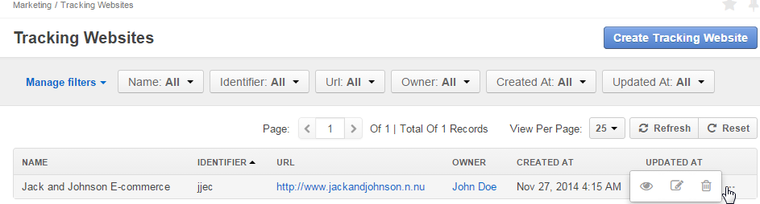

.. _user-guide-marketing-tracking:

Tracking Websites Record
========================

*Tracking Website* records define details of a website, for which tracking shall be performed. 
This article describes how to :ref:`create <user-guide-marketing-tracking-websites-create>` and 
:ref:`manage <user-guide-marketing-tracking-websites-actions>` tracking website records, as well as provides detailed 
description of their *"View"* pages <user-guide-marketing-tracking-websites-view-page>`. 

.. _user-guide-marketing-tracking-websites-create:

Creating a Tracking Websites
--------------------

1. Go to *Marketing --> Tracking Websites* page and click :guilabel:`Create Tracking Website` button in the top right 
  corner to get to the *"Create Tracking Website"* form.
   
.. image:: ./img/marketing/tracking_general.png

2. Define the settings of the tracking record:

There are four mandatory fields that **must** be defined:
  
.. csv-table::
  :header: "**Name**","**Description**"
  :widths: 10, 30

  "**Name***","Name used to refer to the record in the system."
  "**Identifier***","Unique code of the website used to generate its tracking"
  "**Url***","Url of the website to be tracked" 
  "**Owner***","Limits the list of Users that can manage the tracking website record to its owner and Users, whose roles
  allow managing tracking-websites of the owner (e.g. members of the same business unit, system administrator, etc.)
  
  By default, the user creating the tracking websites is chosen.

  - Click |BCrLOwnerClear| button to clear the field
  
  - Click |Bdropdown| button to choose one of available users from the list

  - Click |BGotoPage| button to choose from the *"Select Owner"* page." 

.. image:: ./img/marketing/marketing_tracking_general.png

3. Save the record in the system with the button in the top right corner of the page.

.. _user-guide-marketing-tracking-websites-actions:

Tracking Websites Actions
----------------

The following actions are available for a tracking websites from the :ref:`grid <user-guide-ui-components-grids>`:

- Delete the record from the system : |IcDelete| 

- Get to the *"Edit"* form of the record : |IcEdit| 
  
  You can change the tracking websites details or delete the tracking websites from the 
  :ref:`Edit form <user-guide-ui-edit-forms>`.

- Get to the *"View"* page of the record :  |IcView| 

.. _user-guide-marketing-tracking-websites-view-page:

*Tracking Websites View Page*
-----------------------------

.. image:: ./img/marketing/tracking_view.png

View page of a tracking websites contains the following three sections:

- General Information : general details specified for the tracking websites during creation

- Tracking Code : pieced of code to be added to the website to :ref:`track` <user-guide-how-to-track>` campaign-related
  user activities. The code and its usage is described in more details in :ref:`*How to Track Campaign Related 
  Activities on the Website <user-guide-how-to-track>*` guide.

- Events : tracking events recorded for the Website

You can also get to the Edit form from the :ref:`View page <user-guide-ui-components-view-pages>`.

 

