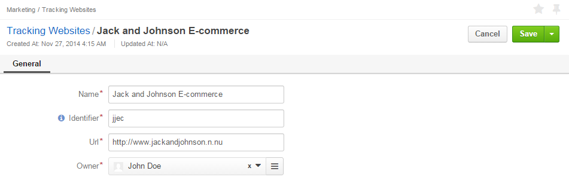
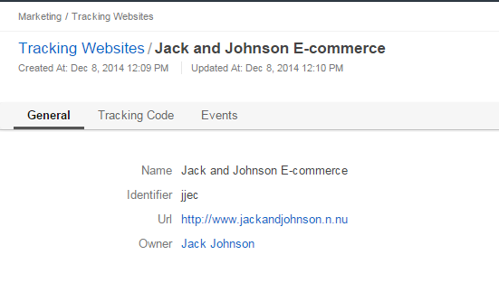
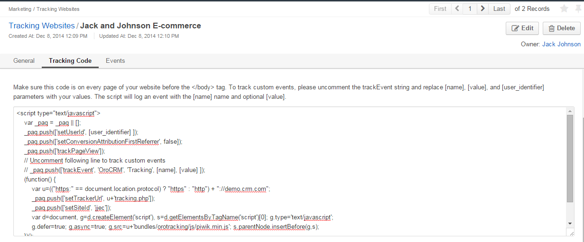

.. _user-guide-marketing-tracking:

Tracking Websites Record
========================

*Tracking Website* records define details of a website, for which tracking shall be performed. 
This article describes how to :ref:`create <user-guide-marketing-tracking-websites-create>` and 
:ref:`manage <user-guide-marketing-tracking-websites-actions>` tracking website records, as well as provides detailed 
description of their :ref:`*"View"* pages <user-guide-marketing-tracking-websites-view-page>`. 

.. _user-guide-marketing-tracking-websites-create:

Creating a Tracking Websites
--------------------

1. Go to *Marketing --> Tracking Websites* page and click :guilabel:`Create Tracking Website` button in the top right 
   corner to get to the *"Create Tracking Website"* form.

2. Define the settings of the tracking record:

There are four mandatory fields that **must** be defined:
  
.. csv-table::
  :header: "**Name**","**Description**"
  :widths: 10, 30

  "**Name***","Name used to refer to the record in the system"
  "**Identifier***","Unique code of the website used to generate its tracking"
  "**Url***","Url of the website to be tracked" 
  "**Owner***","Limits the list of Users that can manage the tracking website record to its owner and users, whose roles
  allow managing tracking-websites of the owner (e.g. members of the same business unit, system administrator, etc.). 
  
  You can  choose one of available users from the list (|Bdropdown|) or from the *Select Owner* page (|BGotoPage|).

  Click |BCrLOwnerClear| button to clear the field
  
  By default, the user creating the tracking websites is chosen."

3. Save the record in the system with the button in the top right corner of the page.

.. _user-guide-marketing-tracking-websites-actions:

Tracking Websites Actions
----------------

The following actions are available for a tracking websites record from the 
:ref:`grid <user-guide-ui-components-grids>`:

.. image:: ./img/marketing/tracking_grid_actions.png

- Delete the record from the system : |IcDelete| 

- Get to the *"Edit"* form of the record : |IcEdit| 
  
  You can change the record details or delete it using the :ref:`Edit form <user-guide-ui-edit-forms>`.

- Get to the *"View"* page of the record :  |IcView| 

.. _user-guide-marketing-tracking-websites-view-page:

*Tracking Websites View Page*
-----------------------------

View page of a tracking websites contains the following three sections:

- General Information: general details specified for the tracking websites during creation and/or editing.

- Tracking Code: a piece of code to be added to the website in order to :ref:`track` <user-guide-how-to-track>` the 
  campaign-related user activities. 
  The code and its usage are described in more details in :ref:`How to Track Campaign Related 
  Activities on the Website <user-guide-how-to-track>` guide.

  
- Events : each event represents one time a user has accessed a pre-defined part of the Website following the 
  campaign.
  Events grid contains name of the event, value of the event, user identification value, page url, campaign code and 
  time the event was logged at.

.. image:: ./img/marketing/tracking_view_events.png

*In the example above you can see the three kinds of events defined for the Jack and Johnson E-commerce website tracking.
As soon as a user gets on any of the Website pages, a "visit" is logged. Value of a visit is always "1".*
*As soon as a user gets to the "Orders" page of the Website, an "Order" is logged. Value of an order is the ordered 
item id.*
*As soon as a user gets to the "Item Details" page of the Website, an "View item" is logged. Value of a "View item" is 
the item id.*

The way to define the events for tracking is described in more details in :ref:`How to Track Campaign Related 
Activities on the Website <user-guide-how-to-track>` guide.

You can also get to the Edit form from the :ref:`View page <user-guide-ui-components-view-pages>`.

.. |IcDelete| image:: ./img/buttons/IcDelete.png
   :align: middle

.. |IcEdit| image:: ./img/buttons/IcEdit.png
   :align: middle

.. |IcView| image:: ./img/buttons/IcView.png
   :align: middle
   
.. |BGotoPage| image:: ./img/buttons/BGotoPage.png
   :align: middle
   
.. |Bdropdown| image:: ./img/buttons/Bdropdown.png
   :align: middle

.. |BCrLOwnerClear| image:: ./img/buttons/BCrLOwnerClear.png
   :align: middle

