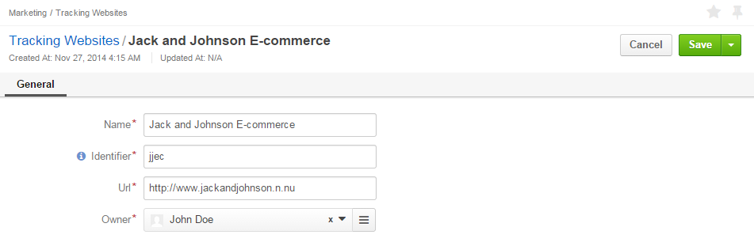
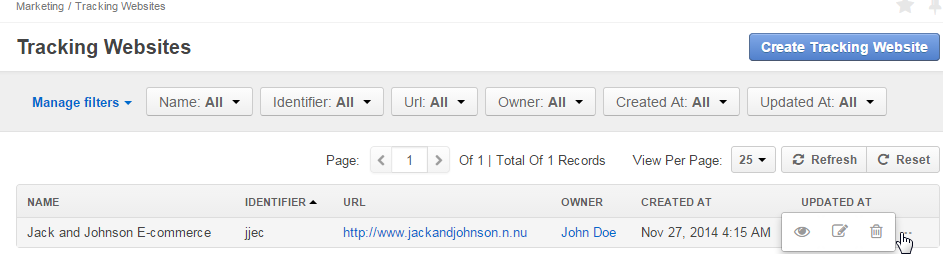
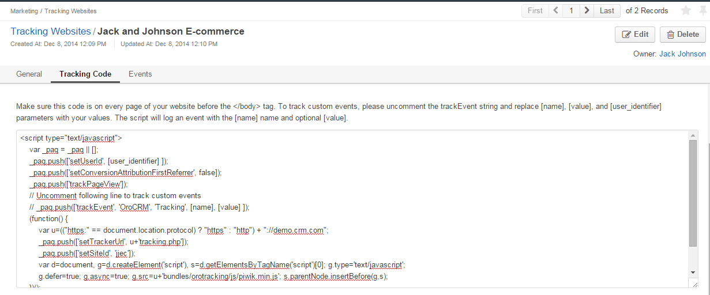
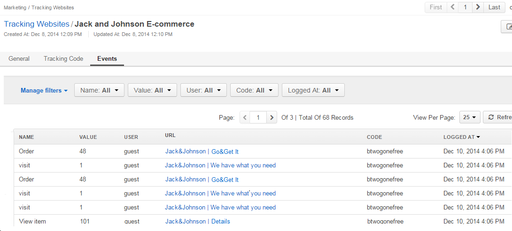

.. _user-guide-marketing-tracking:

Tracking Website Records
========================

*Tracking Website* records are necessary for the OroCRM :ref:`tracking functionality <user-guide-how-to-track>` and
specify the details of a website, at which you want to control user activity related to a marketing campaign. 
This article describes how to create, manage and view the tracking details. 

.. _user-guide-marketing-tracking-websites-create:

Create Tracking Websites Records
--------------------------------

1. Go to *Marketing → Tracking Websites* page and click :guilabel:`Create Tracking Website` button in the top right 
   corner to get to the *Create Tracking Website* :ref:`form <user-guide-ui-components-create-pages>`.

2. Define the settings of the tracking record:

There are four mandatory fields that **must** be defined:
  
.. csv-table::
  :header: "**Field**","**Description**"
  :widths: 10, 30

  "**Name***","Name used to refer to the record in the system"
  "**Identifier***","Unique code of the website used to generate its tracking"
  "**Url***","Url of the website to be tracked" 
  "**Owner***","Limits the list of Users that can manage the tracking website record to the users,  whose 
  :ref:`roles <user-guide-user-management-permissions>` allow managing tracking-websites of the owner (e.g. the owner, 
  members of the same business unit, system administrator, etc.)."

Additionally, you can connect the tracking record with a channel in the system. If this is done, you will be able to 
bind events registered by the tracking engine and other CRM data like orders, shopping carts, customer profiles, etc. 
This connection can be further utilized in reports and segments.

3. Save the record in the system with the button in the top right corner of the page.

.. _user-guide-marketing-tracking-websites-actions:

Manage Tracking Websites Records
--------------------------------

The following actions are available for a tracking websites record from the 
:ref:`grid <user-guide-ui-components-grids>`:

- Delete the record from the system : |IcDelete| 

- Get to the :ref:`Edit form <user-guide-ui-components-create-pages>` of the record: |IcEdit| 
 
- Get to the :ref:`View page <user-guide-ui-components-view-pages>` of the record:  |IcView| 

.. note::

    The tracking process also depends on the :ref:`Tracking settings <admin-configuration-tracking>` defined for the 
    OroCRM instance.

.. _user-guide-marketing-tracking-websites-view-page:

Tracking Websites View Page
^^^^^^^^^^^^^^^^^^^^^^^^^^^

:ref:`View page <user-guide-ui-components-view-pages>` of a tracking websites contains the following three sections:

- General Information: general details specified for the tracking websites during creation and/or editing.

.. image:: ./img/marketing/tracking_view_general.png

- Tracking Code: a piece of code to be added to the website in order to :ref:`track <user-guide-how-to-track>` the 
  campaign-related user activities. 
  The code and its usage are described in more details in :ref:`How to Track Campaign Related 
  Activities on the Website <user-guide-how-to-track>` guide.

  
- Events: each event represents one time a user has accessed a pre-defined part of the Website following the 
  campaign.
  Events grid contains name of the event, value of the event, user identification value, page url, campaign code and 
  time the event was logged at.

*In the example above you can see the three kinds of events defined for the Jack and Johnson E-commerce website tracking.
As soon as a user gets on any of the Website pages, a "visit" is logged. Value of a visit is always "1".*
*As soon as a user gets to the "Orders" page of the Website, an "Order" is logged. Value of an order is the ordered 
item id.*
*As soon as a user gets to the "Item Details" page of the Website, an "View item" is logged. Value of a "View item" is 
the item id.*

The way to define the events for tracking is described in more details :ref:`here <user-guide-how-to-track>`.

.. |IcDelete| image:: ./img/buttons/IcDelete.png
   :align: middle

.. |IcEdit| image:: ./img/buttons/IcEdit.png
   :align: middle

.. |IcView| image:: ./img/buttons/IcView.png
   :align: middle
   
.. |BGotoPage| image:: ./img/buttons/BGotoPage.png
   :align: middle
   
.. |Bdropdown| image:: ./img/buttons/Bdropdown.png
   :align: middle

.. |BCrLOwnerClear| image:: ./img/buttons/BCrLOwnerClear.png
   :align: middle

