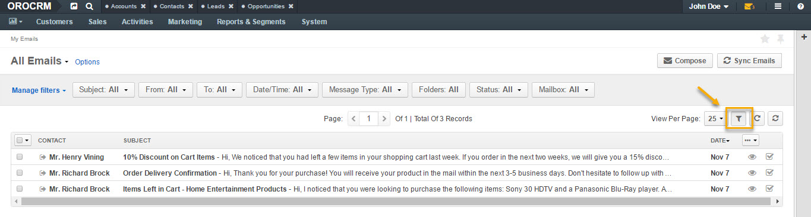
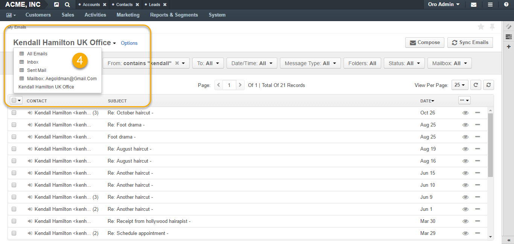
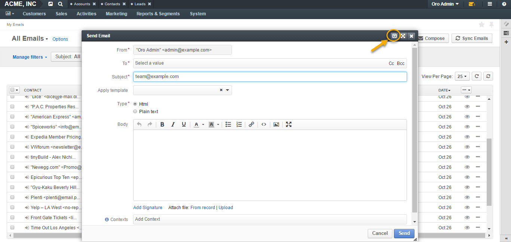
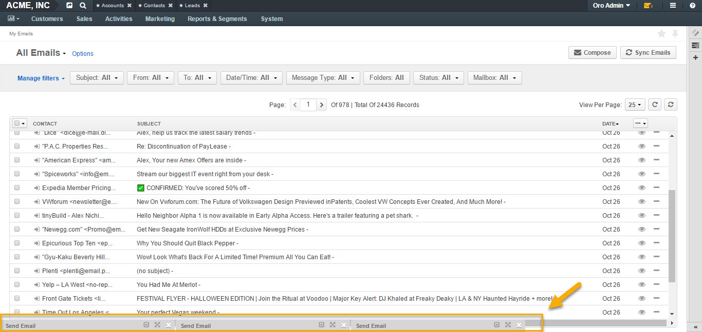
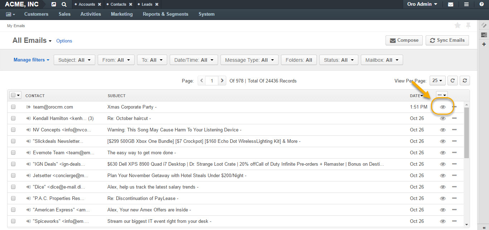

.. _doc-my-oro-emails:

My Emails
=========

To reach the **My Emails** page:

1.  Navigate to your user name in the upper-right corner.

2.  Click **My Emails** in the dropdown menu.

|

.. image:: ../img/emails/user_my_emails.jpg

|

**My Emails** page has the following functionality available:

-  Grid views for emails.

-  Compose button.

-  Sync Emails button.

-  Filters.

-  Options.

Grid Views
~~~~~~~~~~

There are four grid views for emails available by default:

-  **All Emails** (contains all available emails).

-  **Inbox** (contains newly delivered emails).

-  **Sent Mail** (contains sent emails).

-  **Mailbox: Local** (contains emails sent to the user’s personal
   email).

|

.. image:: ../img/emails/my_emails_page.jpg

|

Filters
~~~~~~~

To enable filters for My emails page, click the corresponding button on
the right, as illustrated below:

|

|

Filters sort your emails based on certain criteria, such as:

-  Subject

-  From

-  To

-  Date/Time

-  Message Type

-  Folders

-  Status

-  Mailbox

To find a specific record, click on the filter and select the necessary
search parameter from the dropdown:

|

.. image:: ../img/emails/filters_dropdown.jpg

|

Options
~~~~~~~

Options save the filtered view as a separate page.

To save a page filtered according to the necessary criteria:

1.  Filter your emails according to your requirements using **Filters**.

2.  Click **Options**.

3.  Select **Save As/Save As Default**.

4.  Give your email page a name and click **Save**.

5.  The page will appear in the **Emails** grid dropdown list.

|

.. image:: ../img/emails/filter.jpg

|

|

.. image:: ../img/emails/options_save_list.jpg

|

|

.. image:: ../img/emails/options_save.jpg

|

|

|

Sync Emails
~~~~~~~~~~~

By clicking **Sync Emails** in the top right corner, you will
synchronize emails manually.

.. _doc-activities-emails-actions-compose:

Compose A New Email
~~~~~~~~~~~~~~~~~~~

To compose a new email:

1.  Navigate to your user name in the top right corner.

2.  Click **My Emails** in the dropdown menu.

3.  Click **Compose** in the top right corner.

4.  A **Send Email form** will appear:

|

.. image:: ../img/emails/compose_new_emails.jpg

|

To compose a new email, define the following fields in the form:

+--------------------+---------------------------------------------------------------------------------------------------------------------------------------------------------------------------------------------------------------------------------------+
| **Field**          | **Description**                                                                                                                                                                                                                       |
+====================+=======================================================================================================================================================================================================================================+
| **From**           | The **From** field should contain the email address of the sender. Note that the primary email address is used as a default value and additional addresses are available in the selector for the **From** field.                      |
+--------------------+---------------------------------------------------------------------------------------------------------------------------------------------------------------------------------------------------------------------------------------+
| **To**             | The **To** field should contain the email(s) of the recipient(s). You can add more than one email to the field.                                                                                                                       |
|                    | **Cc:** Clicking **Cc** (carbon copy) will prompt a new field to appear to include more recipients to the emails whom the sender wishes to *publicly* inform of the message. Such recipients will be visible to all other recipients. |
|                    | **Bcc:** Clicking **Bcc** (blind carbon copy) will prompt a new field to appear to include those recipients whom the sender wishes to inform of the email *discreetly*. Such recipients are not visible to anyone.                    |
+--------------------+---------------------------------------------------------------------------------------------------------------------------------------------------------------------------------------------------------------------------------------+
| **Subject**        | Short, descriptive outline of the email message displayed in the mailbox of the recipients.                                                                                                                                           |
+--------------------+---------------------------------------------------------------------------------------------------------------------------------------------------------------------------------------------------------------------------------------+
| **Apply Template** | You can apply a pre-configured template for your email. More information on email template configuration can be found In the :ref:`corresponding <user-guide-email-template>` section of this guide.                                  |
+--------------------+---------------------------------------------------------------------------------------------------------------------------------------------------------------------------------------------------------------------------------------+
| **Type**           | Select the type of the message to be sent:                                                                                                                                                                                            |
|                    | **HTML:** The email will be coded so that the text is formatted and images are added.                                                                                                                                                 |
|                    | **Plain:** The email will contain plain text with no formatting or special layout options.                                                                                                                                            |
+--------------------+---------------------------------------------------------------------------------------------------------------------------------------------------------------------------------------------------------------------------------------+
| **Body**           | Enter the text of your email.                                                                                                                                                                                                         |
|                    | You can customize you email text using the following features:                                                                                                                                                                        |
|                    | -  Bold, Italic, Underline styles                                                                                                                                                                                                     |
|                    | -  Text color                                                                                                                                                                                                                         |
|                    | -  Background color                                                                                                                                                                                                                   |
|                    | -  Bullet List                                                                                                                                                                                                                        |
|                    | -  Numbered List                                                                                                                                                                                                                      |
|                    | -  Insert/Edit link                                                                                                                                                                                                                   |
|                    | -  Source Code                                                                                                                                                                                                                        |
|                    | -  Image Embed Upload                                                                                                                                                                                                                 |
|                    | -  Fullscreen view                                                                                                                                                                                                                    |
+--------------------+---------------------------------------------------------------------------------------------------------------------------------------------------------------------------------------------------------------------------------------+
| **Add Signature**  | The signature may be added to any email you write in OroCRM. Your organization settings define whether the signature will be added automatically or manually.                                                                         |
|                    | If you have a signature configured, you can add it by clicking **Add Signature**. For example:                                                                                                                                        |
|                    | -                                                                                                                                                                                                                                     |
|                    | John Doe, VP                                                                                                                                                                                                                          |
|                    | OroCRM                                                                                                                                                                                                                                |
|                    | t.: 0786756465                                                                                                                                                                                                                        |
|                    | e.: john.doe@example.com                                                                                                                                                                                                              |
|                    | For more information, see **Add Signature To Your Email** section of this guide.                                                                                                                                                      |
+--------------------+---------------------------------------------------------------------------------------------------------------------------------------------------------------------------------------------------------------------------------------+
| **Attach a file**  | You can attach a file from your PC or a related record.                                                                                                                                                                               |
|                    | Click **From a Record** to re-use an attachment from another email in the thread or to choose an attachment assigned to the records.                                                                                                  |
|                    | Click **Upload** and select the necessary file to be uploaded from your computer as an attachment to your email.                                                                                                                      |
|                    | .                                                                                                                                                                                                                                     |
+--------------------+---------------------------------------------------------------------------------------------------------------------------------------------------------------------------------------------------------------------------------------+
| **Contexts**       | Context is any record or records that ha(s)ve meaningful relation to an email conversation. When you add context of a record to the email conversation, it will be displayed in the **Activity** section of that record’s page.       |
|                    | **Note**: If an email has been created from an entity record view page (e.g. from a lead’s page), this record will be added as a context automatically.                                                                               |
+--------------------+---------------------------------------------------------------------------------------------------------------------------------------------------------------------------------------------------------------------------------------+

5.  Once done, click **Send** to send your email.

Save Unfinished Email
~~~~~~~~~~~~~~~~~~~~~

To save an unfinished email, minimize the email dialog window by
clicking on the corresponding button in the top right corner of the
email dialog window.

|

|

Your unfinished email will appear as a minimized window throughout
sessions, as illustrated in the following screenshot:

|

.. image:: ../img/emails/email_minimized2.jpg

|

You can save several of such emails as drafts:

|

|

View Emails
~~~~~~~~~~~

To **open** an email, click once either on the email or the **View**
icon at the right end of the email.

|

|

|

.. image:: ../img/emails/example_email_sent.jpg

|

From the page of the opened email, you can:

-  **Add Comment** (add, edit or delete a comment to the email).

|

.. image:: ../img/emails/add_comment.jpg

|

-  **Add Task** (assign a task through an email).

|

.. image:: ../img/emails/add_task.jpg

|

-  **Mark Unread**

|

.. image:: ../img/emails/mark_unread.jpg

|

-  **Add Context** (define a record related to the email).

|

.. image:: ../img/emails/add_context.jpg

|

-  **Reply** (reply directly to the sender).

-  **Reply All** (reply to everyone in the email conversation).

-  **Forward** (forward an email to a different recipient).

 |

 .. image:: ../img/emails/reply_reply_all_forward.jpg

 |

 |

 .. image:: ../img/emails/reply_all.jpg

 |

 |

 .. image:: ../img/emails/forward.jpg

 |

-  **Download Attachment** (download the attached file, if available).

 |

 .. image:: ../img/emails/download_attachment.jpg

 |

See Also
--------

:ref:`Using Emails <user-guide-using-emails>`

