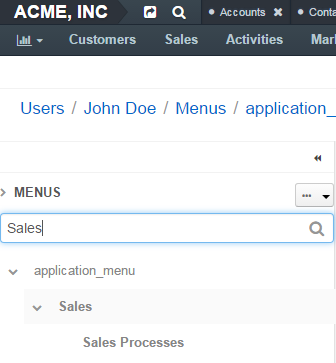

.. _doc-my-user-menus:

My Menus Configuration
======================

.. contents:: :local:
   :depth: 3

Navigation
----------

In the user menu that resides below your username in the upper-right corner of the application, click **My User**.

.. image:: ../img/intro/user_menu.png

On the page that opens, click **More Actions** in the upper-right part of the page and click **Edit Menus**.

Description
-----------

This page describes how you can personalize menus of your Oro application. The changes that you make via your personal menus page do not affect other users. If you are an administrator and want to configure menus for the whole system, please see the :ref:`System Menus Configuration <doc-config-menus>` guide.

.. _doc-menus-menuspage:

Menus Page
^^^^^^^^^^

This page contains a list of menus that you can configure.

|

.. image:: ../img/my_oro/my_user_menus.png

|

- **application_menu**—This is the main menu of the application (also called ``navigation bar`` in the application settings). Via it you can navigate through Oro application. It is always displayed on every page. Subject to the configuration, it may be displayed horizontally or vertically. In the latter case, the menu items are displayed as icons. For more information, see :ref:`Main Menu <user-guide-navigation-menu>`.

  |

  .. image:: ../img/navigation/menu/nav_bar_top.png

  |

- **shortcuts**—You can find this menu in the top panel of the application, next to the organization name. Via it you can quickly perform common actions from anywhere. It is always displayed on every page. For more information, see :ref:`Shortcuts <user-guide-getting-started-shortcuts>`.

  .. image:: ../img/navigation/panel/shortcut_full.png

  |

- **usermenu**—This is the menu that you can access by clicking on your name in the upper-right corner of the application. Via it you can access your profile, emails, tasks and events. It is always displayed on every page. For more information, see :ref:`User Menu <user-guide-getting-started-user-menu>`.

  |

  .. image:: ../img/intro/user_menu.png

  |

- **calendar_menu**—This is a specialized menu that you can find on the **My Calendar** page. Via it you can change the displayed calendar color, hide or remove a calendar from view. For more information, see :ref:`Calendar List <doc-my-oro-calendar-list>`.

  |

  .. image:: ../img/my_oro/calendar_menu.png

  |

.. _doc-menus-actions-viewmenu:

View a Menu
~~~~~~~~~~~

To view a menu, click the corresponding row or the |IcView| **View** icon.

.. _doc-menus-configuration:

Menu Configuration
^^^^^^^^^^^^^^^^^^

When you open a menu configuration, you can see a list of menu items in the left panel of the page. A menu can be multi-level (as a default main menu, for example) with child menu items nested under a parent menu items (e.g. **Reports**, **Manage Custom** reports are child menu items of the **Reports&Segments** menu item in the main menu).
Menu items in a menu can be visually separated by a divider (a horizontal line). Dividers help you logically organize menu items.

.. note:: Some menus (or some menu levels) cannot display dividers. For example, if you add a divider to the first level of the main menu (**application_menu**), this divider will not be displayed.

|

.. image:: ../img/my_oro/my_user_menus_application.png

|

.. _doc-menus-actions-hideorshowpanel:

Hide / Show the Left Menu Panel
~~~~~~~~~~~~~~~~~~~~~~~~~~~~~~~

To minimize or maximize the left menu panel, click a double arrow in the upper-right corner of the panel.

|

.. image:: ../img/my_oro/my_user_menus_application_showpanel.png

|

.. _doc-menus-actions-expandorcollapse:

Expand / Collapse a Menu
~~~~~~~~~~~~~~~~~~~~~~~~

To expand / collapse a parent menu item, click an arrow in front of it.

|

.. image:: ../img/my_oro/my_user_menus_application_expand.png

|

To expand / collapse all menu items, click the ellipses dropdown menu in the upper-right corner of the left panel and click **Expand All** or **Collapse All**.

|

.. image:: ../img/my_oro/my_user_menus_application_expall.png

|

.. _doc-menus-actions-search:

Find a Menu Item
~~~~~~~~~~~~~~~~

To quickly find a menu item, enter its name into the search field and click the |IcSearch| **Search** icon or press :guilabel:`Enter`.

|

|

.. _doc-menus-actions-viewandedit:

View / Edit a Menu Item
~~~~~~~~~~~~~~~~~~~~~~~~

1. In the left panel, click a menu item that you want to view / edit.

2. In the right part of the page, review / edit the menu item settings. See step 3 of the :ref:`Add a Menu Item <doc-menus-actions-addmenuitem>` action description for information about menu item fields.

.. important::
    You cannot edit URI for default menu items.

.. _doc-menus-actions-addmenuitem:

Add a Menu Item
~~~~~~~~~~~~~~~

1. In the left panel, click a menu item which will be parent for the menu item that you create.

2. Click the :guilabel:`Create` dropdown in the upper-right corner of the page and click :guilabel:`Create Menu Item` on the list.

   |

   .. image:: ../img/my_oro/my_user_menus_createmenuitem.png

   |

   The created menu item will appear as the last one on the list of children of the same parent item. You can move it to the position that you need as described in the :ref:`Rearrange Menu Items / Dividers <doc-menus-actions-draganddrop>` action description.

3. In the right part of the page, specify the following information:

   - **Title**—A name for the menu item. This is how this menu item will be represented in the menu.

     Click the |IcTranslations| **Translations** icon to provide spelling for different languages. Click the |IcTranslationsC| **Default Language** icon to return to the single-language view.

     |

     .. image:: ../img/my_oro/my_user_menus_actions_create_translations.png

     |

   - **URI**—An web address of the page or resource that this menu item opens.

     You can specify an absolute URI or one relative to the application URI (as specified in :ref:`Application Settings <admin-configuration-application-settings>`).

     If this menu item will serve as a non-clickable parent that does not link itself to any resource (like **Customers** in the default main menu), type *\#*.

   - **Icon**—From the list, select the icon that will denote the menu item.

     .. note:: Sometimes menus (or menu levels) may not be supposed to display icons. For example, icons added to the first level of the main menu (**application_menu**) are displayed only when this menu is set to appear on the left.

   - **Description**—Type a short but meaningful description of the menu item.

     Click the |IcTranslations| **Translations** icon to provide spelling for different languages. Click the |IcTranslationsC| **Default Language** icon to return to the single-language view.

   |

   .. image:: ../img/my_oro/my_user_menus_actions_create_general.png

   |

4. Click :guilabel:`Save` or, if you want to start immediately create another menu item, :guilabel:`Save and New` in the upper-right corner of the page.

.. important::
    You need to reload the page to see changes.

.. _doc-menus-actions-adddivider:

Add a Divider
~~~~~~~~~~~~~

1. In the left panel, click a menu item which will be parent for the menu divider that you create.

2. Click the :guilabel:`Create` dropdown in the upper-right corner of the page and click :guilabel:`Create Divider` on the list.

|

.. image:: ../img/my_oro/my_user_menus_createdivider.png

|

The created divider will appear as the last one on the list of children of the same parent item. You can move it to the position that you need as described in the :ref:`Rearrange Menu Items / Dividers <doc-menus-actions-draganddrop>` action description.

.. note:: Some menus (or some menu levels) cannot display dividers. For example, if you add a divider to the first level of the main menu (**application_menu**), this divider will not be displayed.

.. important::
    You need to reload the page to see changes.

.. _doc-menus-actions-draganddrop:

Rearrange Menu Items / Dividers
~~~~~~~~~~~~~~~~~~~~~~~~~~~~~~~

You can change the position of an item / divider in a menu by dragging and dropping it in the left panel. You can change the order of menu items at the same level as well as move an item / divider to the higher or lower level.

When you drag-and-drop items, pay attention to the arrow that shows where the item will be placed:

- If an arrow points to the place between items, that is where the moved item will be placed.

  |

  .. image:: ../img/my_oro/my_user_menus_actions_d&dsame.png

  |

 - If and arrow appears in front of a menu item, then the moved item will become a child of the item that the arrow points to.

  |

  .. image:: ../img/my_oro/my_user_menus_actions_d&dunder.png

  |

.. _doc-menus-actions-delete:

Delete a Menu Item / Divider
~~~~~~~~~~~~~~~~~~~~~~~~~~~~

.. important::
    - You cannot delete default menu items.

    - When you delete a menu item that has child items, they will not be deleted but moved to the parent of the menu item that you delete.

1. In the left panel, click a menu item / divider that you want to delete.

2. Click the :guilabel:`Delete` button in the upper-right corner of the page.

3. In the **Delete Confirmation** dialog box, click :guilabel:`Yes, Delete`.

.. important::
    You need to reload the page to see changes.

.. _doc-menus-actions-hide:

Hide a Menu Item
~~~~~~~~~~~~~~~~

If you do not want one of the default menu items to be visible on the interface, you can hide it.

.. important::
    - If a menu that you hide has child items, they will be hidden too.

    - You cannot hide non-default menu items.

To hide a menu item:

1. In the left panel, click a menu item that you want to hide.

2. Click the :guilabel:`Hide` button in the upper-right corner of the page.

.. important::
    You need to reload the page to see changes.

.. _doc-menus-actions-show:

Show a Menu Item
~~~~~~~~~~~~~~~~

To show a previously hidden menu item:

1. In the left panel, click a menu item that you want to show.

2. Click the :guilabel:`Show` button in the upper-right corner of the page.

.. note::
    If a menu item that you want to show has a parent, it will become visible too.

.. important::
    You need to reload the page to see changes.

.. _doc-menus-actions-reset:

Reset a Menu
~~~~~~~~~~~~

1. In the left panel, click a menu name.

2. Click the guilabel:`Reset` button in the upper-right corner of the page.

3. In the **Reset Confirmation** dialog box, click :guilabel:`Yes, Reset`.

.. important::
   You need to reload the page to see changes.

See Also
--------

    :ref:`My User Page <doc-my-user-view-page>`

    :ref:`Actions with My User <doc-my-user-actions>`

    :ref:`My System Configuration <doc-my-user-configuration>`

.. |IcTranslations| image:: /img/buttons/IcTranslations.png
    :align: middle

.. |IcTranslationsC| image:: /img/buttons/IcTranslationsC.png
    :align: middle

.. include:: /img/buttons/include_images.rst
   :start-after: begin

