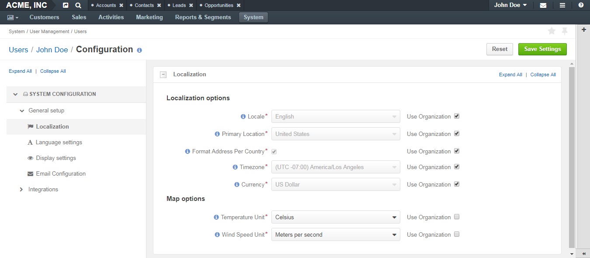

.. _doc-my-user-configuration:

My Configuration
================

Description
-----------

For each option, you can set up an organization value by selecting the **Use Organization** check box next to it.

To revert changes to the default settings, click the :guilabel:`Reset` button in the upper-right corner of the page.

.. contents:: :local:
   :depth: 3

.. _doc-my-user-configuration-general:

General setup
^^^^^^^^^^^^^^^

.. _doc-my-user-configuration-localization:

Localization
~~~~~~~~~~~~

|

|

**Localization options**

+----------------------------+---------------------------------------------------------------------------------------------------------------------------------------------------------------------------------+
| Field                      | Description                                                                                                                                                                     |
+============================+=================================================================================================================================================================================+
| Locale                     | Select the default locale for the user. Numbers, addresses, names and dates will be formatted according to the selected locale.                                                 |
+----------------------------+---------------------------------------------------------------------------------------------------------------------------------------------------------------------------------+
| Primary Location           | Select the country which will be considered the user's primary location. The addresses the user sees on the interface will be formatted according to the rules of this country. |
+----------------------------+---------------------------------------------------------------------------------------------------------------------------------------------------------------------------------+
| Format Address Per Country | When this option is selected, addresses will be formatted according to the rules of their countries. Otherwise, the primary location formatting will be applied.                |
+----------------------------+---------------------------------------------------------------------------------------------------------------------------------------------------------------------------------+
| Timezone                   | Select the timezone for the user location. All dates and times will be displayed according to the specified timezone.                                                           |
+----------------------------+---------------------------------------------------------------------------------------------------------------------------------------------------------------------------------+

**Map options**

+------------------+--------------------------------------------------------------------------------+
| Field            | Description                                                                    |
+==================+================================================================================+
| Temperature Unit | Select the temperature unit. This settings will be applied for weather on map. |
+------------------+--------------------------------------------------------------------------------+
| Wind Speed Unit  | Select the wind speed unit.                                                    |
+------------------+--------------------------------------------------------------------------------+

.. _doc-my-user-configuration-language:

Language settings
~~~~~~~~~~~~~~~~~

|

.. image:: ../img/my_oro/my_user_config_language.png

|

**Languages**

+------------------+----------------------------------------------------+
| Field            | Description                                        |
+==================+====================================================+
| Default Language | Select the default language for the interface.     |
+------------------+----------------------------------------------------+

.. _doc-my-user-configuration-display:

Display settings
~~~~~~~~~~~~~~~~

|

.. image:: ../img/my_oro/my_user_config_display.png

|

**User bar**

+--------------------+------------------------------------------------------------------------------------------------------------------------------------+
| Field              | Description                                                                                                                        |
+====================+====================================================================================================================================+
| Show Recent Emails | Select this check box to display the recent emails on the user bar (they will appear next to the user name).                       |
|                    |                                                                                                                                    |
|                    | .. image:: ../../admin_guide/img/user_management/user_configuration_showemailsuserbar.png                                          |
|                    |                                                                                                                                    |
+--------------------+------------------------------------------------------------------------------------------------------------------------------------+

**WYSIWYG settings**

+-----------------------+-----------------------------------------------------------------------------------------------------------+
| Field                 | Description                                                                                               |
+=======================+===========================================================================================================+
| Enable WYSIWYG Editor | Select this check box to enable text formatting tools for emails, notes and comments.                     |
|                       |                                                                                                           |
|                       | .. image:: ../../admin_guide/img/user_management/user_configuration_wysiwyg.png                           |
|                       |                                                                                                           |
+-----------------------+-----------------------------------------------------------------------------------------------------------+

**Data Grid settings**

+---------------------------+----------------------------------------------------------------------------------------------------------------+
| Field                     | Description                                                                                                    |
+===========================+================================================================================================================+
| Items Per Page By Default | Select how many records will appear on one page of record grids.                                               |
+---------------------------+----------------------------------------------------------------------------------------------------------------+
| Lock Headers In Grids     | Select this check box to ensure that headers of a record grid will stay visible while you scroll.              |
+---------------------------+----------------------------------------------------------------------------------------------------------------+
| Record Pagination         | Select this check box to enable the user navigate to the previous or next grid record from a record view page. |
|                           |                                                                                                                |
|                           | .. image:: ../../admin_guide/img/user_management/user_configuration_pagination.png                             |
|                           |                                                                                                                |
+---------------------------+----------------------------------------------------------------------------------------------------------------+
| Record Pagination Limit   | Type the maximum number of records that the user can navigate from a record view page.                         |
+---------------------------+----------------------------------------------------------------------------------------------------------------+

**Navigation bar**

 +----------+-----------------------------------------------------------------------------------------------+
 | Field    | Description                                                                                   |
 +==========+===============================================================================================+
 | Position | Select whether the OroCRM main menu will be positioned at the top of the page or on its left. |
 +----------+-----------------------------------------------------------------------------------------------+

**Activity lists**

+---------------------------+-------------------------------------------------------------------------------------------------------------------------------------+
| Field                     | Description                                                                                                                         |
+===========================+=====================================================================================================================================+
| Sort By Field             | Select whether to sort activity records by the date when they were created or by the date when they were updated for the last time. |
+---------------------------+-------------------------------------------------------------------------------------------------------------------------------------+
| Sort Direction            | Select whether to sort records in the ascending or descending direction.                                                            |
+---------------------------+-------------------------------------------------------------------------------------------------------------------------------------+
| Items Per Page By Default | Select how many records will appear on one page of the activity grids.                                                              |
+---------------------------+-------------------------------------------------------------------------------------------------------------------------------------+

**Sidebar settings**

 +----------------------+-------------------------------------------------------------------------+
 | Field                | Description                                                             |
 +======================+=========================================================================+
 | Enable Right Sidebar | Select **Yes** to enable the user to see and utilize the right sidebar. |
 +----------------------+-------------------------------------------------------------------------+
 | Enable Right Sidebar | Select **Yes** to enable the user to see and utilize the right sidebar. |
 +----------------------+-------------------------------------------------------------------------+

**Reports settings**

 +-------------------------------------+------------------------------------------------------------------------------------------------------------------+
 | Field                               | Description                                                                                                      |
 +=====================================+==================================================================================================================+
 | Display SQL In Reports And Segments | Select this check box to enable the user to review the SQL request sent to the system for a report or a segment. |
 |                                     |                                                                                                                  |
 +-------------------------------------+------------------------------------------------------------------------------------------------------------------+

|

.. image:: ../../admin_guide/img/user_management/user_configuration_showsql.png

|

.. _doc-my-user-configuration-email:

Email Configuration
~~~~~~~~~~~~~~~~~~~

|

.. image:: ../img/my_oro/my_user_config_email.png

|

**Signature**

 +--------------------------------+--------------------------------------------------------------------------+
 | Field                          | Description                                                              |
 +================================+==========================================================================+
 | Signature Content              | Type the signature to be appended to the user's emails.                  |
 +--------------------------------+--------------------------------------------------------------------------+
 | Append Signature To Email Body | Select whether the signature must be appended automatically or manually. |
 +--------------------------------+--------------------------------------------------------------------------+

**Email synchronization settings**

 +-----------------------------------+------------------------------------------------------------------------------------------------------------------------------------------------------------------------------------------+
 | Field                             | Description                                                                                                                                                                              |
 +===================================+==========================================================================================================================================================================================+
 | Enable IMAP                       | Select this check box to enable the IMAP synchronization of the user's remote mailbox with their OroCRM mailbox. Additional fields that alow you to configure IMAP settings will appear. |
 +-----------------------------------+------------------------------------------------------------------------------------------------------------------------------------------------------------------------------------------+
 | IMAP Host                         | Available only when **Enable IMAP** is selected. Enter a host name of your IMAP server, e.g. imap.gmail.com.                                                                             |
 +-----------------------------------+------------------------------------------------------------------------------------------------------------------------------------------------------------------------------------------+
 | IMAP Port                         | Available only when **Enable IMAP** is selected. Enter a port that IMAP uses, e.g. 993.                                                                                                  |
 +-----------------------------------+------------------------------------------------------------------------------------------------------------------------------------------------------------------------------------------+
 | Encryption                        | Available only when **Enable IMAP** is selected. Select the type of encryption: **SSL** or **TLS**.                                                                                      |
 +-----------------------------------+------------------------------------------------------------------------------------------------------------------------------------------------------------------------------------------+
 | Enable SMTP                       | Select this check box to enable the SMTP synchronization of the user's remote mailbox with their OroCRM mailbox. Additional fields that alow you to configure SMTP settings will appear. |
 +-----------------------------------+------------------------------------------------------------------------------------------------------------------------------------------------------------------------------------------+
 | SMTP Host                         | Available only when **Enable SMTP** is selected. Enter a host name of your SMTP server, e.g. imap.gmail.com.                                                                             |
 +-----------------------------------+------------------------------------------------------------------------------------------------------------------------------------------------------------------------------------------+
 | SMTP Port                         | Available only when **Enable SMTP** is selected. Enter a port that SMTP uses, e.g. 993.                                                                                                  |
 +-----------------------------------+------------------------------------------------------------------------------------------------------------------------------------------------------------------------------------------+
 | Encryption                        | Available only when **Enable SMTP** is selected. Select the type of encryption: **SSL** or **TLS**.                                                                                      |
 +-----------------------------------+------------------------------------------------------------------------------------------------------------------------------------------------------------------------------------------+
 | User                              | Enter a username used to access mailbox on the configured server. For example, for Gmail, an email address server as a username: alanwise@gmail.com                                      |
 +-----------------------------------+------------------------------------------------------------------------------------------------------------------------------------------------------------------------------------------+
 | Password                          | Enter the password to a user's mailbox.                                                                                                                                                  |
 +-----------------------------------+------------------------------------------------------------------------------------------------------------------------------------------------------------------------------------------+

 Click the :guilabel:`Check Connection/Retrieve Folders` button to check whether the specified synchronization settings are correct and to retrieve the current folder structure of the user's remote mailbox.

 |

**Email Threads**

 +--------------------------------------------------+----------------------------------------------------------------------------------------------------------------------------------------------------------------------------------------------------+
 | Field                                            | Description                                                                                                                                                                                        |
 +==================================================+====================================================================================================================================================================================================+
 | Display Email Conversations As                   | Select whether to visually group original emails with replies to them or show all emails separately.                                                                                               |
 +--------------------------------------------------+----------------------------------------------------------------------------------------------------------------------------------------------------------------------------------------------------+
 | Display Email Conversations In Activity Lists As | Select whether to visually group original emails with replies to them in the **Activities** sections of the record view pages or show all emails separately.                                       |
 +--------------------------------------------------+----------------------------------------------------------------------------------------------------------------------------------------------------------------------------------------------------+

**Reply**

 +----------------------+----------------------------------------------------------------------------------------------------------------------------------------------------------------------------------------------------+
 | Field                | Description                                                                                                                                                                                        |
 +======================+====================================================================================================================================================================================================+
 | Default Reply Button | Select which button will be default for replying to emails: **Reply** or **Reply All**. Other button will continue be available in the **Reply** menu, it will just not be on the top of the list. |
 |                      |                                                                                                                                                                                                    |
 |                      | .. image:: ../../admin_guide/img/user_management/reply_selector.png                                                                                                                                |
 |                      |                                                                                                                                                                                                    |
 +----------------------+----------------------------------------------------------------------------------------------------------------------------------------------------------------------------------------------------+

.. _doc-my-user-configuration-integrations:

Integrations
^^^^^^^^^^^^

.. _doc-my-user-configuration-msoutlook:

MS Outlook settings
~~~~~~~~~~~~~~~~~~~

.. note::
	This functionality is available only for OroCRM Enterprise Edition. For more information about the synchronization with Outlook, see the :ref:`Synchronization with Outlook <user-guide-synch-outlook>` guide.

|

.. image:: ../img/my_oro/my_user_config_outlook.png

|

**Integration settings**

+------------------------------------+----------------------------------------------------------------------------------------------------------------------------------------+
| Field                              | Description                                                                                                                            |
+====================================+========================================================================================================================================+
| Sync Direction                     | Select whether the data will be taken from OroCRM to Outlook, from Outlook to OroCRM or synchronization will occur in both directions. |
+------------------------------------+----------------------------------------------------------------------------------------------------------------------------------------+
| Conflict Resolution                | Select whether OroCRM or Outlook has priority if the same piece of data has been changed in both systems.                              |
+------------------------------------+----------------------------------------------------------------------------------------------------------------------------------------+
| CRM Sync Interval (In Seconds)     | Type how often changes on OroCRM side will be checked.                                                                                 |
+------------------------------------+----------------------------------------------------------------------------------------------------------------------------------------+
| Outlook Sync Interval (In Seconds) | Type how often changes on Outlook side will be checked.                                                                                |
+------------------------------------+----------------------------------------------------------------------------------------------------------------------------------------+

**Synchronization settings**

+-----------------+-----------------------------------------------------------+
| Field           | Description                                               |
+=================+===========================================================+
| Contacts        | Select this check box to synchronize the contacts.        |
+-----------------+-----------------------------------------------------------+
| Tasks           | Select this check box to synchronize the tasks.           |
+-----------------+-----------------------------------------------------------+
| Calendar Events | Select this check box to synchronize the calendar events. |
+-----------------+-----------------------------------------------------------+

See Also
--------

    :ref:`My User Page <doc-my-user-view-page>`

    :ref:`Actions with My User <doc-my-user-actions>`

    :ref:`My Menus Configuration <doc-my-user-menus>`

