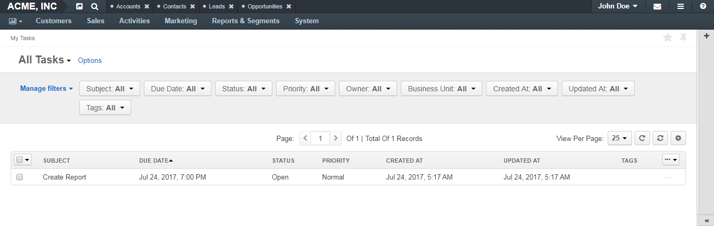

.. _doc-my-oro-tasks:

My Tasks
========

.. include:: /old_version_notice.rst
   :start-after: begin_old_version_notice

In the user menu that resides below your username in the upper-right corner of the application, click **My Tasks**.

.. image:: ../img/intro/user_menu.png

The following page opens:

|

|

This page contains a list of tasks assigned to you.

For the description of fields and to learn more about how to manage this list and tasks from it, see the :ref:`Tasks Grid <doc-activities-tasks-grid>` guide. (The page described in the guide contains the list of tasks of all assignees but structurally is the same as the **My Tasks** page, except that you cannot create new tasks from **My Tasks**).

.. tip:: You can also monitor your tasks on the :ref:`My Calendar <doc-my-oro-calendar>` page, in :ref:`Tasks section of your profile <doc-my-user-view-page-activity-tasks>`, and using the :ref:`Today's Calendar <doc-widgets-today-calendar>` and :ref:`Task List <doc-widgets-sidebar-task-list>` widgets.

See Also
--------

:ref:`Tasks Overview <doc-activities-tasks>`

:ref:`Manage Tasks <doc-activities-tasks-actions>`

:ref:`Tasks Grid <doc-activities-tasks-grid>`

:ref:`Task View Page <doc-activities-tasks-view-page>`

:ref:`My Calendar Page <doc-my-oro-calendar>`

:ref:`Task List Sidebar Widget <doc-widgets-sidebar-task-list>`

:ref:`Today's Calendar Widget <doc-widgets-today-calendar>`

