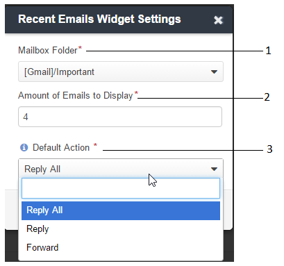

.. _user-guide-navigation-sidebar-panel:
  
Sidebar Panel
=============

The sidebar panel is a host for a number of widgets that provide fast and convenient access to frequently needed 
information, such as recent emails or the task list. 

By default, the sidebar panel is located on the right side of the page. However, subject to the configuration settings 
of your organization, there can be a sidebar on the left, two sidebars (on the left and on the right), or no sidebar at 
all. The location of the sidebar is defined by the system administrator for the whole organization.

What Can Be on the Sidebar 
--------------------------

Out of the box, any sidebar can contain widgets of three types:

|

.. image:: ../img/navigation/sidebar/sb_icons.png

1 - The *"Recent Emails"* widget: Set up the widget to get access to your emails in one or several of the 
  synchronized mailboxes, or to all the emails in your OroCRM mailbox.

2 - *"Sticky Notes"*:  Place free text notes and reminders.

3 - *"Task List"*: See the most recent tasks assigned to you.

To add a new widget, use the :guilabel:`+` button, as described in the section below.

Add a Widget to the Sidebar
---------------------------

Click the :guilabel:`+` button to add a widget, then select the widget type an click the :guilabel:`OK` button. 

|

.. image:: ../img/navigation/sidebar/sb_select.png

|

The newly added widget will appear on the sidebar, below the existing widgets. To reorder widgets on the sidebar, drag 
and drop them with your mouse. 

You can add more than one widget of any type if necessary. For example, you can stick any amount of notes or follow 
several different email folders or mailboxes that are synchronized to your account in OroCRM.

Expand/Collapse the Sidebar
---------------------------

Initially, the sidebar panel is minimized. Hover over the icon to see the widget header.

|

.. image:: ../img/navigation/sidebar/sb_hover.png

|

 In order to expand the sidebar panel, click the double-arrow at its bottom.

|

.. image:: ../img/navigation/sidebar/sb_expand.png

|

Now you can see the widget headers. To collapse the panel back, click the double-arrow again.

|

.. image:: ../img/navigation/sidebar/sb_fold.png

|

Expand/Collapse a Widget
------------------------

In order to see the widget content:

- Click the icon on a minimized bar.

- Click the triangular arrow next to the header on the expanded bar.
    
|

.. image:: ../img/navigation/sidebar/sb_expand_view.png

| 

To fold the widget, click the triangular arrow again.

To reorder widgets on the sidebar, drag and drop them with your mouse. This works in both the collapsed and expanded 
states.

This way, you can keep some of the content visible at all times, and keep fewer used widgets minimized.

|

.. image:: ../img/navigation/sidebar/sb_expand_view_1.png

| 

Manage the Widgets
------------------  

As shown below, each widget contains a header (1), content (2), and icons (3).

|

.. image:: ../img/navigation/sidebar/sb_view.png

|

You can:

- Refresh the content (e.g., load the most actual emails or tasks) with |BRefresh|.

- Get to the widget settings with |IcSettings|.

- Delete the widget from the sidebar with |IcDelete|.

- Close the widget with |BCrLOwnerClear|  (appears only when the panel is minimized).

.. hint::

    You can add several widgets of the same type and define different settings for them. For example, you can keep notes 
    with different content, or email widgets for different folders.

    
Default OroCRM Widgets
----------------------

This section describes the three widgets available in OroCRM out of the box.

The "Recent Emails" Widget 
^^^^^^^^^^^^^^^^^^^^^^^^^^

The widget informs you about new and unread emails, and gives you a convenient way to access them.

|
 
.. image:: ../img/navigation/sidebar/sb_emails.png

|

From the widget, you can:

- Access the *"All Emails"* page and see all your emails available in OroCRM: click the *"My emails"* link (1).

- Mark all the visible emails as read: Click the :guilabel:`Mark Visible As Read button` at the top (2).

- Access any of the displayed emails: Click the Email header.(e.g., 3)

- Mark any of the displayed emails as read: Click the envelope icon by the letter (e.g., 4)

- Reply, reply all, or forward the emails: All these actions are available as links below the email header when the 
  widget is expanded from a minimized tray (e.g., 5). (If the panel bar is expanded, only the default actions will be 
  available).
  
- Get to the view page of the user from whose mailbox the emails have been sent (if available): Click the user name 
  below the letter (e.g., 6).

  
Configure the "Recent Emails" Widget 
""""""""""""""""""""""""""""""""""""

Click the |IcSettings| icon to configure the widget. The settings window will emerge:

|

|

- The widget can be configured to display all the emails from your OroCRM mailbox or from any specific folder or 
  mailbox that has been synchronized (1).
  
- You can change the number of emails displayed (2).

- You can define which default action is shown if the sidebar panel has been expanded (3).

.. hint::

    To make sure you don’t miss some particularly important emails, configure your mailbox to sort them in a specific 
    folder, then configure the widget to display this folder and place it at the top of your sidebar panel.
  
  
Sticky Note
^^^^^^^^^^^

Sticky notes are a great way to keep reminders and memos. You can keep them organized in your OroCRM sidebar panel.

Click the |IcSettings| to change the content of a note.

|

.. image:: ../img/navigation/sidebar/sb_note.png

|

You can keep any number of sticky notes in the panel. If the panel is expanded, you can minimize some of the notes, and 
keep others visible (such as those that are due today). When you don't need the note anymore, you can easily delete it.

Task List
^^^^^^^^^

See :ref:`Task List Widget <doc-widgets-sidebar-task-list>`.

Conclusion
----------

Set up the sidebar widgets in the way that is most convenient for you. This will help you maximize your performance with 
a minimum amount of effort.

.. |IcDelete| image:: /img/buttons/IcDelete.png
   :align: middle
   
.. |IcSettings| image:: /img/buttons/IcSettings.png
   :align: middle
   
.. |BRefresh| image:: /img/buttons/BRefresh.png
   :align: middle
   
.. |BCrLOwnerClear| image:: /img/buttons/BCrLOwnerClear.png
   :align: middle