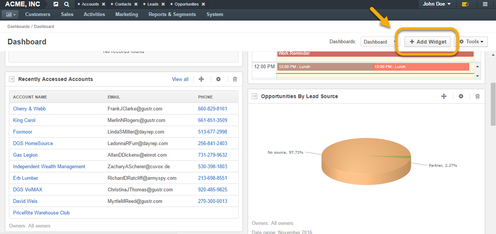
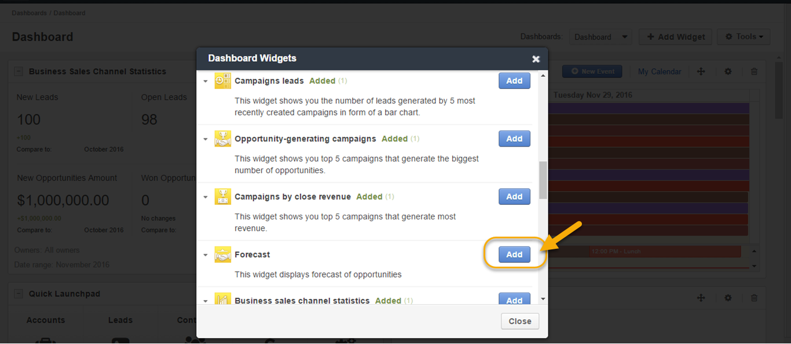
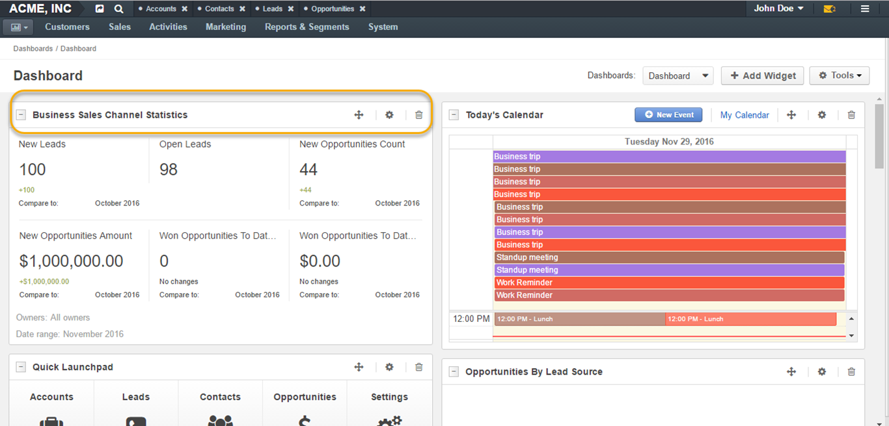
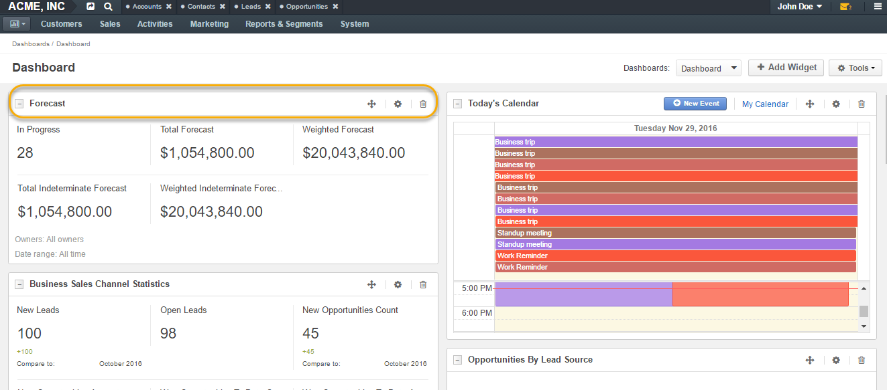
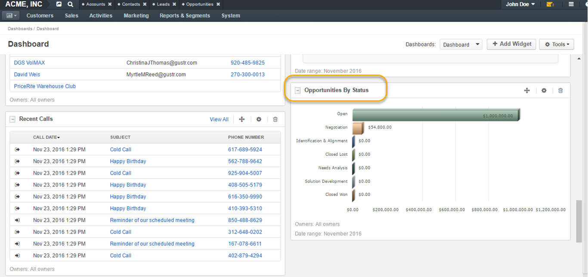

.. _user-guide-widgets:

Dashboard Widgets
=================

Activities Widgets
------------------

:ref:`Recent Emails <doc-widgets-recent-emails>`

:ref:`Today's Calendar <doc-widgets-today-calendar>`

:ref:`Recent Calls <doc-widgets-recent-calls>`

Widgets for Sales
-----------------

Specifically for business sales, there are a number of dashboards
widgets available that can simplify day-to-day sales process activities.
These widgets give concise overview on what is happening with the sales
at any point in time:

-  Business Sales Channel Statistics

-  Forecast

-  Leads List

-  Opportunities List

-  Opportunities by Status

-  Opportunities by Lead Source

-  Campaign Leads

-  Opportunity-generating campaigns

-  Campaigns by Close Revenue and others.

You can read more on how to create and manage dashboards in :ref:`this <user-guide-dashboards>` section
of the guide.

Add Widgets
-----------

-  To add a new widget, click **Add Widget** in the top right corner of
   the dashboard:

|

|

-  To search for a widget, type its name in the search field.
 
|

.. image:: ../img/widgets/business_sales_channel_statistics.png

|

-  To add a new widget from the list, click **Add**.

|

|

.. note:: You can add the same widgets a number of times and assign them different owners.
 
  

Manage Widgets
--------------

Widgets can be easily managed and filtered. A number of widgets can be
created for various team members. For instance, a sales manager can
create the same widgets for each sales rep within the organization to be
able to see results of each sales rep’s work.

|

.. image:: ../img/widgets/configure_widget.png

|

The header of each widget contains the following actions (as illustrated
in the screenshot above):

1. **Collapse/Expand button**: if a widget has been collapsed, only its
   header will be displayed on the dashboard.

2. **Widget name**: widget title displayed on the dashboard.

3. **Move button**: click the button and hold the mouse button to move
   the widget around the dashboard.

4. **Configuration button**: click the button to adjust the widget. You
   can change various settings, depending on the widget type, for
   instance:

|

.. image:: ../img/widgets/configure_widget2.png

|

|

 .. image:: ../img/widgets/date_range.png

|

  
  

   a. Widget title: the name displayed on the dashboard.

   b. Business unit: select the business unit to present statistics for.

   c. Role: select the user’s role (e.g. a sales manager, an
      administrator, a leads development rep, etc.) to see statistics
      for.

   d. Owner: select the owner for the widget to see statistics for a
      certain user.

   e. Date range: time for which the widget details are displayed.

   f. Compare with previous period: tick this option if you wish to
      compare statistics for the current and the previous periods and
      see it displayed in the dashboard widget.

   g. Other widget details (depending on widget type).

5. **Delete button**: delete the widget from the dashboard.

|

.. image:: ../img/widgets/delete_widget.png

|

The specified owner and date range are displayed at the bottom of the
widget:

|

.. image:: ../img/widgets/owner_date_displayed.png

|

List of Widgets
---------------

Business Sales Channel Statistics
~~~~~~~~~~~~~~~~~~~~~~~~~~~~~~~~~

Business Sales Channel Statistics displays a set of metrics that
indicate performance of your sales channels.

|

|

These statistics give information on the number of new and open leads,
new opportunities count and amount, as well as the count and value of
won opportunities to date.

Forecast
~~~~~~~~

Forecast widget displays expected sales potential: the forecast of
opportunities, including opportunities in progress, total and weighted
forecasts, total and weighted intermediate forecasts.

|

|

|

.. image:: ../img/widgets/configure_widget2.png

|

Leads List
~~~~~~~~~~

This widget displays a list of leads that can be configured to show only
leads in certain conditions, e.g. only open leads owned by the current
user.

|

.. image:: ../img/widgets/leads_list.png

|

|

.. image:: ../img/widgets/leads_list_config.png

|

Opportunities List
~~~~~~~~~~~~~~~~~~

This widget displays a list of opportunities that can be configured to
show only opportunities in certain conditions, e.g. only open
opportunities owned by the current user.

|

.. image:: ../img/widgets/opportunities_list.png

|

|

.. image:: ../img/widgets/opportunities_list_config.png

|

Opportunities by Status
~~~~~~~~~~~~~~~~~~~~~~~

The widget displays the breakdown of opportunities by status in a form
of a bar chart.

|

|

|

.. image:: ../img/widgets/opp_by_status_config.png

|

You can select whether to display opportunities amount or count, as well
as select the necessary data range, role, owner, etc.

Opportunities by Lead Source
~~~~~~~~~~~~~~~~~~~~~~~~~~~~

The widget displays the breakdown of opportunities by lead sources in a
form of a pie chart.

|

.. image:: ../img/widgets/opp_by_lead_source.png

|

|

.. image:: ../img/widgets/opp_by_lead_source_config.png

|

Campaign Leads
~~~~~~~~~~~~~~

This widget shows you the number of leads generated by 5 most recently
created campaigns in a form of a bar chart.

|

.. image:: ../img/widgets/campaign_leads.png

|

|

.. image:: ../img/widgets/campaign_leads_config.png

|

Opportunity-generating campaigns
~~~~~~~~~~~~~~~~~~~~~~~~~~~~~~~~

The widget shows you top 5 campaigns that generate the biggest number of
opportunities.

|

.. image:: ../img/widgets/op_generating_camp.png

|

|

.. image:: ../img/widgets/op_generating_camp_config.png

|

Campaigns By Close Revenue
~~~~~~~~~~~~~~~~~~~~~~~~~~

The widget shows the top 5 campaigns that generate the most income.

|

.. image:: ../img/widgets/campaign_revenue.png

|

|

.. image:: ../img/widgets/campaign_revenue_config.png

|

.. toctree::
   :maxdepth: 1
   :hidden:

   widgets_recent_calls
   widgets_recent_emails
   widgets_today_calendar
   widgets_sidebar_tasks