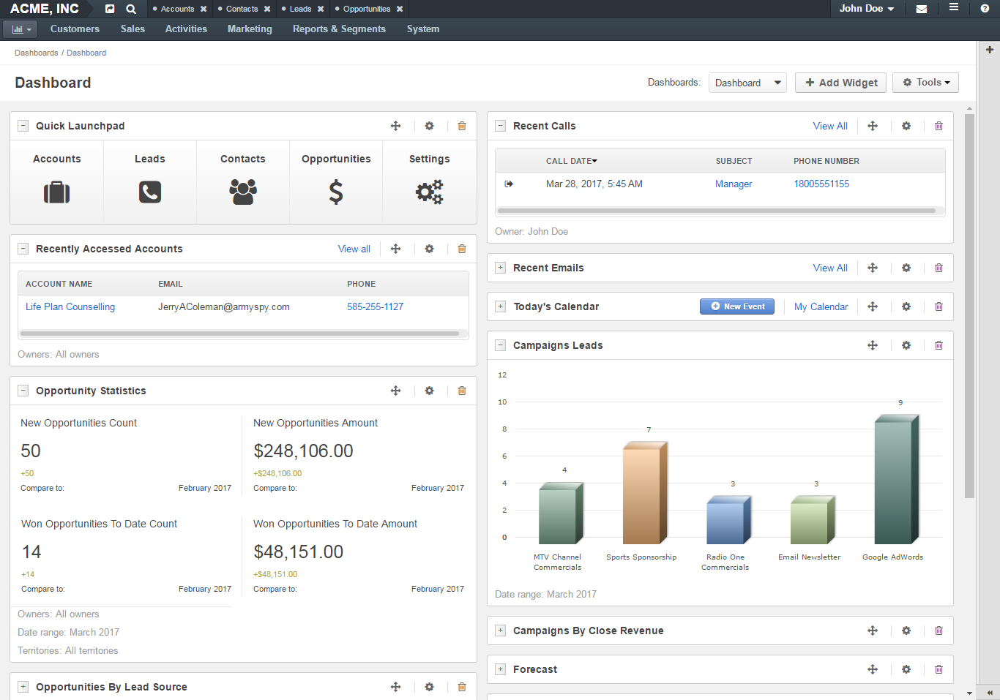

.. _user-guide-widgets:

Dashboard Widgets
=================

Oro dashboard widgets are small applications that perform a single function and serve as blocks that you can use to build your dashboard with.

You can add widgets in any combination and move them around the page creating a dashboard that displays content in a way most convenient to you. Many widgets are customizable: you can set a custom name for them, apply filters to the data that widgets display and so on.

|

|

Quick Launchpad

Recent Emails

:ref:`Today's Calendar <doc-widgets-today-calendar>`

:ref:`Recent Calls <doc-widgets-recent-calls>`

Recently Accessed Contacts

Recently Accessed Accounts

:ref:`Opportunities List <doc-widgets-sales>`

:ref:`Opportunities by Lead Source <doc-widgets-sales>`

:ref:`Opportunities by Status <doc-widgets-sales>`

:ref:`Opportunity Statistics <doc-widgets-sales>`

:ref:`Leads List <doc-widgets-sales>`

:ref:`Lead Statistics <doc-widgets-sales>`

:ref:`Opportunity-generating campaigns <doc-widgets-sales>`

:ref:`Campaigns by Close Revenue and others <doc-widgets-sales>`

:ref:`Campaign Leads <doc-widgets-sales>`

Average Lifetime Sales

:ref:`Forecast <doc-widgets-sales>`

My Sales Flow B2C

Average order amount

New Magento Customers

Ecommerce Statistics

Revenue over time

Orders over time

Purchase Funnel

.. toctree::
       :maxdepth: 1
       :hidden:

       widgets_recent_calls
       widgets_sales
       widgets_today_calendar
