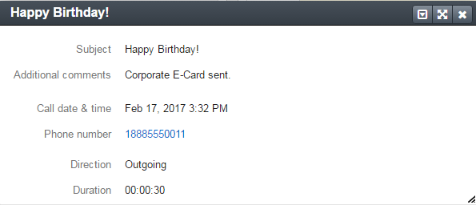

.. _doc-widgets-recent-calls:

Recent Calls Widget
===================

.. include:: /old_version_notice.rst
   :start-after: begin_old_version_notice

This widget displays the list of recently logged calls.

|

.. image:: ../img/activities/activities_calls2.png

|

.. contents:: :local:
   :depth: 3

Widget's Header
---------------

Expand / Collapse the Widget
^^^^^^^^^^^^^^^^^^^^^^^^^^^^

Click **+** / **-** in the upper-left corner of the widget to expand / collapse it.

Move the Widget
^^^^^^^^^^^^^^^

Click the |IcMoveW| **Move** icon and drag-and-drop the widget to move to another part of a dashboard.

Remove the Widget
^^^^^^^^^^^^^^^^^

Click the |IcDelete| **Delete** icon to remove the widget from a dashboard.

Open the Calls Grid
^^^^^^^^^^^^^^^^^^^

Click the **View All** link to open the calls grid.

Configure the Widget
^^^^^^^^^^^^^^^^^^^^

Click the |IcConfigure| **Configure** icon to set parameters for a widget.

To change a widget title, clear the **Use default** check box, and enter a new widget name into the **Widget title** field.

The rest of the available fields enable you to filter the displayed calls.
By default, the widget shows all available calls. You can filter the displayed calls by the following parameters:

- **Business Unit**
- **Role**
- **Owner**

To filter calls, click the corresponding field, and select the desired values from the list.

|

.. image:: ../img/widgets/recent_calls/calls_widget_configuration.png

|

You can always see what filters are currently selected in the lower part of the widget.

|

.. image:: ../img/widgets/recent_calls/calls_widget_filters.png

|

Grid
----

The widget displays the following information about the calls:

+--------------+------------------------------------------------------+
| Field        | Description                                          |
+==============+======================================================+
| DIRECTION    | - |IcOutgoing| **Outgoing**—The call was outgoing.   |
|              |                                                      |
|              | - |IcIncoming| **Incoming**—The call was incoming.   |
+--------------+------------------------------------------------------+
| CALL DATE    | The date and time when the call was started.         |
+--------------+------------------------------------------------------+
| SUBJECT      | What the call was about.                             |
+--------------+------------------------------------------------------+
| PHONE NUMBER | A number that the call was made to / from.           |
+--------------+------------------------------------------------------+

View a Call Card
^^^^^^^^^^^^^^^^

Click on the call log subject in the list to view a call log card:

|

|

Sort Calls
^^^^^^^^^^

Click on the **CALL DATE** column header to sort calls by date and time when call was made.

See Also
--------

:ref:`Dashboard Widgets <user-guide-widgets>`

:ref:`Actions with Calls <doc-activities-calls-actions>`

:ref:`Calls Grid <doc-activities-calls-grid>`

:ref:`Call View Page <doc-activities-calls-view-page>`

.. |IcRemove| image:: /img/buttons/IcRemove.png
   :align: middle

.. |IcClone| image:: /img/buttons/IcClone.png
   :align: middle

.. |IcDelete| image:: /img/buttons/IcDelete.png
   :align: middle

.. |IcEdit| image:: /img/buttons/IcEdit.png
   :align: middle

.. |IcView| image:: /img/buttons/IcView.png
   :align: middle

.. |IcShow| image:: /img/buttons/IcShow.png
   :align: middle

.. |IcHide| image:: /img/buttons/IcHide.png
   :align: middle

.. |IcPassReset| image:: /img/buttons/IcPassReset.png
   :align: middle

.. |IcConfig| image:: /img/buttons/IcConfig.png
   :align: middle

.. |IcDisable| image:: /img/buttons/IcDisable.png
   :align: middle

.. |IcIncoming| image:: /img/buttons/IcIncoming.png
   :align: middle

.. |IcOutgoing| image:: /img/buttons/IcOutgoing.png
   :align: middle

.. |IcMoveW| image:: /img/buttons/IcMoveW.png
   :align: middle

.. |IcConfigure| image:: /img/buttons/IcConfigure.png
   :align: middle