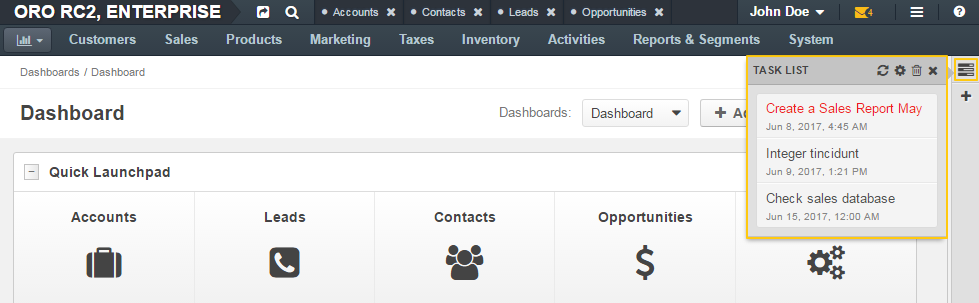

.. _doc-widgets-sidebar-task-list:

Task List Widget
================

This widget displays tasks assigned to you.

The widget's look on the minimized sidebar pannel:

|

|

The widget's look on the maximized sidebar pannel:

|

.. image:: ../img/widgets/task_list/widget_task_list2.png

|

For more information about the sidebar, see :ref:`Sidebar Panel <user-guide-navigation-sidebar-panel>`

.. contents:: :local:
   :depth: 3

Expand the Widget
-----------------

On the minimized sidebar, click the |IcTasks| **Task List** icon on the sidebar to expand the widget.

On the maximized sidebar, click the |IcCaretRight| **Expand** icon on the sidebar to expand the widget.

Widget's Header
---------------

Update the Task List
^^^^^^^^^^^^^^^^^^^^

Click the |IcRefresh| **Refresh** icon to actualize the list of tasks.

Configure the Widget
^^^^^^^^^^^^^^^^^^^^

Click the |IcSettings| **Configure** icon to set parameters for a widget.

To change a number of displayed tasks, enter the required value into the **Number of tasks to show** field and click **OK**.

|

.. image:: ../img/widgets/task_list/widgets_task_list_configuration.png

|

Remove the Widget
^^^^^^^^^^^^^^^^^

Click the |IcDelete| **Delete** icon to remove the widget from a dashboard.

Collapse the Widget
^^^^^^^^^^^^^^^^^^^

On the minimized sidebar, the |IcTimes| **Close** icon to collapse the widget.

On the maximized sidebar, click the |IcCaretDown| **Collapse** icon to collapse the widget.

Task List
---------

Tasks in the list are represented by their subject and due date. Tasks are ordered by their due dates in ascending order—the earlier a due date, the higher on the list a task is displayed.

Overdue tasks appear in red.

Click the task to open its view page.

See Also
========

:ref:`Tasks Overview <doc-activities-tasks>`

:ref:`Manage Tasks <doc-activities-tasks-actions>`

:ref:`Tasks Grid <doc-activities-tasks-grid>`

:ref:`Task View Page <doc-activities-tasks-view-page>`

:ref:`My Tasks <doc-my-oro-tasks>`

:ref:`My Calendar Page <doc-my-oro-calendar>`

:ref:`Today's Calendar Widget <doc-widgets-today-calendar>`

.. include:: ../../img/buttons/include_images.rst
   :start-after: begin