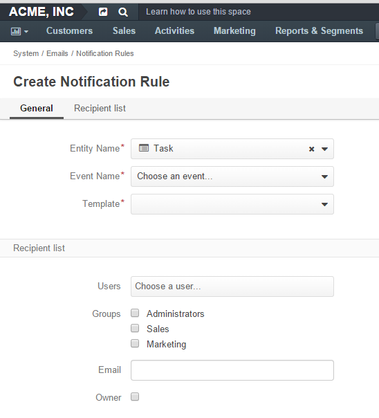

.. _system-notification-rules:

Notification Rules
==================

Create a Notification Rule
--------------------------

Notification rules define a situation to trig a mailing. 
A notification rule can only be created for a specific :ref:`email template <user-guide-email-template>` available in 
the system.

To create a notification rule:

- Go to the *System → Emails → Notification Rules* 
- Click the :guilabel:`Create Notification Rules` button
- Define the general mailing details and the list of recipients

General
^^^^^^^

The following details **must** be defined in the *"General"* section.

.. csv-table::
  :header: "**Name**","**Description**"
  :widths: 10, 30

  "**Entity Name**","Choose an entity, template for which will be used in the rule"
  "**Event Name**","Choose the event that will trig the mailing. (Entity create, Entity remove, Entity update)"
  "**Template**","Choose the template for which the rule will be created"
  
Recipient list
^^^^^^^^^^^^^^
In the *"Recipient list"*, choose to what users the email will be sent when the rule is trigged.
You can use one specific :term:`user` and/or :ref:`user groups <user-management-groups>` and/or a specific 
address, to which the email will be sent.  If the *Owner* box is checked, the email will be sent to the user who is 
assigned as the entity owner.

.. hint::

    The box is only available for the entities with 
    :ref:`ownership type <user-guide-user-management-permissions-ownership-type>` set to "User"

View and Manage Notification Rules
----------------------------------

All the notification rules available are displayed in the All Notification Rules
:ref:`grid <user-guide-ui-components-grid-action-icons>` (*System → Emails → Notification Rules*).

From the grid you can:

- Delete a notification rule from the system: |IcDelete|.

- Get to the :ref:`Edit form <user-guide-ui-components-create-pages>` of the notification rule: |IcEdit|.

.. |IcDelete| image:: ./img/buttons/IcDelete.png
   :align: middle

.. |IcEdit| image:: ./img/buttons/IcEdit.png
   :align: middle
