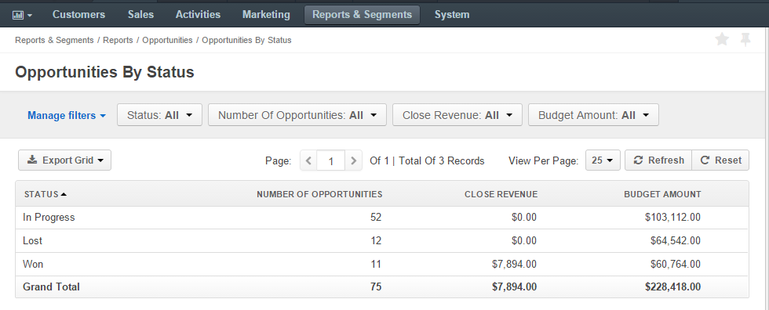
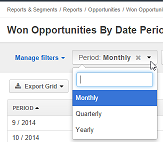

.. _user-guide-system-channel-entities-opportunities:

Opportunities
=============

In order to save and process the details of highly probable potential or actual sales to a new or established customer,
use *"Opportunity records"* ("opportunities"), Request for proposal, invitation for a bidding, 
agreement of intentions or order for a delivery can be saved as opportunities. 

In order to add and process details of opportunities in OroCRM, you need to have at least one 
:term:`Channel` to which the *"Opportunity"* entity :ref:`is assigned <user-guide-channel-guide-entities>`.

.. _user-guide-opportunities-create:

Create Opportunities
--------------------

- Go to the *Sales → Opportunities*

- Click :guilabel:`Create Opportunity` button

- The *Create Opportunity* :ref:`form <user-guide-ui-components-create-pages>` will appear:

  | 
  
.. image:: ./img/opportunities/opportunities_create.png

|

The following fields are mandatory and **must** be defined:

.. csv-table::
  :header: "Field", "Description"
  :widths: 10, 30

  "**Owner***","Limits the list of users that can manage the opportunity to users, whose 
  :ref:`roles <user-guide-user-management-permissions>` allow managing 
  opportunities assigned to the owner (e.g. the owner, members of the same business unit, system administrator, etc.).
  
  By default, the user creating the record is chosen."
  "**Opportunity Name***","The name used to refer to the opportunity in the system."
  "**Channel***","Choose one of active :term:`channels <Channel>`, from which OroCRM will get information on this 
  opportunity."
  "**B2B Customer***","A :term:`B2B customer <B2B Customer>` the opportunity is created for.
  
  Choose from the drop-down or list, or :ref:`create a new B2B customer 
  <user-guide-system-channel-entities-b2b-customer>`."

The rest of the fields are optional. They have been added to the system based on the general B2B practices and keep 
additional details of the opportunity (such as the its 
probability, customer need and proposed solution description, close reason and revenue). The optional fields may be left 
empty.

.. hint::

    If you need to record and process any other details of your opportunities, :ref:`custom fields can be created <user-guide-field-management-create>`. Custom fields are displayed in the *Additional* section.
  
Once all the necessary fields have been defined, click the button in the right top corner of the page to save the 
opportunity in the system.

.. _user-guide-opportunities-actions:

Manage Opportunities 
--------------------

The following actions can be performed for the opportunities:

From the :ref:`grid <user-guide-ui-components-grids>`:

      |

.. image:: ./img/opportunities/opportunities_grid.png

|

- Export and import opportunity record details with :guilabel:`Export` and :guilabel:`Import` buttons as described in 
  the :ref:`Export and Import Functionality <user-guide-import>` guide. 

- Delete an opportunity from the system : |IcDelete|
  
- Get to the :ref:`Edit form <user-guide-ui-components-create-pages>` of the opportunity : |IcEdit|
  
- Get to the :ref:`View page <user-guide-ui-components-view-pages>` of the opportunity : |IcView| 

      |
	  
From the View page you can:
  
- Get to the *"Edit"* form of the opportunity.

- The rest of the actions available depend on the system settings defined in the
  :ref:`Communication & Collaboration settings <user-guide-entity-management-create-commun-collab>` of the 
  Opportunity entity.

      
.. _user-guide-opportunities-reports:

Reports with Opportunities
--------------------------

OroCRM provides two out-of-the-box reports on opportunities:

- Opportunities by Status

- Won Opportunities by Period

 
Opportunities by Status
^^^^^^^^^^^^^^^^^^^^^^^^

This is a simple but useful report, with which you can see how many opportunities with a specific status are available 
in the system, what is their total close revenue and budget amount.

In order to see the report go to *Reports and Segments → Reports → Opportunities → Opportunities By Status*

It shows:

- status of the opportunities

- the number of the opportunities with this status 

- total close revenue of all the opportunities with the status

- total budget amount of all the opportunities with one the status

- total number of opportunities regardless of their status ("Grand Total"), their close revenue and budget amount.

Won Opportunities by Period
^^^^^^^^^^^^^^^^^^^^^^^^^^^

This report helps to analyze a process of opportunity closer per period. 

In order to see the report go to *Reports and Segments → Reports → Opportunities → Won Opportunities By Period*

It shows:

- the period, for which data is shown

- the number of the opportunities won within this period 

- total close revenue of all the opportunities won within the period

- total number of opportunities won, regardless of the period when they we won ("Grand Total") and their close revenue.

.. image:: ./img/opportunities/opportunities_report_by_period_month.png 

Use the *period* filter to choose the period length:

.. hint::

    New custom reports can be added. For more details on the ways to create and 
    customize the reports, see the :ref:`Reports guide <user-guide-reports>`.

.. _user-guide-opportunities-workflows:

Using Opportunities in the Workflows
------------------------------------

You can use OroCRM's :term:`workflows <Workflow>` to define rules and guidelines on possible actions/updates of 
Opportunities in the system. 

OroCRM comes with a pre-implemented B2B-oriented :ref:`Sales Processes Workflow <user-guide-sales-processes>`. 

New customer-specific workflows can also be created, as described in the 
:ref:`Workflows guide <user-guide-workflow-management-basics>`.

.. |BCrLOwnerClear| image:: ./img/buttons/BCrLOwnerClear.png
   :align: middle

.. |Bdropdown| image:: ./img/buttons/Bdropdown.png
   :align: middle

.. |BGotoPage| image:: ./img/buttons/BGotoPage.png
   :align: middle

.. |Bplus| image:: ./img/buttons/Bplus.png
   :align: middle

.. |IcDelete| image:: ./img/buttons/IcDelete.png
   :align: middle

.. |IcEdit| image:: ./img/buttons/IcEdit.png
   :align: middle

.. |IcView| image:: ./img/buttons/IcView.png
   :align: middle

