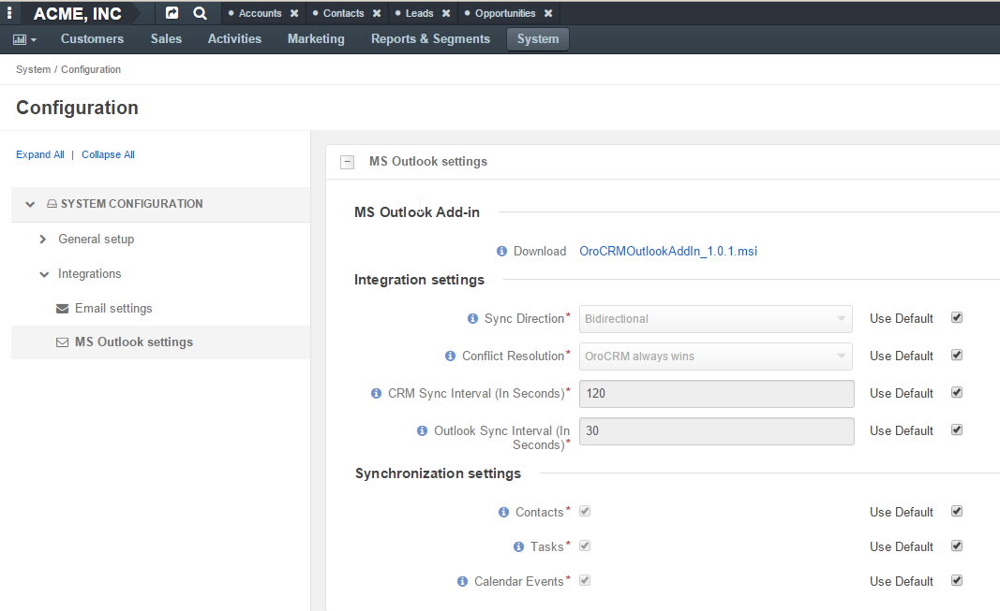
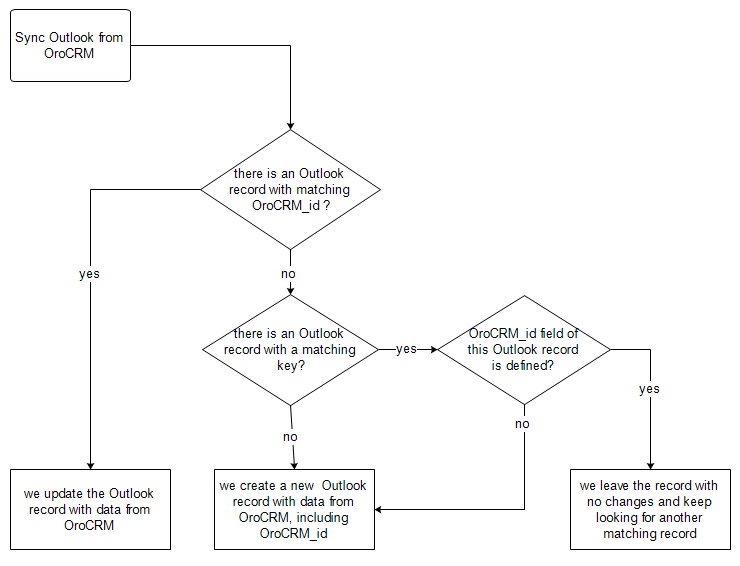
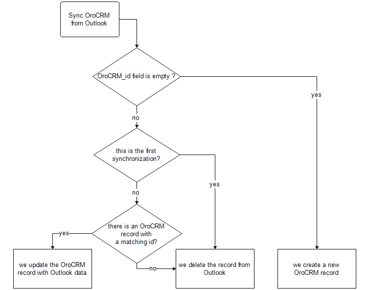

Synchronization with Outlook
============================

OroCRM enterprise version supports data synchronization in the OroCRM and Outlook.
Now, all the contacts, tasks and calendar events available for the user can be synchronized with the specified
Outlook account and backwards. 

From this article you will learn how to configure and run synchronization, and see the workflow used therefore.

Getting Started
---------------

Preconditions
^^^^^^^^^^^^^

- OroCRM enterprise version 1.6+
- Outlook 2010+

Plug-in Setup
^^^^^^^^^^^^^

In order to enable data synchronization from OroCRM go to *System  Configuration  --> SYSTEM CONFIGURATION --> MS 
Outlook settings* 

Click the file link in the "Download" field to download MS Outlook OroCRM Plugin to integrate with your Outlook client. 
Wait for download to finish and run the installation process.

Integration and Synchronization Settings on the OroCRM Side
^^^^^^^^^^^^^^^^^^^^^^^^^^^^^^^^^^^^^^^^^^^^^^^^^^^^^^^^^^^

You can choose sync direction and intervals, as well as priority of the conflict resolution and set of entities
synchronized.

Initially, default settings are applied. Uncheck "Use Default" box to change the settings. 

.. caution::

    If "Use Default" box has been checked, the default values will be applied regardless the values entered for the 
    field.

.. csv-table::
  :header: "**Setting**","**Description**","**Possible Values**","**Default Value**" 
  :widths: 20, 30, 20, 20

  "**Sync Direction**","The data synchronization direction","
  
  - OroCRM to Outlook
  - Outlook to OroCRM
  - Biderectional","Biderectional"
  "**Conflict Resolution**","Conflict resolution strategy to be used if the same data has been changed in the both 
  Outlook and CRM","
  
  - OroCRM always wins
  
  - Outlook always wins", "OroCRM always wins"
  "**CRM Sync Interval (In Seconds)**","How often changes on the CRM side will be checked","Any numeric value from 1 to 
  86399","120"
  "**Outlook Sync Interval (In Seconds)**","How often changes on Outlook side will be checked","Any numeric value from 1 
  to 86399","30" 
  "**Contacts, Tasks and Calendar Events**","Records of the entity are synchronized if the box is checked","Yes or No","
  Yes"
  

Settings on the Outlook Side
^^^^^^^^^^^^^^^^^^^^^^^^^^^^

Once you have installed the .msi file, *"OroCRM for Outlook*" menu will appear in your Oultlook menu bar. 

.. image:: ./img/outlook/outlook_menu_bar.png

Choose "Settings". *"OroCRM for Outlook Settings"* window will emerge.  The following fields are available

.. csv-table::
  :header: "**Name**","**Description**" 
  :widths: 10, 30

  "**OroCRM URL**","The Web address of your OroCRM instance. Mandatory field."
  "**Ignore self-signed certificate**","The box must be checked. Mandatory field."
  "**User**","Your Username as defined on *My user* page of the OroCRM. Mandatory field."
  "**Api Key**","API Key as generated on *My user* page of the OroCRM. Mandatory field."
  "**Enable Sync**","

  - If the box is checked, synchronization will be run automatically in the intervals defined in the 
    OroCRM.
  
  - If the box is not checked, synchronization will start only after the user has clicked :guilabel:`StartSyncNow` 
    button on the side panel
  
  "
  "**Show Alerts**","
	
  - If the box is checked, synchronization-related alerts (if any) will pop-up in the bottom panel. 
    For example, 
	
	|alert|

  - If the box is not checked, alert will not appear in the bottom panel."

  
Mapped Fields
-------------
Values of fields of an OroCRM and Outlook records are mapped, as described below:

Contact Mapping
^^^^^^^^^^^^^^^

The following fields of an OroCRM Contact record are mapped to the following fields of the Outlook Contact Record. 

.. csv-table::
  :header: "**OroCRM Field**","**Outlook Field**","Note"
  :widths: 20, 20, 20
  
  "First Name","First Name","If no *First Name* is defined in the Outlook record, the *Last Name* value will be used for 
  the both first name and last name in OroCRM."
  "Middle Name","Middle Name",""
  "Last Name","Last Name","If no *Last Name* is defined in the Outlook record, the *First Name* value will be used for 
  the both first name and last name in OroCRM."
  "Name Suffix","Name Suffix",""
  "Description","Notes",""
  "Email","Email","Any number of Emails may be mapped."
  "Phone","Primary Phone","Only the first OroCRM phone number is mapped."
  "Job Title","Job Title",""
  "Birthday","Birthday",""
  "Gender","Gender",""
  "Fax","Fax",""
  "Address of a *Billing* Type","Business Address",""
  "Address of a *Shipping* Type","Home Address",""
  "Address with no type defined","Other Address",""
  
Task Mapping  
^^^^^^^^^^^^

The following fields of an OroCRM Task record are mapped to the following fields of the Outlook Task Record. 

.. csv-table::
  :header: "**OroCRM Field**","**Outlook Field**"
  :widths: 20, 20
  
  "Subject","Subject"
  "Priority","Priority"
  "Due Date","Due Date"
  
OroCRM statuses are mapped to Outlook as is:
 
.. csv-table::
  :header: "**OroCRM Task Status**","**Outlook Task Status**"
  :widths: 20, 20
  
  "In progress","In progress"
  "Closed","Closed"
  "Open","Open"

Outlook status not available in OroCRM are mapped as follows:
  
.. csv-table::
  :header: "**Outlook Task Status**","**OroCRM Task Status**"
  :widths: 20, 20
  
  "Not Started","Open"
  "Completed","Closed"
  "Waiting on someone else","In progress"
  "Deferred","In Progress"

Calendar Mapping  
^^^^^^^^^^^^^^^^

The following fields of an OroCRM Calendar Event record are mapped to the following fields of the Outlook Appointment. 

.. csv-table::
  :header: "**OroCRM Field**","**Outlook Field**"
  :widths: 20, 20
  
  "Title","Subject"
  "Start","Start time"
  "End","End time"
  "All-Day Event ","All day event"
  
 ..note ::
 
      Only calendar assigned to the specified user is mapped, regadless of access settings. 
      
      Invitations, recieved by the user are sent to Outlook as regular calendar event.  
  
Synchronization Workflow
------------------------

Synchronization Start
^^^^^^^^^^^^^^^^^^^^^
Synchronization will start automatically, or as soon as the user has clicked :guilabel:`StartSyncNow` 
button on the side panel, subject to the settings defined.

Identifying a Record
^^^^^^^^^^^^^^^^^^^^
For every entity synchronized, there is also a key defined. The key is a set of field values used to identify an entity
record. Fields of a key can be chosen subject to the specific company needs and defined at the back-end.
The following keys are used by default: 

.. csv-table::
  :header: "**Entity**","**Key Fields**" 
  :widths: 10, 30
  
  "Contact","First Name, Last Name, Gender and Birthday"
  "Calendar Event","Title(Subject), Start Time, End Time and whether it is an All-day event"
  "Task","Subject and Task Priority"
  

Every contact, task and calendar event present in OroCRM has a unique id. When the record is saved in the Outlook, the
id value is saved from OroCRM in the OroCRM_id field.

 
Synchronization from OroCRM to Outlook
^^^^^^^^^^^^^^^^^^^^^^^^^^^^^^^^^^^^^^

Synchronization is run in the same way for records of activities, tasks and calendar events: 

All the records processed in the OroCRM since the latest synchronization date and available to the user are 
checked:

- If id of an OroCRM record matches an OroCRM_id value of an Outlook record, the Outlook record is updated. 
  (Values of all the mapped fields in Outlook are overwritten with corresponding values from OroCRM).
 
- If id of an OroCRM record does not match OroCRM_id of any Outlook records, their keys are checked against fields of 
  Outlook records with empty OroCRM_id field.
  
  -  As soon as an Outlook record with empty OroCRM_id and matching key is found, it is updated from OroCRM and 
     the id value is saved from OroCRM into the OroCRM_id field of the Outlook record. 

  - If no Outlook record with empty OroCRM_id and matching key is found, a new record is created in Outlook.

.. note:: 
    
    During the first synchronization or resynchronization, all the Outlook records with non-empty OroCRM_id field are
    deleted first, and then OroCRM record keys are checked for all of them.

.. csv-table::
  :header: "**If**","**Then**" 
  :widths: 20, 30
	
  "Such record already exists in Outlook.","Values of the mapped fields of the OroCRM record replace corresponding values 
  for the Outlook record."
  "A record doesn’t yet exist in Outlook.","OroCRM creates the record in Outlook."
  "Multiple matching records exist in Outlook.","OroCRM will update one of them"
  "You've updated a record in OroCRM.","Values of the mapped fields of the OroCRM record replace corresponding values 
  for the Outlook record."
  "You've updated a record in Outlook.","The updates remain in the Outlook record, but won’t sync to the OroCRM."
  "You've deleted a record in Outlook.","OroCRM will create the record again."
  "You've deleted a record in OroCRM.","The recodr will stay in the Outlook with no changes."
  

Synchronization from Outlook to OroCRM
^^^^^^^^^^^^^^^^^^^^^^^^^^^^^^^^^^^^^^

All the records processed in the Outlook since the latest synchronization date and available to the user are 
loaded:

- If OroCRM_id field of a record is empty, a new record is created in OroCRM

- If OroCRM_id field is defined and 

  - if this is the first synchronization or resynchronization, the record is deleted
  
  - otherwise, the OroCRM_id is checked against id values of the records in OroCRM:

    - if a record with the matching id is found in OroCRM, it is updated with data from Outlook
	
	- if a record with a matching if is absent in OroCRM, it is deleted from the Outlook

.. csv-table::
  :header: "**If**","**Then**" 
  :widths: 20, 30
	
  "Such record (record with such id) already exists in OroCRM.","Values of the mapped fields of the Outlook record 
  replace corresponding values for the OroCRM record."
  "A record doesn’t yet exist in OroCRM.","A new record is created in OroCRM."
  "You've updated a record in OroCRM.","Values of the mapped fields of the Outlook record replace corresponding values 
  of the OroCRM record."
  "You've updated a record in Outlook.","Values of the mapped fields of the Outlook record replace corresponding values 
  of the OroCRM record."
  "You've deleted a record in Outlook.","The record will stay in OroCRM."
  "You've deleted a record in OroCRM.","The record will be deleted from Outlook."
  
 
Bidirectional Synchronization
^^^^^^^^^^^^^^^^^^^^^^^^^^^^^

For Bidirectional synchronization, synchronization from OroCRM to Outlook is performed first and followed by 
synchronization from Oultlook to OroCRM.

.. csv-table::
  :header: "**If**","**Then**" 
  :widths: 20, 30
	
  "A record exists in both OroCRM and Outlook.","Values of the mapped fields of the OroCRM record 
  replace corresponding values for the Outlook record."
  "A record doesn’t yet exist in OroCRM.","A new record is created in OroCRM."
  "A record doesn’t yet exist in Outlook.","A new record is created in Outlook."
  "You've updated a record in OroCRM.","Values of the mapped fields of the OroCRM record replace corresponding values 
  of the Outlook record."
  "You've updated a record in Outlook.","Values of the mapped fields of the Outlook record replace corresponding values 
  of the OroCRM record."
  "You've updated a record in the both OroCRM and Outlook.","Subject to your conflict resolution settings."
  "You've deleted a record in Outlook.","The record will stay in OroCRM and will be added to Outlook."
  "You've deleted a record in OroCRM.","The record will be deleted from Outlook as well."

  

  
  
.. |alert| image:: ./img/outlook/alert.png
