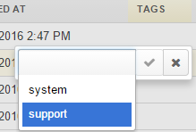
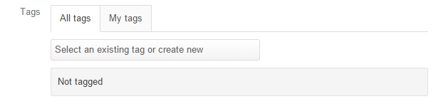
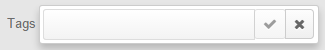

.. _user-guide-tags:

Tags
====

Tags are non-hierarchical keywords or phrases that are assigned to records. They provide additional information about 
records and are visible to all the system users. Tags can be assigned to any records of any entity and used for 
:ref:`filtering <user-guide-filters-management>`. They can also be used to create a report for only the records that 
have/don't have a specific tag, and even generate targeted segments for mailings and marketing campaigns. Moreover, you 
can easily find all records that have a specific tag from anywhere in the system, even if you don't know their other 
details, as described below. 

Add a Tag to a Record
---------------------

You can add a tag from the grid or from a View page of a specific record.

Add a Tag from the Grid
^^^^^^^^^^^^^^^^^^^^^^^

The tag column is available by default on the :ref:`grids <user-guide-ui-components-grids>`. If they are not, you can 
:ref:`adjust the table settings <user-guide-ui-components-grids-change-table>` and add the column. Adding a tag is no 
different from :ref:`editing other properties <user-guide-ui-components-grid-edit>` from a grid:

- Double-click the tag cell of the record. 

- Select one or several of the existing tags from the list, and/or enter a new tag in the field.

  |TagsfGrid|
  
- Start entering the tag, and only matching tags will be left in the selector.  
  
- If you have entered a new tag, it will also appear in the selector. Select it to add. This way you can add one or 
  several tags that contain one or several words.
  
    |TagsfGrid1|
  
- Click the check to confirm the action.

.. _user-guide-tags-add:

Add a Tag from the View page
^^^^^^^^^^^^^^^^^^^^^^^^^^^^

In order to add a tag to a record from its :ref:`View page <user-guide-ui-components-view-pages>` of a record:

- Go to the *"Tags"* field.

  |TagsfView|

- Click the |IcEdit| icon, and the tag field will appear.

  |TagsfView1|
  
- Start entering the tag, and only matching tags will be left in the selector.  
  
- If you have entered a new tag, it will also appear in the selector. Select it to add. This way you can add one or 
  several tags that contain one or several words.
  
  |TagsfView2|
  
- Click the check to confirm the action.

Manage Tags
-----------

You can see all the tags available in the system, as well as the amount of times they were assigned to a record, in the 
Tags :ref:`grid <user-guide-ui-components-grids>`.

|

From the grid, you can:

- Get to the :ref:`Create form <user-guide-ui-components-create-pages>` of the tag:
  
  - Click the :guilabel:`Create Tag` button.
  
  - Define the tag :term:`owner <Owner>` and the tag itself.
  
- Get to the :ref:`Edit form <user-guide-ui-components-create-pages>` of the tag: |IcEdit|

- Delete the tag: |IcDelete|

- View all the records that were marked with this tag: |IcSearch|

Search by Tag
-------------

In order to see all the records with a specific tag anywhere in the system.

|

.. image:: ../img/navigation/panel/search_vip.png

|

.. image:: ../img/navigation/panel/search_vip_1.png

|

You will see the page similar to the search results. It will contain all the records with this tag.

|

.. image:: ../img/navigation/panel/search_vip_2.png

|

Conclusion
----------

Tags are easy to add and can help manage the content of any record. They can be used to find records from anywhere 
within the system and can filter records for reports and segments.

.. |IcDelete| image:: /img/buttons/IcDelete.png
   :align: middle

.. |IcEdit| image:: /img/buttons/IcEdit.png
   :align: middle

.. |IcView| image:: /img/buttons/IcView.png
   :align: middle
   
.. |IcSearch| image:: /img/buttons/IcSearch.png
   :align: middle  
   

   
.. |Tags02| image:: ../img/data_management/tags/tags_02.png
   :align: middle

.. |TagsfGrid1| image:: ../img/data_management/tags/tags_from_grid_1.png
   :align: middle   
   
.. |TagsfView| image:: ../img/data_management/tags/tags_from_view.png
   :align: middle   
   

   
.. |TagsfView2| image:: ../img/data_management/tags/tags_from_view_2.png
   :align: middle 