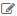

.. _user-guide-reports:

Reports
=======

The Oro Platform gives you the opportunity to create customized reports about
the entities in your application.

To manage your custom reports, go to *Reports & Segments* → *Manage Custom Reports*.
You'll see a list of all created reports:

.. image:: /user_guide/img/reports/reports.png

.. _book-reports-create-report:

Creating Reports
----------------

Go to *Reports and Segments → Manage Custom Reports* and click :guilabel:`Create Report` button.

*Create Report* page will appear.

1. Define :ref:`general setting <user-guide-reports-general-settings>` of the report
2. Specify the data to be processed, the way of analysis and filters in the :ref:`Designer 
   <user-guide-reports-designer>` section.
3. Define the report chart settings in the :ref:`Chart Designer <user-guide-reports-chart>` section. 

.. _user-guide-reports-general-settings:

General Setting
^^^^^^^^^^^^^^^

.. image:: ./img/reports/general.png

The following fields are mandatory and **must** be defined for a report:

.. csv-table::
  :header: "Field","Description"
  :widths: 10, 30

  "**Name***","The name is used to refer to the report in the future.
  
  It is recommended to keep the name meaningful for you."
  "**Entity***","The Entity, details of which are processed by the report. This can be any system or custom entity.

  Click |Bdropdown| button to choose one of available Entities. 
  (Both system and custom entities will be displayed in the alphabetic order). 
  You can also start typing the entity name in the text field to find it faster."
  "**Report Type***","Only table reports are available."
  "**Owner***","Limits the list of users that can manage the report to its owner and users, whose roles allow managing 
  reports assigned to the owner (e.g. members of the same business unit, system administrator, etc.)."

The only optional system field, **Description**, can be used to save additional information about the report. 

.. _user-guide-reports-designer:

Designer
^^^^^^^^

In the section you can define the structure of your report.

.. image:: ./img/reports/designer.png

There are three main parts:

- **Columns**: defines the columns of your report and information displayed therein and

- **Grouping**: defines how details of the report will be grouped in the rows

- **Filters**: filter the records to be processed by the report

*Columns*
^^^^^^^^^

The following settings shall be defined for each column of the report:

.. csv-table:: 
  :header: "Field","   Description"
  :widths: 10, 30

  "**Choose a field***","Choose a field from which raw data will be taken. This can be a field of the entity
  specified in the general settings of the report or of a related entity. All the fields available will appear in the 
  drop-drop-down list under their entity."
  "**Label***","A free text field that defines how the field chosen at the previous step will be referred to in the 
  report.  
  
  The field is automatically field by the label chosen for the field in the system settings, but may be edited subject 
  to the specific report needs."                 
  "**Function***","A function to perform with the field values. You will only see the functions available for the field
  chosen.
  
  There are some filed-specific functions (e.g. *Won Count* that shows the number of *Won* Opportunities for the 
  *Opportunities → Status* field. Description of some of the most common function and relevant examples is
  provided below:

  - *None*: no function applied. The data will be displayed for all the available entity records
   
  - *Count*: you will see the number of possible values of the field for all the entity records
   
  - *Sum*: the field values for all the entity records will be summed up
    
  - *Average*: the arithmetical mean of the field values for all the records against the amount of records will be 
    displayed.
    
  - *Min*: only the smallest of all the field values for all the records will be displayed.
   
  - *Max*: only the largest of all the field values for all the records will be displayed.
  
  "
  "**Sorting***","Defines the way values of the field or their functions to be displayed in the report.
   
  - *None*: no sorting applied 
  - *Asc*: ascending
  - *Desc*: descending
  
  "

  
Actions for Columns
"""""""""""""""""""
    
Once you have specified the settings for a column element click :guilabel:`Add` button, and the field you have defined 
will appear in the "COLUMN" grid.

Now you can edit (|IcEdit|), delete (|IcDelete|) or move (|IcMove|) the column. 

Examples of Columns and Actions 
"""""""""""""""""""""""""""""""

For the sake of example, we have created a very simple report of one field. It contains only budget amount details. 

.. image:: ./img/reports/RepEx1.png

 
Click :guilabel:`Add` button to add the settings into the *Columns* grid. Save the report with a button in the top right
corner of the page and view it.

You would see something of the kind:

.. image:: ./img/reports/RepEx1a.png

There are 75 opportunities, an the values defined in the *Budget Amount* field of each and every of them will be
displayed in the report.

Click :guilabel:`Edit` to return to the report settings. Let's see, how the report changes, if we apply different 
functions to the *Opportunity Budget* field. 

Click |IcEdit| icon and change the column settings. 

**Function = Count**

.. image:: ./img/reports/RepEx1b.png

There are 43 different values of the *Budget Amount* field for all the Entity instances in the System.

**Function = Sum**

.. image:: ./img/reports/RepEx1c.png

   
The sum of all the values of the *Budget Amount* fields for all the Entity instances in the System makes 
$202.565.00.

**Function = Max**

.. image:: ./img/reports/RepEx1e.png

The biggest Budget amount value available in the system is 9.902.00 USD
 
 
Grouping
^^^^^^^^
 
The *Grouping* section provides for more complex and informative reports. Once you have added a field in the *Grouping* 
section you will see all the columns values or their functions for a set of all the entity instances with the same 
*Grouping* field value.

For example, you can see a total, average maximum and minimum budget amount for all the opportunities with the same 
status.

.. caution:: 

    You have to add the field(s) grouping is made by to the *COLUMN* section.

Grouping Example 
""""""""""""""""

.. image:: ./img/reports/RepEx2.png

Here is what we have got:

.. image:: ./img/reports/RepEx2a.png

Several Level Grouping Example
""""""""""""""""""""""""""""""

You can also group records inside a group. For example, we can add one more grouping field (e.g. Customer name) to our 
report.

.. image:: ./img/reports/RepEx3.png

Now you can see the budget function values for all the opportunities with the same status the belong to specific 
customer. Data for all the "In Progress" opportunities of one customer, then of another customer, etc. Only 
then you will see data for all the "Won" opportunities of each customer, etc.

.. image:: ./img/reports/RepEx3a.png

.. hint::

    Once a report has been generated, you can click on the name of a column, to sort all the data in the report by the
    specified fields' value (ascending or descending). You can see the report ordered by the "Name" value below.

.. image:: ./img/reports/RepEx3b.png

As you can see in the circled area, for Albers Super Markets there are opportunities that are in progress and 
that were lost. You can view the budget details for the both groups.

.. note::
    
    If the customer's name is the most important part of the grouping, it might be reasonable to edit the report and 
    move the column to make it first.

Filters
^^^^^^^

You can define conditions used to select the entity records for the report, using the following tools: 

- **Field Condition**: only records that meet the condition are added to the list

- **Conditions Group**: a set of field conditions

- **Apply Segment**: only records that meet a specific set of predefined conditions (belong to a segment) are added to 
  the list. (Segments are subject to a separate document)

Field conditions, condition groups and segment settings can be combined or ORed to define the final set of conditions. 

Field Condition
"""""""""""""""

To define a field condition (for example, that all the Leads details whereof shall be used in the report have been 
created within the last month):

- Drag *"Field condition"* to the box on the right

.. image:: ./img/reports/filters_field_condition.png

- Click *Choose a field* link and select the necessary field (e.g *"Created at"*) 

-  Click links and choose a drop-down value. (e.g. "day" "more than" Oct 1, 2014, 12:00 AM)

.. image:: ./img/reports/filters_field_condition_value.png

Condition Group
"""""""""""""""

To add a condition group (e.g. state in the address of the lead or of the lead's B2B customer's contact shall be 
"California" or "CA"):

- Drag *"Conditions Group"* to the box on the right

.. image:: ./img/reports/filters_condition_group_01.png

- Add several field conditions to the group

.. image:: ./img/reports/filters_condition_group_02.png

- Define the field conditions and choose AND or OR conjunction for the conditions

.. image:: ./img/reports/filters_condition_group_03.png

.. _user-guide-reports-chart:

Chart
^^^^^

OroCRM supports line charts. To create a line chart for the report, go to the **Chart** and define the following 
fields (all the fields are mandatory and **must** be defined)

.. csv-table:: **ChartSettings**
  :header: "Field","Description"
  :widths: 10, 30

  "**Chart Type***:","Currently only *Line Chart* option is available"
  "**Category (X Axis)***","Choose the fields, values whereof will form the X Axis of the report chart"
  "**Value (Y Axis)***","Choose the fields, values whereof will form the Y Axis of the report chart"

Chart Example
"""""""""""""

Let's make a chart for the Budget per opportunity status report (not grouped by customers). 

.. image:: ./img/reports/RepExChart1.png

That's what we have got:

.. image:: ./img/reports/RepExChart2.png

.. _book-reports-view-report:

Viewing a Report
----------------

You can access a report in two ways:

#. From any place in the web UI, you can enter a certain by choosing it from
   the quick menu:

   .. image:: /user_guide/img/reports/quick-menu.png

#. When you're viewing the list of all available reports, you can simply click
   on its row.

When you have selected the report to view, you'll see the data you selected
when creating it presented as a nice table:

.. image:: /user_guide/img/reports/report-details.png

You can export the presented data in CSV format clicking on the *Export Grid*
button. The data shown above will then look like this:

.. code-block:: text

    Name,"Parent BU","# Users"
    Main,,1
    Sales,"Sales Asia",0
    Sales,"Sales Europe",0
    Sales,"Sales North America",0
    "Sales Asia",,0
    "Sales Europe",,0
    "Sales North America",,0

Modifying and Deleting Records
------------------------------

When you :ref:`view <book-reports-view-report>`, you can modify or delete
a report clicking on the appropriate button in the upper right corner. To
avoid accidentally losing reports, you will have to confirm the removal of
a report when you click the *Delete* button:

.. image:: /user_guide/img/reports/delete-confirm.png

When you click on the *Edit* button, you'll see the form that you already
saw when :ref:`creating <book-reports-create-report>` the report.

.. |Bdropdown| image:: ./img/buttons/Bdropdown.png
   :align: middle

   
.. |IcDelete| image:: ./img/buttons/IcDelete.png
   :align: middle
   
.. |IcMove| image:: ./img/buttons/IcMove.png
   :align: middle
