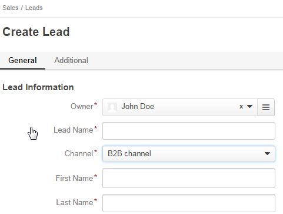

===============
Sales Processes
===============

.. |B01| image:: ./img/channel_guide/Buttons/B01.png
   :align: middle

   align: middle

   align: middle

.. |Bdropdown| image:: ./img/sales_processes/Buttons/Bdropdown.png
   align: middle

.. |BGotoPage| image:: ./img/sales_processes/Buttons/BGotoPage.png
   align: middle

.. |LS| image:: ./img/sales_processes/Screenshots/LS.png
   :width: 75 %

   

What Sales Processes are About
==============================
Sales Processes is a part of OroCRM responsible for automation of Business to Business workflow handling. 
This functionality provides for consistence and continuous monitoring of the sales process from initial arrangements all the way over negotiations and proposals to successfully realized opportunities. With the functionality and customizable embedded report sales managers can gain clear understanding of the specific workflows and implement more customer-oriented sales approach.

As any part of OroCRM, Sales Processes functionality is very flexible and can be tuned to correspond your specific business need. 
In fact, OroCRM may be filled with any business specific Entities and their details and Oro Platform can be used to set up a Workflow using this Entities. We have implemented such a workflow that fits general needs of B2B Sales Process management and may be used without additional tuning, without prejudice to its flexibility and scalability. 

  :Hint: OroCRM may be filled with any business specific Entities and their details and Oro Platform can be used to set up a Workflow using this Entities.  

Steps to Perform
================

As it was said above, the Sales Processes functionality is about Business to Business workflow. What do we need to create a meaningful workflow?

- Information about Channels of B2B Sales (shops, stores, retail outlets, etc.)

- Information about Leads that appear for these Channels (people/organizations that fit the Channels target-group and may make a good Opportunity)

- Information about Opportunities for these Channels (Leads for which there is a high probability of successful sales initiation)

Once these three are in the system, OroCRM provides for clear and convenient ways to input and process this information, as well as tools for its monitoring and analysis. In the following sections we shall consider, how to:

1. Populate the System with B2B Channels

2. Populate the System with Leads

3. Populate the System with Opportunities and/or Process Leads into Opportunities

4. Develop Sales Processes

5. View Sales Process details on the Dashboard.

Fill the System with B2B Channels
^^^^^^^^^^^^^^^^^^^^^^^^^^^^^^^^^

Channel in OroCRM represents a specific retail outlet. For each Channel there is a predefined set of entities (forms, flags, text-fields) used to collect outlet-specific data. A special type of Channels is devoted for B2B sales processing. 
To create a B2B channel go to *System --> Channels*, click |B01| button in the top right corner, and create a B2B type channel in the emerged page.
For more details on Channel creation please address our `Channels Guide </user_guide/channel_guide.rst#channel-guide>`_.

  :Note: When creating a B2B Channel Users with appropriate right can use default settings or modify B2B Customer, Lead and Opportunity forms, as well as enable/disable attachment storage within Sales Process details. This settings will then be applied for this Channel everywhere in OroCRM.

Populate the System with Leads
^^^^^^^^^^^^^^^^^^^^^^^^^^^^^^
There are two ways to populate the system with Leads:

I. **Populating the System with Leads from the Leads section**
""""""""""""""""""""""""""""""""""""""""""""""""""""""""""""""

1. Go to the dedicated *Sales --> Leads* section.

2. Create or Import Leads

3. Edit created leads, if necessary.

1. Go to the dedicated *Sales --> Leads* section.
*************************************************

|LS| 
  
:Note: If you cannot see the section, there may be still no B2B Channels with Leads Entity assigned to them in the System. `View the Channels list </user_guide/channel_guide.rst#further-actions>`_ to check if this is so need and, if yes, `fill the System with B2B Channels </user_guide/sales_process.rst#fill-the-system-with-b2b-channels>`_. 
  
  If the problem persists, you may not have User-rights to View/Edit the functionality. Please address you system administrator.

*Sales/Leads* page will appear. From here you can Create of Import Leads.

2a. Create Leads
*************************

Click |BCrL| button to manually input the Lead's details. 
The form specified for the Channel's Leads will appear. The form contains mandatory system fields, optional system fields.

Mandatory fields
****************
Regardless the Lead entity settings, the following fields are mandatory and **must** be defined.

|LeadCrMF|

Detailed description of each field is provided below:

.. list-table:: **Mandatory Lead Fields**
   :widths: 5 30
   :header-rows: 2

   * - 
     - 

   * - Field
     - Descripion

   * - 
     - 

   * - **Owner***
     - This field limits the list of Users authorized to manage the Lead created. Once a User is chosen only this User and Users whose predefined Role provides for management of Leads that belong to this User (e.g. a head of the User's Business Units, System administrator) can do so. Please see Roles Admin Guide for more details if required. 

       By default, the User creating the Lead is chosen. 

            To clear the field click |BCrLOwnerClear| button.

            Click |Bdropdown| button to choose one of available Users from the list.

            Click |BGotoPage| button to choose from the *Select Owner* page.

   * - 
     - 
    
   * - **Lead Name***
     - This is the name that will be used to save and display the Lead in the System. 

       It is recommended to define a meaningful name and to avoid the use of special symbols.

   * - 
     - 
          
   * - **Channel***
     - Any of the Channels in the System that is assigned *Lead* Entity. 

            Click |Bdropdown| button to choose one of available Channels from the list.

   * - 
     - 

   * - **First Name***
     - Name of the potential customer or contact person.

       It is recommended to define a meaningful name and to avoid the use of special symbols.

   * - 
     - 

   * - **Last Name***
     - Last nameof the potential customer or contact person.

       It is recommended to define a meaningful name and to avoid the use of special symbols.
