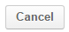
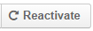
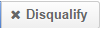

Sales Processes Workflow
========================

Sales Processes and Other Workflows
-----------------------------------

In general, a workflow is a set of ordered actions that can be performed with a specific entity.
Workflows allow to manage :term:`entities <Entity>`, update existing ones and create new ones and OroCRM may be filled 
with any business-specific Entities and their details and Oro Platform can be used to set up a 
`Workflow </user_guide/workflow_management.rst#workflow-management>`_ using these Entities. 
From the user's POV workflow appears as a set of buttons which may open forms that allow to manipulate entity data.

However, using our experience in sales and retail, we have implemented such a workflow that fits general needs of B2B 
Sales Process management and may be used without additional tuning, without prejudice to its flexibility and 
scalability. 

Sales Processes is a part of :term:`OroCRM` functionality for automation of Business to Business sales management.
This functionality provides for consistence and continuous monitoring of the sales process from initial arrangements
all the way over negotiations and proposals to successfully realized opportunities. With the functionality and
customizable embedded report sales managers can gain clear understanding of the specific workflows and implement
more customer-oriented sales approach.

Preliminary Conditions
-----------------------
As it was said above, the Sales Processes functionality is about Business to Business workflow. What do we need to
create a meaningful workflow?

- Information about `Channels </user_guide/channel_guide.rst#channel-guide>`_ of :term:`B2B Type <B2B Channel>`
  (shops, stores, retail outlets, etc.)

- Information about the Channel's :term:`Leads <Lead>`, people and/or organizations that fit the Channels target-group 
  and may make a good Opportunity, described in more details in the `"System Channel Entities. 
  Leads" </user_guide/system_entities_leads.rst#system-channel-entities-leads>`_ article

- Information about the Channels :term:`Opportunities <Opportunity>`, people and/or organizations that fit the Channels 
  target-group and are likely to enter run the sales, described in more details in the relevant 
  `"System Channel Entities. 
  Opportunities" </user_guide/system_entities_opportunities.rst#system-channel-entities-opportunities>`_ article

Once these three are in the system, OroCRM gives clear and convenient ways to input and process this information, as
well as tools for its monitoring and analysis. 

.. hint:: 
     
      For the Sales Processed Workflow you can use the Lead and Opportunity instances previously populated into 
      the system or create them at a Workflow step, as described below.
          
      Channels that support Lead and Opportunity entities *must* already by in the System.

Sales Processes Workflow Diagram
^^^^^^^^^^^^^^^^^^^^^^^^^^^^^^^^
The workflow entities are :term:`Leads <Lead>` and :term:`Opportunities <Opportunity>`. It is rather a see-through 
workflow that provides for consistent and structured pre-sales and sales process.

|WorkFlow|

1. You can **Start** a workflow **From Lead** (new Lead instance will be created)

2. If you **Disqualify** a Lead, it is turned into a disqualified Lead

   You can **Reopen** any disqualified Lead instance to turn it into a new one

3. Make a new Opportunity

   - If you **Qualify** a Lead instance it is turned into an new Opportunity instance(new Opportunity instance is 
     created that automatically inherits the details of the initial Lead).
      
   - You can also **Start** a workflow directly **from Opportunity** (new Opportunity instance is created).

4. You can **Develop** an Opportunity. A developed Opportunity instance means that there is active negotiation going on.

5. Each new or developed Opportunity can be **Closed as Won** or **Closed as Lost**.

   You can **Reopen** any closed Opportunity, and it will turn into a new Opportunity.

1. Start from a New Lead
""""""""""""""""""""""""
If you feel that there is a potential opportunity, a person or business that migh become interested in making a deal
with you, you can add a new Lead instance and start the Sales Process.

**In order to start a Sales Process From a Lead instance**:

- Go to the *Sales --> Sales Processes* page

- Click |BStartfL| button

- Fill in the General information. 
  The following four fields are mandatory and **must** be defined:

.. list-table:: **Mandatory Opportunity Fields**
   :widths: 5 30
   :header-rows: 1

   * - Field
     - Description

   * - **Owner***
     - This field limits the list of Users authorized to manage the Sales Process created. Once a User is chosen only
       this User and Users whose predefined Role provides for management of Leads that belong to this User (e.g. a head
       of the User's Business Units, System administrator) can do so. 

       By default, the User creating the Lead is chosen.

       To clear the field click |BCrLOwnerClear| button.

       Click |Bdropdown| button to choose one of available Users from the list.

       Click |BGotoPage| button to choose from the Select Owner page.

   * - **Start Date**
     - This is the date when the Lead was created and the Sales Process was started. Choose the date from the calendar.

   * - **Channel**
     - Any of the Channels in the System that is assigned a Lead entity.

       Click |Bdropdown| button to choose one of available Channels from the list.

   * - **Lead**
     - One of Lead instances in the System or a new Lead instance.

       Click |Bdropdown| button to choose one of available Leads from the list.

       Click |BGotoPage| button to choose from the Select Lead page.

       Click |Bplus| button to add a new Lead to the System.
       Follow the process described to `create a Lead </user_guide/system_entities_leads.rst#create-leads>`

Click |BSubmit| button to save the started workflow in the System.

Click |BCan| to cancel the flow start. No changes will be saved in the System.
 
 
*For Example 1*
***************

*You are a toy factory owner. Yesterday you came back from a big fair, where you had your sales stand with
commercial materials. At the fair you ran a lottery, and to take part in the lottery people filled in a form with their
personal details. They also got a small toy of your brand and a set of commercials.
In order to keep track of the campaign success, you have created a Fair Channel of B2B type and had your secretary to
fill it with information of the fair lottery participants.*

2. Disqualified Leads
""""""""""""""""""""""

If a specific Lead instance has appeared meaningless for your future business activity management, you can 
**Disqualify** it. A disqualified Lead instance will not be taken into account when preparing reports and running the 
further workflow.

**In order to disqualify a Lead instance:**

- Go to the *Sales --> Sales Processes* page

- Find the process started with the Lead in the grid and click in the corresponding row

- You will get to the page of the Lead instance. Click |BDqualify| button in the top right corner

.. hint:: 

      You can use Filters functionality to simplify the search for the necessary Lead. The Filters are rather
      see-through and easy to use, but if you feel a lack of assistance, please refer to the Filters Guide (TBD).

If there is a need to define reasons for the decision, click |BFollowUp| button and write a free text message. The
message will be added to the Lead's additional information section.

While Disqualified Leads are kind of benched, their information is kept in the system and you can **Reactivate** them.

**In order to reactivate a disqualified Lead instance:**

- Go to the *Sales --> Sales Processes* page

- Find the process with the Lead in the grid and click  in the corresponding row

- You will get to the page of the Lead instance. Click |BReAct| button in the top right corner

The Lead instance created will be treated as a new one, however, all the information you have input for it (including 
the Follow-up) will be saved.

*For Example 2*
***************
*Eventually, you have figured out that some form at the fair were filled by children. You Disqualify them and make
an Follow-up like: "Child".*
*At some point, you understand that "Jane 12" is not a 12-year old girl but the name of a Toy Shop, so you Reactivate
the Lead.*

3a. New Opportunities from Leads
""""""""""""""""""""""""""""""""
You can **Qualify** a Lead instance, in case if it is rather likely to turn into a real Opportunity (the chances of 
getting into sales are high).

**In order to qualify a Lead instance:**

- Go to the *Sales --> Sales Processes* page

- Find the process with the Lead in the grid and click in the corresponding row

- You will get to the page of the Lead instance

- Click |BQualify| button in the top right corner

- Qualify tab will appear

|QualifyTab|

The only mandatory field, *Opportunity name*, is by default filled with the name of a Lead instance qualified.

System optional field *B2B Customer* enables binding the Opportunity to a specific Customer instance in the System. 
This may be a representative of the company associated with an Opportunity or the company itself. 
If you bind a Customer and an Opportunity, it will be considered when making reports of this Customer and creating the 
Customer's profile (a unique functionality that provides for generalized view of the Customer's activity over different 
Channels).
If a new Customer instance is created for an Opportunity, keep in mind that it can be assigned a Contact instance and 
must be assigned an Account instance.

You can also define the *Company name* (this is particularly convenient if the Company name is different from the
Opportunity name).

.. hint:: 
     
      If your Sales Process requires any additional information to be added, the Qualify form can be customized
      respectively.

*For Example 3a (1)*
********************
*The Head of Jane 12 company from the previous example has called you and asked about prices and discounts for a
relatively big amount of toys for his shop. Later, during the day he sent you and E-mail with a set of conditions for
the purchase. The man seems very determined to buy the toys from you.*
*The same day you have Qualified Jane 12 Lead into an Opportunity. You also created a New Customer. You created a
Jane 12 Account and made a new Contact, that contain the directors contact details. In the additional comment you wrote
"Toy Shop in Cisco. Lead from the fair lottery. And added some details of the potential order".*

*For Example 3a(2)*
*******************
*You got a call from one your Leads, who asked you to provide more information on possible discounts and terms of work.
When you started asking for more details, the man said that "so far he was collecting pricing information, that he
really liked your conditions and toy quality but still needs to check on some more potential contractors".
You turned this Lead into an Opportunity but decided not to create a Customer for it yet.*

3b. Start a Sales Process from an Opportunity
"""""""""""""""""""""""""""""""""""""""""""""
Sometimes, high probability of future sales is obvious from the very beginning. In this case, you may skip the Lead step
and **Start** you Sales Processes workflow **from Opportunity**.

**In order to start a Sales Process from an Opportunity instance:**

- Go to the *Sales --> Sales Processes* page and click |BStartfO| button

- Fill in the General information. 
  The following four fields are mandatory and **must** be defined.

.. list-table:: **Mandatory Opportunity Fields**
   :widths: 10 30
   :header-rows: 1

   * - Field
     - Description

   * - **Owner***
     - This field limits the list of Users authorized to manage the Sales Process created. Once a User is chosen only
       this User and Users whose predefined Role provides for management of Leads that belong to this User (e.g. a head
       of the User's Business Units, System administrator) can do so. 

       By default, the User creating the Lead is chosen.

       To clear the field click |BCrLOwnerClear| button.

       Click |Bdropdown| button to choose one of available Users from the list.

       Click |BGotoPage| button to choose from the Select Owner page.

   * - **Start Date**
     - This is the date when the Opportunity was created and the Sales Process was started. Choose the date in the
       calendar.

   * - **Channel**
     - Any of the Channels in the System that is assigned Opportunity Entity.

       Click |Bdropdown| button to choose one of available Channels from the list.

   * - **Opportunity**
     - One of Opportunity instances in the System or a new Opportunity.

       Click |Bdropdown| button to choose one of available Opportunities from the list.

       Click |BGotoPage| button to choose from the Select Opportunity page.

       Click |Bplus| button to add a new Opportunity to the System.

       Follow the process to `Create an Opportunity <user_guide/sales_process_workflow.rst#create-opportunities>`_

Click |BSubmit| button to save the started workflow in the System.

Click |BCan| to cancel the flow start. No changes will be saved in the System.

*For Example 3b(1)*
********************

*At the fair there was a representative of a big toy store chain. She came to your stand and seemed very interesting in
your goods. She did not leave her details but took the commercial materials. Later she wrote you a letter with a
request for proposal on a significant toy purchase.*
*You have started a Sales Processes workflow with an Opportunity. You have created a new Customer and Account for this
Opportunity.*

*For Example 3b(2)*
********************

*One of your regular customers, a big event-organizing company, contacted you. They are going to take part in a bid for
organization of celebration for the Child Defence Day and are considering you as their partner. You Started a sales
workflow from Opportunity. You chose the event-organizing company from you Customer list. There contact/account details
were automatically bound to this Opportunity.*

4. Develop an Opportunity
""""""""""""""""""""""""""

As negotiations keep going, there appear more and more conditions, needs, solution options, and other details related to
the Opportunity. In order to fill Opportunity with these details you can **Develop** the Opportunity. Basically, this is
very similar to editing of an Opportunity instance, but there is significant difference from the Sales Processes 
workflow as if an Opportunity has been developed, it means there is/was a negotiation process going on about it.

**In order to develop an Opportunity:**

- Go to the *Sales --> Sales Processes* page

- Find the process with the Opportunity in the grid and click in the corresponding row

- You will get to the page of the Opportunity instance. Click |BDevelop| button in the top right corner

- *Develop* tab will appear. Fill the tab with new Opportunity details

*For Example 4*
***************

*While working on the Bid from the previous example you have developed a special proposal that meets the bid conditions.
You Developed the corresponding Opportunity and added all the arrangements reached there. Now all the information on
this Opportunity is saved in the same place.*

5. Close an Opportunity
""""""""""""""""""""""""""

Any developed or new Opportunity instance can be Closed. If for some reason it has not worked out into actual sales, 
you can **Close** it **as Lost**. If you have made a successful sale, happily **Close** the Opportunity **as Won**.

**In order to Close an Opportunity:**

- Go to the *Sales --> Sales Processes* page

- Find the process with the Opportunity instance in the grid and click in the corresponding row

- You will get to the page of the Opportunity instance. Click |BCasL| or |BCasW| button in the top right corner

*Close as Lost* or *Close as Won* tab will appear. There only two mandatory system fields:

.. list-table:: **Mandatory Opportunity Fields**
   :widths: 10 30
   :header-rows: 1

   * - Field
     - Description

   * - **Close Reason**
     - (Lost Opportunities)
       Chose one of the reasons from the list. The list may be customized to meet your specific business process

   * - **Close Revenue**
     - (Won Opportunities)
       Deal amount. (By default, in USD)

   * - **Close Date**
     - Chose the date when the Opportunity was Closed from the calendar.

Click |BSubmit| button to Close the Opportunity.

Click |BCan| to cancel the operation. No changes will be saved in the System.

If you have unintentionally closed and Opportunity, or if you have closed an Opportunity and then eventually, it gained
back the actuality, you can Reopen it. The Reopen process may be customized subject to your business need, though
initially it creates a New Opportunity instance.

**In order to Close an Opportunity:**

- Go to the *Sales --> Sales Processes* page

- Find the process with the Opportunity instance in the grid and click in the corresponding row

- You will get to the page of the Opportunity instance. Click |BReopen| button in the top right corner. You will see a 
  warning. Click |BOK| to confirm the action

  
*For Example 5(a)*
******************

*The man who called you in the Example 3a(2) (the one who still was going to check on other potential contractors) has
never called you back. Eventually you Close the Opportunity as Lost. Later, he got in touch and said that he want to
go on with the purchase discussion. You Reopened the Opportunity.*

*For Example 5(b)*
******************

*You won the bid and the contact was executed. You can take a deep breath and Close the Opportunity as Won.*

.. |BCrLOwnerClear| image:: ./img/buttons/BCrLOwnerClear.png
   :align: middle

.. |Bdropdown| image:: ./img/buttons/Bdropdown.png
   :align: middle

.. |BGotoPage| image:: ./img/buttons/BGotoPage.png
   :align: middle

.. |BStartfO| image:: ./img/buttons/BStartfO.png
   :align: middle

.. |Bplus| image:: ./img/buttons/Bplus.png
   :align: middle

   

.. |BCasW| image:: ./img/buttons/BCasW.png
   :align: middle

.. |WorkFlow| image:: ./img/sales_process_workflow/Screenshots/WorkFlow.png
   :width: 100 %

.. |QualifyTab| image:: ./img/sales_process_workflow/Screenshots/QualifyTab.png
   :width: 50 %