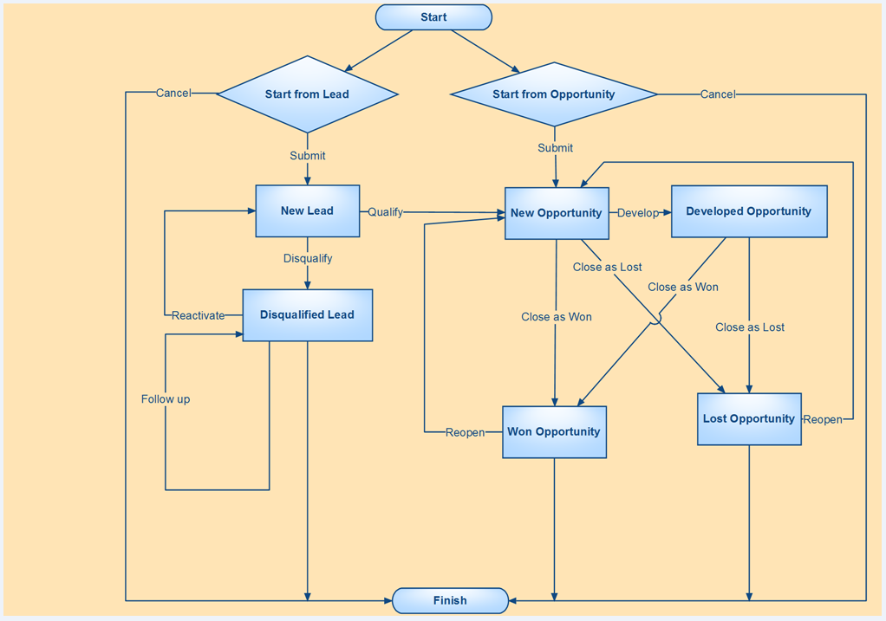
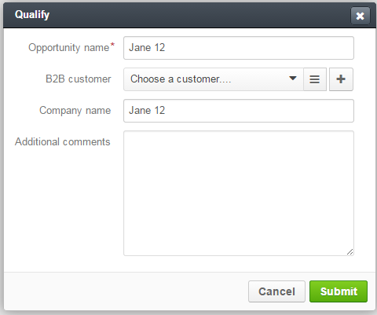

Sales Process Workflow
======================

.. |B01| image:: ./img/buttons/B01.png
   :align: middle

.. |BCan| image:: ./img/buttons/BCan.png
   :align: middle

.. |Bsc| image:: ./img/buttons/Bsc.png
   :align: middle

.. |BDelete| image:: ./img/buttons/BDelete.png
   :align: middle

.. |BEdit| image:: ./img/buttons/BEdit.png
   :align: middle

.. |BCrL| image:: ./img/buttons/BCrL.png
   :align: middle

.. |BCrLOwnerClear| image:: ./img/buttons/BCrLOwnerClear.png
   :align: middle

.. |Bdropdown| image:: ./img/buttons/Bdropdown.png
   :align: middle

.. |BGotoPage| image:: ./img/buttons/BGotoPage.png
   :align: middle

.. |BStartfL| image:: ./img/buttons/BStartfL.png
   :align: middle

.. |BStartfO| image:: ./img/buttons/BStartfO.png
   :align: middle

.. |Bplus| image:: ./img/buttons/Bplus.png
   :align: middle

.. |BSave| image:: ./img/buttons/BSave.png
   :align: middle

.. |BSubmit| image:: ./img/buttons/BSubmit.png
   :align: middle

.. |BCrO| image:: ./img/buttons/BCrO.png
   :align: middle

.. |BAddNote| image:: ./img/buttons/BAddNote.png
   :align: middle

.. |BSendEm| image:: ./img/buttons/BSendEm.png
   :align: middle

.. |BFollowUp| image:: ./img/buttons/BFollowUp.png
   :align: middle

.. |BReAct| image:: ./img/buttons/BReAct.png
   :align: middle

.. |BQualify| image:: ./img/buttons/BQualify.png
   :align: middle

.. |BDQualify| image:: ./img/buttons/BDQualify.png
   :align: middle

.. |BDevelop| image:: ./img/buttons/BDevelop.png
   :align: middle

.. |BCasW| image:: ./img/buttons/BCasW.png
   :align: middle

.. |BCasL| image:: ./img/buttons/BCasL.png
   :align: middle

.. |BReopen| image:: ./img/buttons/BReopen.png
   :align: middle

.. |BOK| image:: ./img/buttons/BOK.png
   :align: middle

What Sales Processes are About
------------------------------

Sales Processes is a part of OroCRM responsible for automation of Business to Business work-flow handling.
This functionality provides for consistence and continuous monitoring of the sales process from initial arrangements
all the way over negotiations and proposals to successfully realized opportunities. With the functionality and
customizable embedded report sales managers can gain clear understanding of the specific workflows and implement
more customer-oriented sales approach.

As any part of OroCRM, Sales Processes functionality is very flexible and can be tuned to correspond your specific
business need.
In fact, OroCRM may be filled with any business specific Entities and their details and Oro Platform can be used to
set up a Workflow using this Entities. We have implemented such a work-flow that fits general needs of B2B Sales
Process management and may be used without additional tuning, without prejudice to its flexibility and scalability.

.. hint:: OroCRM may be filled with any business specific Entities and their details and Oro Platform can be used to
          set up a Workflow using this Entities.

Steps to Perform
-----------------

As it was said above, the Sales Processes functionality is about Business to Business workflow. What do we need to
create a meaningful workflow?

- Information about Channels of B2B Sales (shops, stores, retail outlets, etc.)

- Information about Leads that appear for these Channels (people\organizations that fit the Channels target-group and
  may make a good Opportunity)

- Information about Opportunities for these Channels (Leads for which there is a high probability of successful sales
  initiation)

Once these three are in the system, OroCRM gives clear and convenient ways to input and process this information, as
well as tools for its monitoring and analysis. In the following sections we shall consider, how to:

I. Populate the System with B2B Channels

II. Populate the System with Leads

III. Populate the System with Opportunities

IV. Develop Sales Processes

I. Populate the System with B2B Channels
----------------------------------------

Channel in OroCRM represents a specific source of sales or customers, this may be a retail outlet, an E-commerce market
place, a partner or a marketing campaign, etc. For each Channel there is a predefined set of entities (groups of
instances with predefined contents and processing rules), and their instances contain Channel-specific details to be
processed in the system (e.g. information about actual and potential customers, details of campaigns etc.)

A special type of Channels is devoted for B2B sales processing.
To create a B2B channel go to *System --> Channels*, click |B01| button in the top right corner, and create a B2B type
channel in the emerged page.

For more details on Channel creation please address our `Channels Guide </user_guide/channel_guide.rst#channel-guide>`_.

.. note:: When creating a B2B Channel Users with appropriate right can use default settings or modify B2B Customer,
          Lead and Opportunity forms, as well as enable\disable attachment storage within Sales Process details.
          This settings will then be applied for this Channel everywhere in OroCRM.

II. Populate the System with Leads
----------------------------------

The straightforward way to populate the System with Leads is from the *System --> Leads* page:

1. Go to the dedicated *Sales --> Leads* page

2. Create or Import Leads

3. Edit created leads, if necessary

1. Go to the Dedicated *Sales --> Leads* section
^^^^^^^^^^^^^^^^^^^^^^^^^^^^^^^^^^^^^^^^^^^^^^^^
*Sales\Leads* page will appear. From here you can Create of Import Leads.

.. hint:: If you cannot see the section, there may be still no B2B Channels with Leads Entity assigned to them in the
          System. `View the Channels list </user_guide/channel_guide.rst#further-actions>`_ to check it.
          `Fill the System with Channels </user_guide/sales_process_workflow.rst#fill-the-system-with-b2b-channels>`_ ,
          if necessary

          If the problem persists, you may not have User-rights to View\Edit the functionality.
          Please address you system administrator.

2a. Create Leads
^^^^^^^^^^^^^^^^

Click |BCrL| button to manually input the Lead's details.
The form specified for the Channel's Leads will appear.

.. hint:: You can also create a Lead from the *System -->Sales Processes* page.
          See `Sales Processes </user_guide/sales_process_workflow.rst#start-a-sales-process-from-lead>`_ for details.

The form contains mandatory system fields, optional system fields and custom fields (if any).

Mandatory System Fields for Leads
"""""""""""""""""""""""""""""""""

Regardless the Lead entity settings, the following fields are mandatory and **must** be defined.

|LeadCrMF|

Detailed description of each field is provided below:

.. list-table:: **Mandatory Lead Fields**
   :widths: 10 30
   :header-rows: 1

   * - Field
     - Description

   * - **Owner***
     - This field limits the list of Users authorized to manage the Lead created. Once a User is chosen only this User
       and Users whose predefined Role provides for management of Leads that belong to this User (e.g. a head of the
       User's Business Units, System administrator) can do so. Please see Roles Administrator Guide for more details if
       required.

       By default, the User creating the Lead is chosen.

            To clear the field click |BCrLOwnerClear| button.

            Click |Bdropdown| button to choose one of available Users from the list.

            Click |BGotoPage| button to choose from the *Select Owner* page.

   * - **Lead Name***
     - This is the name that will be used to save and display the Lead in the System.

       It is recommended to define a meaningful name.

   * - **Channel***
     - Any of the Channels in the System that is assigned *Lead* Entity.

            Click |Bdropdown| button to choose one of available Channels from the list.

   * - **First Name***
     - Name of the potential customer or contact person.

       It is recommended to define a meaningful name.

   * - **Last Name***
     - Last name of the potential customer or contact person.

       It is recommended to define a meaningful name.

Optional System Fields for Leads
""""""""""""""""""""""""""""""""

Optional System Fields may be left empty. They are added based on Oro's experience as the fields that you may find
handy and convenient to use.
Many of optional system fields are free text fields with transparent names, e.g.*Name Prefix*, *Job Title*,
*Company Name*, *Website*, etc.

If a field refers to a number (e.g. Number of employees) an integer value shall be filled (if any).

Optional system field *Source* is a drop-down that contains adjustable predefined list of possible Lead sources, such
as Website, Direct Mail, Partner, etc.

Optional system fields *Contact* and *B2B Customer* enable binding the Lead created to corresponding Entities in the
System.

*Contact* entity represents one contact person and helps keeping all the contact details and process them for further
usage (mailings, notification delivery, feedback requests etc.)

*B2B Customer* entity contains all the details of one customer available in the System (e.g. shipping and banking
details, data on opportunities and purchases from all Channels, etc.).

- Click |Bdropdown| button to choose one of available Contacts\Customers from the list.

- Click |BGotoPage| button to choose from the *Select Contact*\*Select B2B Customer* page.

- Click |Bplus| button to create a new Contact\new Customer in the System.

- To clear the field click |BCrLOwnerClear| button.

.. note:: If at least one address field (e.g. *Street*) has been field, the rest of the address-related system fields
          (namely *Country*, *City* and *Zip\postal code* **must** be defined)

Custom Fields for Leads
"""""""""""""""""""""""

All the Custom fields populated into the System and available for the User will be displayed in the *Additional*
section (to create a custom field go to *System --> Entities --> Entity Management --> Create Field*).

Once you have filled all the mandatory and desired fields, click |Bsc| button and you will get to the page of the Lead
created. The Lead will also appear in the Leads grid.

2b. Import Leads
^^^^^^^^^^^^^^^^
If you want to upload multiple Leads manually or from a third-party enterprise application, it is worth considering our
*Import* option. OroCRM can process .scv files that correspond to the Data template.

Click |Bdropdown| on the **Import** button in the top right corner of the *Sales\Leads* page. Choose *Download Data
Template*. Prepare a .csv file that corresponds the template and click *Import* button, choose the .csv file for
import, carefully read through the submission form and confirm the import.

.. caution:: `Mandatory fields of Leads </user_guide/sales_process_workflow.rst#mandatory-system-fields-for-leads>`_
             **must** be specified

.. hint:: You can leave "id" field empty, and the system will generate unique ids itself. Be careful, if there are
          already some Leads in the system and you upload new ones with ids specified. If the two ids match (e.g. one
          from a third-party application and one already in the system), the system will treat the Lead creation, as
          update of an existing Lead.

Once import is over the new Leads will appear in the list.

3. Edit Leads
^^^^^^^^^^^^^

There are several ways to edit the Leads that are already present in the system, i.e. editing leads details from the WEB
and processing .csv files.

Edit Leads from the Web
"""""""""""""""""""""""
For individual changes, the most convenient way is *to go the Lead's page and edit the Lead's details*

.. hint:: You can use *Filters* functionality to simplify the search for the necessary Lead. The *Filters* are rather
          see-through and easy to use, but if you feel a lack of assistance, please refer to the Filters Guide (TBD).

Once you have found the target Lead, click on any column thereof.

The Lead's page will emerge.

- Click |BDelete| button to delete this Lead from the System.

- Click |BEdit| button to edit the Lead's details.

*Create* form with previously defined values will appear.

- Re-define the values you need to change.
  This is similar to `creating a Lead </user_guide/sales_process_workflow.rst#create-leads>`_

Once you have done all the necessary changes, click |Bsc| button and you will get back to the Lead's page.
The Lead's details will be updated.

.. hint:: To simplify your work with the Leads, there is an Add Note action. Click |BAddNote| button in the top right
          corner of the Lead's page and enter the text that will appear in the Lead's *Additional Information* section.

Processing .csv Files to Edit Leads
"""""""""""""""""""""""""""""""""""

Another way to edit Leads details, that is especially useful for bulk changes or in case of integration with
third-party applications is over .csv export and import. To do so, you need to

- Export .csv file with the Leads grid:

  In order to export the .csv file, go to *Sales --> Leads* and click **Export** button. "Export started..." message
  will appear at the top of the screen.

  As soon as the export has finished it will change to: *"Export performed successfully, [number] downloads exported.
  Download result file*".

  Click the *"Download result file*" at the end of the message and download will be performed subject to your browser
  settings.

- Edit the file

- `Import </user_guide/sales_process_workflow.rst#import-leads>`_ the edited file.

Actions with Leads
------------------

Of course, we will need the Leads for the further work with Opportunities and Sales Processes described below. However,
even at this stage they can come handy when performing different activities.
So, version 4.1 supports *Send Email* action. Click |BSendEm| button in the top right corner of the Lead's page and
E-mail template already filled with the Lead's details will appear. You only need to fill the Subject and Body and
click *Send*

.. hint:: Oro Platform provides tool for creation of other Actions using Leads that may be developed in the course of
          customization subject to your business needs.

II. Populate the System with Opportunities
-------------------------------------------

The straightforward way to populate the System with Opportunities is from the *System --> Opportunities* page:

1. Go to the dedicated *Sales --> Opportunities* page

2. Create or Import Opportunities

3. Edit created Opportunities, if necessary

1. Go to the Dedicated *Sales --> Opportunities* section
^^^^^^^^^^^^^^^^^^^^^^^^^^^^^^^^^^^^^^^^^^^^^^^^^^^^^^^^

.. hint:: If you cannot see the section, there may be still no B2B Channels with Opportunities Entity assigned to them
          in the System. `View the Channels list </user_guide/channel_guide.rst#further-actions>`_ to check it.
          `Fill the System with Channels </user_guide/sales_process_workflow.rst#fill-the-system-with-b2b-channels>`_ ,
          if necessary

If the problem persists, you may not have User-rights to View\Edit the functionality. Please address you system
administrator.

*Sales\Opportunities* page will appear. From here you can Create of Import Opportunities.

2a. Create Opportunities
^^^^^^^^^^^^^^^^^^^^^^^^
Click |BCrO| button to manually input the Opportunity's details.
The form specified for the Opportunities will appear.

.. note:: You can also make an Opportunity from the *System -->Sales Processes* Page, as described page as described
          `in the Sales Processes </user_guide/sales_process_workflow.rst#start-a-sales-process-from-opportunity>`_

The form contains mandatory system fields, optional system fields and custom fields (if any).

Mandatory System Fields for Opportunities
"""""""""""""""""""""""""""""""""""""""""

Regardless the Opportunity entity settings, the following fields are mandatory and **must** be defined.

|OppCrMF|

Detailed description of each field is provided below:

.. list-table:: **Mandatory Opportunity Fields**
   :widths: 10 30
   :header-rows: 1

   * - Field
     - Description

   * - **Owner***
     - This field limits the list of Users authorized to manage the Opportunity created. Once a User is chosen only
       this User and Users whose predefined Role provides for management of Opportunities that belong to this User
       e.g. a head of the User's Business Units, System administrator) can do so. Please see Roles Administrator Guide
       for more details if required.

       By default, the User creating the Opportunity is chosen.

            To clear the field click |BCrLOwnerClear| button.

            Click |Bdropdown| button to choose one of available Users from the list.

            Click |BGotoPage| button to choose from the *Select Owner* page.

   * - **Opportunity Name***
     - This is the name that will be used to save and display the Opportunity in the System.

       It is recommended to define a meaningful name.

   * - **B2B Customer***
     - The field binds the Opportunity created to a specific Customer in the System. Customer entity contains all the
       details
       of one customer available in the System (e.g. shipping and banking details, data on opportunities and purchases
       from all Channels, etc.).

       Field that was optional for Leads, is mandatory for Opportunities. This is related to higher business importance
       of Opportunities. While almost any potentially useful acquaintance may be deemed as a Lead, Opportunities shall
       have high probability of turning into real sales activities, and thus it is important to keep track of the
       related customers information.

- Click |Bdropdown| button to choose one of available Customers from the list.

- Click |BGotoPage| button to choose from the *Select B2B Customer* page.

- Click |Bplus| button to create a Customer in the System.

- To clear the field click |BCrLOwnerClear| button.

Optional System Fields for Opportunities
""""""""""""""""""""""""""""""""""""""""

Optional System Fields may be left empty. They are added based on Oro's experience as the fields that you may find
handy and convenient to use.
Many of optional system fields are free text fields with transparent names, e.g.*Custom Need*, *Proposed Solution*, etc.

If a field refers to a number (e.g. *Probability (%)*, *Budget Amount ($)*, *Close Revenue ($)*) an integer value shall
be filled (if any).

Optional system field *Close Reason* is a drop-down that contains adjustable predefined list of possible Opportunity
closure reasons, i.e. Cancelled, Outsold and Won.

Optional system fields *Potential Customer* is a *Contact* bound to an Opportunity.
*Potential Customer* entity represents one contact person and helps keeping all the contact details and process them
for further usage (mailings, notification delivery, feedback requests etc.)

- Click |Bdropdown| button to choose one of available Contacts from the list.

- Click |BGotoPage| button to choose from the *Select Potential Customer* page.

- Click |Bplus| button to create a new *Potential Customer* the System.

- To clear the field click |BCrLOwnerClear| button.

Custom Fields for Opportunities
"""""""""""""""""""""""""""""""

All the Custom fields populated into the System and available for the User will be displayed in the *Additional*
section (to create a custom field go to *System --> Entities --> Entity Management --> Create Field*) .

Once you have filled all the mandatory and desired fields, click |Bsc| button and you will get to the page of the
Opportunity created. The Opportunity will also appear in the Opportunities grid.

2b. Import Opportunities
^^^^^^^^^^^^^^^^^^^^^^^^

Opportunities import is very similar to the `Leads import </user_guide/sales_process_workflow.rst#import-leads>`_
You do the same actions from the *Sales --> Opportunities* page.

.. caution:: `Mandatory fields </user_guide/sales_process_workflow.rst#mandatory-system-fields-for-opportunities>`_
             **must** be specified

3. Edit Opportunities
^^^^^^^^^^^^^^^^^^^^^

There are several ways to edit the Leads that are already present in the system, i.e. editing leads details from the
WEB and processing .csv files.

Edit Opportunities from the Web
"""""""""""""""""""""""""""""""
For individual changes, the most convenient way is *to go the Opportunity's page and edit its details*

.. hint:: You can use *Filters* functionality to simplify the search for the necessary Opportunity. The *Filters* are
          rather see-through and easy to use, but if you feel a lack of assistance, please refer to the Filters
          Guide (TBD).

Once you have found the target Opportunity, click on any column thereof.

The Opportunity's page will emerge. As Opportunity makes a significant components of the Sales Process workflow, you
cannot delete an Opportunity.

- Click |BEdit| button to edit the Opportunity details.

*Create* form with previously defined values will appear.

- Re-define the values you need to change.
  This is similar to `creation of an Opportunity </user_guide/sales_process_workflow.rst#create-opportunities>`_

Once you have done all the necessary changes, click |Bsc| button and you will get back to the Opportunity's page.
The Opportunity's details will be updated.

.. hint:: To simplify your work with the Opportunities, there are Add Attachment and Add Note actions.
           Click corresponding button in the top right corner of the Opportunity's page and choose a file to add
           or enter the text that will appear in the Lead's *Additional Information* section.

Processing .csv Files to Edit Opportunities
"""""""""""""""""""""""""""""""""""""""""""

Another way to edit Opportunity details, that is especially useful for bulk changes or in case of integration with
third-party applications is over .csv export and import.
It is similar to `editing Leads </user_guide/sales_process_workflow.rst#processing-.csv-files-to-edit-opportunities>`_.
You do the same actions from the *Sales --> Opportunities* page.

Some Actions with Opportunities
--------------------------------

Of course, we will need the Opportunities as an integral and vital component of the Sales Process work-flow described
below. However, you can also perform additional actions with them.

So, version 4.1 supports *Send Email* action. Click |BSendEm| button in the top right corner of the Opportunity's
page and E-mail template already filled with the Opportunity's details will appear. You only need to fill the Subject
and Body and click *Send*.

.. hint:: Oro Platform provides tool for creation of other Actions using Opportunities that may be developed in the
          course of customization subject to your business needs.

Sales Process Workflow
-------------------------------
As soon as Leads and Opportunities have been defined in the system they can be used within a specified workflow.
In general, workflow is a set of ordered actions that can be performed with a specific entity.
Workflows allow to manage entities, update existing ones and create new.
From the user's POV workflow appears as a set of buttons which may open forms that allow to manipulate entity data.
OroPlatform supports creation of any workflows of different complexity with any entities defined in the system.

Sales Process Workflow Diagram
^^^^^^^^^^^^^^^^^^^^^^^^^^^^^^^^^^^^^^^^^^^^^^^^^
The workflow entities are Leads and Opportunities. It is rather a see-through workflow that provides for consistent and
structured pre-sales and Sales Process.

|WorkFlow|

1. You can **Start** a workflow from a New Lead.

2. If you **Disqualify** a New Lead it is turned into a Disqualified Lead.

   You can **Reopen** any Disqualified Lead to turn it into a New Lead.

3. Make a New Opportunity

   a) If you **Qualify** a New Lead it is turned into an New Opportunity.
   b) You can also **Start** a workflow directly from a New Opportunity.

4. You can **Develop** each New Opportunity, which corresponds to an active negotiation stage.

5. Each New Opportunity and each Developed Opportunity you can **Close as Won** or **Close as Lost**.

   You can **Reopen** any Lost Opportunity and any Won Opportunity to turn into a New Opportunity.

1. Start From a New Lead
""""""""""""""""""""""""

Go to the Sales --> Sales Process page and click |BStartfL| button

Fill in the General information. The following four fields are mandatory and **must** be defined.

.. list-table:: **Mandatory Opportunity Fields**
   :widths: 5 30
   :header-rows: 1

   * - Field
     - Description

   * - **Owner***
     - This field limits the list of Users authorized to manage the Sales Process created. Once a User is chosen only
       this User and Users whose predefined Role provides for management of Leads that belong to this User (e.g. a head
       of the User's Business Units, System administrator) can do so. Please see Roles Administrator Guide for more
       details if required.

       By default, the User creating the Lead is chosen.

       To clear the field click |BCrLOwnerClear| button.

       Click |Bdropdown| button to choose one of available Users from the list.

       Click |BGotoPage| button to choose from the Select Owner page.

   * - **Start Date**
     - This is the date when the Lead was created and the Sales Process was started. Choose the date from the calendar.

   * - **Channel**
     - Any of the Channels in the System that is assigned Lead Entity.

       Click |Bdropdown| button to choose one of available Channels from the list.

   * - **Lead**
     - One of Leads in the System or a new Lead.

       Click |Bdropdown| button to choose one of available Leads from the list.

       Click |BGotoPage| button to choose from the Select Lead page.

       Click |Bplus| button to add a new Lead to the System.
       Follow the process described to `create a Lead </user_guide/sales_process_workflow.rst#create-leads>`_ above

Click |BSubmit| button to save the started workflow in the System.
Click |BCan| to cancel the flow start. No changes will be saved in the System.

*For Example 1*
***************

*You are a toy factory owner. Yesterday you came back from a big fair, where you had your sales stand with
commercial materials. At the fair you ran a lottery, and to take part in the lottery people filled in a form with their
personal details. They also got a small toy of your brand and a set of commercials.
In order to keep track of the campaign success, you have created a Fair Channel of B2B type and had your secretary to
fill it with information of the fair lottery participants.*

2. Disqualified Leads
""""""""""""""""""""""

If a specific Lead has appeared meaningless for your future business activity management, you can **Disqualify**
it. A Disqualified Lead will not be taken into account when preparing reports and running the further workflow.

To disqualify a Lead go to the Sales --> Sales Processes.

Find the process started with the Lead in the grid and click  in the corresponding row.

You will get to the Lead's page. Click |BDqualify| button in the top right corner.

.. hint:: You can use Filters functionality to simplify the search for the necessary Lead. The Filters are rather
          see-through and easy to use, but if you feel a lack of assistance, please refer to the Filters Guide (TBD).

If there is a need to define reasons for the decision, click |BFollowUp| button and write a free text message. The
message will be added to the Lead's additional information section.

While Disqualified Leads are kind of benched, their information is kept in the system and you can **Reactivate** them.

To **Reactivate** a Lead:

- Go to the Sales --> Sales Processes.

- Find the process with the Lead in the grid and click  in the corresponding row.

You will get to the Lead's page.

- Click |BReAct| button in the top right corner.

The Lead will be treated as a New Lead, and all the information you have input for it (including the Follow-up) will be
saved.

*For Example 2*
***************
*Eventually, you have figured out that some form at the fair were filled by children. You Disqualify them and make
an Follow-up like: "Child".*
*At some point, you understand that "Jane 12" is not a 12-year old girl but the name of a Toy Shop, so you Reactivate
the Lead.*

3a. New Opportunities from Leads
""""""""""""""""""""""""""""""""
You can **Qualify** a Lead, in case if it is rather likely to turn into a real Opportunity (the chances of getting
into sales are high).

To **Qualify** a Lead:

- Go to the Sales --> Sales Processes.

- Find the process with the Lead in the grid and click in the corresponding row.

You will get to the Lead's page.

- Click |BQualify| button in the top right corner.

Qualify tab will appear.

|QualifyTab|

The only mandatory field Opportunity name is by default filled with the named of a Lead qualified.

System optional field B2B Customer enables binding the Opportunity to a specific Customer in the System. This may be a
representative of the company associated with an Opportunity or the company itself. If you bind a Customer and an
Opportunity, it will be considered when making reports of this Customer and creating the Customer's profile (a unique
functionality that provides for generalized view of the Customer's activity over different Channels).
If a new Customer is created for an Opportunity, keep in mind that the Customer can be assigned a Contact,
and must be assigned an Account for more details please see Customer Management Guide (TBD).

You can also define the Company name (this is particularly convenient if the Company name is different from the
Opportunity name).

.. hint:: If your Sales Process requires any additional information to be added, the Qualify form can be customized
          respectively.

*For Example 3a (1)*
********************
*The Head of Jane 12 company from the previous example has called you and asked about prices and discounts for a
relatively big amount of toys for his shop. Later, during the day he sent you and E-mail with a set of conditions for
the purchase. The man seems very determined to buy the toys from you.*
*The same day you have Qualified Jane 12 Lead into an Opportunity. You also created a New Customer. You created a
Jane 12 Account and made a new Contact, that contain the directors contact details. In the additional comment you wrote
"Toy Shop in Cisco. Lead from the fair lottery. And added some details of the potential order".*

*For Example 3a(2)*
*******************
*You got a call from one your Leads, who asked you to provide more information on possible discounts and terms of work.
When you started asking for more details, the man said that "so far he was collecting pricing information, that he
really liked your conditions and toy quality but still needs to check on some more potential contractors".
You turned this Lead into an Opportunity but decided not to create a Customer for it yet.*

3b. Start Sales Process from an Opportunity
""""""""""""""""""""""""""""""""""""""""""""
Sometimes, high probability of future sales is obvious from the very beginning. In this case, you may skip the Lead step
and **Start** you Sales Process workflow **from Opportunity**.

Go to the Sales --> Sales Process page and click |BStartfO| button

Fill in the General information. The following four fields are mandatory and **must** be defined.

.. list-table:: **Mandatory Opportunity Fields**
   :widths: 10 30
   :header-rows: 1

   * - Field
     - Description

   * - **Owner***
     - This field limits the list of Users authorized to manage the Sales Process created. Once a User is chosen only
       this User and Users whose predefined Role provides for management of Leads that belong to this User (e.g. a head
       of the User's Business Units, System administrator) can do so. Please see Roles Administrator Guide for more
       details if required.

       By default, the User creating the Lead is chosen.

       To clear the field click |BCrLOwnerClear| button.

       Click |Bdropdown| button to choose one of available Users from the list.

       Click |BGotoPage| button to choose from the Select Owner page.

   * - **Start Date**
     - This is the date when the Opportunity was created and the Sales Process was started. Choose the date in the
       calendar.

   * - **Channel**
     - Any of the Channels in the System that is assigned Opportunity Entity.

       Click |Bdropdown| button to choose one of available Channels from the list.

   * - **Opportunity**
     - One of Opportunities in the System or a new Opportunity.

       Click |Bdropdown| button to choose one of available Opportunities from the list.

       Click |BGotoPage| button to choose from the Select Opportunity page.

       Click |Bplus| button to add a new Opportunity to the System.

       Follow the process to `Create an Opportunity <user_guide/sales_process_workflow.rst#create-opportunities>`_

Click |BSubmit| button to save the started workflow in the System.
Click |BCan| to cancel the flow start. No changes will be saved in the System.

*For Example 3b(1)*
********************
*At the fair there was a representative of a big toy store chain. She came to your stand and seemed very interesting in
your goods. She did not leave her details but took the commercial materials. Later she wrote you a letter with a
request for proposal on a significant toy purchase.*
*You have started a Sales Process workflow with an Opportunity. You have created a new Customer and Account for this
Opportunity.*

*For Example 3b(2)*
********************
*One of your regular customers, a big event-organizing company, contacted you. They are going to take part in a bid for
organization of celebration for the Child Defence Day and are considering you as their partner. You Started a sales
workflow from Opportunity. You chose the event-organizing company from you Customer list. There contact/account details
were automatically bound to this Opportunity.*

4. Develop an Opportunity
""""""""""""""""""""""""""
As negotiations keep going there appear more and more conditions, needs, solution options, and other details related to
the Opportunity. In order to fill Opportunity with these details you can **Develop** the Opportunity. Basically, this is
very similar to editing of the opportunity, but there is significant difference from the Sales Process workflow as if an
Opportunity has been developed, it means there is/was a negotiation process going on about it.

In order to **Develop** an Opportunity:

- Go to the Sales --> Sales Processes.

- Find the process with the Opportunity in the grid and click in the corresponding row.

You will get to the Opportunity's page.

- Click |BDevelop| button in the top right corner.

Develop tab will appear. Fill the tab with new Opportunity details.

*For Example 4*
***************
*While working on the Bid from the previous example you have developed a special proposal that meets the bid conditions.
You Developed the corresponding Opportunity and added all the arrangements reached there. Now all the information on
this Opportunity is saved in the same place.*

5. Close an Opportunity
""""""""""""""""""""""""""
Any Developed or New Opportunity can be Closed. If for some reason it has not worked out into actual sales, you can
**Close** it **as Lost**. If you have made a successful sale, happily **Close** the Opportunity **as Won**.

To **Close** an Opportunity:

- Go to the Sales --> Sales Processes.

- Find the process with the Opportunity in the grid and click in the corresponding row.

You will get to the Opportunity's page.

- Click |BCasL| or |BCasW| button in the top right corner.

Close as Lost or Close as Won tab will appear. There only two mandatory system fields:

.. list-table:: **Mandatory Opportunity Fields**
   :widths: 10 30
   :header-rows: 1

   * - Field
     - Description

   * - **Close Reason**
     - (For Lost Opportunities)
       Chose one of the reasons from the list. The list may be customized to meet your specific business process

   * - **Close Revenue**
     - (For Won Opportunities)
       Deal amount. (By default, in USD)

   * - **Close Date**
     - Chose the date when the Opportunity was Closed from the calendar.

Click |BSubmit| button to Close the Opportunity.
Click |BCan| to cancel the operation. No changes will be saved in the System.

Click |BSubmit| button to Close the Opportunity.
Click |BCan| to cancel the operation. No changes will be saved in the System.

If you have unintentionally closed and Opportunity, or if you have closed an Opportunity and then eventually, it gained
back the actuality, you can Reopen it. The Reopen process may be customized subject to your business need, though
initially it creates a New Opportunity.

To **Close** an Opportunity:

- Go to the Sales --> Sales Processes.

- Find the process with the Opportunity in the grid and click in the corresponding row.

You will get to the Opportunity's page.

- Click |BReopen| button in the top right corner. You will see a warning. Click |BOK| to confirm the action.

*For Example 5(a)*
******************
*The man who called you in the Example 3a(2) (the one who still was going to check on other potential contractors) has
never called you back. Eventually you Close the Opportunity as Lost. Later, he got in touch and said that he want to
go on with the purchase discussion. You Reopened the Opportunity.*

*For Example 5(b)*
******************
*You won the bid and the contact was executed. You can take a deep breath and Close the Opportunity as Won.*

