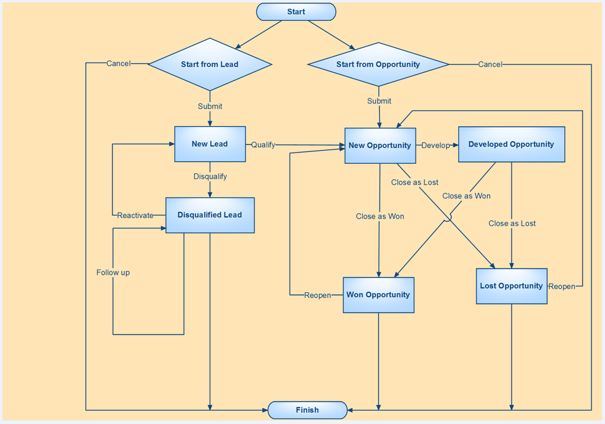
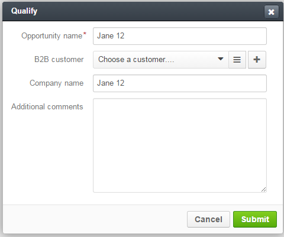

.. _user-guide-sales-processes-workflow:

Sales Processes Workflow
========================

Several Words about Sales Processes and Other Workflows
-------------------------------------------------------

In general, a workflow is a set of ordered actions that can be performed with a specific entity. From the user's POV a 
workflow appears as a set of buttons which may open forms that allow to manipulate entity data.

OroCRM may be filled with any :term:`entities <Entity>` and their instances then can be used to set up a 
:ref:`Workflow <user-guide-workflow-management>`. 

However, using our experience in sales and retail, we have implemented such a workflow that fits general needs of B2B 
sales process management and, while being a very flexible and scalable tool, may be used without additional tuning. 

The workflow is named **Sales Processes**.

It provides for consistence and continuous monitoring of a B2B sales process from initial arrangements and all the way 
through negotiations and proposals to successfully realized opportunities. With the functionality and customizable 
embedded report and diagrams, sales managers can gain clear understanding of the specific workflows and implement
more customer-oriented sales approach.

Preliminary Conditions
-----------------------
Main component of any B2B sales process are :term:`Leads <Lead>` and :term:`Opportunities <Opportunity>` that either 
become successful deals or fail to do so.

In order for the system to get information about the Leads and Opportunities, there have to be defined some 
:term:`Channels <Channel>` predefined in the system (in OroCRM a Channel is an entity, the instances whereof correspond 
to a specific source of potential and actual sales (e.g. a shop, a retail outlet, an e-commerce point, a commercial 
campaign,etc.)  

.. caution::

     At least one B2B or Custom Channel assigned both Lead and Opportunity sales **must** be defined in the system to 
     use the *Sales Processes* work-flow!

Detailed description of the Channel creation and settings is provided in the \:ref:`Channel Management Guide 
<user-guide-channel-guide>`\.

For the Sales Processed Workflow you can use the Lead and Opportunity instances previously populated into the system as
described in the \:ref:`"Leads Management Guide" <user-guide-system-channel-entities-leads>`\ and \:ref:`"Opportunities
Management Guide" <user-guide-system-channel-entities-opportunities>`\ or define a new Lead or Opportunity at the
:ref:`Start From Lead <user-guide-sales-processes-workflow-start-from-lead>` or :ref:`Start From 
Opportunity <user-guide-sales-processes-workflow-start-from-opportunity>` step of the *Sales Processes* workflow. 

.. _user-guide-sales-processes-workflow-diagram:

Sales Processes Workflow Diagram
---------------------------------

*Sales Processes* is rather a see-through workflow that provides for consistent and structured pre-sales and sales 
process.

   
   **fig.1 "Sales Processes" workflow diagram**

Sales Processes Workflow Tables
-------------------------------
The tables in this section provide description for each step of the *Sales Processes* workflow from the system and sales
perspective and links to the section with the steps to perform the action in OroCRM.

.. csv-table:: The following actions are available for Leads
   :header: "No.", "Action", "Description", "Meaning for the Sales", "How to"
   :widths: 5, 15, 30, 30, 20

   "\1","
   **Start From Lead**","
   At this step you can create a new Lead instance or use a Lead instance already present in the system to start a Sales
   Process.","
   There is a potential opportunity, a person or business that might become interested in making a deal with you.","
   :ref:`How to Start from Lead <user-guide-sales-processes-workflow-start-from-lead>`"
       
   "\2a","
   .. _user-guide-sales-processes-workflow-diagram-qualify-lead:
      
   **Qualify**","
      
   The Lead instance it is turned into an new Opportunity instance that automatically inherits the details of the 
   initial Lead.","Active negotiations have started or, for some other reason, the chances for successful deal 
   conclusion have increased.",":ref:`How to Qualify a Lead <user-guide-sales-processes-workflow-qualify-leads>`"
   
   "\2b","
   **Disqualify**","
   Status of the the Lead instance is set to *disqualified*. The instance will not be taken into
   account in the course of the further workflow development.","
   There was no development towards a deal, no negotiations were started and are unlikely to start.
   
   Specific Lead instance has appeared meaningless for your future business activity management.","
   :ref:`How to Disqualify a Lead <user-guide-sales-processes-workflow-disqualify-leads>`"
     
   "\3.","
   **Reactivate**","
   While Disqualified Leads are kind of benched, their information is kept in the system and they can be reactivated. 
   Once you have reactivated a disqualified Lead instance, it will be processed as a new one. 
   
   This is equal to the step *1. Start From Lead*, where the Lead instance is already present in the system, and it is 
   the disqualified Lead you Reactivate."," 
   You have decided to give the Lead another chance."," 
   :ref:`How to reactivate a disqualified Lead <user-guide-sales-processes-workflow-reactivate-leads>`"

.. csv-table:: The following actions are available for Opportunities
   :header: "No.", "Action", "Description", "Meaning for the Sales", "How to"
   :widths: 5, 15, 30, 30, 20

   "\1","
   **Start from Opportunity**","
   At this step you can create a new Opportunity instance or use an Opportunity instance already present in the system 
   to start a Sales Process. This way you kind of skip starting from the Lead and start from :ref:`Qualifying a 
   Lead <user-guide-sales-processes-workflow-diagram-qualify-lead>`.","
   There is potential client with relatively high probability of going into real sales.","
   :ref:`How to start from Opportunity <user-guide-sales-processes-workflow-start-from-opportunity>`"

   "\2","
   **Develop**","Add some more details to the Opportunity instance.","
   There is an active negotiation going on and there has appeared a need to record the new conditions, arrangements, 
   request, solution options, etc.","
   :ref:`How to develop an Opportunity <user-guide-sales-processes-workflow-develop-opportunities>`"
   
   "\3a","
   **Close as Won**","Any Opportunity instance can be *Closed as Won*, whether it has been developed or not. The
   Opportunity status is changed to *Won*. The sales process is closed with some revenue.","
   The deal was executed successfully.","
   :ref:`How to close an Opportunity instance as Won <user-guide-sales-processes-workflow-close-opportunities>`"
   
   "\3a","
   **Close as Lost**","Any Opportunity instance can be *Closed as Lost*, whether it has been developed or not. 
   The Opportunity status is changed to *Lost*. The sales process is closed with no revenue.","
   The deal was not executed and there probability of a success is very low.","
   :ref:`How to close an Opportunity instance as Lost <user-guide-sales-processes-workflow-close-opportunities>`"
   
   "\4","
   **Reopen**","
   Previously closed Opportunity instances can be *Reopened* and will be processed as new ones.
   
   This is equal to the step *1. Start From Opportunity*, where the Opportunity instance is already present in the 
   system, and it is the close Opportunity Lead you Reopen.","
   You have decided to give the Opportunity another chance(new round of negotiations started).","
   :ref:`How to reopen a closed 
   Opportunity instance <user-guide-sales-processes-workflow-reopen-opportunities>`"

     
Steps to Perform
----------------
     
     
.. _user-guide-sales-processes-workflow-start-from-lead:

**In order to start a Sales Process From a Lead instance**:
^^^^^^^^^^^^^^^^^^^^^^^^^^^^^^^^^^^^^^^^^^^^^^^^^^^^^^^^^^^

- Go to the *Sales --> Sales Processes* page

- Click :kbd:`Start From Lead` button

- Fill in the General information. 
  All the four fields are mandatory and **must** be defined:

.. list-table:: **Mandatory Lead Fields**
   :widths: 5 30
   :header-rows: 1

   * - Field
     - Description

   * - **Owner***
     - This field limits the list of Users authorized to manage the Sales Process created. Once a User is chosen only
       this User and Users whose predefined Role provides for management of Leads that belong to this User (e.g. a head
       of the User's Business Units, System administrator) can do so. 

       By default, the User creating the Lead is chosen.

       To clear the field click |BCrLOwnerClear|.

       Click |Bdropdown| to choose one of available Users from the list.

       Click |BGotoPage| to choose from the Select Owner page.

   * - **Start Date**
     - This is the date when the Lead was created and the Sales Process was started. Choose the date from the calendar.

   * - **Channel**
     - Any of the Channels in the System that is assigned a Lead entity.

       Click |Bdropdown| to choose one of available Channels from the list.

   * - **Lead**
     - One of Lead instances in the System or a new Lead instance.

       Click |Bdropdown| to choose one of available Leads from the list.

       Click |BGotoPage| to choose from the Select Lead page.

       Click |Bplus| to add a new Lead to the System.
       Follow the process described to \:ref:`create a Lead <user-guide-system-entities-leads-create-leads>`\

Click :kbd:`Submit` button to save the started workflow in the System.

Click :kbd:`Cancel` to cancel the flow start. No changes will be saved in the System.
 

.. _user-guide-sales-processes-workflow-qualify-leads:

**In order to qualify a Lead instance:**
^^^^^^^^^^^^^^^^^^^^^^^^^^^^^^^^^^^^^^^^^^^^^^^^^^^^^^

- Go to the *Sales --> Sales Processes* page

- Find the process with the Lead in the grid and click in the corresponding row

- You will get to the page of the Lead instance

- Click :kbd:`Qualify` button in the top right corner

- Qualify tab will appear

- The only mandatory field is *Opportunity name*. It is by default filled with the name of a Lead instance qualified.

- The following optional system fields are available:

  - **B2B Customer**: enables binding the Opportunity to a specific Customer instance in the System. 
                      This may be a representative of the company associated with an Opportunity or the company itself. 
                      If you bind a Customer and an Opportunity, it will be considered when analysing information of this 
                      term:`Customer`.
                   
                      If a new Customer instance is created for an Opportunity, keep in mind that it can be assigned a 
                      Contact instance and must be assigned an Account instance.

  - **Company name**: the field is particularly convenient if the Company name is different from the Opportunity name.

.. hint:: 
     
      If your Sales Process requires any additional information to be added, the Qualify form can be customized
      respectively.

 
.. _user-guide-sales-processes-workflow-disqualify-leads:

**In order to disqualify a Lead instance:**
^^^^^^^^^^^^^^^^^^^^^^^^^^^^^^^^^^^^^^^^^^^

- Go to the *Sales --> Sales Processes* page

- Find the process started with the Lead in the grid and click in the corresponding row

- You will get to the page of the Lead instance. Click :kbd:`Disqualify` button in the top right corner

.. hint:: 

      You can use Filters functionality to simplify the search for the necessary Lead. The Filters are rather
      see-through and easy to use, but if you feel a lack of assistance, please refer to the Filters Guide (TBD).

If there is a need to define reasons for the decision, click :kbd:`FollowUp` button and write a free text message. The
message will be added to the Lead's additional information section.

.. _user-guide-sales-processes-workflow-reactivate-leads:

**In order to reactivate a disqualified Lead instance:**
^^^^^^^^^^^^^^^^^^^^^^^^^^^^^^^^^^^^^^^^^^^^^^^^^^^^^^^^

- Go to the *Sales --> Sales Processes* page

- Find the process with the Lead in the grid and click  in the corresponding row

- You will get to the page of the Lead instance. Click :kbd:`Reactivate` button in the top right corner

.. _user-guide-sales-processes-workflow-start-from-opportunity:

**In order to start a Sales Process from an Opportunity instance:**
^^^^^^^^^^^^^^^^^^^^^^^^^^^^^^^^^^^^^^^^^^^^^^^^^^^^^^^^^^^^^^^^^^^

- Go to the *Sales --> Sales Processes* page and click :kbd:`Start From Opportunity` button

- In the emerged form, fill in the General information. 
  All the four fields are mandatory and **must** be defined.

.. list-table:: **Mandatory Opportunity Fields**
   :widths: 10 30
   :header-rows: 1

   * - Field
     - Description

   * - **Owner***
     - This field limits the list of Users authorized to manage the Sales Process created. Once a User is chosen only
       this User and Users whose predefined Role provides for management of Leads that belong to this User (e.g. a head
       of the User's Business Units, System administrator) can do so. 

       By default, the User creating the Lead is chosen.

       To clear the field click |BCrLOwnerClear|.

       Click |Bdropdown| to choose one of available Users from the list.

       Click |BGotoPage| to choose from the Select Owner page.

   * - **Start Date**
     - This is the date when the Opportunity was created and the Sales Process was started. Choose the date in the
       calendar.

   * - **Channel**
     - Any of the Channels in the System that is assigned Opportunity Entity.

       Click |Bdropdown| to choose one of available Channels from the list.

   * - **Opportunity**
     - One of Opportunity instances in the System or a new Opportunity.

       Click |Bdropdown| to choose one of available Opportunities from the list.

       Click |BGotoPage| to choose from the Select Opportunity page.

       Click |Bplus| to add a new Opportunity to the System.`Create an 
       Opportunity <user-guide-system-channel-entities-opportunities-create-opportunities>`

Click :kbd:`Submit` button to save the started workflow in the System.

Click :kbd:`Cancel` to cancel the flow start. No changes will be saved in the System.

.. _user-guide-sales-processes-workflow-develop-opportunities:

**In order to develop an Opportunity:**
^^^^^^^^^^^^^^^^^^^^^^^^^^^^^^^^^^^^^^^

- Go to the *Sales --> Sales Processes* page.

- Find the process with the Opportunity in the grid and click in the corresponding row.

- You will get to the page of the Opportunity instance. Click :kbd:`Develop` button in the top right corner.

- *Develop* tab will appear. Fill the tab with new Opportunity details.

.. _user-guide-sales-processes-workflow-close-opportunities:

**In order to Close an Opportunity:**
^^^^^^^^^^^^^^^^^^^^^^^^^^^^^^^^^^^^^

- Go to the *Sales --> Sales Processes* page

- Find the process with the Opportunity instance in the grid and click in the corresponding row

- You will get to the page of the Opportunity instance. Click :kbd:`Close as Lost` or :kbd:`Close as Won` button in the 
  top right corner

*Close as Lost* or *Close as Won* tab will appear. There only two mandatory system fields:

.. list-table:: **Mandatory Opportunity Fields**
   :widths: 10 30
   :header-rows: 1

   * - Field
     - Description

   * - **Close Reason**
     - (Lost Opportunities)
       Chose one of the reasons from the list. The list may be customized to meet your specific business process

   * - **Close Revenue**
     - (Won Opportunities)
       Deal amount. (By default, in USD)

   * - **Close Date**
     - Chose the date when the Opportunity was Closed from the calendar.

Click :kbd:`Submit` button to Close the Opportunity.

Click :kbd:`Cancel` to cancel the operation. No changes will be saved in the System.

.. _user-guide-sales-processes-workflow-reopen-opportunities:

**In order to Reopen a closed Opportunity:**
^^^^^^^^^^^^^^^^^^^^^^^^^^^^^^^^^^^^^^^^^^^^

- Go to the *Sales --> Sales Processes* page

- Find the process with the Opportunity instance in the grid and click in the corresponding row

- You will get to the page of the Opportunity instance. Click :kbd:`Reopen` button in the top right corner. You will see
  a warning. Click :kbd:`OK` to confirm the action.

  
Sales Processes Flow Examples
-----------------------------

1.
^^

You are a toy factory owner. You were at a big fair, where you had your sales stand with commercial materials. At the 
fair you ran a lottery, and to take part in the lottery people filled in a form with their personal and business 
details. The participants also got a small toy of your brand and some leaflets and brochures.

In order to keep track of the campaign success, you have created a *Fair* Channel of B2B type and had your secretary to
fill it with information of the fair lottery participants. All of these participants are your Leads.

You have chosen those of them who have left the business details and who were closer to toy business to the others, and
decided to create Sales Processes for them. You **Start** each of this Sales Processes **From Lead** instance that 
corresponds to a specific lottery participant.

Soon you get a call. This is a *Cool Toys* shop owner who has taken part in your lottery. He calls and asks 
about prices and discounts for a relatively big amount of toys. Later, during the day he sent you and E-mail with a set 
of conditions for the purchase. The man seems very determined to buy the toys from you, so you **Qualify** this Lead 
into an Opportunity.

You get some more calls from different lottery participants and **Qualify** them into Opportunities. At some point, 
there are no more new calls. You decide that the every lottery participant, who was really interested in cooperation has
already got in touch, so you **Disqualify** the rest of the Leads from the *Fair* Channel. You leave a follow-up like:
"two months since the initial contact and no progress".

Eventually you find a request for proposal in your E-mail. It comes from a manager of *Baby Buy* shop network, who 
mentions that he got your brochure at the fair and needs your toys. You find the disqualified Lead instance that
corresponds to this shop, and **Reactivate** it. Now you can **Qualify** this Lead instance into an Opportunity. You 
also created a Contact instance that corresponds to this manager and a Customer instance that corresponds to the *Baby
Buy* network and assigned them to the Opportunity. 

2.
^^

A *Target* chain manager got in touch with you. They asked you to send out the commercial materials and seemed very
interested in cooperation. You **Start** a new sales processes **From Opportunity**. Meanwhile, you create a Customer 
instance for the *Target* and Account instance for the manager's details.

You have sent all the details but there was no request from the Target in half a year. Disappointed, you **Close** the 
Opportunity instance **As Lost**.

However, some more months later, they do get in touch, and they are still interested. You **Reopen** the Opportunity 
instance. Now, you don't need to create the Customer and Contacts, as they are already in the System.

3.
^^
 
One of your regular customers, a big event-organizing company, contacted you. They are going to take part in a bid for
organization of celebration for the Child Defence Day and are considering you as their partner. You **Start** a sales
process **from Opportunity**. You choose the event-organizing company from you Customer list. There contact/account 
details are automatically bound to this Opportunity.

While working on the Bid from the previous example you have developed a special proposal that meets the bid conditions.
You **Develop** the corresponding Opportunity and add all the arrangements reached there. Now all the information on
this Opportunity is saved in the same place.

You won the bid and the contract was executed. You can take a deep breath and **Close** the Opportunity instance 
**As Won**.

.. |BCrLOwnerClear| image:: ./img/buttons/BCrLOwnerClear.png
   :align: middle

.. |Bdropdown| image:: ./img/buttons/Bdropdown.png
   :align: middle

.. |BGotoPage| image:: ./img/buttons/BGotoPage.png
   :align: middle

.. |Bplus| image:: ./img/buttons/Bplus.png
   :align: middle

