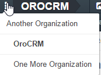

.. _user-guide-getting-started-change-organization:

Select Organization
-------------------

In the Enterprise Edition, there may be any amount of organizations within one OroCRM instance and one user may belong to several organizations, as described in the :ref:`Multiple Organizations Support guide <user-ee-multi-org>`.

If there are several organizations available to a user (in OroCRM Enterprise Edition only), this user can switch between them.

Organization name is displayed in the top left corner of the screen. To switch click the selecto near the organization name.

|multi_org_choice|

.. hint::

    The :ref:`system organization <user-ee-multi-org-system>` (if any) is shifted left related to the other 
    organizations. The organization you are currently logged into is displayed in bold. 

