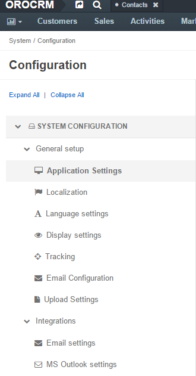
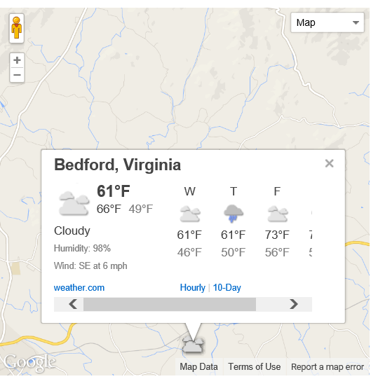
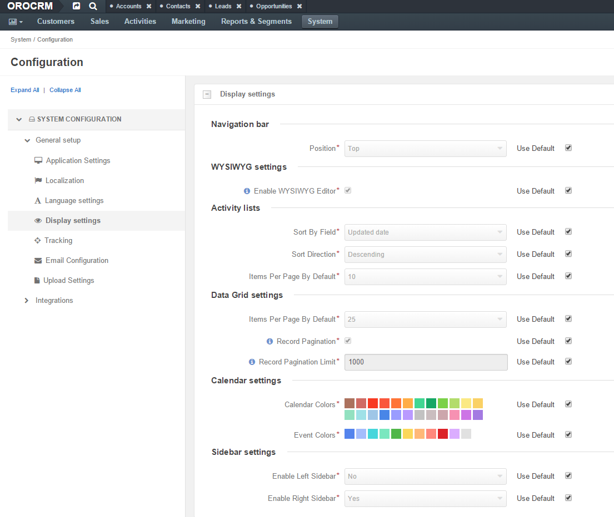
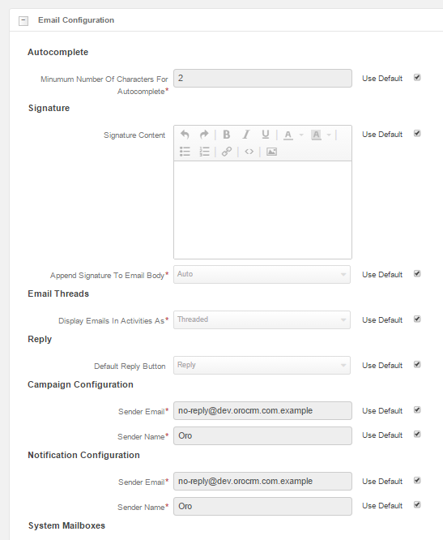
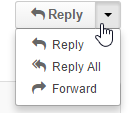
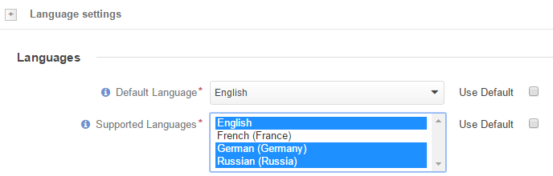

.. _admin-configuration:

Configuration Settings
======================

Use the Configuration settings to define options to be applied to the OroCRM instance.

Open the OroCRM instance and go to *"System → Configuration"*.

      |
  

|

The available options are described and explained in the order they appear in the menu by default.

.. sidebar:: Use Default

    Beside each of the settings there is a *"Use Default"* check-box. If the check-box is active, the default value will 
    be used. Default values for each of the settings are described in corresponding sections below.  
	
.. hint ::

    The :guilabel:`Reset` button will restore the latest saved values.

Application Settings
--------------------

In the *"System → Configuration → General setup → Application Settings"* you can define the URL to be used as a value 
for the {{system.appURL}} in the :ref:`email templates <user-guide-email-template>`. 

      |
  
.. image:: ./img/configuration/application_settings.png

|

The default value is http://localhost/oro/.

Localization
------------

Localization Options
^^^^^^^^^^^^^^^^^^^^

In *"System → Configuration → General setup → Localization → Localization Options"* you can define a number of 
localization options to be applied to the OroCRM instance, as follows:

      |
  
.. image:: ./img/configuration/localization.png

.. csv-table::
  :header: "Option", "Description", "Default"
  :widths: 10, 30, 10

  "**Locale***","Affects formatting of numbers, addresses, names, and dates.","English"
  "**Primary Location*** and **Format Address Per Country***","Define the address formatting to be applied. If *Format 
  Address Per Country* is enabled and the country-specific formatting is enabled for the instance, the address will be 
  displayed in compliance with the rules specified for the country.
  For example, if the chosen country is Ukraine, the address will be displayed as follows:
  
  *ZIP code Ukraine City*
  *Street*
  *First and Last name*
  
  whereas, for the US it will be:
  
  *First and Last name*
  *Street name*
  *CITY NAME, STATE CODE, US, ZIP code*  
  Otherwise, the *Primary Location* formatting will be applied.","US" 
  "**First Quarter Starts On***","Defines the quarter start date.","January 1"
  "**Timezone***","Defines the timezone to be applied for all the time settings defined in the instance. If the 
  time-zone is changed all the time settings (e.g. due dates of :ref:`tasks <user-guide-activities-tasks>`), time of
  reminders, etc. will be changed correspondingly.","UTC +02:00"
  "**Currency***","Defines the default currency used in the system. There is no currency conversion in the system, so the
  setting basically defines the currency label applied to the monetary values defined in the system.","US dollars"
 
 
Map Options
^^^^^^^^^^^
In *"System → Configuration → General setup → Localization → Map Options"* you can define the
**Temperature Unit** and **Wind Speed Unit** used for the map displayed by the address.

The default values are Fahrenheit and miles per hour (MPH).

      |

.. csv-table::
  :header: "Option", "Description", "Default"
  :widths: 10, 30, 10

  "**Locale***","Affects formatting of numbers, addresses, names, and dates.","English"

.. _admin-configuration-language:

Language Settings
-----------------

In *"System → Configuration → General setup → Language settings"* you can define a number of 
language-related options to be applied to the OroCRM instance, as follows:

.. image:: ./img/configuration/language_settings.png

.. csv-table::
  :header: "Option", "Description", "Default"
  :widths: 15, 30, 10

  "**Default Language***","Defines the language used for the instance UI. Choose a language from the drop-down menu:
  
  |UseDef|","English"
  "**Supported Languages***","Defines a set of languages that can be used for translation of the 
  :ref:`email template <user-guide-email-template>`. Use the :guilabel:`Ctrl` and :guilabel:`Shift` keys to choose the 
  languages from the list.

  |Supported|","English"
  "**Available Translations** grid","

  - If the :guilabel:`Download` button is available and the *Translation status* column is empty, the
    translation has not been loaded by you. Click the :guilabel:`Download` button.

  - If the translation has been loaded and has an *Up to date* status, you can enable it (use the :guilabel:`Enable` 
    button).

  - If the translation has been loaded and enabled, you can Disable it (:guilabel:`Disable`).

  - The settings will be applied, once you have clicked the :guilabel:`Save Settings` button in the top right-hand 
    corner of the page. Enabled languages will appear in the *Supported Languages* field and in the *Default Language* 
    drop-down (unless *Use Default* is checked).

  "

Display Settings
----------------

In *"System → Configuration → General setup → Display settings"* you can define a number of display-related options
to be applied to the OroCRM instance, as follows:

      |
  

Navigation bar
^^^^^^^^^^^^^^

In the **Navigation bar → Position*** field, define the *Navigation bar* position. Choose a value from the drop-down
menu.

The default value is "Top".

WYSIWYG settings
^^^^^^^^^^^^^^^^

In the  **WYSIWYG settings → Enable WYSIWYG Editor*** field, define whether text formatting tools must be available for 
:ref:`emails <user-guide-activities-emails>`, :ref:`notes <user-guide-add-note>` and 
:ref:`comments <user-guide-activities-comments>`. 

The value is enabled by default.

.. note::

    The formatting tools can also be enabled for other text fields in the course of integration.

Activity lists
^^^^^^^^^^^^^^

The activity list setting define different options to be applied to display :ref:`activities <user-guide-activities>` 
in the UI.

The following options are available:

.. csv-table::
  :header: "Option", "Description", "Default"
  :widths: 10, 30, 10

  "**Sort By Field*** and **Sort Direction***","Defines the field and direction used to sort activities in the grid by 
  default (every time you open a page with the grid.) You can changed the sorting of the grid each time.","By default 
  the activities updated last will be shown at the top."
  "**Items Per Page By Default***","Defines the number of activities displayed on one page of the grid by 
  default (every time you open the grid.) You can changed the number each time.","10"

  
Data Grid settings
^^^^^^^^^^^^^^^^^^  

Data Grid settings define different options used to display all the 
:ref:`entity records grids <user-guide-ui-components-grids>` in the UI.

The following options are available:
 
.. csv-table::
  :header: "Option", "Description", "Default"
  :widths: 10, 30, 10

  "**Items Per Page By Default***","Defines the number of items displayed on one page of the grid by 
  default (every time you open the grid.) You can change the number each time.","25"
  "**Lock Headers In Grids***","Defines whether grid headers will be locked on a page during scrolling.","Enabled"
  "**Record Pagination***","If enabled, you can navigate to previous or next grid record from a 
  :ref:`View page <user-guide-ui-components-view-pages>`","Enabled"
  "**Record Pagination Limit***","Defines a maximum number of records available for the *Record Pagination*. (If there 
  are more records, the pagination will be disable for the grid to avoid performance deterioration) ","1000"

Calendar settings
^^^^^^^^^^^^^^^^^^  

Calendar settings specify the colors available to manage calendars in the UI:

.. csv-table::
  :header: "Option", "Description", "Default"
  :widths: 10, 30, 10
  
  "**Calendar Colors***","A set of colors available for different users' calendars.

  |CalCol1|","|CalCol1Def|"
  "**Event Colors***","A set of colors available for different events in the user's calendar.

  |CalCol2|","|CalCol2Def|"
  

Sidebar settings
^^^^^^^^^^^^^^^^

With the Sidebar settings you can enable or disable the left and/or right sidebar to keep your Sticky notes and Task lists. 
By default only the right sidebar is enabled.

Reports Settings
^^^^^^^^^^^^^^^^

If this function is enabled, users can see the SQL request sent to the system for a report.

|

.. image:: ./img/roles/sql_show.png

|

This way, users can check if a report has been developed correctly.

.. hint::

    This link will only be available if the :ref:`View SQL query of a report/segment <admin-capabilities-view-sql>` 
    capability has been enabled for the role.

    
.. _admin-configuration-tracking:

Tracking
--------

The Tracking section specifies the settings to be applied for all the 
:ref:`Tracking records <user-guide-marketing-tracking>` created in the system instance.

The following options are available:

.. csv-table::
  :header: "Option", "Description", "Default"
  :widths: 10, 30, 10
  
  "**Enable Dynamic Tracking***","If enabled, tracking data will be processed in the real-time mode. Please note, this 
  may affect the performance.","Enabled"
  "**Log Rotation Interval***","Defines how often log files must be processed if the *Dynamic Tracking* is 
  disabled.","1 hour"
  "**Piwik Host**","The field must be specified if you want the tracking date to be sent to a
  Piwik account. The value corresponds to the Piwik analytics URL of your account.","None"
  "**Piwik Token Auth**","The field must be specified if you want the tracking date to be sent to a
  Piwik account. The value corresponds to the Piwik `token_auth <http://piwik.org/faq/general/faq_114/>`_ field.","None"

.. caution::

    In order to enable the data transfer to a Piwik account, the "identifier" field of the Tracking Website record shall
    be the same as the `Website ID <http://piwik.org/faq/general/faq_19212/>`_ used by Piwik.

At the bottom of the form there is a link to the grid of all the Tracking Website records.

.. _admin-configuration-uploads:

Upload Settings
---------------

In the section you can define a set of mime types that will be supported for image and file entities and will be by 
default supported for attachments in the system. 

.. hint::

    If :ref:`attachments are enabled for an entity <user-guide-entity-management-create-attachments>`, the settings will 
    be applied only if that mime type list is empty.
    

.. _admin-configuration-emails:

Email Configuration
-------------------

In the Email Configuration section you can define options, applied to all the emails generated within the instance.

The following settings are available:

Autocomplete
^^^^^^^^^^^^
Choose how many characters shall be entered manually to enable auto-complete for emails.

Signature
^^^^^^^^^

You can define a signature that will be added to all the email bodies created within the instance. The following fields
are available:

.. csv-table::
  :header: "Option", "Description", "Default"
  :widths: 10, 30, 10
  
  "**Signature Content**","Specify the text and formatting of the signature","Empty"
  "**Append Signature To Email Body**","Defines whether a signature must be added automatically or manually.","Auto"

  
Email Threads
^^^^^^^^^^^^^

The section field **Display Emails In Activities As*** defines if the emails and replies must be displayed separately 
or in a thread.

.. image:: ./img/configuration/email_threaded.png

Reply
^^^^^

Reply button with the *Forward* and *Reply all* options below it is available by default. The settings can be changed to 
have "Reply all" shown at the top. 

.. _admin-configuration-campaign-configuration:

Campaign Configuration
^^^^^^^^^^^^^^^^^^^^^^

These *Sender Email* and *Sender Name* fields are used for Email Campaigns if no other values are defined for them.

.. _admin-configuration-email-notification:

Notification Configuration
^^^^^^^^^^^^^^^^^^^^^^^^^^

The section defines the rules that will be applied by default to a notification generated in the OroCRM. You can define 
the **Sender Email** and **Sender Name** to be used.

.. _admin-configuration-email-campaign:

Campaign Configuration
^^^^^^^^^^^^^^^^^^^^^^

The section defines the rules that will be applied by default to emails generated as a part of marketing campaigns in 
OroCRM. You can define the **Sender Email** and **Sender Name** to be used.

System Mailboxes
^^^^^^^^^^^^^^^^

System mailbox allows people who don't have access to the company mailbox addresses write to the company. 

You can create several system mailboxes. This may be, 
for example, a mailbox for support request, for business proposals, for order requests, etc. You can define and modify 
the list of OroCRM users who have access to each of these mailboxes, automatically turn letters into cases or leads, 
and set-up auto-responses. 
The way to set up a system mailbox is described in the 
:ref:`System Mailboxes guide <admin-configuration-system-mailboxes>`

.. _admin-configuration-integrations:

Integrations
------------

In this section you can define rules applied to pre-implemented integrations.

Google Settings
^^^^^^^^^^^^^^^

The only integration by default available in the community editions is integration with Google. In the *"System →  
Integrations  →  Google Settings"* you can define the details used for google single sing-on,  which enables user with 
the same Google account email address and OroCRM primary email address to log-in only once in the session, as described
in the relevant :ref:`guide <admin-configuration-google-settings>` 

Email Settings
^^^^^^^^^^^^^^
Integration with Microsoft Exchange server is available for the OroCRM 
Enterprise Edition only. The integration allows automatic uploading of emails from mailboxes on the server to OroCRM.
OroCRM will collect any letter on the server such that one of its from/to fields is an email address assigned to any 
contact and the other one is an email address assigned to any user in the OroCRM instance.
The integration set-up is described in the relevant :ref:`guide <admin-configuration-ms-exchange>` 

MS Outlook Settings
^^^^^^^^^^^^^^^^^^^
Integration with Microsoft Outlook is available for the OroCRM Enterprise Edition only. The integration allows automatic 
synchronization of all the contacts, tasks and calendar events available for the user can be synchronized with the specified
Outlook account and vice versa. 
The integration set-up is described in the relevant :ref:`guide <user-guide-synch-outlook>` 

.. |UseDef| image:: ./img/configuration/language_settings_use_def.png
   :align: middle

.. |CalCol1| image:: ./img/configuration/cal_col_1.png
   :align: middle
   :scale: 50%
   
.. |CalCol1Def| image:: ./img/configuration/cal_col_1_def.png
   :align: middle
   

.. |CalCol2| image:: ./img/configuration/cal_col_1.png
   :align: middle
   :scale: 50%
   
.. |CalCol2Def| image:: ./img/configuration/cal_col_1_def.png
   :align: middle