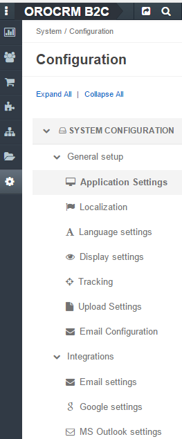

.. _admin-configuration:

Configuration Settings
======================

Once you have your OroCRM installed it is configured by default to use English language, US postal format, Fahrenheit 
degrees as temperature units and US dollars as a currency. Of course, these may be not the most convenient settings 
if your company is located in France. Not everyone may like to have the navigation bar on the top 
and sidebar panel on the right, as it is set by default. The list of allowed mime-types depends on the company 
policies. Piwik tracking details, email settings and Google single sign-on details (if any) are different and have to be 
defined for each company.

These and some other details of a similar nature are the Configuration settings. 

In OroCRM Community Edition you can change the configuration settings for the whole system only, while in the Enterprise
edition some of the settings can be changed for each specific organization available.  

.. sidebar:: Use Default

    Beside each of the settings there is a *"Use Default"* check-box. If the check-box is active, the default value will 
    be used. Default values for each of the settings are described in corresponding sections below.  

.. hint::

    The :guilabel:`Reset` button will restore the latest saved values.

The available options are described and explained in the order they appear in the menu by default.

     |
  

|

    
Application Settings
--------------------

Define the URL of you OroCRM instance. The value will be used to replace the {{system.appURL}} variable in 
:ref:`email templates <user-guide-email-template>`. This way, if the URL is changed it is enough to replace it in the 
settings (email templates won't require any change). 

The setting can only be defined for the whole system.

      |
  
.. image:: ./img/configuration/application_settings.png

|

The default value is http://localhost/oro/.

Localization
------------

To adjust the settings related to the location of your company/office, use the *"Localization"* section of 
*"Configuration"* settings for the whole system or any of its organizations in the following two subsections.

Localization Options
^^^^^^^^^^^^^^^^^^^^

To defined location-specific settings, such as language, currency, go to the *"Localization Options"* subsection.

      |
  
.. image:: ./img/configuration/localization.png

.. csv-table::
  :header: "Option", "Description", "Default"
  :widths: 10, 30, 10

  "**Locale***","Affects formatting of numbers, names, and dates.","English"
  "**Primary Location*** and **Format Address Per Country***","Define the address formatting to be applied. If *Format 
  Address Per Country* is enabled and the country-specific formatting is enabled for the instance, the address will be 
  displayed in compliance with the rules specified for the country.
  For example, if the chosen country is Ukraine, the address will be displayed as follows:
  
  *ZIP code Ukraine City*
  *Street*
  *First and Last name*
  
  whereas, for the US it will be:
  
  *First and Last name*
  *Street name*
  *CITY NAME, STATE CODE, US, ZIP code*  
  Otherwise, the *Primary Location* formatting will be applied.","US" 
  "**First Quarter Starts On***","Defines the quarter start date.","January 1"
  "**Timezone***","Defines the timezone to be applied for all the time settings defined in the instance. If the 
  time-zone is changed all the time settings (e.g. due dates of :ref:`tasks <user-guide-activities-tasks>`), time of
  reminders, etc. will be changed correspondingly.","UTC +02:00"
  "**Currency***","Defines the default currency used in the system. There is no currency conversion in the system, so the
  setting basically defines the currency label applied to the monetary values defined in the system.","US dollars"
 
 
Map Options
^^^^^^^^^^^
To define the **Temperature Unit** and **Wind Speed Unit** used for the map displayed by the address, use the 
*"Map Options"* subsection. 

The default values are Fahrenheit and miles per hour (MPH).

      |

.. image:: ./img/configuration/localization_map.png

.. _admin-configuration-language:

Language Settings
-----------------

By default the system is English. You can download new translations and specify what languages can be used for the 
system UI and mailings in the *"Language settings"* section. A default language can be set up for the whole system and 
for each of its organizations. 

.. image:: ./img/configuration/language_settings.png

.. csv-table::
  :header: "Option", "Description", "Default"
  :widths: 15, 30, 10

  "**Default Language***","Defines the language used for the UI of the whole system and of each of its organizations. 
  Choose a language from the drop-down menu:
  
  |UseDef|
  
  ","English"
  "**Supported Languages***","Defines a set of languages that can be used for translation of the 
  :ref:`email template <user-guide-email-template>`. The settings is applied to the whole system.

  Use the :guilabel:`Ctrl` and :guilabel:`Shift` keys to choose the 
  languages from the list.

  |Supported|","English"
  "**Available Translations** grid","
  
  Defines what languages can be used in the selections above.

  - If the :guilabel:`Download` button is available and the *Translation status* column is empty, the
    translation has not been loaded by you. Click the :guilabel:`Download` button.

  - If the translation has been loaded and has an *Up to date* status, you can enable it (use the :guilabel:`Enable` 
    button).

  - If the translation has been loaded and enabled, you can Disable it (:guilabel:`Disable`).

  - The settings will be applied, once you have clicked the :guilabel:`Save Settings` button in the top right-hand 
    corner of the page. Enabled languages will appear in the *Supported Languages* field and in the *Default Language* 
    drop-down (unless *Use Default* is checked).

  "

Display Settings
----------------

Arrangement of the menu, colours of the calendar, type of the text editor used,  the arrangement of an activity list and 
grid, and other display settings can be defined for the whole system and each organization in the *"Display settings"*
section. 

|
  
.. image:: ./img/configuration/display_settings.png

Navigation bar
^^^^^^^^^^^^^^

Define the *Navigation bar* position in the **Navigation bar → Position*** field. Choose a value from the drop-down
menu.

The default value is "Top".

WYSIWYG settings
^^^^^^^^^^^^^^^^

In the  **WYSIWYG settings → Enable WYSIWYG Editor*** field, define whether text formatting tools must be available for 
:ref:`emails <user-guide-activities-emails>`, :ref:`notes <user-guide-add-note>` and 
:ref:`comments <user-guide-activities-comments>`. 

The value is enabled by default.

.. note::

    The formatting tools can also be enabled for other text fields in the course of integration.

Activity lists
^^^^^^^^^^^^^^

The activity list setting define different options to be applied to display :ref:`activities <user-guide-activities>` 
in the UI.

The following options are available:

.. csv-table::
  :header: "Option", "Description", "Default"
  :widths: 10, 30, 10

  "**Sort By Field*** and **Sort Direction***","Defines the field and direction used to sort activities in the grid by 
  default (every time you open a page with the grid.) You can changed the sorting of the grid each time.","By default 
  the activities updated last will be shown at the top."
  "**Items Per Page By Default***","Defines the number of activities displayed on one page of the grid by 
  default (every time you open the grid.) You can changed the number each time.","10"

  
Data Grid settings
^^^^^^^^^^^^^^^^^^  

Data Grid settings define different options used to display all the 
:ref:`entity records grids <user-guide-ui-components-grids>` in the UI.

The following options are available:
 
.. csv-table::
  :header: "Option", "Description", "Default"
  :widths: 10, 30, 10

  "**Items Per Page By Default***","Defines the number of items displayed on one page of the grid by 
  default (every time you open the grid.) You can change the number each time.","25"
  "**Lock Headers In Grids***","Defines whether grid headers will be locked on a page during scrolling.","Enabled"
  "**Record Pagination***","If enabled, you can navigate to previous or next grid record from a 
  :ref:`View page <user-guide-ui-components-view-pages>`","Enabled"
  "**Record Pagination Limit***","Defines a maximum number of records available for the *Record Pagination*. (If there 
  are more records, the pagination will be disable for the grid to avoid performance deterioration) ","1000"

Calendar settings
^^^^^^^^^^^^^^^^^^  

Calendar settings specify the colors available to manage calendars in the UI:

.. csv-table::
  :header: "Option", "Description", "Default"
  :widths: 10, 30, 10
  
  "**Calendar Colors***","A set of colors available for different users' calendars.

  |CalCol1|","|CalCol1Def|"
  "**Event Colors***","A set of colors available for different events in the user's calendar.

  |CalCol2|","|CalCol2Def|"
  

Sidebar settings
^^^^^^^^^^^^^^^^

With the Sidebar settings you can enable or disable the left and/or right sidebar to keep your Sticky notes and Task lists. 
By default only the right sidebar is enabled.

.. _admin-configuration-tracking:

Tracking
--------

With OroCRM :ref:`Tracking Websites functionality <user-guide-marketing-tracking>` you can learn how many users have 
visited your Web-site by the links within a specific marketing campaign and what these users' actions at the site were.
This can be done with OroCRM's internal tools and using your Piwik account.

Define the related system settings in the *"Tracking"* section. 

.. csv-table::
  :header: "Option", "Description", "Default"
  :widths: 10, 30, 10
  
  "**Enable Dynamic Tracking***","If enabled, tracking data will be processed in the real-time mode. Please note, this 
  may affect the performance.","Enabled"
  "**Log Rotation Interval***","Defines how often log files must be processed if the *Dynamic Tracking* is 
  disabled.","1 hour"
  "**Piwik Host**","The field must be specified if you want the tracking date to be sent to a
  Piwik account. The value corresponds to the Piwik analytics URL of your account.","None"
  "**Piwik Token Auth**","The field must be specified if you want the tracking date to be sent to a
  Piwik account. The value corresponds to the Piwik `token_auth <http://piwik.org/faq/general/faq_114/>`_ field.","None"

.. caution::

    In order to enable the data transfer to a Piwik account, the "identifier" field of the Tracking Website record shall
    be the same as the `Website ID <http://piwik.org/faq/general/faq_19212/>`_ used by Piwik.

At the bottom of the form there is a link to the grid of all the Tracking Website records.

.. _admin-configuration-uploads:

Upload Settings
---------------

In the section you can define a set of mime types that will be supported for image and file entities and will be by 
default supported for attachments in the whole system and each of its organizations. 

.. hint::

    If :ref:`attachments are enabled for an entity <user-guide-entity-management-create-attachments>`, the settings will 
    be applied only if that mime type list is empty.
    

.. _admin-configuration-emails:

Email Configuration
-------------------

Today, emails have become a substantial part of communications, particularly, of communications with customers. 
Therefore, OroCRM provides an extensive and flexible functionality with which you can send emails from OroCRM as well 
as integrate with other existing mailboxes and servers. (An overview of the emails functionality is available in the 
Email Management `<emails-overview>` guide).

A number of email-related settings can be defined system-wide in the *"Email Configuration"* section.
These settings, include such relatively small things as settings of address auto-complete, way to display email threads
and reply/forward buttons, default sender's email and name for campaigns and notifications and adjustable signature, 
with which you can set up the emails in the way most convenient for your users, as well as ability to create 
:ref:`system mailboxes <admin-configuration-system-mailboxes>`. Moreover, signature text can be defined, and system 
mailboxes can be created separately for each of the available organizations. 

Autocomplete
^^^^^^^^^^^^
Choose how many characters shall be entered manually to enable auto-complete for emails.

Signature
^^^^^^^^^

You can define a signature that will be added to all the email bodies created in the system or in each of its 
organizations. The following fields are available:

.. csv-table::
  :header: "Option", "Description", "Default"
  :widths: 10, 30, 10
  
  "**Signature Content**","Specify the text and formatting of the signature","Empty"
  "**Append Signature To Email Body**","Defines whether a signature must be added automatically or manually.","Auto"

  
Email Threads
^^^^^^^^^^^^^

The section field **Display Emails In Activities As*** defines if the emails and replies must be displayed separately 
or in a thread.

.. image:: ./img/configuration/email_threaded.png

Reply
^^^^^

Reply button with the *Forward* and *Reply all* options below it is available by default. The settings can be changed to 
have "Reply all" shown at the top. 

.. _admin-configuration-campaign-configuration:

Campaign Configuration
^^^^^^^^^^^^^^^^^^^^^^

These *Sender Email* and *Sender Name* fields are used for :ref:`Email Campaigns <user-guide-email-campaigns>` if no 
other values are defined for them.

.. _admin-configuration-email-notification:

Notification Configuration
^^^^^^^^^^^^^^^^^^^^^^^^^^

These *Sender Email* and *Sender Name* fields are used for :ref:`Notifications <system-notification-rules>` if no other 
values are defined for them,

System Mailboxes
^^^^^^^^^^^^^^^^

System mailbox allows people who don't have access to the company mailbox addresses write to the company. 

You can create several system mailboxes. This may be, 
for example, a mailbox for support request, for business proposals, for order requests, etc. You can define and modify 
the list of OroCRM users who have access to each of these mailboxes, automatically turn letters into cases or leads, 
and set-up auto-responses. 
The way to set up a system mailbox is described in the 
:ref:`System Mailboxes guide <admin-configuration-system-mailboxes>`

.. _admin-configuration-integrations:

Integrations
------------

In this section you can define rules applied to pre-implemented integrations.

Google Settings
^^^^^^^^^^^^^^^

The only integration by default available in the community editions is integration with Google. In the *"System →  
Integrations  →  Google Settings"* you can define the details used for Google single sing-on,  which enables user with 
the same Google account email address and OroCRM primary email address to log-in only once in the session, as described
in the relevant :ref:`guide <admin-configuration-google-settings>`. The setting is defined system-wide.

Email Settings
^^^^^^^^^^^^^^
Integration with Microsoft Exchange server is available for the OroCRM 
Enterprise Edition only. The integration allows automatic uploading of emails from mailboxes on the server to OroCRM.
OroCRM will collect any letter on the server such that one of its from/to fields is an email address assigned to any 
contact and the other one is an email address assigned to any user in the OroCRM instance.
The integration set-up is described in the relevant :ref:`guide <admin-configuration-ms-exchange>`.

MS Outlook Settings
^^^^^^^^^^^^^^^^^^^
Integration with Microsoft Outlook is available for the OroCRM Enterprise Edition only. The integration allows automatic 
synchronization of all the contacts, tasks and calendar events available for the user can be synchronized with the 
specified Outlook account and vice versa. 
The integration set-up is described in the relevant :ref:`guide <user-guide-synch-outlook>`.

.. |UseDef| image:: ./img/configuration/language_settings_use_def.png
   :align: middle

.. |Supported| image:: ./img/configuration/language_settings_supported.png
   :align: middle

.. |CalCol1| image:: ./img/configuration/cal_col_1.png
   :align: middle
   :scale: 50%
   
.. |CalCol1Def| image:: ./img/configuration/cal_col_1_def.png
   :align: middle
   

.. |CalCol2| image:: ./img/configuration/cal_col_1.png
   :align: middle
   :scale: 50%
   
.. |CalCol2Def| image:: ./img/configuration/cal_col_1_def.png
   :align: middle