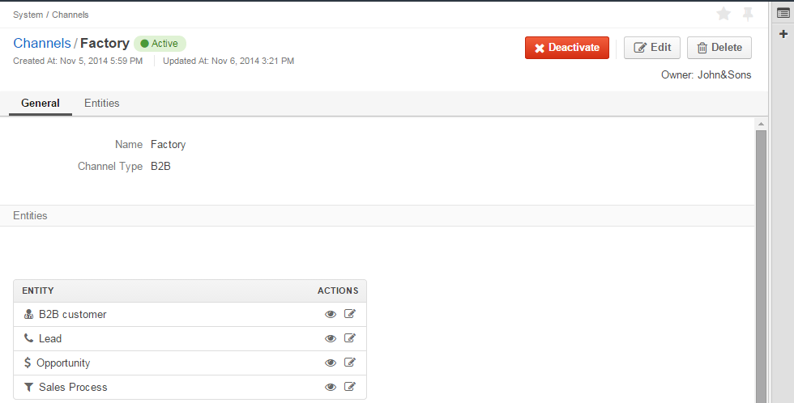

.. _user-guide-system-channel-entities-leads:

Channel Entities. Leads.
========================

.. _user-guide-system-channel-entities-leads:

Overview
--------

*Entity* is a grouping of things with common rules and/or data. Rules and/or setting defined for an Entity are applied 
to all of its instances. 

OroCRM provides a number of pre-implemented entities that may be assigned to a 
:ref:`channel <user-guide-channel-guide`>.

One of such entities is a *Lead*.

Instances of a Lead entity represent people or businesses the have initial interest, authority and 
budget to purchase a product or service from you. Intentions thereof may be yet unclear and often not backed up with 
any arrangements. Once a probability of making a deal with a lead becomes high, the Lead instance becomes an 
:ref:`opportunity <user-guide-system-channel-entities-opportunities`.

As soon as there is at least one Channel assigned a *Lead* entity, Lead records ("leads") may be added and processed in 
the system.

Now you can:

- :ref:`Create <user-guide-system-entities-leads-create>` new and :ref:`edit <user-guide-system-entities-leads-edit>`
  existing Lead records from the UI. 

- Perform different :ref:`actions <user-guide-system-entities-actions-with-leads>

- Analyse details of the Lead instances with :ref:`out of box reports <user-guide-system-entities-reports-with-leads>` 
  or customized reports, created as provided by the *Reports* guide

- Refer to the Lead instances within a pre-implemented B2B-oriented workflow described in the 
  :ref:`Sales Processes Workflow <user-guide-sales-processes-workflow>` guide and customized workflows (see
  :ref:`Workflows <user-guide-workflow-management>`)

- Import and export lead records from/to .csv files (see 
  :ref:`Import and Export Functionality <user_guide_export_import>` guide)
  
  
.. _user-guide-system-entities-leads-create:

Create Leads from the UI
^^^^^^^^^^^^^^^^^^^^^^^^

Click :guilabel:`Create Lead` button to manually input the details of a lead. *Create Lead* form will appear.

.. _user-guide-system-entities-leads-salesleads-tab-mandatory-fields-for-leads:

The following fields are mandatory and **must** be defined.

.. csv-table:: **Mandatory Lead Properties**
  :header: "**Name**","**Description**"
  :widths: 10, 30

  "**Owner***","The field limits the list of Users authorized to manage the lead created to the selected User and Users 
  whose roles allow managing leads owned by the User(e.g. a head of the User's Business Units, System administrator, 
  etc.).
  
  By default, the User creating the Lead is chosen.

  - Click |BCrLOwnerClear| button to clear the field
  
  - Click |Bdropdown| button to choose one of available Users from the list

  - Click |BGotoPage| button to choose from the *Select Owner* page."

  "**Lead Name***","This is the name that will be used to refer to the Lead instance in the System.
  
  It is recommended to define a meaningful name."

  "**Channel***", "Any of active channels assigned the *Lead* entity.
  
  - Click |Bdropdown| button to choose one of available Channels from the list."

   "**First Name and Last Name***","Personal details of the potential customer or contact person. The fields will be 
   optional since 1.4.5"
       
Optional system fields keep additional information and may be left empty.

- If a field refers to a number (e.g. Number of employees) an integer value shall be filled (if any).

- Optional system field **Source** is a drop-down that contains adjustable predefined list of possible lead sources, 
  such as Website, Direct Mail, Partner, etc.

- Optional system fields *Contact* and *B2B Customer* enable binding the lead created to records of corresponding 
  Entities in the System.
  
  - Click |Bdropdown| button to choose one of available Contacts\Customers from the list

  - Click |BGotoPage| button to choose from the *Select Contact*\*Select B2B Customer* page

  - Click |Bplus| button to create a new Contact\new Customer in the System

  - Click |BCrLOwnerClear| button to clear the field
  
All the available custom fields of the Lead entity will be displayed in the *Additional* section (to create a custom 
field go to *System --> Entities --> Entity Management --> Lead* and click :guilable: `Create Field` button).

Click the button the right top corner of the page to save the lead in the system.

*Create Leads. Example.*
""""""""""""""""""""""""

John&Sons Company is providing building materials to different scale construction businesses. Company account managers 
have run  preliminary negotiations with a construction company Build&Live on subcontracting in a bid for public school 
construction. However the bid conditions have not yet been approved.
To record details of the potential opportunity, a Lead instance with the following properties was created:

- Owner: Jack Johnson (the user creating the instance)

- Lead name: Public School Bid 

- Channel: Factory (Channel instance of B2B Type created for the John&Sons Factory sales activities as an example in the
 \:ref: Channel Management Guide <user-guide-channel-guide_example>`\ 

- First Name: James

- Last Name: Custolini

- Contact: James Custolini

- Job Title: Sales Manager

- Phone number: 1626568976

- E-mail: JCust@gmail.com

- B2BCustomer: left empty. This is the first contact with Build&Live, so there still have not been a B2B Customer 
  created for the company. As probability of the deal completion is unclear, there is no essential sense in creating 
  the record.

.. image:: ./img/leads/leads_example.png
   align: right

.. _user-guide-system-entities-leads-edit:

Edit Existing Leads 
^^^^^^^^^^^^^^^^^^^

Once a lead has been saved, it will appear in the *Leads* grid. A number of options is available for each lead. Hover 
the mouse to *...* column to see them:

- Click |IcDelete| to delete the lead from the system. 

.. caution:: 

    Once a channel has been deleted all the relevant data will be deleted as well.

- Click |IcEdit| to edit the channel details. Edit page very similar to the page you used to 
  :ref:`create a channel <user-guide-channel-guide-create>`), but details you have already defined will be 
  displayed

.. caution:: 

    You cannot change the channel type if data from the channel has been uploaded into the system at least once.

- Click |IcView| to get to the page of the channel. For example, out *Factory* channel page looks as follows:

There is a number of actions available from the page.

- Click :guilabel:`Deactivate` button (for Active channels) or :guilabel:`Activate` button (for Inactive channels):

  - You can deactivate an active channel. Once the channel has been deactivated, no new data from the channel will be 
    uploaded to the system.
  
  - You can activate an inactive channel. It will become active and data from the channel will be uploaded to the 
    system.
  
- Click :guilabel:`Edit` button edit the channel
  
- Click :guilabel:`Delete` button to delete the channel 

You can edit the leads from *...* column of the grid or with the buttons on the leads view page.

- Click :guilabel:`Delete` button to delete the lead from the System.

- Click :guilabel:`Edit` button to edit the details.

  - *Create* form with previously defined values will appear. Re-define the values you need to change.

  - Once you have done all the necessary changes, click the button in the top right corner to save them.

Details of the Lead instance will be updated.

.. hint:: 

      You can use *Filters* functionality to simplify the search for a necessary Lead instance. 

Another way to edit Lead instances, especially useful for bulk changes or in case of integration with a
third-party applications, is over .csv export and import. It is described in the 
:ref:Import and Export Functionality <user_guide_export_import>` guide.

.. _user-guide-system-entities-actions-with-leads:

Actions with Leads
------------------

All the actions enabled for the Lead entity can be performed using the lead's details. Action buttons are available 
in the top right corner of the view page. If there are over two different actions, the buttons are collected under the
:guilabel:`Lead Actions` drop-down.

**For example**, Jack&Sons managers have called to James Custolini from the Build&Live. To log the call, it is enough
to choose the :guilabel:`Log Call` action button. The log call form filled with the lead's details will appear:

      
      
.. _user-guide-system-entities-reports-with-leads:

Reports with Leads
^^^^^^^^^^^^^^^^^^^

OroCRM supports a very flexible functionality for creation of drill-down reports for any entities populated into the 
OroCRM.

OroCRM 1.4 comes with two ready-to-use reports related to Lead instances.

*Leads by Date*
"""""""""""""""

This is a simple but useful report with which you can see how many Lead instances were created at a specific date for 
all of your Channels.

To see the report go to *Reports and Segments --> Reports --> Leads --> Leads By Date*

It shows:

- the date Lead instances were created 

- the number of Lead instances for the date, and 

- total amount of Lead instances created

*Lead by Geography*
""""""""""""""""""""

This report is placed in the *Manage custom reports* section and can be edited. 
"As is" the report shows:

- name of the US state (in alphabetic order)

- number of Leads in this State

For more details on the ways to customize the reports, please see the Report Guide (TBD)

Using Leads in the Workflows
^^^^^^^^^^^^^^^^^^^^^^^^^^^^
For each Entity in the OroCRM you can specify one or several workflows that will provide for rules and guidelines on 
possible actions/updates related to all the instances of the Entity. This way you can ensure consistency and proper
succession of each step of the process using the instances.

OroCRM 1.4 comes with a ready-to-use B2B-sharpened workflow *Sales Processes*, part whereof Leads are. 
The workflow defines that each instance of a Lead entity may be:

- Used to start a new Sales Process

- Qualified into an Opportunity

- Disqualified (and Reopened later if applicable).

The full workflow is described in a \:ref:separate 
article <user-guide-sales-processes-workflow>`\

Leads Example
---------------

John&Sons Company is providing building materials to different scale businesses. During an industry fair the company account 
managers ran preliminary negotiations with Home2Go company on subontracting in a bid for public school construction. 
However the bid conditions have not yet been approved.

To record the details of the potential opportunity, there was created a Lead instance with the following propeties:

- Owner: Jack Johnson (the user creating the instance)
- Lead name: Public School Bid 
- Channel: Factory (Channel instance of B2B Type created for the John&Sons Factory sales activities as an example in the
 \:ref: Channel Management Guide <user-guide-channels-example`\ If there is no Channel instance that correspond to the 
 Lead inb the system, a new one can be created.
- First Name
- Last Name
- Contact: James Custolini
- Job Title: sales manager
- Phone number: 1676568976
- E-mail:
- B2BCustomer: Home2Go (B2B customer instance  created for the Home2Go company as an example in the
 \:ref: Channel Management Guide <user-guide-channels-example`\ If there is no B2B Customer nor a Customer Identity
 instance that correspond to the Lead inb the system, a new one can be created.)

.. |BCrLOwnerClear| image:: ./img/buttons/BCrLOwnerClear.png
   :align: middle

.. |Bdropdown| image:: ./img/buttons/Bdropdown.png
   :align: middle

.. |BGotoPage| image:: ./img/buttons/BGotoPage.png
   :align: middle

.. |Bplus| image:: ./img/buttons/Bplus.png
   :align: middle
