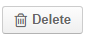
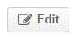

System Entities. Leads
======================

.. |BCrLOwnerClear| image:: ./img/buttons/BCrLOwnerClear.png
   :align: middle

.. |Bdropdown| image:: ./img/buttons/Bdropdown.png
   :align: middle

.. |BGotoPage| image:: ./img/buttons/BGotoPage.png
   :align: middle

.. |Bplus| image:: ./img/buttons/Bplus.png
   :align: middle

.. |LeadCrMF| image:: ./img/system_entities_leads/Screenshots/LeadCrMF.png
   :width: 50 %

What is a Lead Entity
----------------------
*Entity* is a grouping of things with common rules and/or data. Rules and/or setting defined for an Entity are applied 
to all of its instances. Flexible and customizable Oro Platform-based OroCRM solution can be filled with any kind of 
Entities subject to your specific customer needs.

However, we have used our experience in sales and retails business and provided a number of embedded entities, that you
can use right away or after mere customization.
One of such entities is a *Lead*.

Instances of a Lead entity are people or businesses the have initial interest, authority and 
budget to purchase a product or service from you. Intentions of Leads may be yet unclear and often not backed up with 
any arrangements. Once a probability of making a deal with a lead becomes high, the Lead becomes an Opportunity.

What You Can Do with Lead Instances
------------------------------------
Lead is one of `System Channel Entities </user_guide/channel_guide.rst#system-channel-entities>`_ for B2B 
Channels.

As Lead is an embedded Entity, OroCRM provides for some ready-to-use capabilities related to its instances.

Once there is at least one Channel assigned a *Lead* entity (a B2B or custom channel):

- You can manage Lead instances from the devoted 
  `Sales/Leads tab </user_guide/system_entities_leads.rst#manage-leads-from-salesleads-tab>`_ in the OroCRM UI

- You can use details of the Lead instances to perform 
  `Actions </user_guide/system_entities_leads.rst#actions-with-leads>`_, such as an embedded *Send E-mail* 
  and *Add note*

- You can analyse details of the Lead instances with ready-to-use and easy-to-customize 
  `Reports </user_guide/system_entities_leads.rst#reports-with-leads>`_

- You can refer to the Lead instances within a devoted B2B 
  `Sales Processes Workflow </user_guide/sales_processes_workflow.rst#sales-processes-workflow>`_ and customized 
  `Workflows </user_guide/workflow_management.rst#workflow-management>`_

 
Manage Leads from Sales/Leads Tab
^^^^^^^^^^^^^^^^^^^^^^^^^^^^^^^^^^^^^
Once there is at least one Channel assigned a *Lead* entity (B2B or custom channel), *Leads* section will appear in the
*Sales* menu. 

.. hint:: If you cannot see the section, there may be still no Channels with a *Lead* Entity assigned to them in the
          System. Please see the `Channel Guide </user_guide/channel_guide.rst#channel-guide>`_ and add necessary 
          channels.

          If the problem persists, you may not have User-rights to View\Edit the functionality.

          Please address you system administrator.

From here you can:

- `Create </user_guide/system_entities_leads.rst#create-leads>`_ Lead instances
 
- `Import </user_guide/system_entities_leads.rst#import-leads>`_  Lead instances  from a .csv file

- `Export </user_guide/system_entities_leads.rst#export-leads>`_ Lead instances  in a .csv file

- `Edit </user_guide/system_entities_leads.rst#edit-leads>`_ existing Lead instances 

Create Leads
""""""""""""

Click |BCrL| button to manually input the details of the Lead instance.
The form specified for the Channel's Lead instances will appear.

.. hint:: You can also create a Lead from the *System -->Sales Processes* page.
          See `Sales Processes </user_guide/sales_process_workflow.rst#start-a-sales-process-from-lead>`_ for details.

The form contains mandatory system fields, optional system fields and custom fields (if any).

*Mandatory System Fields for Leads*
***********************************

Regardless the Lead entity settings, the following fields are mandatory and **must** be defined.

Detailed description of each field is provided below:

.. list-table:: **Mandatory Lead Fields**
   :widths: 10 30
   :header-rows: 1

   * - Field
     - Description

   * - **Owner***
     - This field limits the list of Users authorized to manage the Lead created. Once a User is chosen only this User
       and Users whose predefined Role provides for management of Lead instances that belong to this User(e.g. a head 
       of the User's Business Units, System administrator) can do so.

       By default, the User creating the Lead is chosen.

            To clear the field click |BCrLOwnerClear| button.

            Click |Bdropdown| button to choose one of available Users from the list.

            Click |BGotoPage| button to choose from the *Select Owner* page.

   * - **Lead Name***
     - This is the name that will be used to save and display the Lead instance in the System.

       It is recommended to define a meaningful name.

   * - **Channel***
     - Any of active Channels in the System that is assigned *Lead* Entity.

            Click |Bdropdown| button to choose one of available Channels from the list.

   * - **First Name***
     - Name of the potential customer or contact person.

       It is recommended to define a meaningful name.

   * - **Last Name***
     - Last name of the potential customer or contact person.

       It is recommended to define a meaningful name.

*Optional System Fields for Leads*
**********************************

Optional System Fields may be left empty. They are added based on Oro's experience as the fields that you may find
handy and convenient to use.

Many of optional system fields are free text fields with transparent names, e.g.*Name Prefix*, *Job Title*,
*Company Name*, *Website*, etc.

If a field refers to a number (e.g. Number of employees) an integer value shall be filled (if any).

Optional system field *Source* is a drop-down that contains adjustable predefined list of possible sources of the Lead 
instances, such as Website, Direct Mail, Partner, etc.

Optional system fields *Contact* and *B2B Customer* enable binding the Lead instance created to the instances of
corresponding Entities in the System.

*Contact* instance represents one contact person and helps keeping all the contact details and process them for further
usage (mailings, notification delivery, feedback requests etc.)

*B2B Customer* instance contains all the details of one customer available in the System (e.g. shipping and banking
details, data on opportunities and purchases from all Channels, etc.).

- Click |Bdropdown| button to choose one of available Contacts\Customers from the list.

- Click |BGotoPage| button to choose from the *Select Contact*\*Select B2B Customer* page.

- Click |Bplus| button to create a new Contact\new Customer in the System.

- To clear the field click |BCrLOwnerClear| button.

.. caution:: If at least one address field (e.g. *Street*) has been field, the rest of the address-related system fields
            (namely *Country*, *City* and *Zip\postal code* **must** be defined)

*Custom Fields for Leads*
************************

All the Custom fields populated into the System and available for the User will be displayed in the *Additional*
section (to create a custom field go to *System --> Entities --> Entity Management --> Create Field*).

Once you have filled all the mandatory and desired fields, click |Bsc| button and you will get to the page of the Lead
instance created. The Lead will also appear in the grid.

Import Leads
"""""""""""""

If you want to upload multiple Lead instances manually or from a third-party enterprise application, it is worth 
considering our *Import* option. OroCRM can process .scv files that correspond to the Data template.

Click |Bdropdown| on the **Import** button in the top right corner of the *Sales\Leads* page. Choose *Download Data
Template*. Prepare a .csv file that corresponds the template and click *Import* button, choose the .csv file for
import, carefully read through the submission form and confirm the import.

.. caution:: `Mandatory fields </user_guide/system_entities_leads.rst#mandatory-system-fields-for-leads>`_ of Lead 
              instances **must** be specified

.. hint:: You can leave "id" field empty, and the system will generate unique ids itself. Be careful, if there are
          already some Lead instances in the system and you upload new ones with ids specified. If the two ids match (
          e.g. one from a third-party application and one already in the system), the system will treat the Lead 
          instance creation, as update of an existing Lead instance.

Once import is over the new Lead instances will appear in the grid.

Export Leads
""""""""""""

A functionality is provided to easily export a .csv file from the Leads grid:

In order to export the .csv file:

- Go to *Sales --> Leads* and click **Export** button. 

- *"Export started. Please wait"* message will appear at the top of the screen.

- As soon as the export has finished the message will change to: *"Export performed successfully, [number] 
  downloads exported. Download result file"*.

  - Click the *"Download result file*" at the end of the message and the download will be performed subject to your 
    browser settings.

Edit Leads
""""""""""
There are several ways to edit Lead instances that are already present in the system:

- Editing leads details from the WEB

- Processing .csv files

*Edit Leads from the Web*
*************************

For individual changes, the most convenient way is to go the Leads page and edit details of a specific Lead instance:

- Go to the Sales --> Leads and click on the row of a required Lead instance in the grid.

.. hint:: You can use *Filters* functionality to simplify the search for the necessary Lead instance. 

- The page of the Lead instance will emerge.

- Click |BDelete| button to delete this Lead instance from the System.

- Click |BEdit| button to edit the details.

  - *Create* form with previously defined values will appear.

  - Re-define the values you need to change.
    This is similar to `creating a Lead </user_guide/system_entities_leads.rst#create-leads>`_

- Once you have done all the necessary changes, click |Bsc| button and you will get back to the Leads grid.

Details of the Lead instance will be updated.

*Edit Leads Using .csv Export/Import*
*************************************

Another way to edit Lead instances, that is especially useful for bulk changes or in case of integration with a
third-party applications is over .csv export and import. To do so, you need to

-`Export </user_guide/system_entities_leads.rst#export-leads>`_ .csv file from the Leads grid

- Edit the file

- `Import </user_guide/system_entities_leads.rst#import-leads>`_ the edited file.

Actions with Leads
^^^^^^^^^^^^^^^^^^^
Subject to your business needs and specific customization, Oro Platform provides tools for creation of other Actions 
using Lead instances, as well as instances of any other Entity populated into the OroCRM. However, there are two
actions embedded in the OroCRM 4.1

*Add Note*
""""""""""
To simplify your work with the Leads, there is an Add Note action.

- Go to the Sales --> Leads and click on the row of a required Lead instance in the grid.

.. hint:: You can use *Filters* functionality to simplify the search for the necessary Lead instance. 

- The page of the Lead instance will emerge. 

- Click |BAddNote| button in the top right corner of the page 

- Fill the emerged free text form.

The text that will appear in the *Additional Information* section for the Lead instance.

*Send Email*
""""""""""""
In order to send an Email pre-filled with the details of specific Lead instance:

- Go to the Sales --> Leads and click on the row of a required Lead instance in the grid.

.. hint:: You can use *Filters* functionality to simplify the search for the necessary Lead instance. 

- The page of the Lead instance will emerge. 

- Click |BSendEm| button in the top right corner of the page

- E-mail template already filled with the details of the Lead instance will appear. 

- You only need to fill the Subject and Body and click *Send*

Reports with Leads
^^^^^^^^^^^^^^^^^^^
OroCRM supports a very flexible functionality for creation of drill-down reports for any entities populated into the 
OroCRM.

OroCRM 4.1 comes with two ready-to-use reports related to Lead instances.
- 

*Leads by Date*
"""""""""""""""
This is a simple but useful report with which you can see how many Lead instances were created at a specific date for 
all of your Channels.

To see the report go to *Reports and Segments --> Reports --> Leads --> Leads By Date*

It shows:
- the date Lead instances were created 
- the number of Lead instances for the date, and 
- total amount of Lead instances created

*Lead by Geography*
""""""""""""""""""""""""""
This report is placed in the *Manage custom reports* section and can be edited. 
"As is" the report shows:
- name of the US state (in alphabetic order)
- number of Leads in this State

For more details on the ways to customize the reports, please see the Report Guide (TBD)

Using Leads in the Workflows
^^^^^^^^^^^^^^^^^^^^^^^^^^^^
For each Entity in the OroCRM you can specify one or several workflows that will provide for rules and guidelines on 
possible actions/updates related to all the instances of the Entity. This way you can ensure consistency and proper
succession of each step of the process using the instances.

OroCRM 4.1 comes with a ready-to-use B2B-sharpened workflow *Sales Processes*, part whereof Leads are. 
The workflow defines that each instance of a Lead entity may be:

- Used to start a new Sales Process
- Qualified into an Opportunity
- Disqualified (and Reopened later if applicable).

The full workflow is described in a `separate article </user_guide/sales_process_workflow.rst>`_

*Leads Example*
---------------
*You have run an "Send SMS and Get a Discount" advertisement campaign, and now you have personal and contact details of 
the campaign participants. Supposedly, all of this people are interested in purchasing from you and may become your 
customers. Currently they are your Leads.*

*You have created a B2B Channel and fill the system with Lead entities, each of which corresponds to one campaign 
participant.*

*Now you can access and process their information, use it for notes and E-mails, view it in the reports and use it for
the Sales Processes workflow.* 