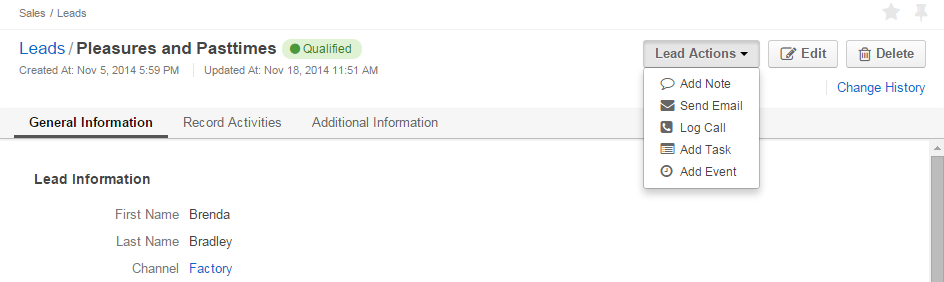

.. _user-guide-system-channel-entities-leads:

Channel Entities. Leads.
========================

Leads Entity defines common rules and setting applied to Lead records ("leads"). 
Lead records represent people or businesses the have initial interest, authority and budget to take part in your 
commercial or social activity. Intentions thereof may be yet unclear and often not backed up with 
any arrangements. 

As soon as there is at least one :ref:`Channel <user-guide-channel-guide>` assigned a *Lead* entity, you can:

- :ref:`Create <user-guide-leads-create>` new leads

- :ref:`Manage <user-guide-leads-actions>` existing leads, particularly, import and export leads and assign different 
  activities to the leads

- Analyse Lead record details with :ref:`reports <user-guide-leads-reports>`

- Use leads in :ref:`workflows <user-guide-leads-workflows>`

.. _user-guide-system-entities-leads-create:

Create Leads from the UI
^^^^^^^^^^^^^^^^^^^^^^^^

- Click :guilabel:`Create Lead` button. 

- *Create Lead* form will appear:

.. image:: ./img/leads/leads_create.png

**Mandatory fields** must be defined:

- **Owner***: limits the list of Users that can manage to its owner and Users, whose roles allow managing leads 
  owned by the owner(e.g. head of the business units, system administrator, etc.).
  
  By default, the User creating the lead is chosen.

  - Click |BCrLOwnerClear| button to clear the field
  
  - Click |Bdropdown| button to choose one of available Users from the list

  - Click |BGotoPage| button to choose from the *Select Owner* page.
  
- **Lead Name***: name used to refer to the lead in the system.

- **Channel***: any of active channels assigned the *Lead* entity. 

  Details of the lead will be uploaded from the source of the Channel.
  
  - Click |Bdropdown| button to choose one of available Channels from the list.
  
- **First Name*** and **Last Name***: personal details of the potential customer or contact person. The fields will be 
  optional since 1.4.5"
       

**Optional fields** keep additional information and may be left empty:

- If a field refers to a number (e.g. Number of employees) an integer value shall be filled (if any).

- **Source** drop-down contains tunable predefined list of possible lead sources, such as Website, Direct Mail, Partner,
  etc.

- **Contact** and *B2B Customer* enable binding the lead created to records of corresponding 
  Entities in the System.
  
  - Click |Bdropdown| button to choose one of available Contacts\Customers from the list

  - Click |BGotoPage| button to choose from the *Select Contact*\*Select B2B Customer* page

  - Click |Bplus| button to create a new Contact\new Customer in the System

  - Click |BCrLOwnerClear| button to clear the field
  
**Custom fields** can be created to meet specific customer needs and will be displayed in the *Additional* section.

To create a custom field go to *System --> Entities --> Entity Management --> Lead* and click :guilable:`Create Field`
button.

**Once all the necessary fields have been defined, click the button the right top corner of the page to save the lead in 
the system.**

.. _user-guide-leads-actions:

Lead Actions 
^^^^^^^^^^^^^

The following actions are available for the leads:

From the :ref:`Grid <user-guide-ui-components-grids>`:

.. image:: ./img/leads/leads_grid.png

- Delete a lead from the system : |IcDelete|
  
- Get to the Edit form  of the lead : |IcEdit|
  
- Get to the View page of the lead : |IcView| 

- Export and import lead record details with :guilabel:`Export` and :guilabel:`Import` buttons as described in the 
  :ref:`*Export and Import Functionality* <user-guide-export-import >` guide. 

From the :ref:`View page <user-guide-ui-components-view-pages>`

  
- Get to the Edit form of the lead

- Delete the lead from the system 

- Add a note to the lead record : the note added will be saved and displayed when the record is approached

- Send Email : Email template pre-filled with lead's details will emerge

- Log Call : the for to log call details will emerge pre-filled with the lead's details

- Add Task : a task related to the lead can be assigned to the user

- Add Event : an event can be added for the lead

      
.. _user-guide-leads-reports:

Reports with Leads
------------------

OroCRM 1.4 comes with two ready-to-use reports related to Lead instances.

*Leads by Date*
^^^^^^^^^^^^^^^

This is a simple but useful report with which you can see how many Lead instances were created at a specific date for 
all of your Channels.

To see the report go to *Reports and Segments --> Reports --> Leads --> Leads By Date*

It shows:

- the date Lead instances were created 

- the number of Lead instances for the date, and 

- total amount of Lead instances created

.. image:: ./img/lead/lead_report_by_date.png

*Lead by Geography*
^^^^^^^^^^^^^^^^^^^

This report is placed in the *Manage custom reports* section and can be edited. 

Out of the box, the report shows:

- name of the US state (in alphabetic order)

- number of Leads in this State

.. image:: ./img/lead/lead_report_by_state.png

This report may be customized, new custom reports can be added. For more details on the ways to customize the reports, 
please see the Reports Guide.

.. _user-guide-leads-workflows:

Using Leads in the Workflows
----------------------------
Workflows defines rules and guidelines on possible actions/updates related to the entity records. 

OroCRM 1.4 comes with a pre-implemented B2B-oriented workflow described in the 
:ref:`Sales Processes Workflow <user-guide-sales-processes-workflow>` guide. 

New customer-specific workflows can also be created, as described in the :ref:`Workflows 
guide <user-guide-workflow-management>`

.. |BCrLOwnerClear| image:: ./img/buttons/BCrLOwnerClear.png
   :align: middle

.. |Bdropdown| image:: ./img/buttons/Bdropdown.png
   :align: middle

.. |BGotoPage| image:: ./img/buttons/BGotoPage.png
   :align: middle

.. |Bplus| image:: ./img/buttons/Bplus.png
   :align: middle
