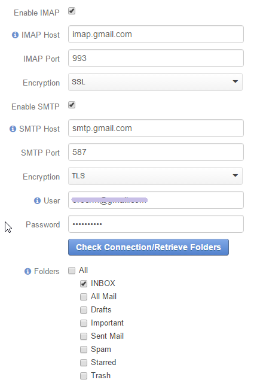

.. _admin-configuration-system-mailboxes:

System Mailboxes
================

System mailbox allows people who don't have access to the company mailbox addresses write to the company. 
You can create several system mailboxes. This may be, for example, a mailbox for support requests, for business 
proposals, for order requests, for reclamations etc.

When someone sends a letter to this mailbox, all your subscribed employees will receive it. In addition, a new lead  or 
case may be created in OroCRM based on this letter. All the available details will then be saved for it and it can be 
processed in the system, following your company's workflow. 

If SMTP is set-up, responses of any user will be sent to the system mailbox 
and can then be received by the rest of the users. This way, all the participants will get  requests (letters) sent to 
the system mailbox and will be able to take part in the issue resolution/opportunity development and see all the related 
correspondence. 

Important and useful feature of the system mailboxes is that the system can be set up to automatically turn 
letters into :ref:`cases <user-guide-activities-cases>` or :ref:`leads <user-guide-system-channel-entities-leads>`, 
which can then be processed in OroCRM. 

Another great capability is ability to set-up auto-responses to the letters that meet certain criteria (or to all the 
letters) in the system mailbox.

Any number of system mailboxes can be set-up for one system and for each of its organizations.

Create System Mailbox
---------------------

.. image:: ./img/system_mailbox/new_mb.png

- Go to *System → SYSTEM CONFIGURATION → General Setup → Email Configuration*
- Click the :guilabel:`Add Mailbox` button in the System Mailboxes sections
- Define the mailbox settings, as described in the sections below

General
^^^^^^^

The "General" section defines the basic settings of the mailbox. The following fields must be defined:

.. csv-table::
  :header: "**Name**","**Description**"
  :widths: 10, 30

  "**Mailbox Label**","Name of the mailbox used in OroCRM to refer to it."
  "**Email**","E-mail address used to write to the mailbox."

  
Synchronization
^^^^^^^^^^^^^^^

- Let OroCRM know the details of IMAP (incoming mail) and/or SMTP (outgoing mail) connection for the mailbox, 
  such as host, port, and encryption, and specify the login (user) and password used to access the mailbox.
  
- Click the :guilabel:`Check Connection/Retrieve Folders` 

- After a successful connection, the list of available folders will be loaded. Check the Folders to be synchronized.

In the example below, synchronization has been done for a .gmail mailbox. The INBOX folder will be synchronized.

.. hint::

    Detailed instructions on how to set-up IMAP and SMTP connection in gmail, are provided 
    `here <https://support.google.com/mail/troubleshooter/1668960?hl=en&rd=1#ts=1665018%2C1665144>`_.

    To enable a connection, check the box next to
    `Allow access for less secure apps box <https://support.google.com/accounts/answer/6010255?hl=en>`_.

	
Email Processing
^^^^^^^^^^^^^^^^

You can choose what actions will be performed with all the emails the mailbox receives.

Available options are:

.. csv-table::
  :header: "",""
  :widths: 10, 30

  "**Do Nothing**","No actions will be performed. Letters will be saved in the mailbox."
  "**Convert To Lead**","Letters will be saved in the mailbox. Based on the first letter in the thread, a new Lead 
  record will be created in OroCRM."
  "**Convert To Case**","Letters will be saved in the mailbox. Based on the first letter in the thread, a new Case 
  record will be created in OroCRM."

  
Email Management
^^^^^^^^^^^^^^^^

Define what OroCRM users will have access to the mailbox. You can select roles and\or specific users. All the users with 
defined :ref:`roles <user-guide-user-management-permissions>` and all the specifically defined users will have access to 
the mailbox.

.. _admin-configuration-system-mailboxes-autoresponse:

Auto-response Rules
^^^^^^^^^^^^^^^^^^^

You can generate one or several auto-response rules in order to determine which response emails will be generated and 
sent back in response to any letter that meets some adjustable criteria.

To create a rule, click the :guilabel:`Add Rule`

"Add Autoresponse Rule" form will appear.

.. image:: ./img/system_mailbox/ar_rule.png 

Define the following settings for the rule:

.. csv-table::
  :header: "",""
  :widths: 10, 30

  "**Status**","Only rules with the *Active* status will be applied."
  "**Name**","Choose the name to be used to refer to the rule in the system."
  "**Conditions**","Define the condition upon which the rule will be applied. 
  
  - In the first selector, choose the field, for which the condition is checked.
  - In the second selector, choose the condition.
  - In the field  besides the selectors, define the values where required (e.g. for conditions contain/doesn't contain/
    is any of, etc.)
  
  Click the :guilabel:`+` or :guilabel:`+Add` button to add another condition for the rule.  Click the :guilabel:`x` 
  button to remove the condition All the conditions are summed up (AND operator).
  
  .. hint::
  
    If you need some ORed conditions, just create a new Rule for each of them.

  "
  "Response Template","Choose an :ref:`Email template <user-guide-email-template>` for autoresponse. All the templates 
  with *Entity Name* value *Email* will be available in the selector. Choose the *Custom* if you want to create a new 
  template."
  "Type","Choose if you want to use html or plain text for the email."
  "Email template","Fill in the email subject and content."
  "Save Response as Email Template","Enable the check-box, and your email will be saved as an email template with entity
  name *Email*."
  
Click Add button and the rule will be saved.

All the rules of a mailbox can be viewed and processed from the "Autoresponse Rules" 
:ref:`grid <user-guide-ui-components-grids>` in the corresponding section of the System Mailbox record page.

.. image:: ./img/system_mailbox/ar_rule.png   

  
Final Steps
^^^^^^^^^^^ 

Save the created mailbox with the button in the top right corner of the page.

All the system mailboxes can be viewed and processed from the "System Mailboxes" 
:ref:`grid <user-guide-ui-components-grids>` in the corresponding section of the Email Configuration page.

Conclusion
----------

Now the mailbox is set up and you can be sure that all the users you have assigned to it will get the required 
information in timely manner. Additionally, automatic responses will be sent to make sure that everyone who sends an 
email will receive an answer, and necessary leads or cases will be created in the system.

  