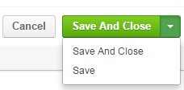
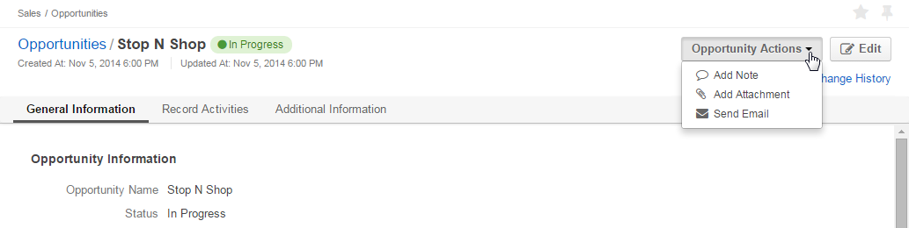

OroCRM UI Elements
==================

OroCRM is featured by a user-friendly and consistent GUI. This article describes the system 
:ref:`menu items <user-guide-ui-components-menu-items>`, :ref:`grids <user-guide-ui-components-grids>`,
:ref:`create <user-guide-ui-components-create-pages>` and :ref:`edit <user-guide-ui-components-edit-forms>` forms, 
and :ref:`view <user-guide-ui-components-view-pages>` pages.

.. _user-guide-ui-components-menu-items:

Menu Items
----------

.. csv-table:: **The top menu of the current OroCRM is divided into seven basic sections:**
  :header: "**Name**","**Description**"
  :widths: 10, 30

  "**Dashboard**","Contains pre-implemented widgets such as Quick Launchpad panel, lists of recent 
  Emails and calls, recently accessed accounts and contacts, calendar and basic report charts."
  "**Customers**","Contains links to accounts, contacts and customer records."
  "**Sales**","Contains links to the entities assigned to channels."  
  "**Activities**","Contains links to call logs, Emails, contact request details and other activities."
  "**Marketing**","Contains links to marketing-related entities."
  "**Reports&Segments**","Contains links to reports and their settings."
  "**System**","Contains links to the system settings."

.. note::
  
    Please note that availability of each menu section and its subsections depends on the permission settings defined 
    for the relevant functionality and a specific user.

    
.. _user-guide-ui-components-grids:
    
Grids
-----

Once you have clicked a link in the menu, a correspondent grid will appear. The grid contains all the records of the 
chosen entity. 
For example, if you go to *"Customers"* and click *"Contacts"*, you will see the grid of all the Contact records 
available:

.. image:: ./img/ui_components/grid.png

- Rows of the grid represent records of the entity chosen.

- Columns of the grid are values of the record fields.

.. note::

    The list of fields displayed in the grid depends on the *"Show on Grid"* settings defined fields of the entity. 
    
    Please see the *Entity Management* guide for more details. 
    
    
*Grid Actions*
--------------

.. _user-guide-ui-components-grid-action-buttons:

Action Buttons
^^^^^^^^^^^^^^

Action buttons can trigger actions related to the grid only or to the entity in general.

.. image:: ./img/ui_components/grid_action_buttons.png

- Action buttons related to the grid are displayed right above the grid. 

  In the example (1), you can scroll pages, refresh the grid details and reset the grid (clear all the filters), 
  as well as export the details shown in the grid as a .csv file.
  
- Action buttons that trigger actions related to the entity in general are displayed in the top right corner of the grid 
  page.

  In the example (2), you can export and import account records, as well as create a new account.

An arrow on the button means that some sub-actions are available. For example, you can start the import and download the
data template from the :guilabel:`Import` button:

.. image:: ./img/ui_components/grid_action_subbuttons.png

*Export Grid*
^^^^^^^^^^^^^

All the data displayed in a grid can be exported as a .csv table. Click :guilabel:`Export Grid` button and choose "CSV".

.. image:: ./img/ui_components/export_grid.png

The file will be saved subject to your browser settings.

.. _user-guide-ui-components-grid-action-icons:

Action Icons
^^^^^^^^^^^^

Last column of any grid in the system contains icons of actions available for the grid item. For example, any contact 
record can be viewed, removed or deleted:

.. image:: ./img/ui_components/action_icons.png

.. note::

    Please note that different action icons may be shown for different items of the same grid, subject to the system 
    settings. Specific items of every grid are described in the correspondent guides.

.. _user-guide-ui-components-grid-bulk-action:

Bulk Actions
^^^^^^^^^^^^

|IcBulk| icon in the top right corner of the grid aggregates bulk actions available for the entity records. 

Check the entity records, click the arrow and choose the action to perform.

In the example, the first three contacts will be deleted from the grid:

.. image:: ./img/ui_components/grid_bulk_actions.png

.. _user-guide-ui-components-filters:

*Filters*    
---------

You can apply filters to run bulk actions or to simplify the search. 

Click the arrow on a filter to choose required values. Available value setting depend on the field type. If more than 
one filter is active, only the records that meet requirements of all the filters are displayed.
  
In the example, only the contacts created after the third of November, with "gmail.com" Emails and phones that 
start with 123 are displayed:

.. image:: ./img/ui_components/filters.png

.. note::

    Please note that the list of fields available for filters depends on the  *"Show Grid Filter"* settings defined for 
    fields of the the entity. 
    
    Please see the *Entity Management* guide for more details.

.. _user-guide-ui-components-create-pages:
    
"Create" Form
--------------

If new entity records can be added to the system, :guilabel:`Create {Entity Name}` is shown in the top right 
corner of the grid.

Click the button to get to the *"Create ..."* form.

- All the editable fields of the entity will be displayed in the grid. 

.. note::

    Please note that the list of fields available from the form depends on the *"Show on Form"* settings defined for 
    fields of the entity. 
    
    Please see the *"Entity Management"* guide for more details.

- Mandatory fields are identified with a red asterisk.

- If there are several sections, they are displayed one after another and allocated into different tabs.

For example, this is a *"Create Email Campaign"* form:

.. image:: ./img/ui_components/create_page.png

You can click on a name of the section you need (e.g. *"Email Settings"*), and only this section will be 
displayed:

.. image:: ./img/ui_components/create_page_tab.png

*"Create" Form Action Buttons*
------------------------------

In the top right corner of every *"Create"* form, you can always see two Action Buttons:  :guilabel:`Cancel` and  
:guilabel:`Save` or  :guilabel:`Save and Close`.

- Click :guilabel:`Cancel`, if you don't want to save the changes in the system. 

- Click :guilabel:`Save` to Save the changes applied and stay on the *"Create"* form

- Click :guilabel:`Save and Close` to get to the *"View"* page of the entity record

.. _user-guide-ui-components-view-pages:

"View" Pages
------------

A *"View"* page contains details of a specific entity record.

To get to the page:

- Use :guilabel:`Save and Close` button after you have created/edited a record

- Click |IcView| icon in the grid

- Click anywhere on the row of a record in the grid 

For example, this is a View page of a channel:

.. image:: ./img/ui_components/view_page.png

If there are several sections, they will be displayed one after another and allocated separately in different tabs.

*"View"* pages may contain a lot of sections, subsections and even grids. 
For example, the *"View"* page of an account record contains its general details, information about related activities 
(emails, calls, tasks, etc.) and additional details for all the customers assigned to the account in different channels.

.. image:: ./img/ui_components/view_page_tabs.png

.. note::

    The list of fields displayed in the *"Create"* form depends on the *"Show on View"* settings defined for the fields
    of the entity.    
    
    Please see the *Entity Management* guide for more details. 

.. _user-guide-ui-components-view-page-actions:

*"View" Page Action Buttons*
----------------------------

Action Buttons  trigger actions for a specific entity record. They are displayed in the top right corner of the 
View page.

If there are four or less actions available for the entity records, a separate button is created for each of them.

In the example, you can send Email, log call and synchronize data of the order from its *"View"* page:

.. image:: ./img/ui_components/view_action_buttons_1.png

If there are more than four actions available for record, they will be collected under the 
*"{Entity Name} Actions*" drop-down, as in the example:

The following actions can be enabled in the current OroCRm version:

- Add a note to the lead record: the note added will be saved and displayed when the record is approached

- Send Email: Email template pre-filled with lead's details will appear

- Log Call: the call log form pre-filled with the lead's details will emerge

- Add Task: a task related to the lead can be assigned to the user

- Add Event: an event can be added for the lead

.. _user-guide-ui-components-edit-forms:
    
*"Edit"* Form
-------------

Edit form is used to edit the entity records. The only difference between the *"Edit"* and 
*"Create"* forms is that previously defined field values are already filled in. 

.. note::

    Please note that some of the values cannot be re-defined, subject to the system requirements. 

.. |IcDelete| image:: ./img/buttons/IcDelete.png
   :align: middle

.. |IcEdit| image:: ./img/buttons/IcEdit.png
   :align: middle

.. |IcView| image:: ./img/buttons/IcView.png
   :align: middle
   
.. |IcBulk| image:: ./img/buttons/IcBulk.png
   :align: middle
