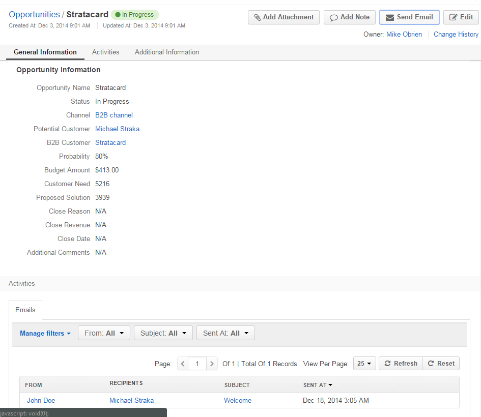
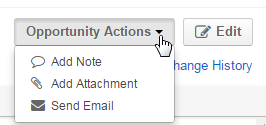

OroCRM UI Elements
==================

OroCRM is featured by a user-friendly and consistent GUI. This article describes basic UI elements and controls used 
throughout the system.

.. _user-guide-ui-components-menu-items:

Menu Items
----------

OroCRM has a multi-level menu. 
The first level defines a set of menu items included (e.g. Marketing, Sales, System etc.). 
The next level may contain some sub-menus or is clickable and will refer you to the relevant page in the system.
(For example, if you go to System → Configuration, the Configuration page will emerge.)

.. note::
  
    Please note that availability of each menu section and its subsections depends on the permission settings defined 
    for the relevant functionality and a specific user.

    
.. _user-guide-ui-components-grids:
    
Entity Records Grids
--------------------

Initially, a grid contains all the records of the chosen entity. 
For example, if you go to *"Customers"* and click *"Contacts"*, you will see the grid of all the Contact records 
available:

.. image:: ./img/ui_components/grid.png

- Rows of the grid represent records of the entity chosen.

- Columns of the grid are values of the record fields.

.. note::

    The list of fields displayed in the grid depends on the *"Show on Grid"* settings defined fields of the entity. 
    
    Please see the *Entity Management* guide for more details. 
    

.. _user-guide-ui-components-grid-filters:
    
Grid Filters
^^^^^^^^^^^^

You can apply filters to choose specific items to be shown in the grid. 

Click the arrow on a filter to choose required values. Available value setting depend on the field type. If more than 
one filter is active, only the records that meet requirements of all the filters are displayed.
  
In the example, only the contacts created after the third of November, with "gmail.com" Emails and phones that 
start with 123 are displayed:

.. image:: ./img/ui_components/filters.png

.. note::

    Please note that the list of fields available for filters depends on the  *"Show Grid Filter"* settings defined for 
    fields of the the entity. 
    
    Please see the *Entity Management* guide for more details.
    
    
    
.. _user-guide-ui-components-grid-action-buttons:

Grid Controls
^^^^^^^^^^^^^^

Grid controls are displayed right above the grid.

.. image:: ./img/ui_components/grid_action_buttons.png

In the example, you can scroll pages, refresh the grid details and reset the grid (clear all the filters), 
as well as export the details shown in the grid as a .csv file.

*Export Grid*
"""""""""""""

All the data displayed in a grid can be exported as a .csv table. Click :guilabel:`Export Grid` button and choose "CSV".

.. image:: ./img/ui_components/export_grid.png

The file will be saved subject to your browser settings.

.. _user-guide-ui-components-grid-action-icons:

Grid Action Icons
^^^^^^^^^^^^^^^^^

Last column of any grid in the system contains icons of actions available for the grid item. For example, any contact 
record can be viewed, removed or deleted:

.. note::

    Please note that different action icons may be shown for different items of the same grid, subject to the system 
    settings. Specific items of every grid are described in the correspondent guides.

.. _user-guide-ui-components-grid-bulk-action:

Grid Bulk Actions
^^^^^^^^^^^^^^^^^

|IcBulk| icon in the top right corner of the grid aggregates bulk actions available for the entity records. 

Check the entity records, click the arrow and choose the action to perform.

In the example, the first three contacts will be deleted from the grid:

.. image:: ./img/ui_components/grid_bulk_actions.png

.. _user-guide-ui-components-create-pages:
    
Entity Record "Create/Edit" Forms
---------------------------------

Click the  :guilabel:`Create {Entity Name}` button in the top right 
corner of the grid to get to the *"Create ..."* form.

- All the editable fields of the entity will be displayed in the grid. 

.. note::

    Please note that the list of fields available from the form depends on the *"Show on Form"* settings defined for 
    fields of the entity. 
    
    Please see the *"Entity Management"* guide for more details.

- Mandatory fields are identified with a red asterisk.

- If there are several sections, they are displayed one after another and allocated into different tabs.

For example, this is a *"Create Email Campaign"* form:

.. image:: ./img/ui_components/create_page.png

You can click on a name of the section you need (e.g. *"Email Settings"*), and only this section will be 
displayed:

Edit form is used to edit the entity records. The only difference between the *"Edit"* and 
*"Create"* forms is that previously defined field values are already filled in. 

.. note::

    Please note that some of the values cannot be re-defined, subject to the system requirements. 

Form Action Buttons
^^^^^^^^^^^^^^^^^^^

In the top right corner of every *"Create"* form, you can always see two Action Buttons:  :guilabel:`Cancel` and  
:guilabel:`Save` or  :guilabel:`Save and Close`.

- Click :guilabel:`Cancel`, if you don't want to save the changes in the system. 

- Click :guilabel:`Save` to Save the changes applied and stay on the *"Create"* form

- Click :guilabel:`Save and Close` to get to the *"View"* page of the entity record

.. _user-guide-ui-components-view-pages:

Entity Record "View" Pages
--------------------------

A *"View"* page contains details of a specific entity record.

To get to the page:

- Use :guilabel:`Save and Close` button after you have created/edited a record

- Click |IcView| icon in the grid

- Click anywhere on the row of a record in the grid 

For example, this is a View page of a channel:

If there are several sections, they will be displayed one after another and allocated separately in different tabs.

*"View"* pages may contain a lot of sections, subsections and even grids. 
For example, the *"View"* page of an account record contains its general details, information about related activities 
(emails, calls, tasks, etc.) and additional details for all the customers assigned to the account in different channels.

.. image:: ./img/ui_components/view_page_tabs.png

.. _user-guide-ui-components-view-page-actions:

"View" Page Action Buttons
^^^^^^^^^^^^^^^^^^^^^^^^^^

Action Buttons  trigger actions for a specific entity record. They are displayed in the top right corner of the 
View page.

If there are four or less actions available for the entity records, a separate button is created for each of them.

In the example, you can send Email, log call and synchronize data of the order from its *"View"* page:

.. image:: ./img/ui_components/view_action_buttons_1.png

If there are more than four actions available for record, they will be collected under the 
*"{Entity Name} Actions*" drop-down, as in the example:

The following actions can be enabled in the current OroCRm version:

- Add a note to the lead record: the note added will be saved and displayed when the record is approached

- Send Email: Email template pre-filled with lead's details will appear

- Log Call: the call log form pre-filled with the lead's details will emerge

- Add Task: a task related to the lead can be assigned to the user

- Add Event: an event can be added for the lead

.. |IcDelete| image:: ./img/buttons/IcDelete.png
   :align: middle

.. |IcEdit| image:: ./img/buttons/IcEdit.png
   :align: middle

.. |IcView| image:: ./img/buttons/IcView.png
   :align: middle
   
.. |IcBulk| image:: ./img/buttons/IcBulk.png
   :align: middle
