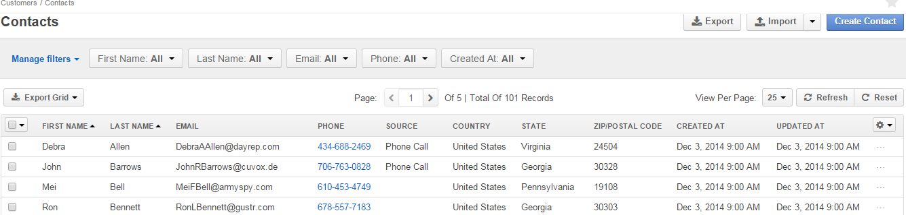

OroCRM UI Elements
==================

The following OroCRM UI components are described in the article:

- Menu items

- Grids

- Create forms
  
- View pages
  
- Edit forms

- Filters

- Action icons and buttons

.. _user-guide-ui-components-menu-items:

Menu Items
----------

.. csv-table:: **Menu of the current OroCRM version 1.4 menu is divided into seven basic menu sections:**
  :header: "**Name**","**Description**"
  :widths: 10, 30

  "**Dashboard**","Contains pre-implemented widgets such as Quick Launchpad panel, lists of recent 
  Emails and calls, recently accessed accounts and contacts, calendar and basic report charts."
  "**Customers**","Contains links to the accounts, contacts and customer identity records created in the system."
  "**Sales**","Contains links to the entities assigned to channels created in the system."  
  "**Activities**","Contains links to the calls, Emails, Contact request and other activities on different entities 
  defined in the system."
  "**Marketing**","Contains links to the Marketing Lists and Campaign related functionalities."
  "**Reports&Segments**","Contains links to the reports and their settings."
  "**System**","Contains links to the System settings."

.. note::
  
    Availability of each menu section and its subsections depends on the permission settings defined for the 
    user and functionality.

    
.. _user-guide-ui-components-grids:
    
Grids
-----

Once you have clicked on a  link in the menu, the grid will appear. The grid contains all the entity records present 
in the system. 
For example, if you go to *"Customers"* and click *"Contacts"*, you will see the grid of all the contacts available.

Rows of the grid represent records of the entity chosen.
Columns if the grid are value of the entity fields.

.. note::

    What fields will be displayed in the grid depends on the entity fields *"Show on Grid"* settings. Please see the 
    *Entity Management* guide for more details. 
    
    
*Grid Actions*
--------------

.. _user-guide-ui-components-grid-action-buttons:

Action Buttons
^^^^^^^^^^^^^^

Action buttons can trigger actions related to the entity in general, or specifically to the grid.

Action buttons related to the grid only are displayed right above the grid. For example, you can scroll pages, refresh 
the grid details and reset the grid (clear all the filters). You can also export the details shown in the grid as a .csv
file.

.. image:: ./img/ui_components/grid_action_buttons.png

Action buttons that trigger actions related to the entity in general are displayed at the top right corner of the grid 
page.

For example, you can export and import account records, as well as to create a new account.

.. image:: ./img/ui_components/entity_action_buttons.png

If there is an arrow on the button, some sub-actions are available. For example, from the Import button you can start
the import and download the data template.

.. _user-guide-ui-components-grid-action-icons:

Action Icons
^^^^^^^^^^^^

Last column of any grid in the system, contains icons of actions available for the grid item. For example, any contact 
record can be view, removed or deleted.

.. image:: ./img/ui_components/action_icons.png

.. note::

    Different action icons may be shown for items of the same grid, subject to the system settings. Specific items of 
    every grid are described in correspondent guides.

.. _user-guide-ui-components-grid-bulk-action:

Bulk Actions
^^^^^^^^^^^^

|IcBulk| icon in the top right corner of the grid contains the list of bulk actions available for the entity records. 

Check the entity records, click the arrow and choose the action to perform.

For example, if you want to delete the first three contacts from the grid:

.. image:: ./img/ui_components/grid_bulk_actions.png

.. _user-guide-ui-components-filters:

*Filters*    
---------

You can apply filters to the grid for the bulk actions or to simplify the search.

.. note::

    What fields will be available for filters depends on the entity fields *"Show Grid Filter"* settings. Please see the 
    *Entity Management* guide for more details. 

    
Click the arrow of the filter to choose required values. The value setting depend on the field type. If more than one
filter is active, only the records that meet requirements of all the filters will be shown.

For example, we have chosen only the contact with "gmail.com" emails and phones that start with 123. All the chosen 
contacts were created after the third of November.

.. image:: ./img/ui_components/filters.png

.. _user-guide-ui-components-create-pages:
    
"Create" Form
--------------

If new entity records can be added to the system, guilabel:`Create {Entity Name}` will be present in the top right 
corner of the grid.
Click the button to get to the *"Create ..."* page.

All the fields of the entity will be displayed in the grid. 

Mandatory fields will be identified with a red asterisk.

If there are several sections, they will be displayed one after another and allocated separately in different tabs.

For example, this is a Create Email Campaign page:

You can click the *"Email Settings"* tab, and only this section will be displayed:

.. image:: ./img/ui_components/create_page_tab.png

.. note::

    What fields will be displayed in the "Create" form depends on the entity fields *"Show on Form"* settings. 
    Please see the *Entity Management* guide for more details. 
    

*"Create" Page Action Buttons*
------------------------------

In the top page of every "Create" page you can see two Action Buttons:  :guilabel:`Cancel` and  :guilabel:`Save` or 
:guilabel:`Save and Close`.

- Click :guilabel:`Cancel`, if you don't want to save the changes in the system. 

- Click :guilabel:`Save` to Save the changes applied and stay at the *Create* page

- Click :guilabel:`Save and Close` to get to the *"View"* page of the entity record.

.. _user-guide-ui-components-view_pages:

"View" Pages
------------

View pages contain details of a specific entity record.

To get to the View page:

- Click on the row of an record 

- Click |IcView| icon in the grid

- Use :guilabel:`Save and Close` button after you have created/edited a record

For example, this is a View page of a Channel:

.. image:: ./img/ui_components/view_page.png

If there are several sections, they will be displayed one after another and allocated separately in different tabs.

"View" pages may contain a lot of sections, subsections and even grids. 
For example, a view of an account record contains its general details, data on the record activities (emails, calls, 
tasks, etc.), additional details and each of the channels such that its customer identities are assigned to the account.

.. image:: ./img/ui_components/view_page_tabs.png

.. note::

    What fields will be displayed in the "Create" form depends on the entity fields *"Show on View"* settings. 
    Please see the *Entity Management* guide for more details. 

*"View" Page Action Buttons*
----------------------------

Action Buttons that trigger actions for a specific entity record. They are displayed in the top right corner of the 
View page.
If any *Activities* have been enable for the entity, you will see them among the buttons.

For example, Email and Note have been enable for the Sales Process entity and available from the View page:

.. image:: ./img/ui_components/view_action_buttons_1.png

If there are over than two Activities defined for the entity, they will be collected under the *"{Entity Name} Actions*"
drop-down, as in the example:

.. image:: ./img/ui_components/view_action_buttons_1.png
    
Edit Form
----------

Edit form is used to edit the entity records created in the system. The only difference between the *"Edit"* form and 
the *"Create"* form is that previously defined field values are already filled in. (Subject to the system needs, some of
them cannot be changed). 

.. |IcDelete| image:: ./img/buttons/IcDelete.png
   :align: middle

.. |IcEdit| image:: ./img/buttons/IcEdit.png
   :align: middle

.. |IcView| image:: ./img/buttons/IcView.png
   :align: middle
   
.. |IcBulk| image:: ./img/buttons/IcBulk.png
   :align: middle
