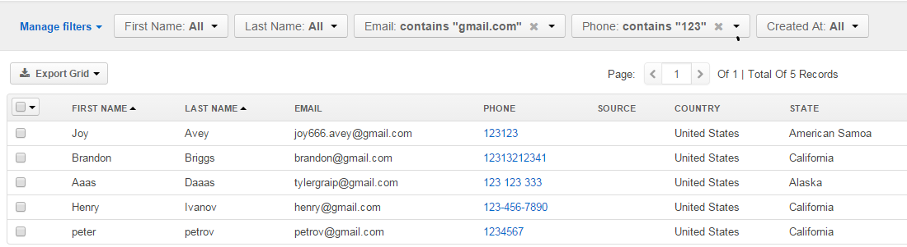
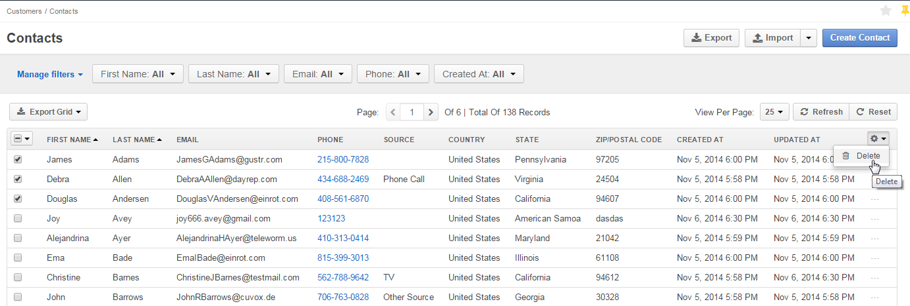
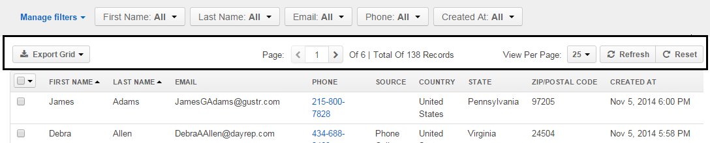

.. _user-guide-ui-components-grids:
    
Grids
=====

Grid is a convenient way to see information about all the records of a specific :term:`entity`.

For example, if you choose *System → Channels* in the :ref:`menu <user-guide-menu-items>`, you will see the grid of all 
the channels available:

      |
  
.. image:: ./img/ui_components/grid.png

|

- Rows of the grid represent records of the entity chosen.

- Columns of the grid represent fields of the records.

.. note::

    Availability of fields displayed in the grid depends on the 
    :ref:`roles and permissions <user-guide-user-management-permissions>` assigned to the user, as well the 
    :ref:`Show on Grid settings <user-guide-entity-management-other-common>` defined for fields of the entity. 
    

.. _user-guide-ui-components-grid-filters:
    
Grid Filters
------------

You can apply filters to choose specific items to be shown in the grid. 

Click the arrow on a filter to choose required values. Available value setting depend on the field type. If more than 
one filter is active, only the records that meet requirements of ALL the filters are displayed.
  
In the example below, only the contacts created after the third of November, with "gmail.com" emails and phones that 
start with 123 are displayed:

      |
  

.. note::

    Please note that the list of fields available for filters depends on the  *"Show Grid Filter"* settings defined for 
    fields of the the entity. Please see the *Entity Management* guide for more details.    

.. _user-guide-ui-components-grid-customized:

Customized Grid Views
^^^^^^^^^^^^^^^^^^^^^

You can save a set of filters and sorting applied to the grid in a named view.
To save a view:

- Apply the filters you want, as described above

- Click the :guilabel:`Options` link next to grid view name, choose :guilabel:`Save As` 

.. image:: ./img/ui_components/custom_view_1.png

|

- Define the view name and click the :guilabel:`Save` button

.. image:: ./img/ui_components/custom_view_2.png

|

The view will now be available in the drop-down next to the grid title

.. image:: ./img/ui_components/custom_view_3.png
    

.. _user-guide-ui-components-grid-action-icons:

Grid Action Icons
-----------------

Last column of any grid in the system contains icons of actions available for the grid item. 

.. image:: ./img/ui_components/action_icons.png

|
  
For example, for any Contact record you can:

- Get to the records :ref:`View page<user-guide-ui-components-view-pages>` of the record: |IcView|

- Get to the :ref:`Edit form <user-guide-ui-components-create-pages>` of the record: |IcEdit|

- Delete the record :|IcDelete|

.. note::

    Different action icons may be shown for different items of the same grid, subject to the system 
    settings. Specific items of every grid are described in the correspondent guides.

.. _user-guide-ui-components-grid-bulk-action:

Grid Bulk Actions
^^^^^^^^^^^^^^^^^

You can perform bulk actions with the |IcBulk| icon in the top right corner of the grid. 

Check the entity records, click the arrow and choose the action to perform.

In the example, the first three contacts will be deleted from the grid:

.. _user-guide-ui-components-grid-action-buttons:

Grid Controls
-------------

Grid controls are displayed right above the grid.

|

The following actions are always available for a grid:

- Change the amount of items per page: :guilabel:`View Per Page`

- Scroll pages (if there is more than one page of records): |ScrollPage|

- Refresh the grid, i.e. get the newest details on the grid items available: |BRefresh|

- Reset the grid, i.e. clear all the filters applied to the grid: |BReset|

In some grids (as in the example), you can export all the details shown in the grid as a .csv file.

.. _user-guide-ui-components-grid-action-buttons-export:

Export Grid
^^^^^^^^^^^

If the :guilabel:`Export Grid` button is available, all the data displayed in a grid can be exported as a .csv table. 

To do so, click the button and choose "CSV".

.. image:: ./img/ui_components/export_grid.png

The file will be saved in compliance with your browser settings.

.. |IcDelete| image:: ./img/buttons/IcDelete.png
   :align: middle

.. |IcEdit| image:: ./img/buttons/IcEdit.png
   :align: middle

.. |IcView| image:: ./img/buttons/IcView.png
   :align: middle
   
.. |IcBulk| image:: ./img/buttons/IcBulk.png
   :align: middle
   
.. |ScrollPage| image:: ./img/buttons/scroll_page.png
   :align: middle
   
.. |BRefresh| image:: ./img/buttons/BRefresh.png
   :align: middle
   
.. |BReset| image:: ./img/buttons/BReset.png
   :align: middle