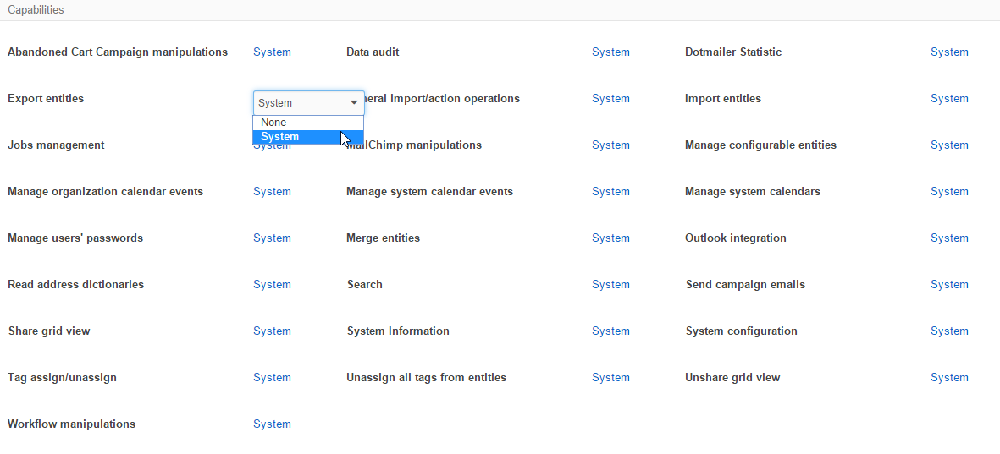

.. _user-guide-user-management-roles:

Roles Management
================

Each OroCRM :term:`user <User>` must be assigned a role. The role defines the user's role within the company structure 
(for example, if this is a manager, a sales-representative, a marketologist, and so on) and specifies permissions 
available for the users, who are assigned with this Role. 

One user may have several roles. All the permissions granted to at least one of the roles assigned to a user, are 
granted to the user. 

Creating a Role
---------------

To create a new role:

- Go to *System → User Management → Roles*.
- Click the :guilabel:`Create Role` button.

  |
  
  |role_create|

  |
  
- In the form that has emerged, define the role name that will be used to assign it to a user.

  Define other settings in the sections described below:
  
  - **Entity**: Define what permissions the users assigned this role will have for the entity records that have 
    an ownership type other than "None".
  - **Capabilities**: Define if the user that has been assigned this role will have access to certain parts of the 
    system.
  - **Users**: Select users to be assigned this role.

The "Entity" Section
^^^^^^^^^^^^^^^^^^^^

To specify if users with this role will be able to perform specific actions with the entity and at which level, choose 
the permissions for each entity and each action from the drop-down menu:

      |
  
.. image:: ./img/user_management/role_entity.png

More detailed description of the available options is provided in the 
:ref:`Access and Permissions Management <user-guide-user-management-role-permissions>` guide.

The *"Default"* field specifies the permission settings that are by default assigned to a new entity.

The "Capabilities" Section
^^^^^^^^^^^^^^^^^^^^^^^^^^

To enable or disable a specific system functionality for the role, use the "Capabilities" section.

      |
  

There are only two options:

- **None**: users with the role won't be able to use the functionality.
- ***System***: users with the role will be able to use the functionality for all the records created within their
  OroCRM instance they've logged in into.

  
The "Users" Section
^^^^^^^^^^^^^^^^^^^

Choose users to be assigned the role created in the "Users" section

Check/uncheck the **HAS ROLE** box to assign/unassign a user to the role:

      |
	  
.. image:: ./img/user_management/role_users.png

.. note::

    Please note that the "HAS ROLE" check-box defines if the user is assigned the specific role that you are 
    editing/creating.

*Manage Roles*
--------------

Once a role has been created, it will be added to the "All Roles" 
:ref:`grid <user-guide-ui-components-grid-action-icons>` (*System → User Management → Roles*).

From the grid you can:

- Delete the role from the system: |IcDelete|. If there is at least one user that has this role, the role cannot be 
  deleted.

- Get to the :ref:`Edit form <user-guide-ui-components-create-pages>` of the campaign: |IcEdit|. 

.. |IcDelete| image:: ./img/buttons/IcDelete.png
   :align: middle

.. |IcEdit| image:: ./img/buttons/IcEdit.png
   :align: middle

.. |role_create| image:: ./img/user_management/role_create.png
   :align: middle