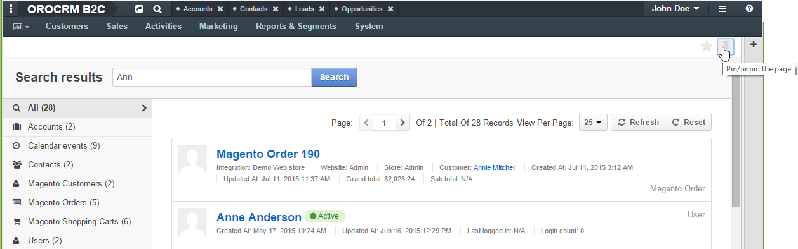
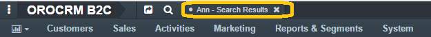

.. _user-guide-getting-started-favorite_viewed_pinned:

Favourite, Pinned and Viewed Pages
==================================

It is always convinient to have the pages you often View at hand. There are several UI controlles to help you do that in 
OroCRM

.. _user-guide-getting-started-favorites:

Mark as Favourite
-----------------

You can mark any page, whether it is a grid, form, report, search result or other as favourite. 

To do so:

- Open the page that you want to mark as favorite.

- Click the "Mark as favorite" icon

.. image:: ./img/ui_components/favorite.png  

- The icon will turn yellow

- You can now see the page in the User's Favorites section 

.. image:: ./img/ui_components/favorite_1.png  

.. _user-guide-getting-started-pinbar:

Pinbar
^^^^^^

You can pin any page to the header and come back to it at any time in one click.

To do so:

- Open the page that you want to pin.

- Click the pin icon 

- The icon will turn yellow

- The page link is now available in the pin section

.. _user-guide-getting-started-history:

History, Favorites and Most Viewed
^^^^^^^^^^^^^^^^^^^^^^^^^^^^^^^^^^
To view the history of pages viewed in the system, the list of favorites and the list of most viewed pages for a 
specific user, click the list icon to the left from the User Menu (6).

All the page names there are links, which you can click to get to the page.

.. image:: ./img/ui_components/history.png  
