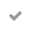
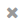
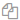
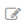
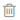

.. _user-guide-workflow-management-basics:

Workflow Management
===================

Basically, a workflow is a sequence of industrial, administrative of other processes applied to a 
piece of work from initiation to completion. Workflow records in OroCRM represent such sequences of processes for work 
applied to instances of an OroCRM :term:`entity <Entity>`. From this article you will learn to understand, create and 
manage workflows.

Steps, Transitions and Attributes
---------------------------------

Each of the processes or actions applied to the entity is a *workflow transition* and the state of the entity before or
after a transition is a *workflow step*.

In the example below you can see a workflow of a document creation.

.. image:: ./img/workflows/wf_example.png

The workflow transitions are the arrows, that show what action can be applied to the document at a certain step.

The workflow steps are in squares (In progress, Under review, Finished) and correspond to the state of the document.

Attributes (also referred as "fields")are characteristics of an entity. For example, zip-code and street name are 
attributes of an address.

At the end of each transition you can change some attributes of the record processed. 

In our example we are working with documents. Our "document" entity has the following attributes:
  
  - "Name" that must be defined after transition "Start Writing" and can be changed after transitions "Submit for 
    review" and "Return for rework" 
	
 -  "Number of Pages" - that must be defined after "Submit for review" and can be changed after "Approved"

UI Limitation
-------------
 
OroCRM workflows can be created from the both back-end and the UI. The following functions can be enabled for a workflow
only from the back-end and require some coding skills:
 
 
- Define Init and Post Actions such as creation of another entity, processing of of the existing entity data, 
  email notifications, and other similar actions performed right before of after the transition.

 
- Define precondition and conditions to check if the transition can be performed.
  Preconditions are checked every time a View page is accessed or a transition is submitted. If preconditions are not 
  met, the transition button is not available, and the transition cannot be submitted. 
  Conditions are checked only when submitting the transition. 
 
- Define validation for the data input in the course of transition.

- Create attributes for records not related to the entity.

 
Creating a Workflow in the UI
-----------------------------

This way, *Workflows created from the UI are comparatively simple and aimed at processing of the records already present
in the system.*

In order to create a workflow for an entity:

1. Go to the *System → Workflows* page and click the :guilabel:`Create Workflow` button in the top right corner to get
   to the *Create Workflow* page.
   
   |create_wf_page|

2. Define :ref:`general workflow details <user-guide-workflow-general>`, possible states of the entity records 
   (:ref:`steps <user-guide-workflow-designer-steps>`), actions that can be applied to the records at each of the steps
   (:ref:`transitions <user-guide-workflow-designer-transitions>`) and related setting, including the 
   :ref:`attributes <user-guide-workflow-designer-attributes>` that can/must be changed after each transition

3. Choose a :ref:``default step <user-guide-workflow-designer-default>` if any.

4. Click the button in the top right corner to save the workflow.

  
.. note::

    Each entity may have unlimited number of workflows related to it, bun only one of them can be active. 
    Each record at any given moment in time can be subject to an only  workflow.
  
  
.. _user-guide-workflow-general:

General Details
^^^^^^^^^^^^^^^

Define basic information in the *General* section.

.. image:: ./img/channel_guide/wf_general.png

The following two fields are mandatory and **must** be defined:

.. csv-table::
  :header: "**Field**","**Description**"
  :widths: 10, 30

  "**Name**","Name used to refer to the workflow in the system (e.g. activate it, display it in the grid, etc.) It is 
  recommended to keep the name meaningful."
  "**Related Entity**", "A drop-down which allows you to choose an entity, for which the workflow is created. When the 
  workflow is active, it can be used for records of this entity."
  
**Display Steps Ordered** box is not checked by default and specifies, the way workflow steps are displayed on the 
widget. 

- When the box is not checked, only the step that have actually been performed are shown and the current step is 
  highlighted.

.. image:: ./img/workflows/wf_display_widget.png
  
- When this box is checked, all the possible workflow steps are shown and the current step is highlighted

.. image:: ./img/workflows/wf_display_widget_ordered.png

..note::

   The functionality can be a bit confusing for branching workflows (so, in the example, you can see both Disqualified 
   and Opportunity steps), but is rather useful for linear workflows, as the user can see possible future steps.

.. _user-guide-workflow-designer-steps:

Workflow Steps
^^^^^^^^^^^^^^

Define possible workflow steps in the *Designer* section.

1. The first "Start" step is already defined. You need it a start point for the first transition.

2. To add a step, click the :guilabel:`+ Add Step` button

  |wf_designer_step|

3. Define necessary step details in the "Add New Step" form.

.. image:: ./img/workflows/wf_designer_step_form.png

.. csv-table::
  :header: "**Field**","**Description**"
  :widths: 10, 30

  "**Name**","Name used to refer to the step in the system (e.g. activate it, display it in the grid, etc.) It is 
  recommended to keep the name meaningful.
  
  Name is the only mandatory field of a step"
  "**Position**", "A number that defines a place where the step will be displayed on the  
  :ref:`workflow widget <user-guide-worfklow-widget>`.
  
  .. note::
  
      Position may be specified with any non-negative integer.
	  
	  The step position on the widget depends on the order only (e.g. 0,2,70). 

	  Steps with the same position are displayed in the order they have been performed. If a step with a smaller 
	  position value has been performed later, steps with higher position values are not displayed in the the widget."
  "**Final**","The flag shall be checked for final steps of the flow"

  
.. _user-guide-workflow-designer-transitions:

Workflow Transitions
^^^^^^^^^^^^^^^^^^^^

Define possible transitions in the *Designer* section.

1. The first "Start" step is already defined. You need it a start point for the first transition.

2. To add a step, click the :guilabel:`+ Add Transition` button

  |wf_designer_transition|

3. Define necessary step details in the "Add New Transition" form.

.. image:: ./img/workflows/wf_designer_transition_form.png

The following fields are mandatory:

.. csv-table::
  :header: "**Field**","**Description**"
  :widths: 10, 30

  "**Name**","Name used to refer to the transition in the system. It is recommended to keep the name meaningful."
  "**From step and To step**", "A dropdown contains the list of steps defined for the workflow. You can choose any two 
  steps between which the transition is made."
  "View form","When a transition is performed, a form with the entity 
  :ref:`attributes <user-guide-workflow-designer-attributes>` appears that shall be submitted to change the step.
  Use the field, to define if this form shall be displayed in a popup window or a separate page."
  
There is also a number of optional fields that can be used to modify the transition in the UI:

.. csv-table::
  :header: "**Field**","**Description**"
  :widths: 10, 30

  "**Warning Message**","A piece of text that will be displayed every time a user is about to perform a transition."
  "**Button icon**","Icon used when displaying the transition button"
  "**Button Style**","Choose the transition button style from the dropdown."

In the *"Button preview"* you can see how the button will look in the UI.

.. _user-guide-workflow-designer-attributes:

*Transitions Attributes*
^^^^^^^^^^^^^^^^^^^^^^^^
	
In order to define the attribute settings:

- Go to the *Add Transition → Attributes* 

  |wf_designer_transition_attributes|
  
.. csv-table::
  :header: "**Field**","**Description**"
  :widths: 10, 30

  "**Entity Field**","Choose field of the entity or its related entities that can/must be defined in the course of the 
  transition.
  	  
  This is an only mandatory field of the attributes section"
  "**Label**","Use the field if you want to change the way it is displayed in the UI. The system *label* value of the 
  entity is used by default."
  "**Required**","The flag shall be checked if defining the attribute must be mandatory for the transition."
 
- Click :guilabel:`+ Add` button to add one more field (if necessary)

- Click :guilabel:`+ Apply` to apply the attribute settings.

.. _user-guide-workflow-designer-default:

Default Step
^^^^^^^^^^^^

You can also define a default step for the records of the entity, processed by the workflow. 
If a default step is specified, once you create a record of the entity, a workflow will be created for it and set to the
default step. 
If no default step is specified, one of the transitions from "Start" step must be performed to create a workflow for the
record. 

Workflow Usage in the UI
------------------------

All the workflows, whether they were created from the back-end or in the UI, can be applied to the records of a related
entity.

If an initial action that creates a new record of the entity has been defined (from the back-end) for the workflow,
the transition buttons are available in the top right corner of the entity :ref:`grid <user-guide-ui-components-grids>`,
such as :guilabel:`Start From Lead` and :guilabel:`Start From Opportunity` that create a new Lead or Opportunity record
at the start of a Sales Process.

.. image:: ./img/workflows/wf_display_grid.png

Button of all the transitions, for which pre-conditions are met (if any), are displayed at
:ref:`View pages <user-guide-ui-components-view-pages>` of the entity records, such as :guilabel:`Develop`, 
:guilabel:`Close As Won` and :guilabel:`Close As Lost` buttons on a View page of a Sales Process record qualified to an 
opportunity.

.. image:: ./img/workflows/wf_display_form.png

All the performed steps of the workflow are displayed at the widget on the top of the View pages of the entity records, 
subject to the *Workflows → General → Show Ordered* and *Workflows → Designer → POSITION* settings.

.. image:: ./img/workflows/wf_display_widget.png

Current step, or all the steps performed can be displayed on the entity grid, subject to the *Entity Management → 
Workflow Step on Grid* settings.

.. image:: ./img/workflows/wf_display_step.png

Managing Workflows
------------------

The following actions can be performed on workflows:

.. From the :ref:`grid <user-guide-ui-components-grids>`

From the grid:

.. image:: ./img/channel_guide/channels_edit.png

- Delete the channel: |IcDelete|

.. caution::

    Once a channel has been deleted, all of the data related to it will be deleted as well.

- Get to the :ref:`Edit from <user-guide-ui-components-create-pages>` of the channel: |IcEdit|

.. caution::

    You cannot edit the channel type if data from the channel has been already been uploaded into the system.

- Get to the :ref:`View page <user-guide-ui-components-view-pages>` of the channel:  |IcView|

From the :ref:`View page <user-guide-ui-components-view-pages>`:

.. image:: ./img/channel_guide/channels_created_b2b_view.png

- Deactivate or activate channels.  No new data from the channel will be uploaded for 
  an inactive channel.

- Get to the :ref:`Edit from <user-guide-ui-components-create-pages>` of the channel

- Delete the channel

 
 
  Workflow Grid
-------------

Workflow grid displays a list of all existing workflows in the system. This grid is available in the main menu under "System" > "Workflow". The image below shows an example of such grid.

.. image:: ./img/workflow_management/workflow_grid.png

The user can create a new workflow directly from this page using the correspondingly named "Create workflow" button in the header.

A default workflow grid contains the following columns:

* **Name** is a human-readable name of the workflow that is used to identify it.

* **Related entity** is the name of the entity the workflow is assigned to.

* **Active** – this flag shows whether the current workflow is active or not. Each entity can have no more than one active workflow at any given moment in time (i.e. one or none). The user can activate or deactivate workflow directly from the grid using the respective row actions (see below). Note that activating a different workflow resets all existing workflow data for all workflow entity records.

* **System** – workflows denoted by this flag can only be viewed or cloned, and cannot be modified or removed. Usually system workflows are the default ones that come out of the box, and non-system workflows are workflows created by the users.

* **Created** is a date when the workflow has been created.

Each workflow can have the following row actions:

* **View** |icon_view| – opens the workflow view page (see below) with the compact representation of workflow: Basic information, list of steps and transitions.

* **Activate** |icon_activate| – activates the current workflow. **Important note:** Activating the workflow resets all existing workflow data for all records of workflow entity. (The process runs in the background an may take some prolonged time for large amounts of data.) This action can be applied to inactive workflows only.

* **Deactivate** |icon_deactivate| – deactivates current worfklow without any additional actions. This action can be applied to active workflows only.

* **Clone** |icon_clone| – opens a workflow edit page with the copy of the cloned workflow. This action is useful if you want to tweak an existing workflow – no need to create it from scratch.

* **Edit** |icon_edit| – opens the workflow edit page. This action is not available for system workflows.

* **Delete** |icon_delete| – deletes the workflow. All related data will be removed automatically. (The process runs in the background an may take some prolonged time for large amounts of data.) This action is not available to system workflows.

.. |icon_view| image:: ./img/workflow_management/icon_view.png

View Page
---------

Workflow view page displays the basic information of a workflow (see image below).

.. image:: ./img/workflow_management/workflow_view.png

The view page may contain several action buttons – "Activate," "Deactivate," "Clone," "Edit," and "Delete." All these
actions are identical to the workflow grid row actions described above.

**General information**

This information block contains the basic information of a workflow: Its name, related entity, default step and "display steps ordered" flag.

Default step is the step that will be automatically assigned to a newly created entity record (see the definition above). Default step is optional, and if the workflow has no default step, the user will have to manually start the workflow with one of the starting transitions.

The "display steps ordered" flag defines whether the workflow widget need to show all steps (including not passed) at the entity view page. Usually this option should be checked only if the workflow is linear in its nature, i.e. the entity must be passed through all workflow steps.

**Steps and transitions**

The "Configuration" block contains a table with the list of steps and transitions. It has the following columns:

* **Step** is a name of the step, as it will appear in the UI. Some steps can be marked as final (see details below). The first row in the table is a service "step" labelled **(Start)** – this step is virtual, it cannot be edited, and it does not correspond to any actual workflow step. Its ony purpose is to define starting transitions that must start from it.

* **Transitions** is a list of all transitions available for the particular step. To the left of an arrow is the transition name, to the right of an arrow is the destination step of the transition.

* **Position** is the number that determines order of steps in the step widget. The higher is the number, the further to the right this step will appear in the step widget.

Edit Page
---------

Workflow edit page is used when you are creating the new workflow, editing or cloning an existing one. Example of such page is shown on a screenshot below.

.. image:: ./img/workflow_management/workflow_edit_overview.png

As you can see, the edit page is very similar in appearance to the view page, and consists of the same information blocks. The only differences are:
* Add transition and Add step buttons above the table
* Steps' and transitions' names in the table are clickable
* The table has additional Actions column

Add step and Add transition are used to create new step or transition. To edit existing ones, clck on the step or transition name in the table. In both cases, a popup window with a form will appear – so let's take a more detailed look on these forms.

**Edit step form**

This form consists of two tabs: "Info" and "Transitions."

.. image:: ./img/workflow_management/workflow_edit_step_info.png

On the "Info" the user can specify step name, its relative position in the workflow, and designate the step as final.

The standard practice for naming steps is to use adjectives, adding the entity name for distinction when necessary – e.g. the Abandoned Shopping Cart flow has two steps: Converted and Converted to Opportuninty. In the former case, the entity name is omitted meaning the actions leading to this step relate only to the workflow entity (Shopping Cart). The inlcusion of Opportunity into the latter step name informs the user that getting to this step involved manipulations with Opportunities.

When you are specifying positions of the workflow steps, think ahead: You might want to include additional steps later, and there should be some space for growth. Good practice is to use numbers like 10, 20, 30, and so on for the positioning.

The designation of the step as final applies to the business logic of the workflow, but it does not mean that there is no way out of the final step – it only means that such "reverse" transition is an exception to the natural order of things. See the Sales Process flow as an example: Its final steps are Disqualified Lead, Won Opportunity and Lost Opportunity, and each of these steps has a "reverse" transition (Reactivate and Reopen, respectively), but these transitions completely reset the workflow data and should be used only in exceptional cases.

.. image:: ./img/workflow_management/workflow_edit_step_transitions.png

The "Transitions" tab contains the table with the list of all transitions available from this step, very similar to the main Steps and Transitions table. Here the user can delete unwanted transitions from the step.

**Edit transition form**

This form also consists of two tabs: "Info" and "Attributes."

.. image:: ./img/workflow_management/workflow_edit_transition_info.png

On the "Info" tab the user can modify the transition name; its initial ("from") and destination ("to") steps; specify the view form type (popup window or full page); add a warning or confirmation message if it's needed; and customize the icon and style of transition button with the live preview.

Transition name is a text that will appear on its button in the step view. It is considered a good practice to start transition names with a verb, and keep them as short as possible.

"From step" and "To step" are the initial and destination steps for this transition. Its button will be available on the "from" step, and after transition is performed, the workflow will be moved to the "to" step. Both steps can be the same, in this case the transition will be a self-transition (e.g. the Log Call transition in the Abandoned Shopping Cart flow). If you want to create a starting transition, select "Start" in the From step dropdown menu.

View from type has two options - "Popup window" and "Separate page". First tells that transition attributes must be
rendered as regular popup window over the entity view page, second - transition will be shown as a separate page.

Warning message is optional and used to warn user about something before performing of transition. It can be extremely
useful if transition does some changes that can't be undone.

Button icon and style allows user to customise look of transition button - icon and background color.

.. image:: ./img/workflow_management/workflow_edit_transition_attributes.png

"Attributes" tab shows list of existing attributes for this step and has small form to add new ones.
Transition attributes are optional, so if there will be no attributes, then there will be no transition window -
transition will be performed immediately.

Add/edit from has only three fields - entity field, label and required flag.

Entity field selector allows user
to select required field from main entity or form it's relations. The way how this field will be rendered in
transition window is defined automatically based on field type.

Value at label field overrides default system field label. If label is not defined, default system field label
will be used.

Required flag specifies whether this field must be filled before transition execution.

Attributes field table has exactly the same columns, and each columns shows appropriate value. Also this table has
additional actions column - it allows to edit and remove attribute fields.

**Steps and transitions**

Steps and transitions table is really similar to such table on a view page (same columns, same information), but also
it has additional functionality.

Step names in column "Step" are links that open step window that allows user to modify step information.
Transition names in column "Transitions" are also links that open transition window to modify transition parameters.
To the right of transition name there are two additional icons that provide functionality to clone and delete
current transition.

Unlike table from view page, this table has additional actions column. It provides ability to add new transition
to this step, and modify, clone or delete current step.

Step by step example of workflow creation
-----------------------------------------

Now lets create simple flow to show how workflow functionality works in action. Here is schema of this flow:

.. image:: ./img/workflow_management/workflow_example_schema.png

* rectangles are steps;
* arrows are transitions;
* related entity is Contact;
* "Started" is default step;
* "Finished" is final step;
* steps must be displayed ordered at view page.

**General Information**

First user have to set basic parameters -  workflow name, related entity and displayed steps ordered flag. Default step
should be empty because there are no steps for now.

.. image:: ./img/workflow_management/workflow_example_general_information.png

**Steps**

Now lets create steps. There are three steps - "Started", "Processed" and "Finished", and each of them
should be created with "Add step" button. Also user need to set appropriate step order (10, 20, 30) and mark step
"Finished" as final step.

Step "Started":

.. image:: ./img/workflow_management/workflow_example_step_1.png

Step "Processed":

.. image:: ./img/workflow_management/workflow_example_step_2.png

Step "Finished":

.. image:: ./img/workflow_management/workflow_example_step_3.png

Now user can select step "Started" as default step, and whole page should look like image below.

.. image:: ./img/workflow_management/workflow_example_all_steps.png

**Transitions**

Next four transitions must be created - "Process", "Finish", "Restart" and "Reset". They can be created either using
"Add transition" button or with appropriate action with plus icon from steps and transitions table.

Transition attributes and parameters:

* Process - First Name (required), Middle Name, Last Name (required);
* Finish - Assign To, Reports To;
* Restart - no attributes, must have confirmation;
* Reset - no attributes, must have confirmation.

Transition "Process":

.. image:: ./img/workflow_management/workflow_example_transition_1_1.png
.. image:: ./img/workflow_management/workflow_example_transition_1_2.png

Transition "Finish":

.. image:: ./img/workflow_management/workflow_example_transition_2_1.png
.. image:: ./img/workflow_management/workflow_example_transition_2_2.png

Transition "Restart":

.. image:: ./img/workflow_management/workflow_example_transition_3.png

Transition "Reset":

.. image:: ./img/workflow_management/workflow_example_transition_4.png

**Saving and activation**

Now when all steps and transitions are created workflow finally can be saved. Lets click "Save and close" button - and
workflow will be saved. If this is a first workflow for custom or extended entity then saving might take some time
(up to 1 minute).

After saving user will be redirected to workflow view page with a short description of created flow. But now
this workflow is inactive, so it must be activated first. To do that user must click button "Activate" at the top
of view page and confirm activation (also activate action can be executed from workflow grid).

Here is how view page should look like.

.. image:: ./img/workflow_management/workflow_example_view.png

And now user can return to the workflow grid and ensure that new flow is there and it marked as active.

.. image:: ./img/workflow_management/workflow_example_grid.png

**Testing**

Finally, user need to test that this flow is actually works. Here is it's schema:

.. image:: ./img/workflow_management/workflow_example_schema.png

For current flow there are two cases - when new entity is created, and when existing entity is used. For new entity
workflow will be automatically started with default step, and for existing entity user have to start it manually
using start workflow button on entity view page. For this flow it will look like this:

.. image:: ./img/workflow_management/workflow_testing_no_workflow.png

After clicking on it workflow will be started. View page shows steps widget with the list of all workflow steps
(black are passed steps, green is current step, grey are not passed steps) and transition buttons.
Now entity is in step "Started" and transition "Process" is available.

.. image:: ./img/workflow_management/workflow_testing_step_started.png

After clicking on Process transition button transition window appears. It shows three defined attributes with required
marks, and it allows to change values.

.. image:: ./img/workflow_management/workflow_testing_transition_process.png

Let's set Middle name to "Unknown" and click "Submit" - after that transition is performed, and now entity is in
step "Processed". Steps widget is changed, and there are two new transition buttons - "Finish" and "Restart".

.. image:: ./img/workflow_management/workflow_testing_step_processed.png

After clicking on Finish transition button transition window will appear - it looks the same to previous one,
but contains other fields.

.. image:: ./img/workflow_management/workflow_testing_transition_finish.png

Let's set some user and contact in appropriate fields, click "Submit" and ensure that appropriate fields in
contact were changed. Now entity is in step "Finished" and one transition "Reset" is available.

.. image:: ./img/workflow_management/workflow_testing_step_finished.png

Clicking on Reset transition button will show the confirmation that was configured in transition. The same confirmation
will appear for Restart transition from step "Processed".

.. image:: ./img/workflow_management/workflow_testing_confirmation_reset.png

And after clicking on OK button entity will be in step "Started" again with Process transition available.

.. image:: ./img/workflow_management/workflow_testing_step_started_again.png

Transitions can be executed any amount of times for the same entity, and all entered data will be stored at entity
fields.

.. |create_wf_page| image:: ./img/channel_guide/create_wf_page.png

.. |wf_designer_step| image:: ./img/workflows/wf_designer_step.png

.. |wf_designer_transition| image:: ./img/workflows/wf_designer_transition.png

.. |wf_designer_transition_attributes image:: ./img/workflows/c.png

.. |IcDelete| image:: ./img/buttons/IcDelete.png
   :align: middle

.. |IcEdit| image:: ./img/buttons/IcEdit.png
   :align: middle

.. |IcView| image:: ./img/buttons/IcView.png
   :align: middle
