Workflow Management
===================

*Used application: OroCRM 1.2.0*

This article provides description of Workflow Management feature from the point of a user.

Basics
------

Let's start from describing of the main concept and terms.

**Workflow** is a set of ordered actions that can be performed with the specific entity. Workflow allows user to
manage entities, update existing and create new ones. From the user point of view workflow can be described as a
list of buttons that can open forms to fill and save entity data.

Each entity can have unlimited number of workflows related to it, bun only one of them can be active.
Entity can be passed through only one workflow in one time, so it's possible to have several flows for one
entity and switch between them according to requirements. When workflow is deleted all related entities loose relation
with it.

**Step** is a "static" element of workflow. At any given moment of time, the workflow entity must be in some step -
as a consequence, at least one step is mandatory for the workflow. In some cases step can de considered
as a synonym to entity status, but some entities may have both step and status - in this cases it is important to
explain user what purposes they have and what is the difference between them. Each entity passed through workflow
has workflow step.

Workflow can have default step - it means that new entities (which workflow in assigned to) will be created with
started workflow in default step. Also steps can be used to collect statistics and build reports for entities.

**Transition** is a "dynamic" element of workflow. Transitions are used to move from one workflow step to another,
to manipulate workflow data, and to commit some additional actions. The transition can point to the same step
it is initiated from (so called "self-transition"). Each step has transitions attached to it,
and each such transition correspond to button shown on the entity view page. Transition may have ACL resource
that specifies whether with transition should be available for current user. Together steps and transitions form
so called `directed graph`_ where steps are nodes and transitions are arcs.

Starting transition is a special case of transition. Main difference from regular transition is that
it has no starting step. Workflow must have either default step or starting transition.

**Preconditions** are the set of conditions that define whether the transition is available.
Preconditions are checked every time the step view is accessed, and if they are not met, transition button
shall not appear on the step view. Preconditions are also checked when the transition form is committed,
and if they are not met, the transaction is not conducted.
*Preconditions are temporary not available from the interface.*

**Conditions** are additional conditions that are checked only when the transition form is committed,
and they determine whether the transaction will be conducted further, or not.
*Conditions are temporary not available from the interface.*

**Post actions** are actions that are committed after the transaction is conducted
(i.e. the workflow is moved to the step that is determined in the transition). Those actions may include,
but not limited to, creation of another entity, manipulation of the existing entity data, email notifications, etc.
If new created entity has another workflow with default step it will be started automatically.
*Post actions are temporary not available from the interface.*

.. _directed graph: http://en.wikipedia.org/wiki/Directed_graph

Workflow Grid
-------------

Workflow grid represents list of all existing workflows in the system. This grid is available in main menu
under "System" > "Workflow" path. Image below shows how this grid can look like.

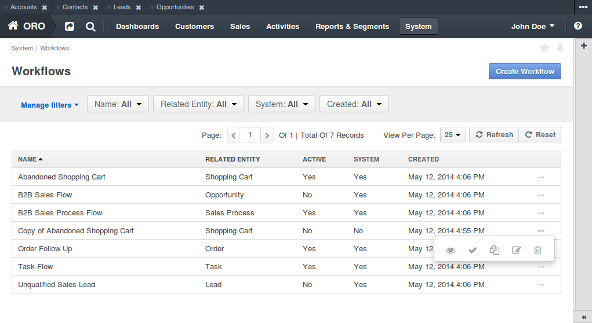

This page has button "Create workflow" that redirects user to create workflow page.

Workflow grid drawn above has following columns:

* **Name** - represents name of the workflow used all over the system. It basically used only to provide readable
  identifier of the current workflow.

* **Related entity** - name of the entity which workflow is assigned to. It means that current workflow will be
  shown and used on view page of this entity.

* **Active** - this columns shows whether current workflow active or not. Only one workflow for each entity can
  be active at the same time. To change this state user can use actions "Activate" and "Deactivate".

* **System** - this flag defines whether current workflow can be modified or removed (system workflows can't be
  modified or removed). Usually system workflows are workflow that are coming out of the box of form additional
  extensions, and non system workflows are workflows created from user interface.

* **Created** - date when current workflow was created.

Each workflow can have following actions:

* **View** (eye icon) - shows compact representation of workflow - basic information, list of steps and transitions.

* **Activate** (tick icon) - allows to activate current workflow. It's important to know that during activation all
  workflow data from other workflows for current entity will be reset. This action can be applied only to
  deactivated workflows.

* **Deactivate** (cross icon) - deactivates current worfklow without any additional actions. This action can be applied
  only to activated workflows.

* **Clone** (two sheets of paper icon) - allows user to create copy of existing workflow and customize it according to
  some requirements.

* **Edit** (pen and paper icon) - allows user to edit existing workflow. This action can be applied only to
  non system workflows.

* **Delete** (trash bin icon) - allows user to delete existing workflow. All related data will be removed automatically.
  This action can be applied only to non system workflows.

View Page
---------

Workflow view page shows basic view representation of workflow (see image below).

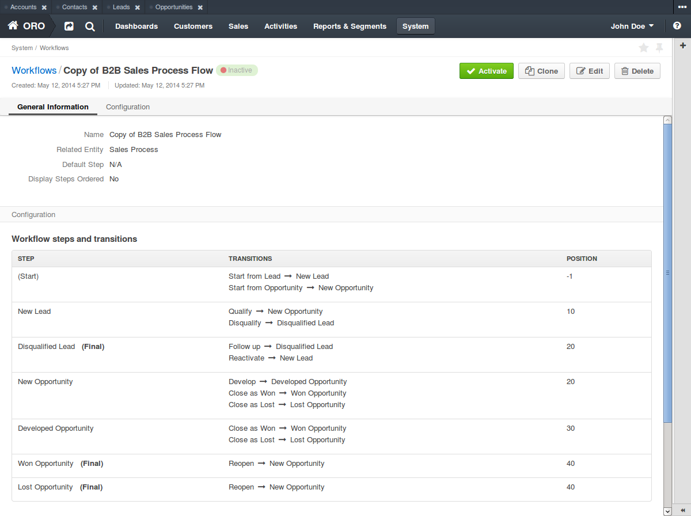

View page can contain several action buttons - "Activate", "Deactivate", "Clone", "Edit" and "Delete". All these
actions are the same to grid actions and they do exactly the same things.

**General information**

Below the buttons there is first information block "General information" that shows name, related entity,
default step and display steps ordered flag.

Default step is the step that will be automatically assigned to an entity after it's creation. For entities that
already exists there will be starting transition that leads to this step. Default step is optional, so if there is
no default step then user have to manually start workflow using one of starting transitions.

Display steps ordered flags defines whether need to show all steps (including not passed) at the entity view page.
Usually this flag sets only if workflow is linear, i.e. entity must be passed through all workflow steps.

**Steps and transitions**

Second information block "Configuration" shows table with list of steps and transitions.
This table has following columns:

* **Step** - name of the step in current row. Step name is a text identifier used in interface to show user current
  step. Some steps can be marked as final - it means that in these steps workflow will be counted as finished for
  the specific entity it assign to.

* **Transitions** - list of available transitions. Text to the left of arrow is transition name, text to the right of
  arrow - step where this transition is leads to.

* **Position** - number that defines order of steps at the entity view page. The higher number is the later this step
  will be in steps widget.

Steps and transitions table contains one service step called "(Start)" - this step used to define starting transitions,
i.e. all starting transitions must lead from this step. In fact this step is virtual, so it will not be shown
anywhere except view and edit page of workflow.

Edit Page
---------

Workflow edit page used to modify existing workflows. Also this page used to create and clone workflows. Example
of edit page is shown below.

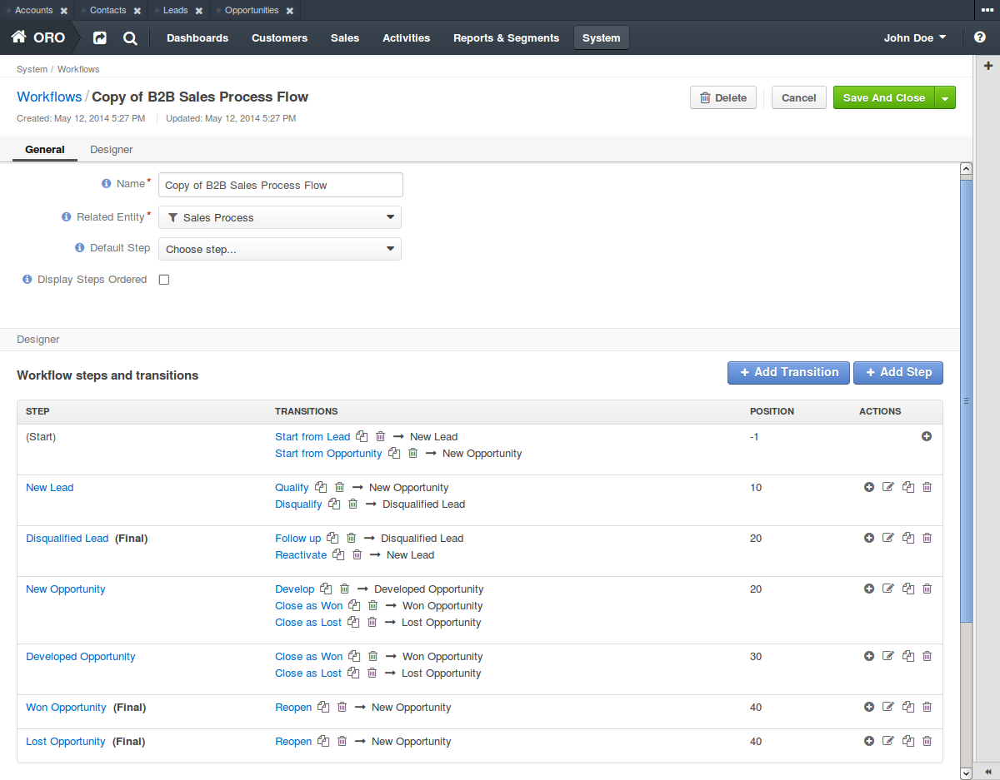

As you can see, edit page is very similar to view page - it has action buttons and two same block that shows
workflow parameters, steps and transitions.

**General information**

Block with general information shows workflow name, related entity selector, default step selector and
display steps ordered checkbox.

Related entity selector shows only that entities, that can contain workflow data - these are all entities that has
such ability out of the box, and all custom and extended entities.

Right above the table there are two buttons that allows to add steps and transitions. Let's look at them closer.

**Step window**

After clicking on button "Add step" appropriate window will appear (the same window is used to edit steps).
This window has two tabs - "Info" and "Transitions".

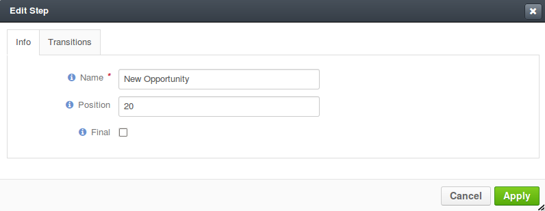

"Info" tab contain small form that allows user to set step name, it's position (order) and final flag.

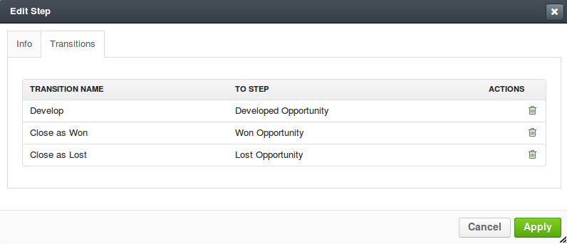

"Transitions" tab shows table with list of all transitions available from this step - it contains transition name,
step where it leads to and "Delete" icon that can remove selected transition.

**Transition window**

Button "Add transition" will open appropriate window (the same window is used to edit transitions). It also has
two tabs - "Info" and "Attributes".

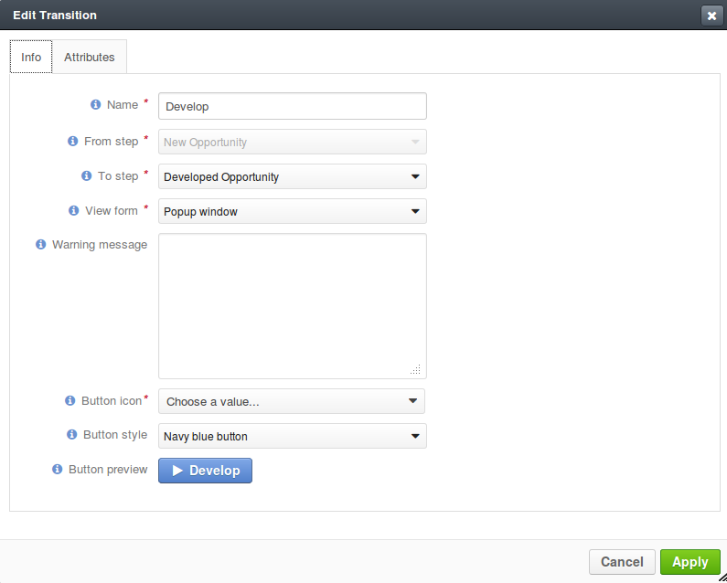

"Info" tab shows and allows to modify transition name, steps where is comes from and where it lead to, view form type,
warning message, and alto transition button icon and style.

Transition name is simply text identifier for user interface.

"From step" and "To step" allows user to specify on which step this transition will be available (From step)
and where it will lead user after transition will be performed (To step).

View from type has two options - "Popup window" and "Separate page". First tells that transition attributes must be
rendered as regular popup window over the entity view page, second - transition will be shown as a separate page.

Warning message is optional and used to warn user about something before performing of transition. It can be extremely
useful if transition does some changes that can't be undone.

Button icon and style allows user to customise look of transition button - icon and background color.

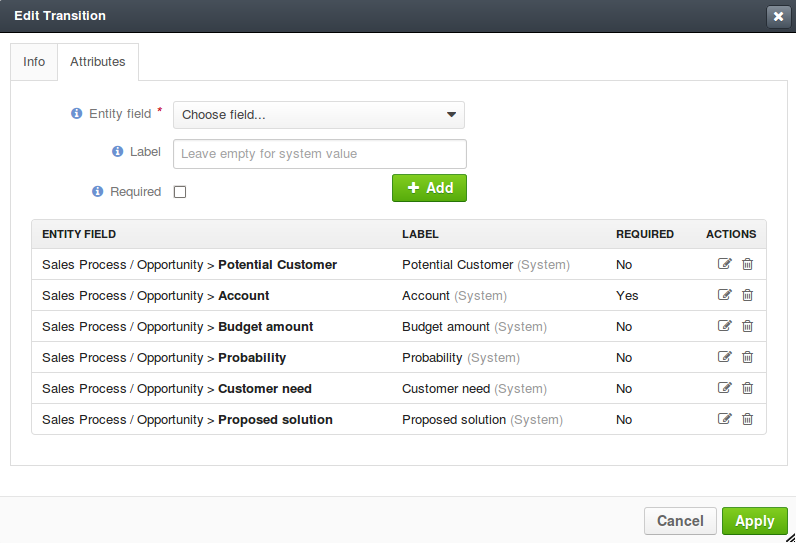

"Attributes" tab shows list of existing attributes for this step and has small form to add new ones.
Transition attributes are optional, so if there will be no attributes, then there will be no transition window -
transition will be performed immediately.

Add/edit from has only three fields - entity field, label and required flag.

Entity field selector allows user
to select required field from main entity or form it's relations. The way how this field will be rendered in
transition window is defined automatically based on field type.

Value at label field overrides default system field label. If label is not defined, default system field label
will be used.

Required flag specifies whether this field must be filled before transition execution.

Attributes field table has exactly the same columns, and each columns shows appropriate value. Also this table has
additional actions column - it allows to edit and remove attribute fields.

**Steps and transitions**

Steps and transitions table is really similar to such table on a view page (same columns, same information), but also
it has additional functionality.

Step names in column "Step" are links that open step window that allows user to modify step information.
Transition names in column "Transitions" are also links that open transition window to modify transition parameters.
To the right of transition name there are two additional icons that provide functionality to clone and delete
current transition.

Unlike table from view page, this table has additional actions column. It provides ability to add new transition
to this step, and modify, clone or delete current step.

Workflow example step by step
-----------------------------

Now lets create simple flow to show how workflow functionality works in action. Here is schema of this flow:

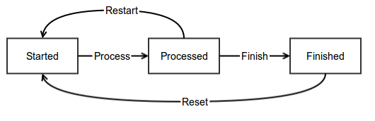

* rectangles are steps;
* arrows are transitions;
* related entity is Contact;
* "Started" is default step;
* "Finished" is final step;
* steps must be displayed ordered at view page.

**General Information**

First user have to set basic parameters -  workflow name, related entity and displayed steps ordered flag. Default step
should be empty because there are no steps for now.

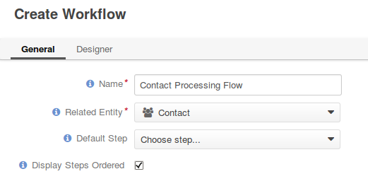

**Steps**

Now lets create steps. There are three steps - "Started", "Processed" and "Finished", and each of them
should be created with "Add step" button. Also user need to set appropriate step order (10, 20, 30) and mark step
"Finished" as final step.

Step "Started":

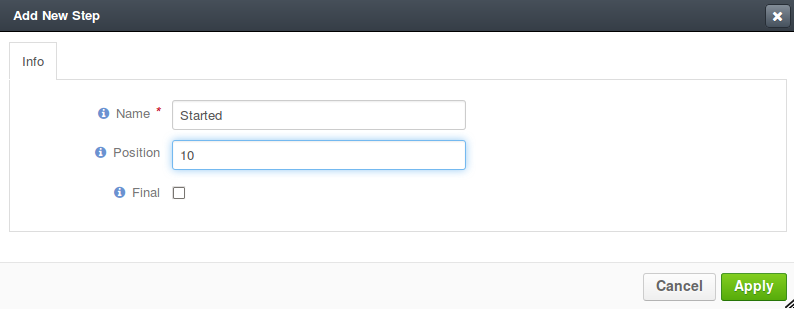

Step "Processed":

Step "Finished":

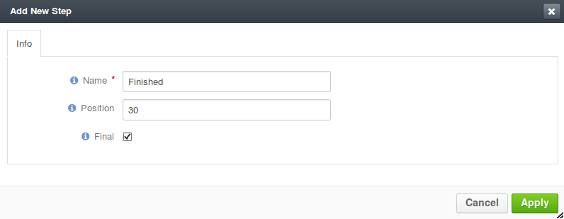

Now user can select step "Started" as default step, and whole page should look like image below.

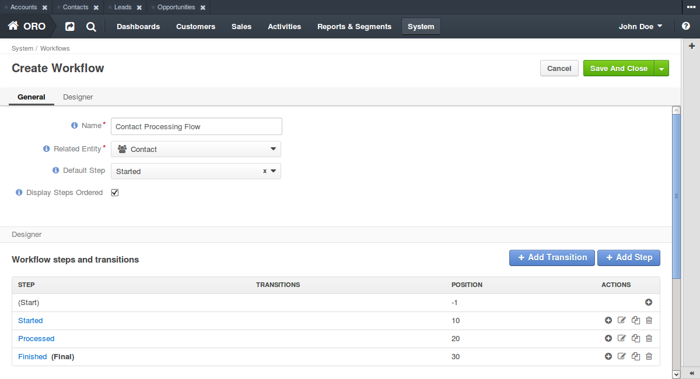

**Transitions**

Next four transitions must be created - "Process", "Finish", "Restart" and "Reset". They can be created either using
"Add transition" button or with appropriate action with plus icon from steps and transitions table.

Transition attributes and parameters:

* Process - First Name (required), Middle Name, Last Name (required);
* Finish - Assign To, Reports To;
* Restart - no attributes, must have confirmation;
* Reset - no attributes, must have confirmation.

Transition "Process":

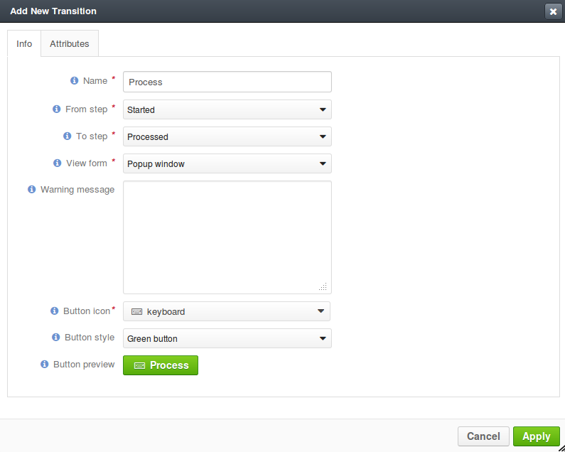
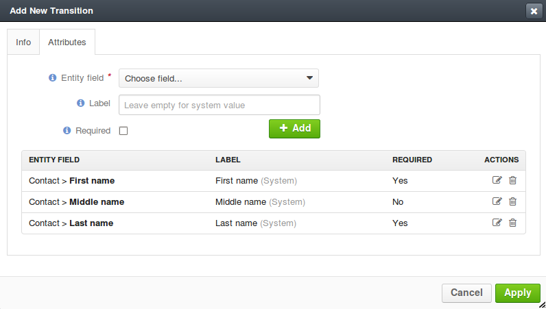

Transition "Finish":

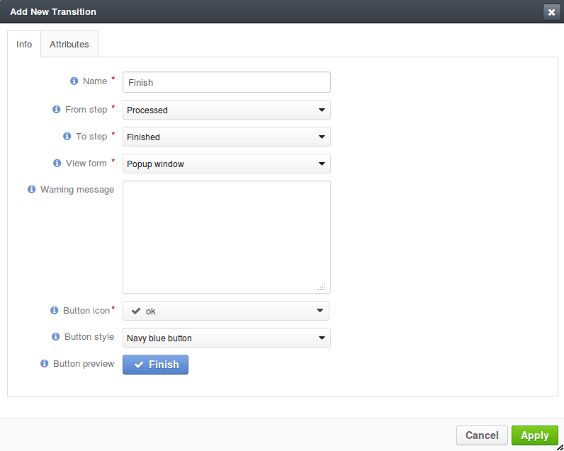
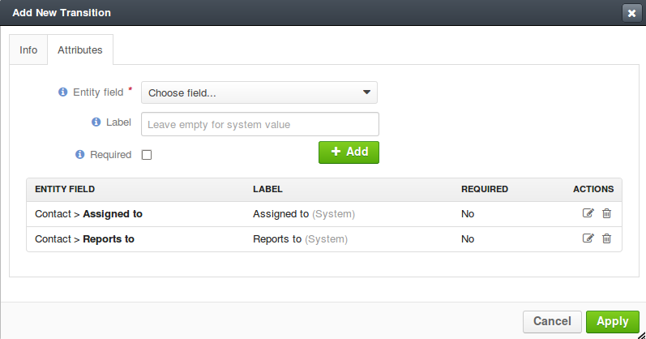

Transition "Restart":

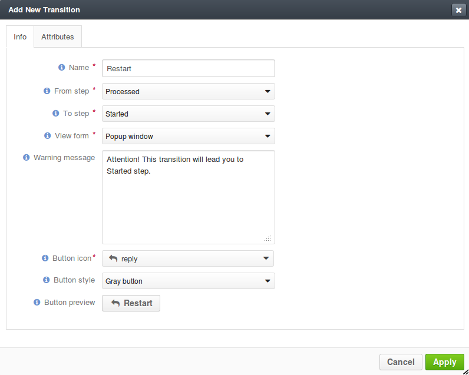

Transition "Reset":

**Saving and activation**

Now when all steps and transitions are created workflow finally can be saved. Lets click "Save and close" button - and
workflow will be saved. If this is a first workflow for custom or extended entity then saving might take some time
(up to 1 minute).

After saving user will be redirected to workflow view page - here there is short description of created flow. But now
this workflow is inactive, so to it must be activated first. To do that user must click button "Activate" at the top
of view page and confirm activation (also activate action can be executed from workflow grid).

Here is how view page should look like.

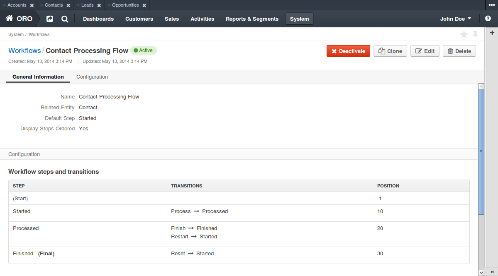

And now user can return to the workflow grid and ensure that new flow is there and it marked as active.

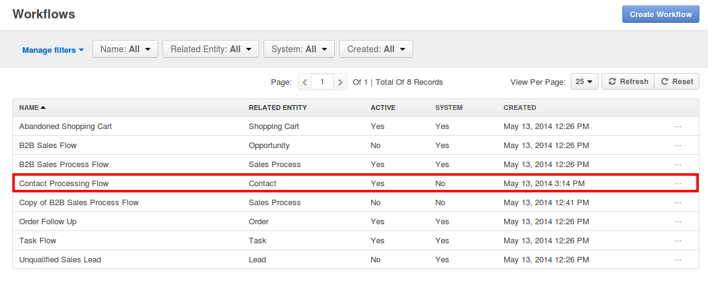

**Testing**

Finally, user need to test that this flow is actually works. Here is it's schema:

For current flow there are two cases - when new entity is created, and when existing entity is used. For new entity
workflow will be automatically started with default step, and for existing entity user have to start it manually
using start workflow button on entity view page. For this flow it will look like this:

.. image:: ./img/workflow_management/workflow_testing_no_workflow.png

After clicking on it workflow will be started. View page shows steps widget with the list of all workflow steps
(black are passed steps, greed is current step, grey are not passed steps) and transition buttons.
Now entity is in step "Started" and transition "Process" is available.

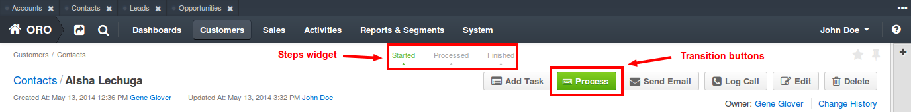

After clicking on Process transition button transition window appears. It shows three defined attributes with required
marks, and it allows to change values.

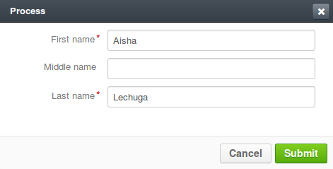

Let's set Middle name to "Unknown" and click "Submit" - after that transition is performed, and now entity is in
step "Processed". Steps widget is changed, and there are two new transition buttons - "Finish" and "Restart".

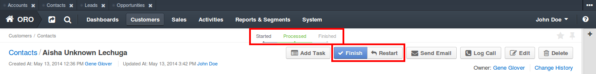

After clicking on Finish transition button transition window will appear - it looks the same to previous one,
but contains other fields.

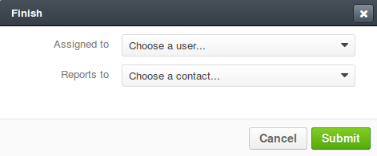

Let's set some user and contact in appropriate fields, click "Submit" and ensure that appropriate fields in
contact were changed. Now entity in step "Finished" and it still has one transition "Reset".

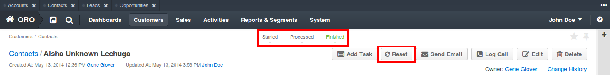

Clicking on Reset transition button will show the confirmation that was configured in transition. The same confirmation
will appear for Restart transition from step "Processed".

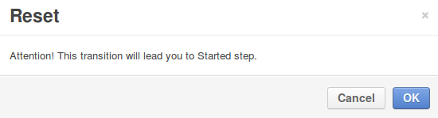

And after clicking on OK button entity will be in step "Started" again with Process transition available.

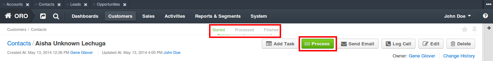

Transition can be executed any amount of times with the same entity, and all entered data will be stored at entity
fields.
