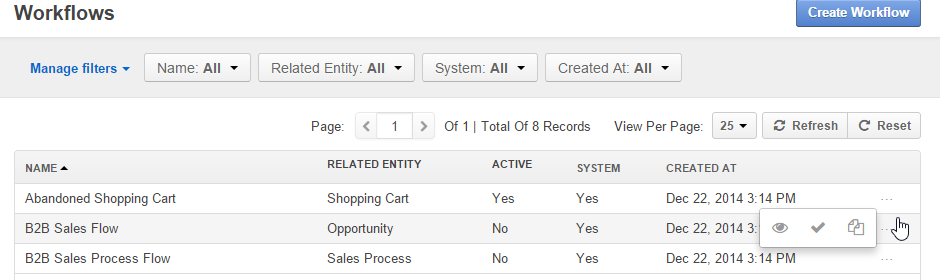
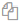

.. _user-guide-workflow-management-basics:

Workflow Management
===================

Basically, a workflow is a sequence of industrial, administrative of other processes applied to a 
piece of work from initiation to completion. Workflow records in OroCRM represent such sequences of processes for work 
applied to instances of an OroCRM :term:`entity <Entity>`. From this article you will learn to understand, create and 
manage workflows.

Steps, Transitions and Attributes
---------------------------------

Each of the processes or actions applied to the entity is a *workflow transition* and the state of the entity before or
after a transition is a *workflow step*.

In the example below you can see a workflow of a document creation.

.. image:: ./img/workflows/wf_example.png

The workflow transitions are the arrows, that show what action can be applied to the document at a certain step.

The workflow steps are in squares (In progress, Under review, Finished) and correspond to the state of the document.

Attributes (also referred as "fields")are characteristics of an entity. For example, zip-code and street name are 
attributes of an address.

At the end of each transition you can change some attributes of the record processed. 

In our example we are working with documents. Our "document" entity has the following attributes:
  
  - "Name" that must be defined after transition "Start Writing" and can be changed after transitions "Submit for 
    review" and "Return for rework" 
	
 -  "Number of Pages" - that must be defined after "Submit for review" and can be changed after "Approved"

UI Limitation
-------------
 
OroCRM workflows can be created from the both back-end and the UI. The following functions can be enabled for a workflow
only from the back-end and require some coding skills:
 
 
- Define Init and Post Actions such as creation of another entity, processing of of the existing entity data, 
  email notifications, and other similar actions performed right before of after the transition.

 
- Define precondition and conditions to check if the transition can be performed.
  Preconditions are checked every time a View page is accessed or a transition is submitted. If preconditions are not 
  met, the transition button is not available, and the transition cannot be submitted. 
  Conditions are checked only when submitting the transition. 
 
- Define validation for the data input in the course of transition.

- Create attributes for records not related to the entity.

 
Creating a Workflow in the UI
-----------------------------

This way, *Workflows created from the UI are comparatively simple and aimed at processing of the records already present
in the system.*

In order to create a workflow for an entity:

1. Go to the *System → Workflows* page and click the :guilabel:`Create Workflow` button in the top right corner to get
   to the *Create Workflow* page.
   
   |create_wf_page|

2. Define :ref:`general workflow details <user-guide-workflow-general>`, possible states of the entity records 
   (:ref:`steps <user-guide-workflow-designer-steps>`), actions that can be applied to the records at each of the steps
   (:ref:`transitions <user-guide-workflow-designer-transitions>`) and related setting, including the 
   :ref:`attributes <user-guide-workflow-designer-attributes>` that can/must be changed after each transition

3. Choose a :ref:``default step <user-guide-workflow-designer-default>` if any.

4. Click the button in the top right corner to save the workflow.

  
.. _user-guide-workflow-general:

General Details
^^^^^^^^^^^^^^^

Define basic information in the *General* section.

.. image:: ./img/channel_guide/wf_general.png

The following two fields are mandatory and **must** be defined:

.. csv-table::
  :header: "**Field**","**Description**"
  :widths: 10, 30

  "**Name**","Name used to refer to the workflow in the system (e.g. activate it, display it in the grid, etc.) It is 
  recommended to keep the name meaningful."
  "**Related Entity**", "A drop-down which allows you to choose an entity, for which the workflow is created. When the 
  workflow is active, it can be used for records of this entity."
  
**Display Steps Ordered** box is not checked by default and specifies, the way workflow steps are displayed on the 
widget. 

- When the box is not checked, only the step that have actually been performed are shown and the current step is 
  highlighted.

.. image:: ./img/workflows/wf_display_widget.png
  
- When this box is checked, all the possible workflow steps are shown and the current step is highlighted

.. image:: ./img/workflows/wf_display_widget_ordered.png

..note::

   The functionality can be a bit confusing for branching workflows (so, in the example, you can see both Disqualified 
   and Opportunity steps), but is rather useful for linear workflows, as the user can see possible future steps.

.. _user-guide-workflow-designer-steps:

Workflow Steps
^^^^^^^^^^^^^^

Define possible workflow steps in the *Designer* section.

1. The first "Start" step is already defined. You need it a start point for the first transition.

2. To add a step, click the :guilabel:`+ Add Step` button

  |wf_designer_step|

3. Define necessary step details in the "Add New Step" form.

.. image:: ./img/workflows/wf_designer_step_form.png

.. csv-table::
  :header: "**Field**","**Description**"
  :widths: 10, 30

  "**Name**","Name used to refer to the step in the system (e.g. activate it, display it in the grid, etc.) It is 
  recommended to keep the name meaningful.
  
  Name is the only mandatory field of a step"
  "**Position**", "A number that defines a place where the step will be displayed on the  
  :ref:`workflow widget <user-guide-worfklow-widget>`.
  
  .. note::
  
      Position may be specified with any non-negative integer.
	  
	  The step position on the widget depends on the order only (e.g. 0,2,70). 

	  Steps with the same position are displayed in the order they have been performed. If a step with a smaller 
	  position value has been performed later, steps with higher position values are not displayed in the the widget."
  "**Final**","The flag shall be checked for final steps of the flow"

  
.. _user-guide-workflow-designer-transitions:

Workflow Transitions
^^^^^^^^^^^^^^^^^^^^

Define possible transitions in the *Designer* section.

1. The first "Start" step is already defined. You need it a start point for the first transition.

2. To add a step, click the :guilabel:`+ Add Transition` button

  |wf_designer_transition|

3. Define necessary step details in the "Add New Transition" form.

.. image:: ./img/workflows/wf_designer_transition_form.png

The following fields are mandatory:

.. csv-table::
  :header: "**Field**","**Description**"
  :widths: 10, 30

  "**Name**","Name used to refer to the transition in the system. It is recommended to keep the name meaningful."
  "**From step and To step**", "A dropdown contains the list of steps defined for the workflow. You can choose any two 
  steps between which the transition is made."
  "View form","When a transition is performed, a form with the entity 
  :ref:`attributes <user-guide-workflow-designer-attributes>` appears that shall be submitted to change the step.
  Use the field, to define if this form shall be displayed in a popup window or a separate page."
  
There is also a number of optional fields that can be used to modify the transition in the UI:

.. csv-table::
  :header: "**Field**","**Description**"
  :widths: 10, 30

  "**Warning Message**","A piece of text that will be displayed every time a user is about to perform a transition."
  "**Button icon**","Icon used when displaying the transition button"
  "**Button Style**","Choose the transition button style from the dropdown."

In the *"Button preview"* you can see how the button will look in the UI.

.. _user-guide-workflow-designer-attributes:

*Transitions Attributes*
^^^^^^^^^^^^^^^^^^^^^^^^
	
In order to define the attribute settings:

- Go to the *Add Transition → Attributes* 

  |wf_designer_transition_attributes|
  
.. csv-table::
  :header: "**Field**","**Description**"
  :widths: 10, 30

  "**Entity Field**","Choose field of the entity or its related entities that can/must be defined in the course of the 
  transition.
  	  
  This is an only mandatory field of the attributes section"
  "**Label**","Use the field if you want to change the way it is displayed in the UI. The system *label* value of the 
  entity is used by default."
  "**Required**","The flag shall be checked if defining the attribute must be mandatory for the transition."
 
- Click :guilabel:`+ Add` button to add one more field (if necessary)

- Click :guilabel:`+ Apply` to apply the attribute settings.

.. _user-guide-workflow-designer-default:

Default Step
^^^^^^^^^^^^

You can also define a default step for the records of the entity, processed by the workflow. 
If a default step is specified, once you create a record of the entity, a workflow will be created for it and set to the
default step. 
If no default step is specified, one of the transitions from "Start" step must be performed to create a workflow for the
record. 

Workflow Usage in the UI
------------------------

All the workflows, whether they were created from the back-end or in the UI, can be applied to the records of a related
entity.

If an initial action that creates a new record of the entity has been defined (from the back-end) for the workflow,
the transition buttons are available in the top right corner of the entity :ref:`grid <user-guide-ui-components-grids>`,
such as :guilabel:`Start From Lead` and :guilabel:`Start From Opportunity` that create a new Lead or Opportunity record
at the start of a Sales Process.

.. image:: ./img/workflows/wf_display_grid.png

Button of all the transitions, for which pre-conditions are met (if any), are displayed at
:ref:`View pages <user-guide-ui-components-view-pages>` of the entity records, such as :guilabel:`Develop`, 
:guilabel:`Close As Won` and :guilabel:`Close As Lost` buttons on a View page of a Sales Process record qualified to an 
opportunity.

.. image:: ./img/workflows/wf_display_form.png

All the performed steps of the workflow are displayed at the widget on the top of the View pages of the entity records, 
subject to the *Workflows → General → Show Ordered* and *Workflows → Designer → POSITION* settings.

.. image:: ./img/workflows/wf_display_widget.png

Current step, or all the steps performed can be displayed on the entity grid, subject to the *Entity Management → 
Workflow Step on Grid* settings.

.. image:: ./img/workflows/wf_display_step.png

Managing Workflows
------------------

Managing System Workflows
^^^^^^^^^^^^^^^^^^^^^^^^^

System workflows are pre-implemented in the system and are of high importance for proper system functioning, thus their
management from the UI is limited. 

The following actions can be performed for the system workflows:

From the :ref:`grid <user-guide-ui-components-grids>`

- Activate or deactivate the workflow: |IcActivate| or |IcDeactivate|

.. caution::
    
    Each entity may have unlimited number of workflows related to it, bun only one of them can be active. 
	
	When a new workflow is activated for an entity, all the workflow data for the entity is reset.
	
- Clone the workflow: |IcClone|. Copy of the workflow is created and can be customized.

- Get to the :ref:`View page <user-guide-ui-components-view-pages>` of the channel:  |IcView|

From the :ref:`View page <user-guide-ui-components-view-pages>`:

.. image:: ./img/workflows/wf_view_system.png

You can deactivate or activate and clone the workflow with corresponding action buttons in the top right of the page. 

Managing Custom Workflows
^^^^^^^^^^^^^^^^^^^^^^^^^

Copies of the system workflows and workflows created in the UI from the scratch are custom workflows. 

All the actions available for the system workflows are available for the custom ones.

The following additional action are available for the custome workflows:

From the :ref:`grid <user-guide-ui-components-grids>`

.. image:: ./img/workflows/wf_grid_actions_custom.png

- Delete the workflow: |IcDelete|

- Get to the :ref:`Edit from <user-guide-ui-components-create-pages>` of the workflow

.. note::

Edit form is similar to Create form, but all the previously defined values are already filled and can be changed.
 

From the :ref:`View page <user-guide-ui-components-view-pages>`:

.. image:: ./img/workflows/wf_view_system.png

You can deactivate or activate and clone, as well as delete the workflow and get to its Edit form with corresponding 
action buttons in the top right of the page. 
 

.. |create_wf_page| image:: ./img/channel_guide/create_wf_page.png

.. |wf_designer_step| image:: ./img/workflows/wf_designer_step.png

.. |wf_designer_transition| image:: ./img/workflows/wf_designer_transition.png

.. |wf_designer_transition_attributes image:: ./img/workflows/c.png

.. |IcDelete| image:: ./img/buttons/IcDelete.png
   :align: middle

.. |IcEdit| image:: ./img/buttons/IcEdit.png
   :align: middle

.. |IcView| image:: ./img/buttons/IcView.png
   :align: middle

.. |IcActivate| image:: ./img/buttons/IcActivate.png
   :align: middle   
   
.. |IcDeactivate| image:: ./img/buttons/IcDeactivate.png
   :align: middle   
   
