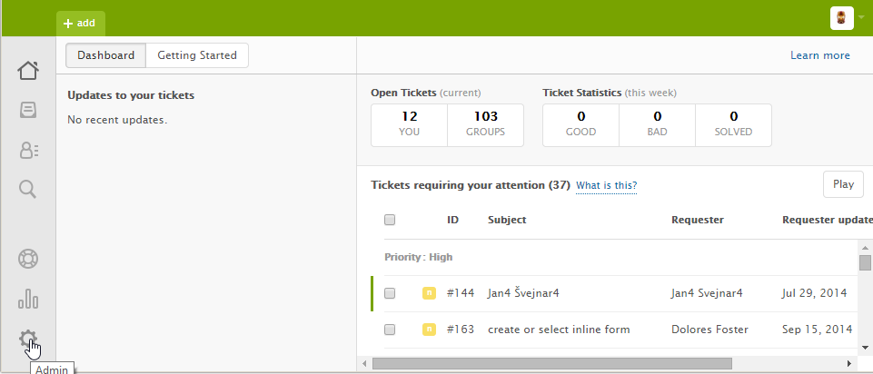
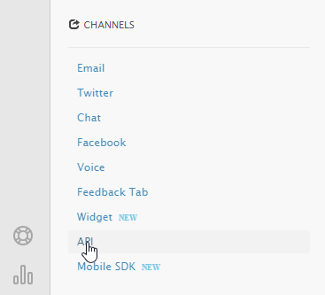
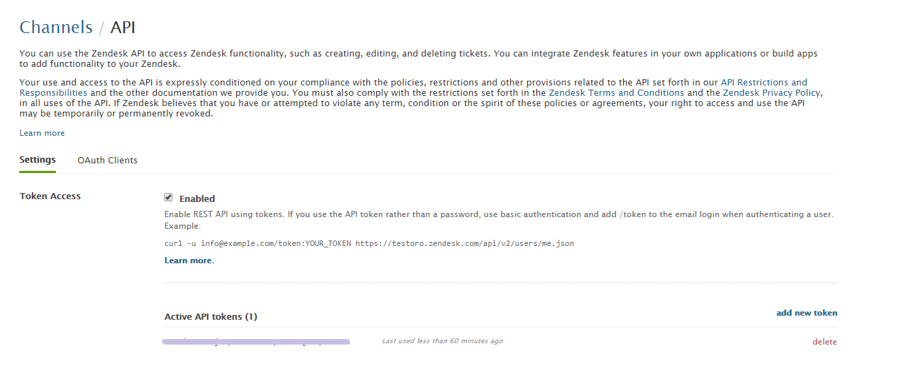
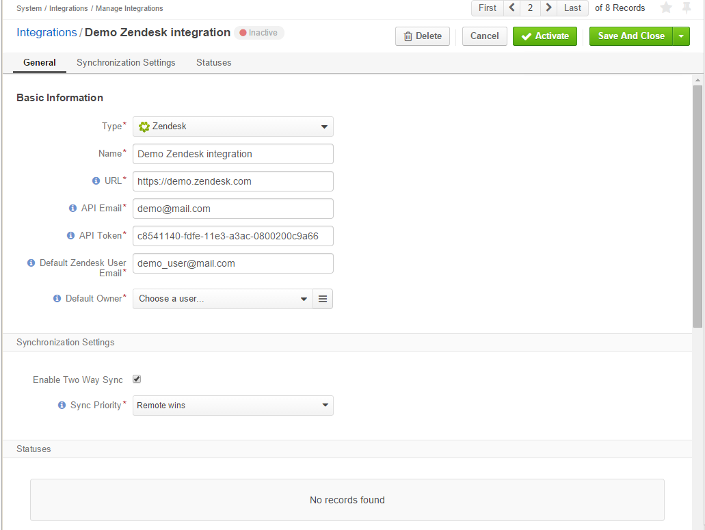
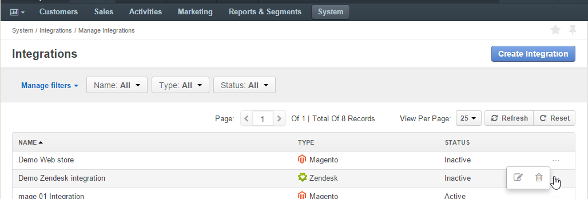

.. _user-guide-zendesk-integration:

Integration with Zendesk
========================

OroCRM supports out of the box integration with Zendesk.
The integration enables loading the data from your Zendesk account and processing it in the OroCRM.
This article describes how to define and edit the integration and synchronization settings.

.. hint::

    While Zendesk integration capabilities are pre-implemented, OroCRM can be integrated with different third-party
    systems.

On the Zendesk Side
-------------------

The only thing you will need on the Zendesk side, is to get your API token:

- Open your account and go to the *Admin* page.

- Go to the CHANNELS → API

- Make sure the *Token Access* is enabled
- Copy an active API token

On the Oro Side
---------------

Create Zendesk Integration
^^^^^^^^^^^^^^^^^^^^^^^^^^

- Go to the *"System → Integrations → Manage Integrations"* and click the :guilabel:`Create Integration` button.

- The "Create Integration" form will appear. 

- As soon as you've set the integration type to "Zendesk", the form will be recalculated to meet specific integration 
  requirements.

General
"""""""

Define the following mandatory details in the *"General"* section:

.. csv-table::
  :header: "Field", "Description"
  :widths: 10, 30

  "**Type***","The integration type. Shall be set to *Zendesk*"
  "**Name***","The integration name used to refer to it within the system."
  "**URL***","A URL of your Zendesk account (e.g. https://username.zendesk.com)."
  "**API Email***","The email used to register your Zendesk account."
  "**API Token***","The API token generated and/or copied on the Zendesk side as described above."
  "**Default Zendesk User Email**","The email used to assigned tickets created from OroCRM cases, if there is no Zendesk
  user with an email that matches the primary email of the user the case is assigned to."
  "**Owner**","Limits the list of users that can manage the integration to users, whose roles allow 
  managing integration assigned to the owner (e.g. the owner, members of the same business unit, system administrator, 
  etc.) Used as an OroCRM user for Zendesk tickets if there are no users with a matching email address."
  

.. _user-guide-zendesk-channel-integration-synchronization:

Synchronization Settings
""""""""""""""""""""""""

Use the *Synchronization Settings* section to enable/disable two way synchronization.

Check *Enable Two Way Sync* box, if you want to download data both from Zendesk to OroCRM and
back. If the box is unchecked, data from Zendesk will be loaded to OroCRM, but changes performed in OroCRM will not be
loaded to Zendesk.

If the two-way synchronization is enabled, define the priority used for the conflict resolution (e.g. if the same
customer details were edited from the both OroCRM and Zendesk):

- *Remote wins*: Zendesk data will be applied to the both Zendesk and OroCRM

- *Local wins*: OroCRM data will be applied to the both Zendesk and OroCRM

For example we have created a Demo Zendesk Integration with enabled two-way synchronization, where if the same data
has been changed from the both Zendesk and OroCRM, the Zendesk changes will take precedence.

.. _user-guide-Zendesk-channel-integration-details_edit:

Activate the Integration
^^^^^^^^^^^^^^^^^^^^^^^^

Initially the integration is inactive. In order to activate it, click the :guilabel:`Activate` button in the  
:ref:`View page <user-guide-ui-components-view-pages>`.

Edit the Integration
^^^^^^^^^^^^^^^^^^^^

All the integrations created will be available in the Integrations grid under the *"System → Integrations → Manage 
Integrations"*. Use the :ref:`grid action icon <user-guide-ui-components-grid-action-icons>` to delete (|IcDelete|) or 
edit (|IcEdit|) the integration details.

.. _user-guide-Zendesk-channel-start-synchronization:

Synchronization
---------------

Start Synchronization
^^^^^^^^^^^^^^^^^^^^^

Once integration has been created, the data will be automatically synchronized. However, you can also start the
synchronization manually from OroCRM:

- Go to the System → Integrations → Manage Integrations and click the |BSchedule|
  :ref:`grid action icon <user-guide-ui-components-grid-action-icons>` or

- Go to the :ref:`View page <user-guide-ui-components-view-pages>` of the :guilabel:`Schedule Sync` button. 
  *A sync* :ref:`job <book-job-execution>` *has been added to the queue.   Check progress.* note will appear.

- The data is being synchronized. You can click *Check progress* link to see the synchronization status.

Synchronization Process
^^^^^^^^^^^^^^^^^^^^^^^

First Synchronization from Zendesk to OroCRM
""""""""""""""""""""""""""""""""""""""""""""

- A new OroCRM case is created for every Zendesk ticket. The ticket fields are mapped at the OroCRM case fields as 
  follows:

.. csv-table::
  :header: "Zendesk Field", "OroCRM case field", "Comments"
  :widths: 20, 20, 40

  "Subject","Subject", "Can be used to find the ticket/case in the grid"
  "Description","Description","Is also added as the first public comment for the both OroCRM case and Zendesk ticket"
  "Assignee","Assigned to","The email address of the assignee is checked against primary emails of OroCRM :term:`User` 
  records:

      - If there is a matching email, the User is mapped to the Assignee field value.
      - If there is no matching email, the integration Owner is mapped to the Assignee field value.
  
  "
  "Description","Description", "Is also added as the first public comment for the both OroCRM case and Zendesk ticket"
  "Priority","Priority","The values are mapped as follows:
  
  .. list-table::
   :widths: 10 30
   :header-rows: 1
 
   * - Zendesk
     - OroCRM
    
   * - Low
     - Low

   * - Normal
     - Normal

   * - High
     - High

   * - Urgent
     - High
  "
  "Status","Status","The values are mapped as follows:
  
  .. list-table::
   :widths: 10 30
   :header-rows: 1
 
   * - Zendesk
     - OroCRM
    
   * - New
     - Open

   * - Open
     - Open

   * - Pending
     - In progress

   * - Solved
     - Closed
  "

.. image:: ./img/zendesk/example_ticket.png
  
- For each case created as a result of synchronization with Zendesk, a ticket is created in OroCRM. The following
  field values are defined as follows:
  
.. csv-table::
  :header: "OroCRM Ticket Field", "Description"
  :widths: 20, 40

  "Ticket Number","Zendesk ticket number. During the following synchronization settings the field value is used to 
  define if an existing case/ticket shall be updated or a new one must be created."
  "Recipients Email","Zendesk value of the Recipients Email field copied, if any."
  "Status","Zendesk status defined for the ticket copied (no mapping to the OroCRM statuses)."
  "Type","Zendesk type defined for the ticket copied."
  "Submitter","Contact or User. There are two possible cases:
  
  - If the ticket has been submitted to Zendesk by an end-user themselves (e.g. by Email or from the Facebook) an 
    OroCRM :term:`Contact` record is tied to it, as follows: 

    - The email address of the end-user is checked against primary emails of OroCRM :term:`Contact` records:

      - If there is a matching email, the Contact is mapped to the Submitter field value.
      - If there is no matching email, a new Contact is created and mapped to the Submitter field value.

    - The mapped OroCRM contact name and link to it are displayed as a value for the Submitter field in the ticket 
      created in OroCRM.
      
      (So, for example, if the ticket was submitted by the user *DreamWorks Founer* in Zendesk and the user's email 
      matches the email of an OroCRM Contact *Steven Spielberg*, the Submitter field in the ticket in OroCRM will be
      filled with the value *Steven Spielberg*).
  
  - If the ticket has been submitted to Zendesk from Zendesk by an agent or administrator, an OroCRM :term:`User` record
    is tied to it, as follows: 

    - The email address of the submitter is checked against primary emails of OroCRM :term:`User` records:

      - If there is a matching email, the User is mapped to the Submitter field value.
      - If there is no matching email, the integration Owner is mapped to the Submitter field value.

  "
  "Assignee","The email address of the assignee is checked against primary emails of OroCRM :term:`User` records:

      - If there is a matching email, the User is mapped to the Assignee field value.
      - If there is no matching email, the integration Owner is mapped to the Assignee field value.

  "
  "Requester","an OroCRM :term:`Contact` record is tied to it, as follows: 

  - The email address of the requester in Zendesk is checked against primary emails of OroCRM :term:`Contact` records:

    - If there is a matching email, the Contact is mapped to the Requester field value.
    - If there is no matching email, a new Contact is created and mapped to the Requester field value.

  "
  "Priority","Zendesk priority defined for the ticket copied (no mapping to the OroCRM priorities)."
  "Problem","Zendesk value of the Problem field copied, if any."
  "Collaborators","Zendesk value of the Collaborators field copied, if any."

Synchronization from OroCRM to Zendesk
""""""""""""""""""""""""""""""""""""""

If two-way synchronization is enabled, :guilabel:`Piblish to Zendesk` will be available in the Case 
:ref:`View page <user-guide-ui-components-view-pages>`. Click the button and the case will be submitted to Zendesk.

The case fields are mapped at the Zendesk ticket fields as follows:

.. csv-table::
  :header: "OroCRM case field", "Zendesk field", "Comments"
  :widths: 20, 20, 40

  "Subject","Subject", "Can be used to find the ticket/case in the grid"
  "Description","Description","Is also added as the first public comment for the both OroCRM case and Zendesk ticket"
  "Assigned to","Assignee","The email address of the *Assigned to* user records is checked against emails of Zendesk 
  users:

      - If there is a matching email, the ticket is assigned to the related user.
      - If there is no matching email, the ticket is assigned to the user with Default Zendesk User Email.
  
  "
  "Description","Description", "Is also added as the first public comment for the both OroCRM case and Zendesk ticket"
  "Priority","Priority","The values are mapped as follows:
  
  .. list-table::
   :widths: 10 30
   :header-rows: 1
 
   * - OroCRM
     - Zendesk
    
   * - Low
     - Low

   * - Normal
     - Normal

   * - High
     - High

  "
  "Status","Status","The values are mapped as follows:
  
  .. list-table::
   :widths: 10 30
   :header-rows: 1
 
   * - OroCRM
     - Zendesk
    
   * - Open
     - Open

   * - In progress
     - Pending

   * - Resolved
     - Solved

   * - Closed
     - Solved
  "

- After the ticket has been created in Zendesk, its details are saved in the Ticket related to the case in OroCRM.
  
Further Synchronization
"""""""""""""""""""""""
  
- If some ticket details of a Zendesk ticket have been changed after the initial synchronization, the corresponding 
  OroCRM case details will also be updated in the course of the nearest synchronization.
- If some ticket details of an OroCRM case have been changed after the initial synchronization, the corresponding 
  Zendesk ticket details will also be updated automatically (if the two-way synchronization is enabled).
- If the same details have been updated in a related Zendesk ticket and OroCRM case and the two-way synchronization is 
  enabled, the synchronization priority settings will be applied.

.. |IcCross| image:: ./img/buttons/IcCross.png
   :align: middle

.. |BSchedule| image:: ./img/buttons/BSchedule.png
   :align: middle

   
.. |IcDelete| image:: ./img/buttons/IcDelete.png
   :align: middle

.. |IcEdit| image:: ./img/buttons/IcEdit.png
   :align: middle

.. |IcView| image:: ./img/buttons/IcView.png
   :align: middle