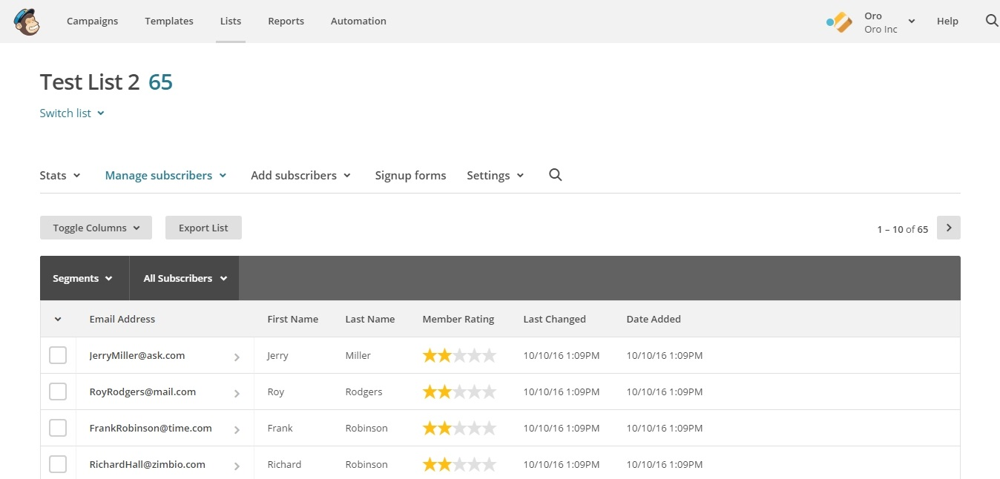

.. _user-guide-mailchimp-campaign:

Sending Email Campaign via MailChimp
====================================

.. contents:: :local:
    :depth: 2

Flow
----

.. image:: ../../img/mc_email_campaign/oro_mc_integration.jpg
   :alt: Sending email campaign via mailchimp

Prepare Data for the Campaign in OroCRM
---------------------------------------

Email campaign is based on data in marketing lists. In order to
prepare a campaign in OroCRM, you need to create a :ref:`Marketing List<user-guide-marketing-lists>` first.

This list will create a segment on the MailChimp side. Go to
**Marketing>Marketing Lists>Create Marketing List.**

You need to complete the following fields to create your marketing list:

+-----------------+--------------------------------------------------------------------------------------------------------------------------------------------------------------------------------------------------------+
| **Field**       | **Description**                                                                                                                                                                                        |
+=================+========================================================================================================================================================================================================+
| **Name**        | Name used to refer to the marketing list in the system.                                                                                                                                                |
+-----------------+--------------------------------------------------------------------------------------------------------------------------------------------------------------------------------------------------------+
| **Description** | Optional field. Can be filled with text to help you and other users understand the purpose of the list in future.                                                                                      |
+-----------------+--------------------------------------------------------------------------------------------------------------------------------------------------------------------------------------------------------+
| **Entity**      | Data to be synchronized into the marketing list will depend on the entity we select.                                                                                                                   |
+-----------------+--------------------------------------------------------------------------------------------------------------------------------------------------------------------------------------------------------+
| **Type**        | Type refers to the type of marketing list update. Dynamic Type means that all changes you make to your marketing list will be automatic. On Demand type means that updates will be performed manually. |
+-----------------+--------------------------------------------------------------------------------------------------------------------------------------------------------------------------------------------------------+
| **Owner**       | Limits the list of users that can manage the marketing list to the users, whose :ref:`roles <user-guide-user-management-permissions-roles>` allow managing marketing lists of the owner                |
+-----------------+--------------------------------------------------------------------------------------------------------------------------------------------------------------------------------------------------------+

.. note:: You can add multiple columns to your marketing list in OroCRM but only First Name, Last Name and Email details will be synced over to MailChimp.

Note that adding an Email column is vital to be able to send an email campaign via MailChimp.

.. image:: ../../img/mc_email_campaign/o_marketing_list_email.jpg
   :alt: Add email field to the columns

Click **Save and Close** when you are finished.

Sync OroCRM Marketing List Data with MailChimp List
---------------------------------------------------

Now it is time to create a list on the MailChimp side. Login to your
MailChimp account. Click on **Lists** in the menu above.

.. image:: ../../img/mc_email_campaign/mc_create_list.jpg
   :alt: Click create list in the lists

A page will open with the following fields to fill in:

+-----------------------------------------------------+---------------------------------------------------------------------------------+
| **Field**                                           | **Description**                                                                 |
+=====================================================+=================================================================================+
| **List Name**                                       | The name of the list that will be seen by all your subscribers.                 |
+-----------------------------------------------------+---------------------------------------------------------------------------------+
| **Default From Email Address**                      | Enter the address people can reply to.                                          |
+-----------------------------------------------------+---------------------------------------------------------------------------------+
| **Default From Name**                               | This will be displayed as the sender of the email, e.g. name of your company.   |
+-----------------------------------------------------+---------------------------------------------------------------------------------+
| **Remind People How They Signed up to Your List**   | Enter text message into the text field.                                         |
+-----------------------------------------------------+---------------------------------------------------------------------------------+
| **Contact Information for This List**               | Enter/edit your contact address information                                     |
+-----------------------------------------------------+---------------------------------------------------------------------------------+
| **Notifications**                                   | Select the notifications to be sent to your provided email                      |
|                                                     |                                                                                 |
|                                                     | -  Daily summary (Summary of subscribe/unsubscribe activity)                    |
|                                                     |                                                                                 |
|                                                     | -  One-by-one (Subscribe notifications as they happen)                          |
|                                                     |                                                                                 |
|                                                     | -  One-by-one (Unsubscribe notifications as they happen).                       |
+-----------------------------------------------------+---------------------------------------------------------------------------------+

Once you are done, click **Save** at the bottom of the page. You have
just created a brand new list in MailChimp.

Now, we need to upload subscribers from OroCRM into our newly created
MailChimp list. In order for OroCRM to see this list, we need to:

-  Go back to OroCRM.

-  Navigate to **System>Manage Integrations**.

-  Select our MailChimp integration.

-  Click **Schedule Sync** in the top right corner.

You can map contents of OroCRM marketing list to use a segment of the
**Subscribers List** in MailChimp. To do this:

-  Navigate to **Market>Marketing Lists** and select the list you would
   like to use.

-  Click **Connect to MailChimp** in the top right corner.

-  Enter your **MailChimp Segment Name**.

-  Choose your **MailChimp Integration**.

-  Select the **MailChimp Subscribers List** that we have just created.

-  Press **Connect.**

.. image:: ../../img/mc_email_campaign/o_select_mc_subscribers_list2.jpg
   :alt: "Connect to mailchimp" form

Once you are connected, you will also notice a MailChimp button appear
at the top with the following actions in the dropdown:

+-------------------------+---------------------------------------------------------------------------+
| **Field**               | **Description**                                                           |
+=========================+===========================================================================+
| **Sync**                | Start sync manually                                                       |
+-------------------------+---------------------------------------------------------------------------+
| **Connection Settings** | Change connection or integration for the current marketing list in OroCRM |
+-------------------------+---------------------------------------------------------------------------+
| **Disconnect**          | Disconnect the list from the segment                                      |
+-------------------------+---------------------------------------------------------------------------+

.. note:: Please be aware that if a marketing list contains invalid emails, they can be rejected by MailChimp and excluded from further synchronization.

At this point, if you go back to MailChimp, you will be able to see data
from OroCRM (subscribers’ first and last names and contact details)
synced into your MailChimp list. Other information that you may have
specified when creating a list on the OroCRM side, such as dates of
birth or custom details, will not be synced.

Create and Send Campaign on the MailChimp Side
----------------------------------------------

.. image:: ../../img/mc_email_campaign/mc_create_campaign.jpg
   :alt: Create and send campaign on the mailchimp side

Now that you have configured integration with MailChimp and created a
marketing list, it is time to create and send campaign on the MailChimp
side.

Once you have logged into your MailChimp account, click **Create
Campaign** in the upper right corner.

You will be asked about the type of the campaign you would like to
select. You can choose one of the following:

-  Regular Campaign

-  Plain Text Campaign

-  A/B Testing Campaign

-  RSS Campaign

.. image:: ../../img/mc_email_campaign/mc_select_campaign.jpg
   :alt: Select a type of campaign to send in the campaign builder

.. note:: Please note that OroCRM is unable to receive email campaigns from segments used in automation programs.

When you are done with the campaign type, choose a list to be sent out
in your email campaign. Here we can select the list segment that we
created before.

.. image:: ../../img/mc_email_campaign/mc_sending_to_test_list2.jpg
   :alt: Select the list segment

When you have selected your list, go to the lower right corner and click
**Next.** You will see the following options:

-  Entire List

-  Saved or Pre-Built segment

-  Group or a new segment

**Entire list** is the entire collection of contacts. In our case,
however, make sure that you send your email campaign to a segment of the
list, i.e. a selected number of contacts within the entire list.
Otherwise, the contacts will **not** get synced back to OroCRM. To do that,
tick **Saved or pre-built segment.** A list of segments, created on the
OroCRM side, will appear below. Just click on the list that you would
like to use. Next, press the **Update Recipient Count** button.

.. image:: ../../img/mc_email_campaign/mc_choose_segments.jpg
   :alt: A list of segments, created on the OroCRM side

**Pre-Built Segments** section of the same page allows you to choose
contacts based on **Subscriber Engagement** (New Subscribers, Active
Subscribers, Inactive Subscribers), or **Customer Behavior and
Demographics (**\ available after connection to your store)\ **.**

Click **Next** when you are finished. This will redirect you the next page
to complete your campaign information:

-  Name your Campaign

-  Enter Subject

-  From Name

-  From Email

**Tracking Options** can be found below the form. Tick the options that
you find useful to you (e.g. track opens, track clicks, etc). If you
wish to promote your email in social media, select **Connect to
Twitter** or **Connect to Facebook**.

.. image:: ../../img/mc_email_campaign/mc_tracking.jpg
   :alt: Tracking options

To add relevance to your emails and to avoid spam filters, you can
personalize emails in your campaign. To do that, check **Personalize the
‘To’ field.** You will be asked to include **Merge Tags** to your email.
Merge tags are personalization options. They include the names of the
subscribers you want to send your emails to. In the provided field,
specify merge tags for your recipients, i.e. \*\|FNAME\|\* or
\*\|FNAME\|\* \*\|LNAME\|\*\ **.**

.. image:: ../../img/mc_email_campaign/mc_campaign_Info.jpg
   :alt: Check personalize the "to" field

Once you are done, click **Next** in the lower right corner. You can
also click on the links at the bottom of the page, they will redirect
you to the same place.

Select a template among a pre-set number of campaign templates, or
create your own.

.. image:: ../../img/mc_email_campaign/mc_select_templates.jpg
   :alt: Select a template among a pre-set number of campaign templates, or create your own

When you have chosen the template that suits you best, go the next page
and design your email following the instructions on the page.

To ensure that your address each of your contacts by name, select
**Merge Tags** and **First Name** in the options within **Content** text
window. This way, if you type in Hi \*\|FNAME\|\*, your subscribers will
see their first name instead of their email address in the campaign they
receive from you.

As soon as you are done with the text, click **Confirm** and review what
you have done before it goes out to your subscribers.

When you have ensured that everything is correct, press **Send** in the
lower right corner. A **Prepare For Launch** pop up window will appear.
Press **Send Now. High Fives** message means that you campaign has
joined the send queue.

To look at your campaign statistics on the MailChimp side, click **Track
Performance in Reports** on the same page. To do this manually, go to
**Campaigns>View Report**. Here, you check out subscriber activity for
your newly created email campaign.

.. image:: ../../img/mc_email_campaign/mc_campaign_in_queue.jpg
   :alt: Click track performance in reports on the mailchimp side

.. image:: ../../img/mc_email_campaign/mc_statistics.jpg
   :alt: Halloween offers

Receive Campaign Statistics on the OroCRM Side
----------------------------------------------

Once you have sent out your email campaign in MailChimp, information
about your email campaign should have been exported to OroCRM.

As soon as export has been completed, your email campaign should appear
in **Marketing>Email Campaigns.** By clicking on your recent campaign,
you will be able to see subscriber activity statistics, such as the
number of clicks, bounces, opens, etc. Numbers in each column for each
contact define the number of times an action has been performed, e.g. 2
opened, 1 click, 1 unsubscribe. These statistics will help you
understand the outcome of your campaign and let you filter contacts for
the next one.

.. image:: ../../img/mc_email_campaign/o_email_campaign_info.jpg
   :alt: Receive campaign statistics on the Oro application

.. note:: Please note that sometimes Mailchimp's summary information may not match the OroCRM summary in the same report. This may happen because one set of statistics comes from Mailchimp directly. The other is generated as we receive specific reporting data back about recipients.

For instance, if you need to exclude customers who did not open your
email from the next campaign, go to **Marketing>Marketing List>Create
New Marketing List.** Fill in the mandatory fields, remembering to
include at least one contact column below.

In the :ref:`Filters<user-guide-filters-management>` section:

-  Drag **Apply Segment** to the field on the right.

-  Choose the list that you used for your previous campaign.

-  Drag **Field Condition** to set the conditions to the list.

-  Select **Contact>Contact Method (Contact)>Contact (Magento
   Customer)>Marketing List (Email Campaign)>Email Campaign (MailChimp
   Campaign)>Opens.**

-  Select **Field Value.** In our case, it is 0.

.. image:: ../../img/mc_email_campaign/o_segment_opens_zero.jpg
   :alt: Select field value in filters

The same way you can apply any conditions of your choice.

When you are done, make sure you click **Save and Close**.

This list will now appear in the **Marketing List** :ref:`Page<user-guide-ui-components-view-pages>` and will
now contain contacts sorted according to your conditions.

Related Articles
----------------

:ref:`Configure MailChimp Integration <user-guide-mc-integration>`
