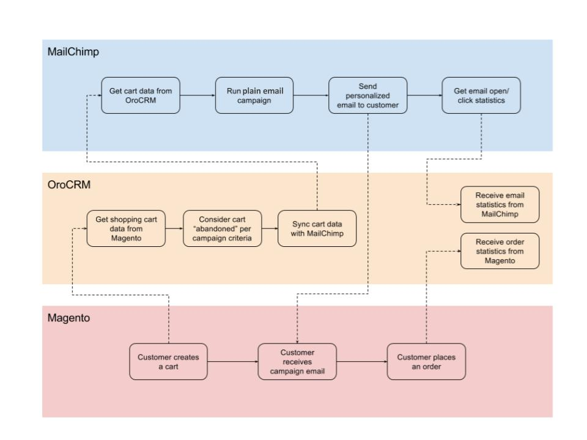
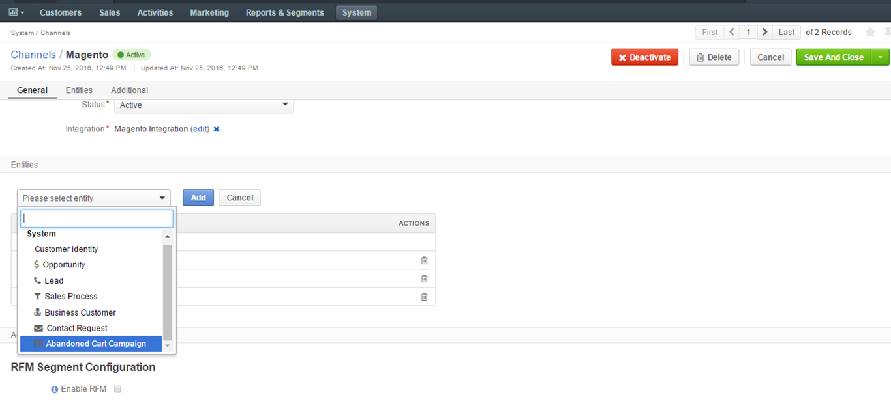
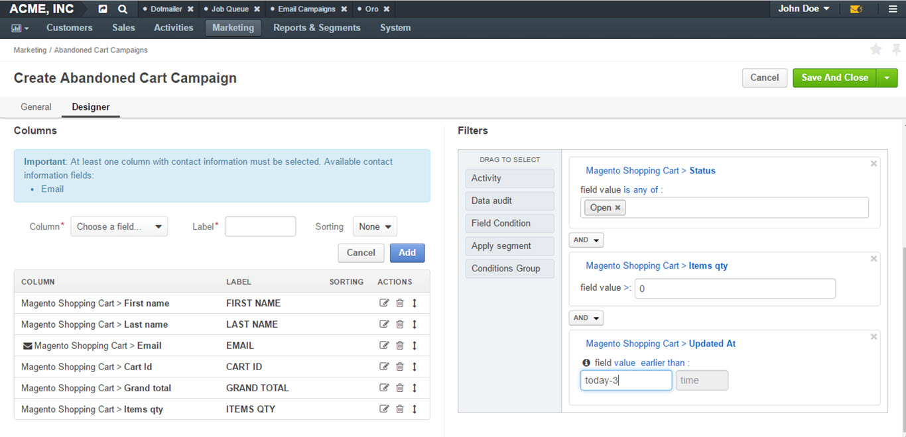
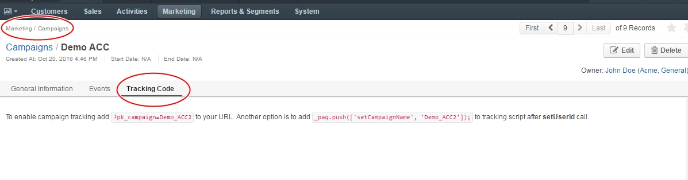
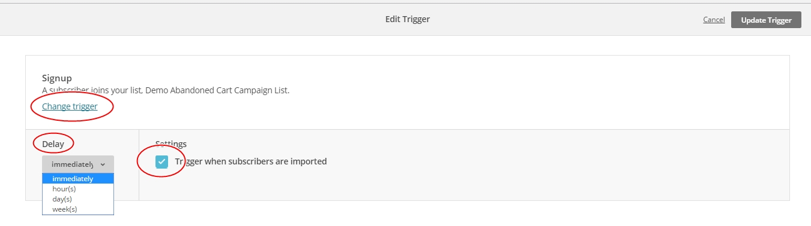
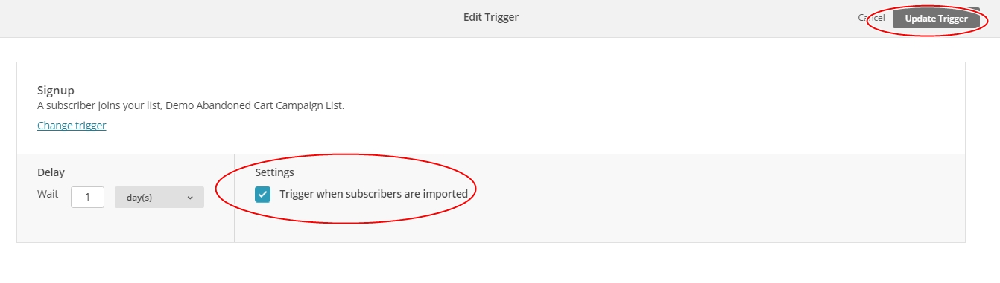
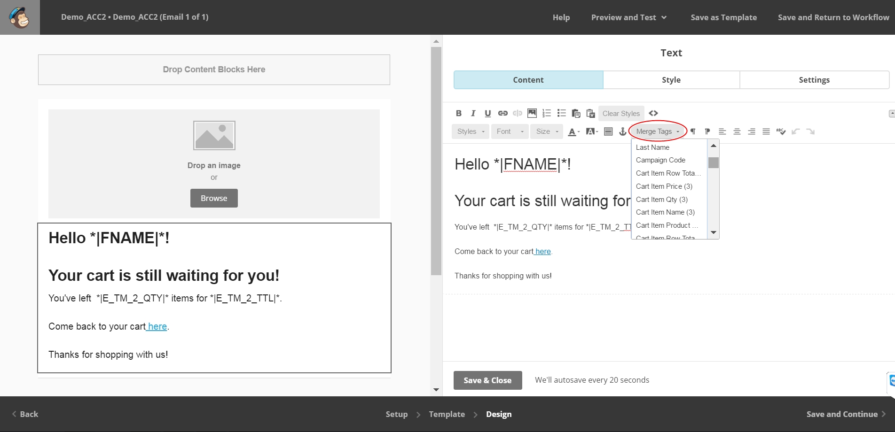
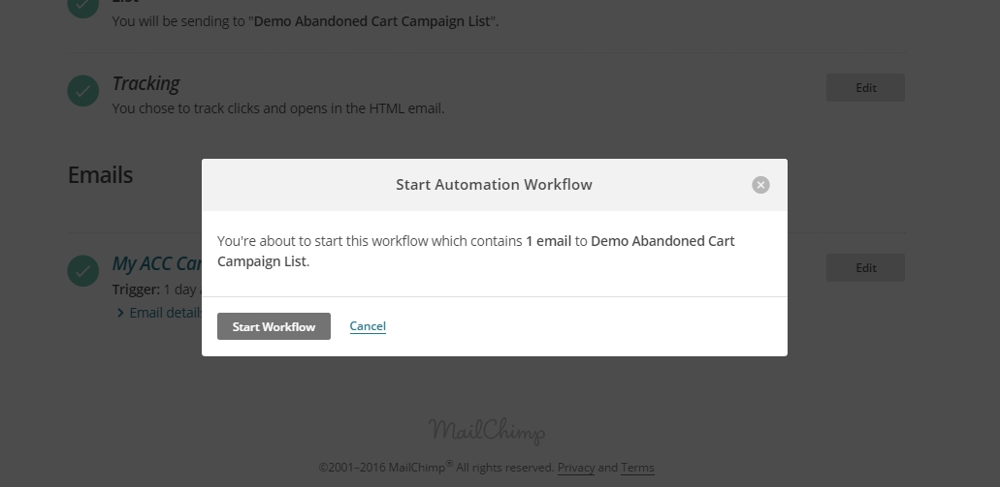
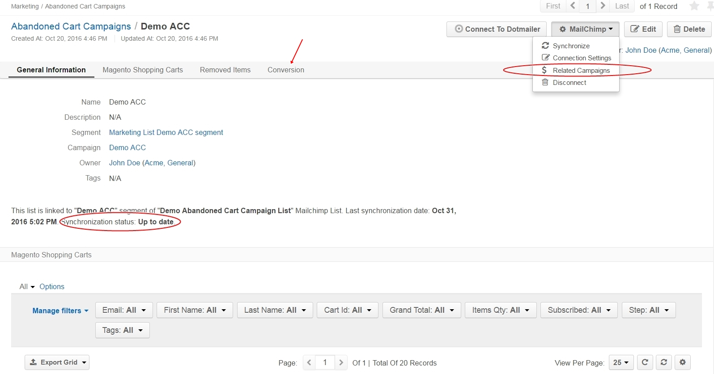
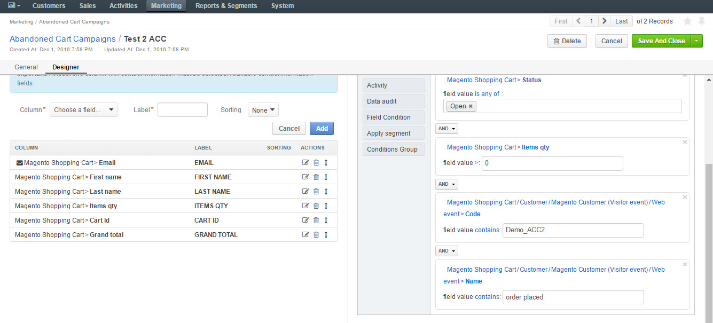

.. _user-guide-acc:

Magento Abandoned Cart Campaigns 
================================

OroCRM’s Magento Abandoned Cart Campaign (ACC) functionality enables
users to receive additional store revenue by increasing conversion of
abandoned carts.

To increase this conversion, OroCRM allows to:

-  Segment the necessary carts from all the carts available in OroCRM.

-  Synchronize customer and cart data with MailChimp.

-  Create an ongoing automation campaign in MailChimp for all carts that
   become abandoned.

-  Receive statistics on clicks and opens to monitor email campaign
   effectiveness.

-  Trace orders resulted from the email campaign to evaluate cart
   conversion and economic benefit.

The following guide will take you through the process of sending ACCs
step by step:

.. contents:: :local:

Flow: Sending an Abandoned Cart Campaign
----------------------------------------

Requirements for Abandoned Cart Campaign
----------------------------------------

In order to send an ACC, you need to have:

-  A Magento Abandoned Cart Extension installed

-  An Active Magento Integration created

-  An Active MailChimp Integration created

Step 1: Enable Abandoned Cart Campaign in the system
----------------------------------------------------

To install the Abandoned Cart Functionality:

-  Navigate to **System>Package Manager**.

-  Enter login credentials.

-  Enter the package name **oro/crm-abandoned-cart**.

-  Click :guilabel:`Install`.

-  Disable **Load Demo Data** check box.

-  Click :guilabel:`Continue`.

.. note:: Ensure that your Magento channel has the Abandoned Cart Campaign entity added to the list of entities managed by the channel. Otherwise, Abandoned Cart Campaign entity will not be available in the main menu.

Step 2: Create MailChimp Integration
------------------------------------

It is necessary to have an active MailChimp Integration to be able to
send an ACC. See the corresponding section of the `Sending Email Campaign via MailChimp <../../../admin-guide/sending-email-campaign-via-mailchimp>`_ guide for MailChimp integration instructions.

Step 3: Add an Abandoned Cart to the Channel
--------------------------------------------

Create a Magento Channel for which your ACC will be used. See how to
create a Channel in the :ref:`Channels <user-guide-channels>` guide. Make sure that all
channels that represent Magento stores contain the ACC entity:

.. image:: ../../img/sending_abandoned_cart_campaigns/o_channel_magento_channel.jpg

Step 4: Create an Abandoned Cart Campaign
-----------------------------------------

-  Navigate to **Marketing>Abandoned Cart Campaigns**.

-  Click :guilabel:`Create Abandoned Cart Campaign` in the top right
   corner of the grid.

-  Define the settings as described below:

+-----------------+------------------------------------------------------------------------------------------------------------------------------------------------------------------------------------------------------------------------------------------------------------------------------------------------------------------------------------------------------------------------------------------------------------------------------------------------------------------------+
| **Field**       | **Description**                                                                                                                                                                                                                                                                                                                                                                                                                                                        |
+=================+========================================================================================================================================================================================================================================================================================================================================================================================================================================================================+
| **Name**        | Name used to refer to the list of abandoned cart contacts in the system                                                                                                                                                                                                                                                                                                                                                                                                |
+-----------------+------------------------------------------------------------------------------------------------------------------------------------------------------------------------------------------------------------------------------------------------------------------------------------------------------------------------------------------------------------------------------------------------------------------------------------------------------------------------+
| **Owner**       | Limits the list of users who can manage the campaign. It is by default set to the user creating the ACC campaign.                                                                                                                                                                                                                                                                                                                                                      |
+-----------------+------------------------------------------------------------------------------------------------------------------------------------------------------------------------------------------------------------------------------------------------------------------------------------------------------------------------------------------------------------------------------------------------------------------------------------------------------------------------+
| **Description** | Optional field that can be filled in with details to help you and other users understand the peculiarities of the list in the future.                                                                                                                                                                                                                                                                                                                                  |
+-----------------+------------------------------------------------------------------------------------------------------------------------------------------------------------------------------------------------------------------------------------------------------------------------------------------------------------------------------------------------------------------------------------------------------------------------------------------------------------------------+
| **Filters**     | By default, the **Status** field value is set to **Open**. If you do not apply any other conditions, all the carts abandoned during the checkout will be covered by the mailing.                                                                                                                                                                                                                                                                                       |
|                 | You can use other filters to choose those abandoned cart records that fit your marketing purposes. For example, this could be carts the belong to customers from a specific state and/or with a birthday within a specific month, carts created after a certain date, or specified with other combinations of filter conditions. More information about the ways to define filters is provided in the :ref:`Filters Management <user-guide-filters-management>` guide. |
+-----------------+------------------------------------------------------------------------------------------------------------------------------------------------------------------------------------------------------------------------------------------------------------------------------------------------------------------------------------------------------------------------------------------------------------------------------------------------------------------------+
| **Columns**     | Defines a set of fields that will be sent to MailChimp and used in the email template as variables. At least one contact information column **must** be specified. In our case, it is **Email.** The same fields will be displayed in the grid to visualize the carts that meet the conditions in OroCRM. Details such as names, URLs, etc. are transferred to MailChimp automatically.                                                                                |
+-----------------+------------------------------------------------------------------------------------------------------------------------------------------------------------------------------------------------------------------------------------------------------------------------------------------------------------------------------------------------------------------------------------------------------------------------------------------------------------------------+

-  Once all the necessary fields have been completed, click :guilabel:`Save and Close`. Your newly created ACC will appear in the grid.

As an illustration, we have created a sample ACC and named it *Demo ACC*. You can see it in the screenshots below.

|

|

.. image:: ../../img/sending_abandoned_cart_campaigns/oro_created_acc_campaign.jpg

|

As you can see from the screenshot, the **Status** field is marked
**Open**. This is a default setting as we are looking for carts that
have not been closed yet. This is what qualifies them abandoned.

Later, we will be sending and ACC via MailChimp. The cart ID, customers’
last names and emails will be transferred to the MailChimp account for
every such cart and can be used as variables for email campaigns. If the
cart is converted into an order, it will be removed from the list. If a
new cart is abandoned that meets the campaign’s conditions, it will be
added to the list.

Since we do not want to send email notifications to all abandoned carts
and bother the customers in vain, we have chosen to set the **earlier
than today-3** variable (where “-“ is a minus and “3” is the number of
days) as a condition in **Filters**. This means that we are looking for
carts that have been updated earlier than 3 days ago.

Note: If we set an exact date as a variable, then within a certain
period of time such condition would lose its relevance. That is why it
is recommended to use *today, today-X*, etc. as a variable.

The following actions are available for an ACC from the grid:

-  Delete campaign from the system : |IcDelete|

-  Edit campaign : |IcEdit|  

-  View campaign: |IcView|

 |

 .. image:: ../../img/sending_abandoned_cart_campaigns/oro_ACC_grid.jpg

 |
 
 
 
When an ACC is saved, a campaign is automatically created as well, and
if at this point we go to **Marketing>Campaigns**, we will see out newly
created ACC in the grid.

|

.. image:: ../../img/sending_abandoned_cart_campaigns/oro_marketing_campaigns_grid.jpg

|

The view page of an ACC contains the following sections:

+------------------------------+---------------------------------------------------------------------------------------------------------------------------------------------------------------------------------------------------------------------------------------------------------------------------------------------------------------------------------------------------------------------+
| **Field**                    | **Description**                                                                                                                                                                                                                                                                                                                                                     |
+==============================+=====================================================================================================================================================================================================================================================================================================================================================================+
| **General Information**      | General details of the campaign, such as Name, Description, Segment and Owner.                                                                                                                                                                                                                                                                                      |
+------------------------------+---------------------------------------------------------------------------------------------------------------------------------------------------------------------------------------------------------------------------------------------------------------------------------------------------------------------------------------------------------------------+
| **Magento Shopping Carts**   | Contains a grid of all abandoned shopping carts that are included in the campaign. Initially, all users on the list are marked subscribed, therefore the value in the **Subscribed** column is **Yes**. If a user unsubscribes during one of the email campaigns, the value will change into **No** and this user will be excluded from the next email campaigns.   |
+------------------------------+---------------------------------------------------------------------------------------------------------------------------------------------------------------------------------------------------------------------------------------------------------------------------------------------------------------------------------------------------------------------+
| **Removed Items**            | This grid will contain carts that have been removed from the list. A cart may be removed from OroCRM and/or from MailChimp after synchronization.                                                                                                                                                                                                                   |
+------------------------------+---------------------------------------------------------------------------------------------------------------------------------------------------------------------------------------------------------------------------------------------------------------------------------------------------------------------------------------------------------------------+
| **Conversion**               | Items that were initially added to the campaign as carts but later turned into orders.                                                                                                                                                                                                                                                                              |
+------------------------------+---------------------------------------------------------------------------------------------------------------------------------------------------------------------------------------------------------------------------------------------------------------------------------------------------------------------------------------------------------------------+

As an illustration for this Demo ACC, we have created a cart on the
Magento side but have not completed our order.

|

.. image:: ../../img/sending_abandoned_cart_campaigns/mg_cart.jpg

|

Once we leave the store and go back to OroCRM, an abandoned cart will be
created with the customer’s and cart details. Make sure you synchronize
your integration by going to **System>Integrations** and selecting your
Magento integration.

Step 5: Set Up Tracking Website Record 
--------------------------------------

For Magento Abandoned Cart Campaigns, OroCRM provides an out-of-the-box
conversion tool. This means that you can see how many carts have been
converted into orders through your campaign.

To enable such conversion, you should create a **Tracking Website
Record** following instructions in this :ref:`section <user-guide-marketing-tracking>` of the guide. When
creating the record, make sure that:

-  The **Url** value is the URL address of the Magento store, for which Abandoned Cart Campaign is created.

-  The **Channel** value is the channel of the Magento store, for which Abandoned Cart Campaign is created.

Once you have created such record, it should be available in
**Marketing>Tracking Websites.** We have set up a Magento Channel record
as an illustration.

|

.. image:: ../../img/sending_abandoned_cart_campaigns/oro_tracking_websites.jpg

|

A tracking website record allows you to add a **Tracking Code** to the
website to track your campaign-related user activities. The code is
located in the **Tracking code tab** of your tracking website record.

|

.. image:: ../../img/sending_abandoned_cart_campaigns/oro_tracking_code.jpg

|

Now we have the abandoned cart campaign (Demo ACC) and a tracking
website record (Magento Channel) ready.

-  Go to **Marketing>Campaigns.**

-  Open your ACC.

-  Navigate to the **Tracking Code** tab.

Here, you will see the code of your campaign.

|

|

You can assign a tracking website record to your campaign in two steps.

1. You can add the code from the :ref:`View Page of the Campaign <user-guide-marketing-campaigns-view-page>`.
   (see the screenshot above) to the tracking script from the :ref:`View Page of the Website Tracking record <user-guide-marketing-tracking-websites-view-page>` (e.g. Magento Channel in our case) after **setUserId** call (e.g.  _paq.push(['setCampaignName', 'Demo\_ACC2']);). This code is added to the page of the website that you wish to track before the </body> tag. Each time a user reaches a page with such a code, an
   event is logged within the campaign.

   |

   .. image:: ../../img/sending_abandoned_cart_campaigns/oro_tracking_code_highlights.jpg

   |
   
   

 .. note:: If you have OroCRM Tracking extension installed, this tracking code will be added to your Magento Store for you. You can read more on Magento Web Tracking in the corresponding section of the guide.

     
      
2. Add the piece of code from the :ref:`campaign view page <user-guide-marketing-campaigns-view-page>` (e.g. ``?pk\_campaign=Demo\_ACC2``) to the Magento store’s URL and use this modified URL as a link in your MailChimp automation emails. Each time a user reaches a page with such a URL, an event will be logged within the campaign (e.g. ``http://XXXX/checkout/cart/?pk_campaign=Demo_ACC2``).

   This tracking code will be automatically passed to MailChimp and can be used as a variable in emails. When we start designing our email in MailChimp automation, the campaign code variable will be available on the list of **Merge Tags** (\|E\_CMPGN\_CD\| variable). This code will be synced to MailChimp during synchronization with Oro (see Step 7).

Step 6: Prepare Data For Automation
-----------------------------------

-  Log into your MailChimp account.

-  Navigate to **Lists** and click :guilabel:`Create a List`.

-  Complete the required fields and click :guilabel:`Save`.
   
 |

 .. image:: ../../img/sending_abandoned_cart_campaigns/mc_list_created.jpg

 |
 
 

At this point your list should be empty. After OroCRM’s synchronization
with MailChimp, an ACC list will be mapped to MailChimp as a segment.
You can also map campaign as a segment of any subscribers’ list
available to you in MailChimp.

To map the list to a segment:

-  Go back to OroCRM.

-  Navigate to **Marketing>Abandoned Cart Campaigns**.

-  Open your ACC.

-  Click :guilabel:`Connect to MailChimp` in the upper-right corner.

-  Select your MailChimp Integration and the list segment on the
   MailChimp side.

-  Click :guilabel:`Connect`.

-  Once connected, navigate to MailChimp button in the upper-right corner.

-  Click :guilabel:`Synchronize`.
   

 |

 .. image:: ../../img/sending_abandoned_cart_campaigns/oro_connect_to_mc.jpg

 |

 

 .. image:: ../../img/sending_abandoned_cart_campaigns/oro_connect_to_mc_sync.jpg

 |
 
 

 .. image:: ../../img/sending_abandoned_cart_campaigns/oro_connect_to_mc_sync_up_to_date.jpg

 |
 
 
 
 
 
 

Once the connection has been marked as **Up To Date**, go back to your
MailChimp account. Your ACC should have now been synced to your
MailChimp list which will now contain all the users from your campaign
along with the details of their carts.

|

.. image:: ../../img/sending_abandoned_cart_campaigns/mc_list_synced.jpg

|

Step 7: Create Automated Campaign
---------------------------------

It is time to create automation for your campaign in MailChimp:

-  Click the :guilabel:`Automation` tab in the upper menu.

-  Click :guilabel:`Add Automation` in the upper-right corner.
 

|

.. image:: ../../img/sending_abandoned_cart_campaigns/mc_add_automation_button.jpg

|

-  Select **Custom** from the left-hand menu.

-  Click :guilabel:`Add Automation`.

    
|

.. image:: ../../img/sending_abandoned_cart_campaigns/mc_cutom_add_automation.jpg

|

-  Give your automation a name and select the list that we created in
   MailChimp and synchronized with OroCRM.

|

.. image:: ../../img/sending_abandoned_cart_campaigns/mc_name_automation.jpg

|

-  On the newly opened page, click :guilabel:`Edit Trigger`.
 
|

.. image:: ../../img/sending_abandoned_cart_campaigns/mc_edit_segment_edit_trigger.jpg

|

-  Choose settings for the trigger or click :guilabel:`Change Trigger` for more
   options.

|

|

-  For our demo campaign, let us assume that we need emails to be sent
   every time as a new subscriber joins the list. To configure this,
   choose **Change Trigger**, open **List Management** tab and select
   **Signup: A subscriber joins your list.**

|

.. image:: ../../img/sending_abandoned_cart_campaigns/mc_edit_trigger_list_management.jpg

|

-  Enable the **Trigger when subscribers are imported** box. This is
   necessary for correct interaction between OroCRM and MailChimp during
   automation workflow.

|

|

-  Click :guilabel:`Update Trigger` when you are finished.

-  Next, we need to add a segmentation condition by clicking :guilabel:`Edit
   Segment`.

|

.. image:: ../../img/sending_abandoned_cart_campaigns/mc_edit_segment_edit_trigger.jpg

|

-  Enable **Choose Segmentation Conditions** box

-  Choose a segment, so that emails are sent to everyone on the ACC list
   but not to everyone on the subscribers’ list. In our case, it is Demo
   ACC.

-  Click :guilabel:`Save Segment`.

|

.. image:: ../../img/sending_abandoned_cart_campaigns/mc_segment.jpg

|

-  If you wish, you can apply certain **Actions** to the campaign by
   clicking **Edit Actions** and ticking **Choose Post-Sending List
   Action.** In the dropdown menu, it is possible to select actions that
   you want to apply to particular subscribers on your ACC list, such as
   **Delete from the List, Unsubscribe from the List**, etc.

-  Once you are redirected to the previous page, click :guilabel:`Design Email`.

|

.. image:: ../../img/sending_abandoned_cart_campaigns/mc_design_email_button.jpg

|

-  Define the following fields:

+--------------------------+-----------------------------------------------------------------------------+
| **Field**                | **Description**                                                             |
+==========================+=============================================================================+
| **Name**                 | Define the name of your campaign                                            |
+--------------------------+-----------------------------------------------------------------------------+
| **Email Subject**        | Enter your email subject                                                    |
+--------------------------+-----------------------------------------------------------------------------+
| **From name**            | Select the name that subscribers will easily recognize, e.g. company name   |
+--------------------------+-----------------------------------------------------------------------------+
| **From email address**   | Enter the email address that the campaign will be sent from                 |
+--------------------------+-----------------------------------------------------------------------------+

|

.. image:: ../../img/sending_abandoned_cart_campaigns/mc_email_information.jpg

|

-  Click :guilabel:`Next` in the lower right corner or use the steps at the
   bottom to redirect you to the next page.

You can now design your own email by changing the pre-configured text
and information in the template.

You can now use the information received from OroCRM. Thanks to this
information, your email can contain different variables such as item
quantity, grand total, item names and the campaign code, as shown in the
example below:

|

.. image:: ../../img/sending_abandoned_cart_campaigns/mc_email.jpg

|

|

You can add these variables by clicking :guilabel: `Merge Tags` in the
**Content** of your email. For **Cart Items**, OroCRM passes information of
up to **three** items in the shopping cart, it does not send all cart
items. If there are 5 items in the cart, only information about the
first three will be sent.

 .. note:: Note, that the tracking code for Demo ACC campaign (**?pk\_campaign=\*\|E\_CMPGN\_CD\|\*** where \*\|E\_CMPGN\_CD\|\* is **Demo\_ACC2**) follows the URL for our Magento Store with an abandoned cart. In the example, this link is attached to the word *here* in the text (see the previous screenshot).
  

Below is a list of variables available for personalization in MailChimp
based on data received from OroCRM:

+-----------------------------+-------------------------+
| **Names**                   | **Variables**           |
+=============================+=========================+
| **First name**              | \*\|FNAME\|\*           |
+-----------------------------+-------------------------+
| **Last name**               | \*\|LNAME\|\*           |
+-----------------------------+-------------------------+
| **Email address**           | \*\|EMAIL\|\*           |
+-----------------------------+-------------------------+
| \ **Items quantity**        | \*\|E\_TM\_1\_QTY\|\*   |
|                             |                         |
|                             | \*\|E\_TM\_2\_QTY\|\*   |
|                             |                         |
|                             | \*\|E\_TM\_3\_QTY\|\*   |
+-----------------------------+-------------------------+
| **Cart Item row total**     | \*\|E\_TM\_1\_TTL\|\*   |
|                             |                         |
|                             | \*\|E\_TM\_2\_TTL\|\*   |
|                             |                         |
|                             | \*\|E\_TM\_3\_TTL\|\*   |
+-----------------------------+-------------------------+
| **Grand Total**             | \*\|E\_GRNDTTL\|\*      |
+-----------------------------+-------------------------+
| **Tracking code**           | \*\|E\_CMPGN\_CD\|\*    |
+-----------------------------+-------------------------+
| **Cart item name**          | \*\|E\_TM\_1\_NM\|\*    |
|                             |                         |
|                             | \*\|E\_TM\_2\_NM\|\*    |
|                             |                         |
|                             | \*\|E\_TM\_3\_NM\|\*    |
+-----------------------------+-------------------------+
| **Cart item price**         | \*\|E\_TM\_1\_PRC\|\*   |
|                             |                         |
|                             | \*\|E\_TM\_2\_PRC\|\*   |
|                             |                         |
|                             | \*\|E\_TM\_3\_PRC\|\*   |
+-----------------------------+-------------------------+
| **Cart item product URL**   | \*\|E\_TM\_1\_RL\|\*    |
|                             |                         |
|                             | \*\|E\_TM\_2\_RL\|\*    |
|                             |                         |
|                             | \*\|E\_TM\_3\_RL\|\*    |
+-----------------------------+-------------------------+

When you are done designing your email, click :guilabel:`Save and Continue` in
the lower right corner. You will be redirected back to the page with
your email campaign details. If necessary, here you can add another
email that can be sent after a certain period of time (following the
first email) to all the users who are still on the list.

Click :guilabel:`Next` when you are finished designing your email and review
your workflow on the next page.

:guilabel:`Start Workflow` when you have made sure that the email contains all
the necessary details and is ready for mailing.

|

|

|

.. image:: ../../img/sending_abandoned_cart_campaigns/mc_campaign_sent_rock_on.jpg

|

Your subscribers should have now received your email with a reminder to
go back to their abandoned carts and place their orders.

|

.. image:: ../../img/sending_abandoned_cart_campaigns/gmail_acc_received_blur.jpg

|

Let us click on the link in the email and place the order.

|

.. image:: ../../img/sending_abandoned_cart_campaigns/mg_place_order.jpg

|

Step 8: Collect Statistics on the OroCRM side
---------------------------------------------

As soon as the order has been placed, information about this should
become available in OroCRM:

-  Navigate to **System>Integrations**

-  Synchronize your Magento and MailChimp integrations either by
   clicking on the :guilabel:`Sync` button next to each of the integrations on
   the View Page, or by opening the integrations and selecting
   :guilabel:`Schedule Sync`.

-  Go to **Marketing>Campaigns** and click on your ACC campaign.

-  Statistics should be displayed in the **Events** tab for your
   campaign, such as the number of orders placed, number of users
   entering their checkout and visits.

-  Go to **Marketing>Abandoned Cart Campaigns>Magento Shopping Carts**
   tab.

|

.. image:: ../../img/sending_abandoned_cart_campaigns/o_purchased_highlights_blur.jpg

|

|

.. image:: ../../img/sending_abandoned_cart_campaigns/o_purchased2.jpg

|

As you can see in the screenshot above, the **Status** of our abandoned
cart is now **Purchased.** You can also see the purchased items and
their details.

Users, who placed their orders after receiving your ACC will be removed
from the lists in OroCRM and MailChimp.

Step 9: Enable conversion
-------------------------

Once automation emails have been sent and integrations have been
synchronized, you can enable conversion results for your ACC.

**The Related Campaigns** option will appear in the MailChimp drop-down
menu on your ACC page (**Marketing>Abandoned Cart Campaigns**).

|

|

Select your campaign’s flow and click :guilabel:`Enable Conversion`. Information
about your converted orders will be available in the **Conversion**
section. Later, if you wish to update the details of your conversions,
choose your flow and click :guilabel:`Update`.

|

.. image:: ../../img/sending_abandoned_cart_campaigns/o_conversion_demo_acc2.jpg

|

Step 10: Use Campaign Statistics to Refine Your Segmentation
------------------------------------------------------------

Tracking campaign statistics helps update the next ACC campaign
according to your needs.

For instance, it is possible to set up another ACC campaign to be sent
to those customers who have previously placed their orders following an
email campaign reminder.

To do that, apply the following conditions within conditions group in
the **Filters** section.

1. **Magento Shopping Cart/Customer/Magento Customer (Visitor Event)/Web
   event>Code**. The field value here would contain your campaign
   tracking code (Demo\_ACC2 in our case).

2. **Magento Shopping Cart/Customer/Magento Customer (Visitor Event)/Web
   event>Name**. The field value here would be ‘order placed’ since we
   are looking for customers who have previously completed their Magento
   orders.

|

|

In similar manner, you can apply various conditions of your choice to
help you filter customers based on previous campaigns.

  
.. |IcDelete| image:: /img/buttons/IcDelete.png
   :align: middle

.. |IcEdit| image:: /img/buttons/IcEdit.png
   :align: middle

.. |IcMove| image:: /img/buttons/IcMove.png
   :align: middle

.. |IcView| image:: /img/buttons/IcView.png
   :align: middle

.. |IcSub| image:: /img/buttons/IcSub.png
   :align: middle

.. |IcUns| image:: /img/buttons/IcUns.png
   :align: middle

.. |IcRemove| image:: /img/buttons/IcRemove.png
   :align: middle

.. |UndoRem| image:: /img/buttons/UndoRem.png
   :align: middle
      
.. |BGotoPage| image:: /img/buttons/BGotoPage.png
   :align: middle
   
.. |Bdropdown| image:: /img/buttons/Bdropdown.png
   :align: middle

.. |BCrLOwnerClear| image:: /img/buttons/BCrLOwnerClear.png
   :align: middle

.. |BSchedule| image:: /img/buttons/BSchedule.png
   :align: middle
   
.. |acc_related_camp| image:: ../../img/marketing/acc_related_camp.png
   :align: middle
   
.. |MapML| image:: ../../img/marketing/map_ml.png
   :align: middle

.. |acc_enable| image:: ../../img/marketing/acc_enable.png
   :align: middle
