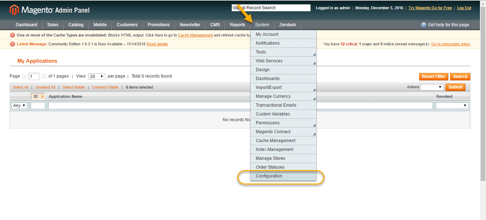
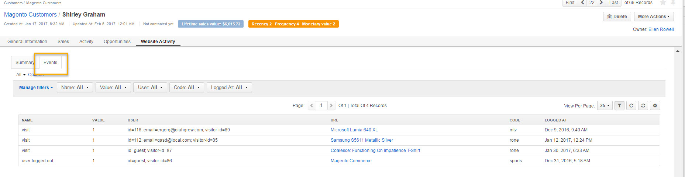
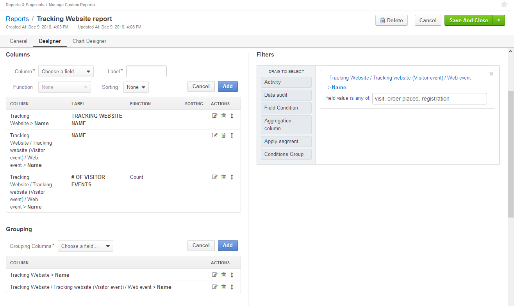

.. _user-guide-magento-web-tracking:

Magento Web Tracking
====================

.. contents:: :local:
    :depth: 2

To improve marketing and sales performance, OroCRM provides a tool that
tracks user behavior data from your Magento Store.

OroCRM Tracking extension adds a pre-configured tracking code to your
Magento store and collects the following events:

-  Page views.

-  Registration of new users.

-  Items added to carts.

-  Start of order checkout.

-  Successful order placement.

These events are recorded in OroCRM making it possible for you to track
your customer activity.

Requirements
------------

To be able to configure OroCRM Tracking extension, you need to have an
active Magento integration.

You can find information on Magento Integration in :ref:`this <user-guide-magento-channel-integration>` section of the guide.

Step 1: Download OroCRM Tracking Extension
------------------------------------------

To download OroCRM Tracking extension, use the following link: https://marketplace.magento.com/oro-oro-tracking.html

.. note:: You must be logged in to be able to download extension key.

Step 2: Configure the Extension on the Magento side
---------------------------------------------------

Once the extension has been downloaded, log in to your Magento admin
panel.

-  Navigate to :guilabel:`System` in the main menu and click :guilabel:`Configuration`.

|

|

-  In the left menu, go to **Customers** section and click :guilabel:`OroCRM`.

|

.. image:: ../img/web_tracking_magento/customers_crm.jpg

|

-  OroCRM section contains the following fields to be defined:

+-------------------------+-------------------------------------------------------------------------------------------------------------------------------------------------------------+
| **Field**               | **Description**                                                                                                                                             |
+=========================+=============================================================================================================================================================+
| **Enable**              | Select **Yes** to enable OroCRM Tracking.                                                                                                                   |
+-------------------------+-------------------------------------------------------------------------------------------------------------------------------------------------------------+
| **Identifier**          | This identifier should be the same as the identifier you will later enter on the OroCRM side. Identifiers on the Magento and OroCRM side should coincide.   |
+-------------------------+-------------------------------------------------------------------------------------------------------------------------------------------------------------+
| **Service Host Name**   | Enter your OroCRM instance URL, e.g.:  http(s)://example.com/                                                                                               |
|                         |                                                                                                                                                             |
|                         | Note: Tracking script may not work properly on secure (https) pages if OroCRM is installed on a non-secure host.                                            |
+-------------------------+-------------------------------------------------------------------------------------------------------------------------------------------------------------+

-  Click :guilabel:`Save Config` to save your configuration on the Magento side.

Step 3: Create a Tracking Website on the OroCRM side
----------------------------------------------------

Now that you have installed OroCRM Tracking extension, you can create a Tracking Website record
in OroCRM.

-  Go to **Marketing>Tracking Websites**.

.. note:: If Tracking Websites is unavailable in the Marketing section of the main menu, make sure you have :ref:`Tracking enabled <admin-configuration-marketing-features-settings>`. Please, contact your administrator if you are experiencing any trouble.

|

.. image:: ../img/web_tracking_magento/marketing_tracking_websites.jpg

|

-  Click :guilabel:`Create Tracking Website` in the top right corner.

-  Define the following fields:

+----------------+-------------------------------------------------------------------------------------------------------------------------------------------------------------------------------------------------------------------------------------------------------------------------------+
| **Field**      | **Description**                                                                                                                                                                                                                                                               |
+================+===============================================================================================================================================================================================================================================================================+
| **Owner**      | Limits the list of users who can manage the tracking website record to the users whose :ref:`roles <user-guide-user-management-permissions>` allow managing tracking-websites of the owner (e.g. the owner, members of the same business unit, system administrator, etc.).   |
+----------------+-------------------------------------------------------------------------------------------------------------------------------------------------------------------------------------------------------------------------------------------------------------------------------+
| **Name**       | Name used to refer to the record in the system                                                                                                                                                                                                                                |
+----------------+-------------------------------------------------------------------------------------------------------------------------------------------------------------------------------------------------------------------------------------------------------------------------------+
| **Identifier** | Unique code of the website used to generate its tracking. Identifiers in OroCRM and Magento should have the same name.                                                                                                                                                        |
+----------------+-------------------------------------------------------------------------------------------------------------------------------------------------------------------------------------------------------------------------------------------------------------------------------+
| **URL**        | URL of the website to be tracked, e.g. your Store Magento.                                                                                                                                                                                                                    |
+----------------+-------------------------------------------------------------------------------------------------------------------------------------------------------------------------------------------------------------------------------------------------------------------------------+
| **Channel**    | Select an active Magento channel.                                                                                                                                                                                                                                             |
+----------------+-------------------------------------------------------------------------------------------------------------------------------------------------------------------------------------------------------------------------------------------------------------------------------+

.. note:: Connecting a tracking record with a channel in the system binds events registered by the tracking engine and other CRM data like orders, shopping carts, customer profiles, etc. This connection can be further utilized in reports and segments.

-  Once you have completed filling in the Create Website Record form,
   click :guilabel:`Save and Close`.

   |

   .. image:: ../img/web_tracking_magento/create_website_tracking_record.jpg

   |

Step 4: Check User Events
-------------------------

As soon as you have configured website tracking, you should be able to
see customer activity in the **Events** section of the tracking website
record you have just created.

Five events are tracked by default:

-  **Page views**: Every time a user gets to the page, a **Visit** event
   is logged.

-  **Registration of new users:** As soon as a user registers, a
   **Registration** event is logged.

-  **Items added to carts:** a **Cart Item Added** event is logged when
   a user adds an item to the cart.

-  **Start of order checkout:** a **User Entered Checkout** event is
   logged when a user starts their checkout process.

-  **Order placement:** An **Order successfully placed** event is logged
   when a user places their order.

These events are illustrated in the screenshot below:

|

.. image:: ../img/web_tracking_magento/events.jpg

|

In addition, activities of a specific customer are displayed in the **Website Activity** section of their view page in Summary and Events:

|

.. image:: ../img/web_tracking_magento/customer_activity_1.jpg

|

|

|

Step 5: Use Collected Data
--------------------------

You can use data collected from your Magento store in a number of ways,
creating reports and segments of users according to your needs.

Build a Segment
~~~~~~~~~~~~~~~

Building segments of your customers is one of many ways of using data
collected through web tracking.

As an example, let us build a segment of users who have not visited the
website for more than a month.

To do this, go to **Reports and Segments>Manage Segments** and click
:guilabel:`Create Segment`.

In the **Filters** section:

-  Drag a **Field Condition** to the field on the right to set
   conditions to the segment.

-  Select **Magento Customer/Magento Customer (Visitor event)/Web
   event>Logged at.**

-  Set the following variables: **not between today** and **today-30**
   as illustrated in the screenshot below.

-  When you are done, click :guilabel:`Save and Close`.

|

.. image:: ../img/web_tracking_magento/create_segment.jpg

|

The segment will appear on the **Manage Segments** page and contain
customers sorted according to your conditions.

Create a Report
~~~~~~~~~~~~~~~

Another example of using data, collected with the help of web tracking,
is creating reports. Let us create a report that will display how many
users have visited your websites, registered and placed their orders.

-  Go to **Reports&Segments>Manage Custom Reports**

-  Click :guilabel:`Create report`.

-  For entity type select **Tracking Website**.

   In **Columns** section add:

-  Tracking Website>Name

-  Tracking Website/Tracking website (Visitor event)/Web event>Name

-  Tracking Website/Tracking website (Visitor event)/Web event>Name, set
   function to **Count**

   In **Grouping**, add:

-  Tracking Website>Name

-  Tracking Website/Tracking website (Visitor event)/Web event>Name

   In **Filters**, set the following condition:

-  Tracking Website/Tracking website (Visitor event)/Web event>Name,
   field value **is any of** **visit, registration, order placed.**

-  Click :guilabel:`Save and Close`.

|

|

Once you have saved your report, you will be able to see how many users
have visited your websites, registered there and placed their orders, as
shown in the following example:

|

.. image:: ../img/web_tracking_magento/TrackingWebsitereport.png

|

In similar manner, using website tracking data, you can create custom
reports that fit specifically your needs and the needs of your business.
