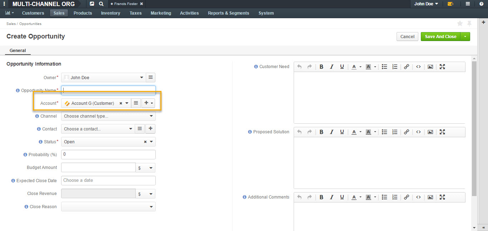
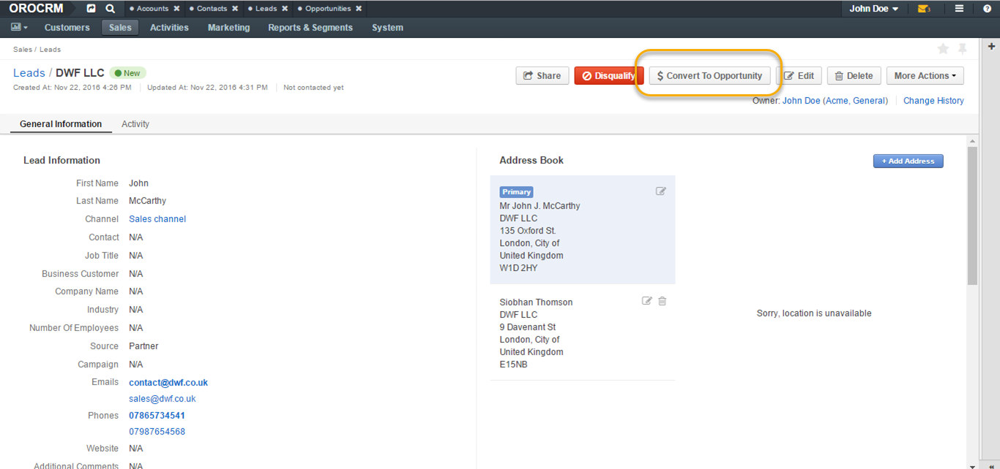
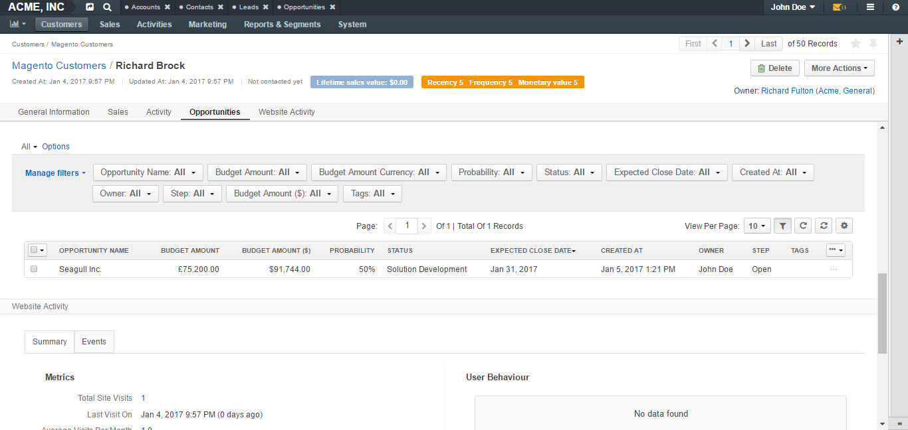
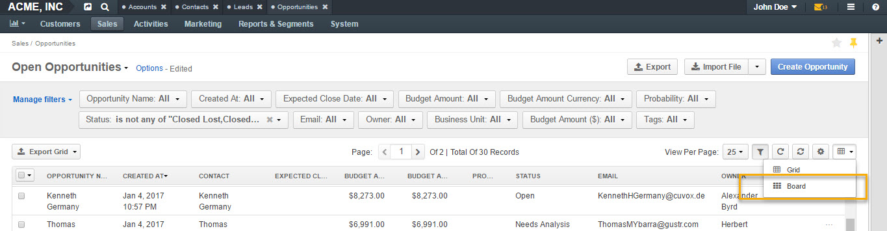
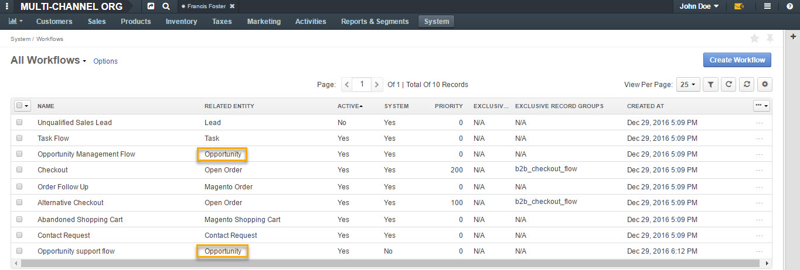
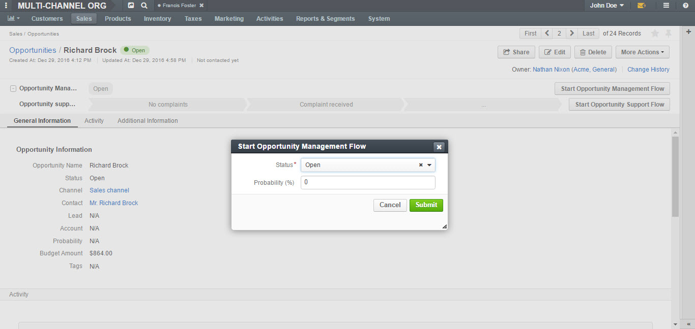
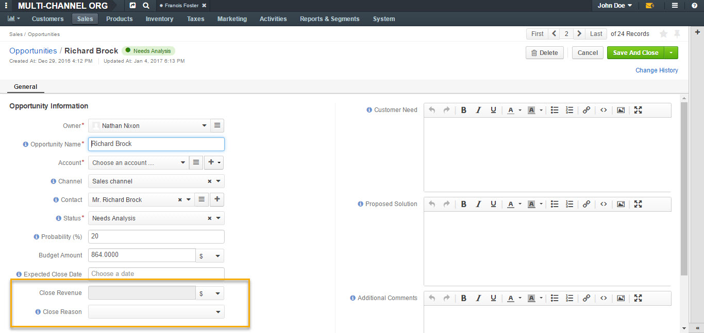
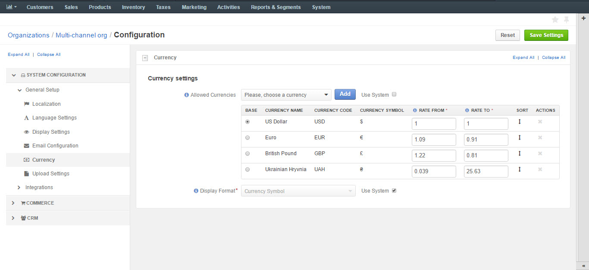
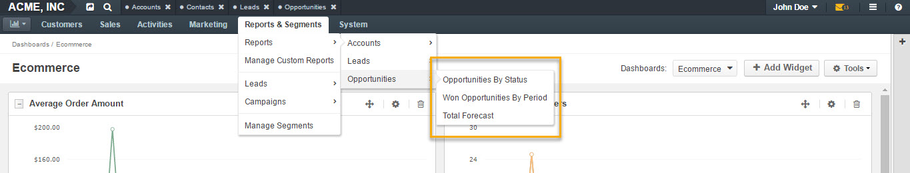
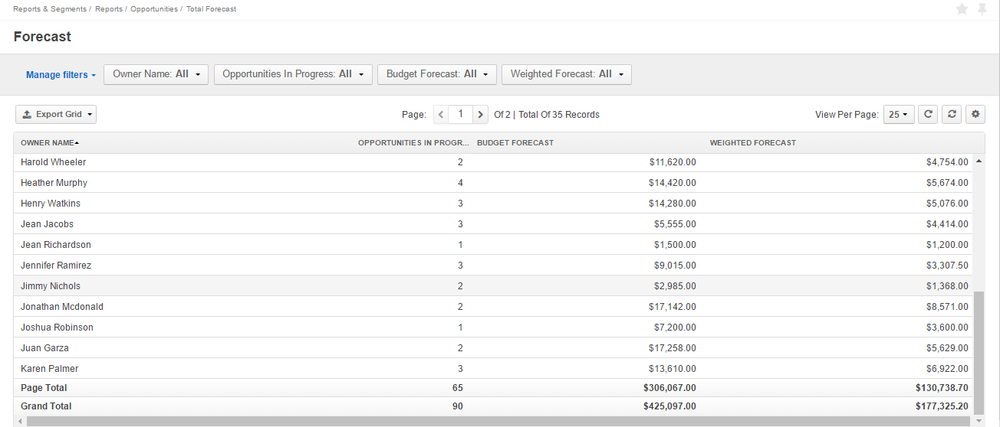

.. _user-guide-system-channel-entities-opportunities:

Opportunities
=============

.. contents:: :local:
    :depth: 4

Overview
--------

Opportunities are highly probable potential or actual sales to a new or established customer. Request for proposal, invitation for a bidding, agreement of intentions or order for a delivery can be saved as opportunities. These are a universal sales tracking tool that can be related to virtually any customer type.

In the following guide, you will learn how to:

-	Enable, create and manage opportunities.
-	Manage opportunity workflow.
-	Work with reports for opportunities.

Enable Opportunities
--------------------
You can enable (or disable) an opportunity manually the following way:

-	Navigate to **Settings>Configuration** in the main menu.
-	Open **CRM>Sales Pipeline** in the left menu and click :guilabel:`Opportunity`.
-	In the **General Setup** section, check the **Enable Opportunity** box.

Enabling opportunity as a feature adds the opportunity entity to **Sales** in the main menu.

|
|

.. image:: ../img/opportunities_2.0/enable_opportunity.jpg

|
|

.. important:: Sales channel is no longer required to enable opportunities.

Create Opportunities
--------------------

Opportunities can be related to any customer type: Magento, OroCommerce or customers introduced by various third-party extensions. Business customers will remain available as legacy for users who upgrade from OroCRM 1.10 edition but will be deprecated in OroCRM 2.0.

Opportunities can also be related directly to accounts.  This is the simplest OroCRM setup if you do not need to track multi-channel sales. You can always enable the additional complexity of multiple customer channels when the need arises.

You can create opportunities from all related entities (e.g. from Magento customer view or account view), by converting a lead to an opportunity and by creating an opportunity manually.

Create Opportunities from Related Entities
^^^^^^^^^^^^^^^^^^^^^^^^^^^^^^^^^^^^^^^^^^

It is possible to create opportunities from all related entities, such as Magento, OroCommerce customers and Accounts directly.

OroCommerce Customer
~~~~~~~~~~~~~~~~~~~~

To create an opportunity from a Commerce customer view page, make sure you have OroCommerce and OroCRM integrated.

-	Navigate to **Customers** in the main menu, click :guilabel:`Commerce Customers`.
-	Select your customer and open their view page.
-	Click :guilabel:`More Actions` in the top right corner.
-	Click Create Opportunity in the dropdown. 
-	A **Create Opportunity form** will open with an **Account** field pre-filled in with your selected Commerce customer.

|

.. image:: ../img/opportunities_2.0/commerce_customer_create_opp.jpg

|

|

|

Magento Customer
~~~~~~~~~~~~~~~~

To create an opportunity from a Magento customer view page:

-	Go to **Customers** in the main menu, click :guilabel:`Magento Customers`.
-	Select a Magento customer from the grid and open their view page.
-	Navigate to :guilabel:`More Actions` in the top right corner.
-	Click :guilabel:`Create Opportunity` from the dropdown.
-	A **Create Opportunity form** will open with an **Account** field already filled in with your selected Magento customer.

|

.. image:: ../img/opportunities_2.0/magento_customer_create_opportunity.jpg

|

|

.. image:: ../img/opportunities_2.0/magento_customer_create_opportunity_form.jpg

|

Account
~~~~~~~

To create an opportunity directly from an account view page:

-	Go to **Customers>Accounts** in the main menu.
-	Click on the required account in the grid.
-	Navigate to :guilabel:`More Actions` in the top right corner.
-	Select :guilabel:`Create Opportunity` from the dropdown.
-	A **Create Opportunity form** will open with an **Account** field already filled in with your selected account.

|

.. image:: ../img/opportunities_2.0/account_opportunity.jpg

|

|

.. image:: ../img/opportunities_2.0/account_opp_form.jpg

|

Convert Lead to Opportunity
^^^^^^^^^^^^^^^^^^^^^^^^^^^

As soon as a lead is ready to be qualified, it can be converted into an opportunity. 

This can be done by:

-	Navigating to **Sales>Leads** in the main menu.
-	Opening a lead from the grid.
-	Clicking :guilabel:`Convert Lead to Opportunity` on the lead page.

|

|

-	**Convert Lead To Opportunity form** will emerge.

|

.. image:: ../img/opportunities_2.0/convert_to_opportunity_2.0.jpg

|

More information on leads can be found in :ref:`this <user-guide-system-channel-entities-leads>` this section of the guide.

Create Opportunity Manually
^^^^^^^^^^^^^^^^^^^^^^^^^^^

To create an opportunity manually:

-	Go to **Sales>Opportunities** in the main menu.
-	Click :guilabel:`Create Opportunity` in the top right corner.
-	The **Create Opportunity form** will appear.

|

.. image:: ../img/opportunities_2.0/create_opportunity_2.0.jpg

|

Fill in the form
^^^^^^^^^^^^^^^^

Create an Opportunity Form
~~~~~~~~~~~~~~~~~~~~~~~~~~

To create a new opportunity manually:

-	Navigate to **Sales>Opportunities**.
-	Click :guilabel:`Create Opportunity` in the top right corner of the page.
-	A **Create Opportunity form** will open with a number of fields to be defined.

|

.. image:: ../img/opportunities_2.0/create_opp_new.jpg

|

.. csv-table::
  :header: "Field", "Description"
  :widths: 10, 30

  "**Owner**", "Limits the list of users who can manage the opportunity to users, whose roles allow managing opportunities assigned to the owner (e.g. the owner, members of the same business unit, system administrator, etc.). By default, the user creating the record is chosen."
  "**Opportunity Name**", "The name used to refer to an opportunity in the system."
  "**Account**", "Allows to select or create a customer account the opportunity will be related to. 

 	-	Account field will be filled in with the company name if such name was entered when creating a lead. 

	-	To create a new account, click **+** at the end of the Account field. 

	-	Alternatively, use write-in functionality to enter a new account name. Type the name in the field and click :guilabel:`Add New Account`.

  You can find more information on Account relation further below this guide."
  "**Contact**", "The person on the customer side who is directly related to the opportunity."
  "**Status**", "A stage in the process of a sale. **Open**, **Closed Won** and **Closed Lost** are system statuses that cannot be deleted.  Other statuses can be added and customized in the system configuration settings by an admin."

|

.. image:: ../img/opportunities_2.0/status.jpg

|

.. csv-table::
  :header: "Field", "Description"
  :widths: 10, 30

  "**Probability**", "The perceived probability of an opportunity being successfully closed. 

  Probability is related to **Status**. For each status, there is a certain percentage of probability which is pre-configured automatically. 

  To configure percentage for each status (see the first screenshot below):

  -	Go to **Systems>Configuration**.
  -	Open **CRM** tab.
  -	Click :guilabel:`Opportunities`.
  -	Configure statuses in the **Probabilities** section.
  	
  Here, you can add new statuses by clicking **+Add**, changes status names, their position and probability percentage.

  **Note** that you cannot change probability percentage for **Open**, **Closed Won** and **Closed Lost** system statuses.

  Probability percentage can be edited manually when filling in the **Convert To Opportunity form** (as illustrated in the second screenshot below)."

|
|

.. image:: ../img/opportunities_2.0/system_config_opportunities.png

|
|

|
|

.. image:: ../img/opportunities_2.0/probability_edited.png

|
|

.. csv-table::
  :header: "Field", "Description"
  :widths: 10, 30

  "**Budget Amount**", "Budget amount is potential deal value being discussed. For OroCRM Enterprise Edition, you can select the currency of the deal. The currencies available in the dropdown will depend on your system configuration. You can find more on multi-currency functionality further below this guide."
  "**Expected Close Date**", "Expected close date of the deal."
  "**Close Revenue**", "The amount actually received as the result of the deal. 

  E.g. If the predicted budget was $10 000 but the result of the deal was $500 lower than the budget amount, the close revenue would constitute $9 500."
  "**CLose Reason**", "The reason for closing the deal, e.g. won, outsold, cancelled, etc."
  "**Customer Need**", "Enter customer needs if known."
  "**Proposed Solution**","Enter your offers and/or solutions for the customer if any were proposed."
  "**Additional comments**","Enter additional comments if necessary."

Convert to Opportunity Form
~~~~~~~~~~~~~~~~~~~~~~~~~~~~

**Convert To Opportunity Form** contains **Opportunity Information** and **New Contact Information** forms.

For **Opportunity Information**, the fields to be defined are the same as the ones in the Create an Opportunity form (see the section above).

**New Contact Information** Form contains **General**, **Contact Details** and **Addresses** sections with a number of fields to fill in. 

Since the lead has fulfilled its purpose and is no longer needed, a new contact will be created based on lead data entered in this form.

It is possible to enter **multiple** phones, emails and addresses for an opportunity. You can choose which phone, email or address is to be primary. You can also delete the entered phone, email or address by clicking **X** on the right of the corresponding fields (as shown in the screenshot below).

|
|

.. image:: ../img/opportunities_2.0/contact_info_form_1.png

|
|

|
|

.. image:: ../img/opportunities_2.0/contact_info_form_2.png

|
|

.. note:: Within the opportunity grid, only one phone, email and address will be displayed, even if multiple phones, emails and addresses have been entered.

Once you have completed filling in the forms, click **Save and Close** to save the opportunity in the system.

Relate Opportunity to an Account
~~~~~~~~~~~~~~~~~~~~~~~~~~~~~~~~

Opportunities can be related to any customer type, e-commerce or not, such as Magento, Prestashop, OroCommerce and such like.
In the simplest OroCRM setup, when you do not need the complexity of multi-channel sales, opportunities can be related directly to accounts. In this context, it is not recommended to use customers when selecting an account in the Opportunity Information form, since your customers will be represented by an account entity. 

You can search for an account or create a new one.

|
|

.. image:: ../img/opportunities_2.0/plus_button_account.jpg

|
|

|
|

.. image:: ../img/opportunities_2.0/account_related_opportunity.jpg

|
|

Account view page will display opportunities related to a particular account in the **Action** section. Lifetime sales value will be calculated based on the values of the opportunities related to an account.

|
|

.. image:: ../img/opportunities_2.0/account_view_page_opp.jpg

|
|

Let us have a look at a more complex context when you need to track multi-channel sales. For instance, if you have different Magento stores and different Magento customers in every store and you wish to track your sales via sales opportunities and create opportunities related to specific Magento customers. In the following example, we have created a new opportunity related to a Magento customer: 

|
|

.. image:: ../img/opportunities_2.0/account_magento_customer.jpg

|
|

In the **Account** dropdown, you will see groups of accounts and customers. Each group will have at least one account. The types of the customers displayed in the dropdown will depend on the active channels in your system. The customers will be identified by the corresponding logo.

In the given example, there is an option to relate the opportunity to an *A.L.Price account* and the customer (from 2 Magento channels) that belongs to the account.

Accounts can be searched for not only by their account name but also contact name, email or phone.

|
|

.. image:: ../img/opportunities_2.0/account_search_by_contact.jpg

|
|

Once saved, this opportunity will be related to an account via a customer. 

|
|

.. image:: ../img/opportunities_2.0/magento_accountjpg.jpg

|
|

View Opportunities
------------------

Customer, Account and Opportunity view pages contain a list of relevant opportunities, so it would be possible to see the full history of the deals with a particular customer or account in one place, thus helping the sales representatives find clues for the current deals.

**Customer view:**

|
|

|
|

**Account view:**

|
|

.. image:: ../img/opportunities_2.0/relevant_opportunities_acc.jpg

|
|

**Opportunity view:**

|
|

.. image:: ../img/opportunities_2.0/relevant_opportunities_opp.jpg

|
|

Manage Opportunities
--------------------

The following actions can be performed for opportunities from the grid:

-	Export and import opportunity record details with Export and Import buttons as described in the :ref:`Export and Import Functionality <user-guide-import>` guide.

-	Delete an opportunity from the system: |IcDelete|
-	Get to the edit form of the opportunity: |IcEdit| 
-	Get to the view page of the opportunity: |IcView|
 	
|
|

.. image:: ../img/opportunities_2.0/opp_grid_manage.jpg

|
|

Multiple Grid Views
^^^^^^^^^^^^^^^^^^^

Multiple grid views are available for opportunities:

-	All opportunities.
-	Open Opportunities.
-	Overdue Opportunities.
-	Recently Closed Opportunities.

Open Opportunities grid is the default view. 

To change the grid view, click on the arrow icon on the right of **Open Opportunities** header and select the preferred grid view from the dropdown, as shown in the screenshot below.

|
|

.. image:: ../img/opportunities_2.0/opp_grid.jpg

|
|

Inline Editing
^^^^^^^^^^^^^^

Inline editing within the grid can help you amend opportunity details without opening the edit opportunity form. To edit opportunities from the grid, double-click on the field or the edit icon in the field you wish to edit.

|
|

.. image:: ../img/opportunities_2.0/inline_editing.jpg

|
|

|
|

.. image:: ../img/opportunities_2.0/inline_editing_2.jpg

|
|

Kanban Board
^^^^^^^^^^^^

As an alternative to grid view, it is possible to view Opportunities in Kanban board. To change grid view to board view, open **Grid/Board** menu and click :guilabel:`Board`.

|
|

|
|

|
|

.. image:: ../img/opportunities_2.0/kanban_view.png

|
|

.. important:: Note that Kanban board functionality is available only if Opportunities Management Flow is deactivated in **System>Workflows**.

Within the board, you can:

-	Change opportunities status by dragging them between columns.

|
|

.. image:: ../img/opportunities_2.0/draggin_opportunity_kanban.png

|
|

-	Delete an opportunity from the system:|IcDelete|
-	Get to the edit form of the opportunity:|IcEdit|  
-	Get to the view page of the opportunity:|IcView|

|
|

.. image:: ../img/opportunities_2.0/edit_opp_kanban.png

|
|

.. important:: Note that inline editing feature is not available for board view. Inline editing is only possible within the grid view.

Manage Opportunity Workflow
---------------------------

You can use OroCRM’s workflows to define rules and guidelines on possible actions/updates of opportunities in the system. 

It is possible to have multiple active workflows for the same entity at the same time (e.g.: alternative sales workflows that the sales representative can choose when they decide how to deal with an opportunity; parallel sales follow-up and order fulfillment workflows for a placed order, etc.). 

In the following example, we have two workflows for Opportunity active at the same time (Opportunity Management Flow and Opportunity Support Flow).

|
|

|
|

Activate Opportunity Management Flow
^^^^^^^^^^^^^^^^^^^^^^^^^^^^^^^^^^^^

To ensure data consistency and reasoned opportunity management by a sales manager, you can activate Opportunity Management Flow in **System>Workflows**.

This can be done from the **Workflows** view page by selecting Opportunity Management Flow and clicking :guilabel:`Activate` in the top right corner.

|
|

.. image:: ../img/opportunities_2.0/activate_opp_flow.jpg

|
|

Active Opportunity Management Flow limits what a sales manager can do with opportunities, thus eliminating situations when, for instance, an opportunity is not yet closed but its close reason is specified, or an opportunity is closed but its close reason is unspecified.

Start Opportunity Management Flow
^^^^^^^^^^^^^^^^^^^^^^^^^^^^^^^^^

Activating Opportunity Management Flow does not happen automatically for all opportunities. Once the flow has been activated in **System>Workflows**, you need to start it manually for the required opportunities.

It is possible to have multiple active workflows for the same record. If you have more than one active workflow, you can separately activate each of them. In the following example, two workflows are available for one opportunity record:

|
|

.. image:: ../img/opportunities_2.0/start_opp_managemtn_flow_manually.jpg

|
|

You can set Opportunity Status and Probability manually before starting Opportunity Management Flow. 

|
|

|
|

|
|

.. image:: ../img/opportunities_2.0/two_workflows_active.jpg

|
|

Manage Multiple Workflows
^^^^^^^^^^^^^^^^^^^^^^^^^

Workflows are expandable and can be collapsed if necessary by clicking on the :guilabel:`**+**` button on the left of the Workflow as illustrated below:

|
|

.. image:: ../img/opportunities_2.0/collapse_flow.jpg

|
|

|
|

.. image:: ../img/opportunities_2.0/collapse_flow_2.jpg

|
|

Transitions
^^^^^^^^^^^

The type of the transitions displayed for opportunities will depend on the type of the workflow enabled.

The following transitions will become available as the result of Opportunity Management flow activation:

-	Develop
-	Close As Won
-	Close As Lost

Close As Won/Close As Lost
~~~~~~~~~~~~~~~~~~~~~~~~~~

**Close Revenue** and **Close Reason** fields and statuses have become unavailable in the edit opportunity form as the result of flow activation. 

|
|

|
|

To close an opportunity as Won or Lost, use **Close As Won/Close As Lost** transition buttons instead. They are located at the top of Opportunities view page.

|
|

.. image:: ../img/opportunities_2.0/transitions.jpg

|
|

Note that it is not possible to close an opportunity from the grid, although inline editing as a feature is available after flow activation.

To close an opportunity as Won:

-	Click :guilabel:`Close As Won`.
-	Enter **Close Revenue**.
-	Enter **Expected Close Date**.
-	Click :guilabel:`Submit`.

To close an opportunity as Lost:

-	Click :guilabel:`Close As Lost`.
-	Select **Close Reason** from the dropdown.
-	Select the **Expected Close Date**.
-	Click :guilabel:`Submit`.

Develop
~~~~~~~

Develop transition is a simplified form for editing an opportunity.

|
|

.. image:: ../img/opportunities_2.0/develop.jpg

|
|

Other
~~~~~

Depending on their configuration, workflow steps can vary. Here is an example of the steps and transitions configured for the Opportunity Support flow.

|
|

.. image:: ../img/opportunities_2.0/wf_steps.jpg

|
|

|
|

.. image:: ../img/opportunities_2.0/wf_steps_2.jpg

|
|

|
|

.. image:: ../img/opportunities_2.0/wf_steps_3.jpg

|
|

Multi-currency Opportunities
----------------------------

Multi-currency feature is available for OroCRM Enterprise Edition only. You can find a complete guide on multi-currency in :ref:`multi-currency guide <user-guide-multi-currency>`.

Currency configuration allows to track and record sales made in different currencies, specifically:

-	Create and manage the list of currencies that will be available for selection in multi-currency fields, e.g. the opportunity budget.
-	Designate one base currency which would serve as the default one for all multi-currency fields, in addition to being the currency to which values in other currencies will be converted.
-	Manage exchange rate for all currencies to calculate opportunity budget, close revenue, etc. from the deal currency to the base currency.
-	Identify currencies in the system with a three-letter ISO code or a symbol.

At the organization level, it is possible only to remove unnecessary currencies, not add the new ones. 

To be able to manage currencies and change the rates:

-	Navigate to **System>User Management>Organizations**.
-	Select your organization and click :guilabel:`Configuration` in the top right corner.
-	In the left menu, click **General Setup>Currency**.
-	Unlock the currency grid by unticking **Use System**.
-	Enter the numbers in the corresponding field of the **Rate From/To** columns. 

In the following example, the base currency is US dollars, the currency format is set to Currency Symbol and three deal currencies are set to Euro, British Pound and Ukrainian Hryvnia.

|
|

|
|

These exchange rates to the base currency will be used to calculate and convert the actual budget value, close revenue, the total number of orders (for Commerce), etc.

This is how multi-currency feature is displayed in the **Create Opportunity** form:

|
|

.. image:: ../img/opportunities_2.0/currency_opp_form.jpg

|
|

You can select one of the enabled currencies in the currency selector for the **Budget Amount** field. They are represented by a currency symbol, as configured in the settings.

Note that the Close Revenue and the Budget Amount can be specified in different currencies.

As you can see from the screenshot, the budget amount entered in Euro (€15000) has been recalculated to the base currency ($16,350) according to the defined exchange rate.

|
|

.. image:: ../img/opportunities_2.0/opp_abc_view.jpg

|
|

The same budget amounts will be available in the grid view and Reports and Segments.

.. note:: In dashboard widgets, only amounts in the base currency will be displayed.
 
  
If you change the currency exchange rate, the changes will be displayed for all **open** opportunities. Rates for closed opportunities are fixed.

|
|

.. image:: ../img/opportunities_2.0/currency_changed.jpg

|
|

|
|

.. image:: ../img/opportunities_2.0/exchange_rate_changed.jpg

|
|

As you can see from the screenshots, the rate of Euro towards US dollar was changed from 1.09 to 1.15 consequently changing the value of the base currency for budget amount from $16350 to $17250.

.. important:: If you are not using the **Opportunity Management Flow**, you will be able to edit the budget amount/close revenue for a closed opportunity.

.. _user-guide-opportunities-reports:

Reports with Opportunities
--------------------------

OroCRM provides three out-of-the-box reports on opportunities:

-	Opportunities By Status.
-	Won Opportunities By Period.
-	Total Forecast.

|
|

|
|
  
Opportunities by Status
^^^^^^^^^^^^^^^^^^^^^^^

Opportunities by Status is a report that allows you to see how many opportunities with a specific status are available in the system, what their total close revenue and budget amount are.

In order to see the report, go to **Reports and Segments>Reports>Opportunities> Opportunities By Status**.

Opportunities by Status report shows:

-	Status of the opportunities
-	The number of the opportunities with the statuses set for the opportunities in the system.
-	Total close revenue of all the opportunities 
-	Total budget amount of all the opportunities.
-	Total number of opportunities regardless of their status (grand total), their close revenue and budget amount.

|
|

.. image:: ../img/opportunities_2.0/opportunities_by_status.png

|
|

Won Opportunities by Period
^^^^^^^^^^^^^^^^^^^^^^^^^^^

This report helps analyze a process of opportunities won per period.

To see the report, go to **Reports and Segments >Reports >Opportunities >Won Opportunities by Period**.

Won Opportunities by Period report shows:

-	The period, for which data is shown.
-	The number of the opportunities won within this period.
-	Total close revenue of all the opportunities won within the period.
-	Total number of opportunities won, regardless of the period when they we won (grand total) and their close revenue.

|
|

.. image:: ../img/opportunities_2.0/won_opp_by_period.png

|
|

Forecast
^^^^^^^^

Forecast report helps estimate the future of sales.

The report shows:

-	Opportunity name.
-	Opportunities in progress.
-	Budget forecast.
-	Weighted forecast.
-	Total forecasted budget for the opportunities per page (page total).
-	Total forecasted budget for all opportunities (grand total).

|
|

|
|

.. note:: New custom reports can be added. For more details on the ways to create and customize reports, see the :ref:`Reports guide <user-guide-reports>`.  
 
  

.. |BCrLOwnerClear| image:: ../../img/buttons/BCrLOwnerClear.png
   :align: middle

.. |Bdropdown| image:: ../../img/buttons/Bdropdown.png
   :align: middle

.. |BGotoPage| image:: ../../img/buttons/BGotoPage.png
   :align: middle

.. |Bplus| image:: ../../img/buttons/Bplus.png
   :align: middle

.. |IcDelete| image:: ../../img/buttons/IcDelete.png
   :align: middle

.. |IcEdit| image:: ../../img/buttons/IcEdit.png
   :align: middle

.. |IcView| image:: ../../img/buttons/IcView.png
   :align: middle
